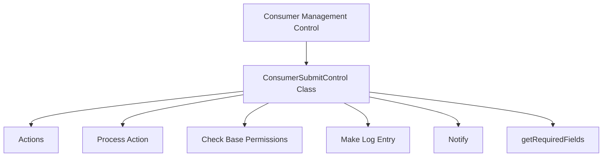

# Introduction to Consumer Management Control

Consumer management control handles the core logic of approving or disabling consumers from using particular user accounts. This control can only be used on the management wiki to ensure centralized management of consumer actions.

# <SwmToken path="src/Control/ConsumerSubmitControl.php" pos="61:2:2" line-data="class ConsumerSubmitControl extends SubmitControl {">`ConsumerSubmitControl`</SwmToken> Class

The class <SwmToken path="src/Control/ConsumerSubmitControl.php" pos="61:2:2" line-data="class ConsumerSubmitControl extends SubmitControl {">`ConsumerSubmitControl`</SwmToken> extends <SwmToken path="src/Control/ConsumerSubmitControl.php" pos="61:6:6" line-data="class ConsumerSubmitControl extends SubmitControl {">`SubmitControl`</SwmToken> and defines various actions that can be performed on a consumer, such as proposing, updating, approving, rejecting, disabling, and re-enabling.

<SwmSnippet path="/src/Control/ConsumerSubmitControl.php" line="67">

---

# Actions

The class defines various actions that can be performed on a consumer, such as proposing, updating, approving, rejecting, disabling, and re-enabling.

```hack
	public static $actions = [ 'propose', 'update', 'approve', 'reject', 'disable', 'reenable' ];
```

---

</SwmSnippet>

# Process Action

The <SwmToken path="src/Control/ConsumerSubmitControl.php" pos="237:5:5" line-data="	protected function processAction( $action ) {">`processAction`</SwmToken> function handles these actions by checking user permissions, validating input data, and performing the necessary database operations.

# Check Base Permissions

The <SwmToken path="src/Control/ConsumerSubmitControl.php" pos="220:5:5" line-data="	protected function checkBasePermissions() {">`checkBasePermissions`</SwmToken> function ensures that the user has the necessary permissions to perform actions on consumers, such as being logged in and not being blocked.

<SwmSnippet path="/src/Control/ConsumerSubmitControl.php" line="220">

---

The <SwmToken path="src/Control/ConsumerSubmitControl.php" pos="220:5:5" line-data="	protected function checkBasePermissions() {">`checkBasePermissions`</SwmToken> function ensures that the user has the necessary permissions to perform actions on consumers.

```hack
	protected function checkBasePermissions() {
		global $wgBlockDisablesLogin;
		$user = $this->getUser();
		$readOnlyMode = MediaWikiServices::getInstance()->getReadOnlyMode();
		if ( !$user->getId() ) {
			return $this->failure( 'not_logged_in', 'badaccess-group0' );
		} elseif ( $user->isLocked() || ( $wgBlockDisablesLogin && $user->getBlock() ) ) {
			return $this->failure( 'user_blocked', 'badaccess-group0' );
		} elseif ( $readOnlyMode->isReadOnly() ) {
			return $this->failure( 'readonly', 'readonlytext', $readOnlyMode->getReason() );
		} elseif ( !Utils::isCentralWiki() ) {
			// This logs consumer changes to the local logging table on the central wiki
			throw new LogicException( "This can only be used from the OAuth management wiki." );
		}
		return $this->success();
	}
```

---

</SwmSnippet>

# Make Log Entry

The <SwmToken path="src/Control/ConsumerSubmitControl.php" pos="594:5:5" line-data="	protected function makeLogEntry(">`makeLogEntry`</SwmToken> function logs the actions performed on consumers, providing an audit trail for administrative purposes.

<SwmSnippet path="/src/Control/ConsumerSubmitControl.php" line="587">

---

The <SwmToken path="src/Control/ConsumerSubmitControl.php" pos="594:5:5" line-data="	protected function makeLogEntry(">`makeLogEntry`</SwmToken> function logs the actions performed on consumers, providing an audit trail for administrative purposes.

```hack
	/**
	 * @param IDatabase $dbw
	 * @param Consumer $cmr
	 * @param string $action
	 * @param User $performer
	 * @param string $comment
	 */
	protected function makeLogEntry(
		$dbw, Consumer $cmr, $action, User $performer, $comment
	) {
		$logEntry = new ManualLogEntry( 'mwoauthconsumer', $action );
		$logEntry->setPerformer( $performer );
		$target = $this->getLogTitle( $dbw, $cmr->getUserId() );
		$logEntry->setTarget( $target );
		$logEntry->setComment( $comment );
		$logEntry->setParameters( [ '4:consumer' => $cmr->getConsumerKey() ] );
		$logEntry->setRelations( [
			'OAuthConsumer' => [ $cmr->getConsumerKey() ]
		] );
		$logEntry->insert( $dbw );
```

---

</SwmSnippet>

# Notify

The <SwmToken path="src/Control/ConsumerSubmitControl.php" pos="626:5:5" line-data="	protected function notify( $cmr, $user, $actionType, $comment ) {">`notify`</SwmToken> function sends notifications about consumer actions to relevant user groups, ensuring that administrators are aware of changes that require their attention.

<SwmSnippet path="/src/Control/ConsumerSubmitControl.php" line="620">

---

The <SwmToken path="src/Control/ConsumerSubmitControl.php" pos="626:5:5" line-data="	protected function notify( $cmr, $user, $actionType, $comment ) {">`notify`</SwmToken> function sends notifications about consumer actions to relevant user groups.

```hack
	/**
	 * @param Consumer $cmr Consumer which was the subject of the action
	 * @param User $user User who performed the action
	 * @param string $actionType
	 * @param string $comment
	 */
	protected function notify( $cmr, $user, $actionType, $comment ) {
		if ( !in_array( $actionType, self::$actions, true ) ) {
			throw new MWException( "Invalid action type: $actionType" );
		} elseif ( !ExtensionRegistry::getInstance()->isLoaded( 'Echo' ) ) {
			return;
		} elseif ( !Utils::isCentralWiki() ) {
			# sanity; should never get here on a replica wiki
			return;
		}

		Event::create( [
			'type' => 'oauth-app-' . $actionType,
			'agent' => $user,
			'extra' => [
				'action' => $actionType,
```

---

</SwmSnippet>

# <SwmToken path="src/Control/ConsumerSubmitControl.php" pos="88:5:5" line-data="	protected function getRequiredFields() {">`getRequiredFields`</SwmToken>

The <SwmToken path="src/Control/ConsumerSubmitControl.php" pos="88:5:5" line-data="	protected function getRequiredFields() {">`getRequiredFields`</SwmToken> function defines the fields required for various consumer actions such as proposing, updating, approving, rejecting, disabling, and re-enabling. It includes validation logic for fields like RSA keys, blob sizes, and <SwmToken path="src/Control/ConsumerSubmitControl.php" pos="232:23:23" line-data="			throw new LogicException( &quot;This can only be used from the OAuth management wiki.&quot; );">`OAuth`</SwmToken> versions.

<SwmSnippet path="/src/Control/ConsumerSubmitControl.php" line="88">

---

The <SwmToken path="src/Control/ConsumerSubmitControl.php" pos="88:5:5" line-data="	protected function getRequiredFields() {">`getRequiredFields`</SwmToken> function defines the fields required for various consumer actions and includes validation logic.

```hack
	protected function getRequiredFields() {
		$validateRsaKey = static function ( $s ) {
			if ( trim( $s ) === '' ) {
				return true;
			}
			if ( strlen( $s ) > self::BLOB_SIZE ) {
				return false;
			}
			$key = openssl_pkey_get_public( $s );
			if ( $key === false ) {
				return false;
			}
			$info = openssl_pkey_get_details( $key );

			return ( $info['type'] === OPENSSL_KEYTYPE_RSA );
		};

		$suppress = [ 'suppress' => '/^[01]$/' ];
		$base = [
			'consumerKey'  => '/^[0-9a-f]{32}$/',
			'reason'       => '/^.{0,255}$/',
```

---

</SwmSnippet>

&nbsp;

*This is an auto-generated document by Swimm AI 🌊 and has not yet been verified by a human*

<SwmMeta version="3.0.0" repo-id="Z2l0aHViJTNBJTNBbWVkaWF3aWtpLWV4dGVuc2lvbnMtT0F1dGglM0ElM0FTd2ltbS1EZW1v" repo-name="mediawiki-extensions-OAuth"><sup>Powered by [Swimm](/)</sup></SwmMeta>
