```mermaid
graph TD;
    A[User Submits oauth Consumer Data] --> B[ConsumerSubmitControl]
    B --> C[registerValidators]
    B --> D[setInputParameters]
    B --> E[submit]
    E --> F[Database Interaction]
    F --> G[Store Consumer Information]
    F --> H[Apply Permissions and Configurations]
    E --> I[Return Submission Status]

%% Swimm:
%% graph TD;
%%     A[User Submits <SwmToken path="tests/phpunit/Control/ConsumerSubmitControlTest.php" pos="73:14:14" line-data="			&#39;callbackUrl&#39; =&gt; &#39;https://example.com/oauth&#39;,">`oauth`</SwmToken> Consumer Data] --> B[ConsumerSubmitControl]
%%     B --> C[registerValidators]
%%     B --> D[setInputParameters]
%%     B --> E[submit]
%%     E --> F[Database Interaction]
%%     F --> G[Store Consumer Information]
%%     F --> H[Apply Permissions and Configurations]
%%     E --> I[Return Submission Status]
```

# Introduction to Consumer Submission Control

<SwmToken path="tests/phpunit/Control/ConsumerSubmitControlTest.php" pos="46:8:8" line-data="		$control = new ConsumerSubmitControl( $context, [], $dbw );">`ConsumerSubmitControl`</SwmToken> is responsible for handling the submission of <SwmToken path="tests/phpunit/Control/ConsumerSubmitControlTest.php" pos="73:14:14" line-data="			&#39;callbackUrl&#39; =&gt; &#39;https://example.com/oauth&#39;,">`oauth`</SwmToken> consumers. It manages the validation and processing of the data submitted by users when they propose new <SwmToken path="tests/phpunit/Control/ConsumerSubmitControlTest.php" pos="73:14:14" line-data="			&#39;callbackUrl&#39; =&gt; &#39;https://example.com/oauth&#39;,">`oauth`</SwmToken> consumers. This document will cover the main functionalities of <SwmToken path="tests/phpunit/Control/ConsumerSubmitControlTest.php" pos="46:8:8" line-data="		$control = new ConsumerSubmitControl( $context, [], $dbw );">`ConsumerSubmitControl`</SwmToken>, including registering validators, setting input parameters, processing submissions, and example usage.

<SwmSnippet path="/tests/phpunit/Control/ConsumerSubmitControlTest.php" line="46">

---

# Register Validators

The <SwmToken path="tests/phpunit/Control/ConsumerSubmitControlTest.php" pos="47:4:4" line-data="		$control-&gt;registerValidators( [] );">`registerValidators`</SwmToken> method is used to ensure that the input data meets the required criteria before processing the submission.

```hack
		$control = new ConsumerSubmitControl( $context, [], $dbw );
		$control->registerValidators( [] );
```

---

</SwmSnippet>

<SwmSnippet path="/tests/phpunit/Control/ConsumerSubmitControlTest.php" line="49">

---

# Process Submission

The <SwmToken path="tests/phpunit/Control/ConsumerSubmitControlTest.php" pos="49:9:9" line-data="		$actualStatus = $control-&gt;submit();">`submit`</SwmToken> method processes the submission and returns the status of the operation, indicating whether it was successful or if there were any errors.

```hack
		$actualStatus = $control->submit();
```

---

</SwmSnippet>

<SwmSnippet path="/tests/phpunit/Control/ConsumerSubmitControlTest.php" line="88">

---

# Example Usage

The <SwmToken path="tests/phpunit/Control/ConsumerSubmitControlTest.php" pos="88:5:5" line-data="	public function testSubmit_OAuth1_good() {">`testSubmit_OAuth1_good`</SwmToken> method demonstrates how to use the <SwmToken path="tests/phpunit/Control/ConsumerSubmitControlTest.php" pos="89:9:9" line-data="		$consumer = $this-&gt;doSubmit( $this-&gt;getBaseForOAuth1(), StatusValue::newGood() );">`doSubmit`</SwmToken> function to submit <SwmToken path="tests/phpunit/Control/ConsumerSubmitControlTest.php" pos="122:17:17" line-data="			StatusValue::newFatal( &#39;mwoauth-error-callback-bare-domain-oauth1&#39; ),">`oauth1`</SwmToken> consumer data and check the status of the operation.

```hack
	public function testSubmit_OAuth1_good() {
		$consumer = $this->doSubmit( $this->getBaseForOAuth1(), StatusValue::newGood() );
		$this->assertInstanceOf( OAuth1Consumer::class, $consumer );
		$this->assertSame( $this->owner->getId(), $consumer->getUserId() );
		$this->assertFalse( $consumer->getOwnerOnly() );
		$this->assertSame( [ 'basic', 'editpage' ], $consumer->getGrants() );
		$this->assertSame( Consumer::STAGE_PROPOSED, $consumer->getStage() );
	}
```

---

</SwmSnippet>

# Main Functions

The main functions of <SwmToken path="tests/phpunit/Control/ConsumerSubmitControlTest.php" pos="46:8:8" line-data="		$control = new ConsumerSubmitControl( $context, [], $dbw );">`ConsumerSubmitControl`</SwmToken> include <SwmToken path="tests/phpunit/Control/ConsumerSubmitControlTest.php" pos="26:5:5" line-data="	private function doSubmit( array $data, StatusValue $expectedStatus ) {">`doSubmit`</SwmToken>, <SwmToken path="tests/phpunit/Control/ConsumerSubmitControlTest.php" pos="66:5:5" line-data="	private function getBaseForOAuth1() {">`getBaseForOAuth1`</SwmToken>, and <SwmToken path="tests/phpunit/Control/ConsumerSubmitControlTest.php" pos="136:5:5" line-data="	private function getBaseForOAuth2() {">`getBaseForOAuth2`</SwmToken>. These functions handle the submission process, provide base data for <SwmToken path="tests/phpunit/Control/ConsumerSubmitControlTest.php" pos="122:17:17" line-data="			StatusValue::newFatal( &#39;mwoauth-error-callback-bare-domain-oauth1&#39; ),">`oauth1`</SwmToken> and OAuth2 consumer submissions, and ensure that the necessary configurations and permissions are applied.

<SwmSnippet path="/tests/phpunit/Control/ConsumerSubmitControlTest.php" line="26">

---

## <SwmToken path="tests/phpunit/Control/ConsumerSubmitControlTest.php" pos="26:5:5" line-data="	private function doSubmit( array $data, StatusValue $expectedStatus ) {">`doSubmit`</SwmToken>

The <SwmToken path="tests/phpunit/Control/ConsumerSubmitControlTest.php" pos="26:5:5" line-data="	private function doSubmit( array $data, StatusValue $expectedStatus ) {">`doSubmit`</SwmToken> function handles the submission of <SwmToken path="tests/phpunit/Control/ConsumerSubmitControlTest.php" pos="73:14:14" line-data="			&#39;callbackUrl&#39; =&gt; &#39;https://example.com/oauth&#39;,">`oauth`</SwmToken> consumers. It sets up the necessary configurations, permissions, and user context, then processes the submission and validates the status of the operation.

```hack
	private function doSubmit( array $data, StatusValue $expectedStatus ) {
		$this->overrideConfigValues( [
			'MWOAuthCentralWiki' => WikiMap::getCurrentWikiId(),
			'OAuthAutoApprove' => [ [
				'grants' => [ 'mwoauth-authonly', 'mwoauth-authonlyprivate', 'basic' ],
			] ],
		] );
		$this->setGroupPermissions( [
			'user' => [ 'mwoauthproposeconsumer' => true ]
		] );

		$context = RequestContext::getMain();
		$user = $this->getMutableTestUser()->getUser();
		$user->setEmail( 'owner@wiki.domain' );
		$user->confirmEmail();
		$user->saveSettings();
		$context->setUser( $user );
		$this->owner = $user;

		$dbw = $this->getDb();
		$control = new ConsumerSubmitControl( $context, [], $dbw );
```

---

</SwmSnippet>

<SwmSnippet path="/tests/phpunit/Control/ConsumerSubmitControlTest.php" line="66">

---

## <SwmToken path="tests/phpunit/Control/ConsumerSubmitControlTest.php" pos="66:5:5" line-data="	private function getBaseForOAuth1() {">`getBaseForOAuth1`</SwmToken>

The <SwmToken path="tests/phpunit/Control/ConsumerSubmitControlTest.php" pos="66:5:5" line-data="	private function getBaseForOAuth1() {">`getBaseForOAuth1`</SwmToken> function provides a base set of data for <SwmToken path="tests/phpunit/Control/ConsumerSubmitControlTest.php" pos="122:17:17" line-data="			StatusValue::newFatal( &#39;mwoauth-error-callback-bare-domain-oauth1&#39; ),">`oauth1`</SwmToken> consumer submissions. This includes default values for various fields required during the submission process.

```hack
	private function getBaseForOAuth1() {
		return [
			'oauthVersion' => Consumer::OAUTH_VERSION_1,
			'name' => 'test consumer',
			'version' => '1.0',
			'description' => 'test',
			'ownerOnly' => false,
			'callbackUrl' => 'https://example.com/oauth',
			'callbackIsPrefix' => false,
			'email' => 'owner@wiki.domain',
			'wiki' => '*',
			'oauth2IsConfidential' => null,
			'oauth2GrantTypes' => [],
			'granttype' => 'normal',
			'grants' => json_encode( [ 'editpage' ] ),
			'restrictions' => MWRestrictions::newDefault(),
			'rsaKey' => '',
			'agreement' => true,
			'action' => 'propose',
		];
```

---

</SwmSnippet>

<SwmSnippet path="/tests/phpunit/Control/ConsumerSubmitControlTest.php" line="136">

---

## <SwmToken path="tests/phpunit/Control/ConsumerSubmitControlTest.php" pos="136:5:5" line-data="	private function getBaseForOAuth2() {">`getBaseForOAuth2`</SwmToken>

The <SwmToken path="tests/phpunit/Control/ConsumerSubmitControlTest.php" pos="136:5:5" line-data="	private function getBaseForOAuth2() {">`getBaseForOAuth2`</SwmToken> function provides a base set of data for OAuth2 consumer submissions. This includes default values for various fields required during the submission process.

```hack
	private function getBaseForOAuth2() {
		return [
			'oauthVersion' => Consumer::OAUTH_VERSION_2,
			'name' => 'test',
			'version' => '1.0',
			'description' => 'test',
			'ownerOnly' => false,
			'callbackUrl' => 'https://example.com/oauth',
			'callbackIsPrefix' => null,
			'email' => 'owner@wiki.domain',
			'wiki' => '*',
			'oauth2IsConfidential' => true,
			'oauth2GrantTypes' => [ 'authorization_code', 'refresh_token' ],
			'granttype' => 'normal',
			'grants' => json_encode( [ 'editpage' ] ),
			'restrictions' => MWRestrictions::newDefault(),
			'rsaKey' => '',
			'agreement' => true,
			'action' => 'propose',
		];
```

---

</SwmSnippet>

&nbsp;

*This is an auto-generated document by Swimm AI 🌊 and has not yet been verified by a human*

<SwmMeta version="3.0.0" repo-id="Z2l0aHViJTNBJTNBbWVkaWF3aWtpLWV4dGVuc2lvbnMtT0F1dGglM0ElM0FTd2ltbS1EZW1v" repo-name="mediawiki-extensions-OAuth"><sup>Powered by [Swimm](/)</sup></SwmMeta>
