# Introduction to <SwmToken path="src/Backend/Consumer.php" pos="300:26:26" line-data="	 * Consumer key (32-character hexadecimal string that&#39;s used in the OAuth protocol">`OAuth`</SwmToken> Consumer

An <SwmToken path="src/Backend/Consumer.php" pos="300:26:26" line-data="	 * Consumer key (32-character hexadecimal string that&#39;s used in the OAuth protocol">`OAuth`</SwmToken> Consumer represents an application that interacts with the <SwmToken path="src/Backend/Consumer.php" pos="300:26:26" line-data="	 * Consumer key (32-character hexadecimal string that&#39;s used in the OAuth protocol">`OAuth`</SwmToken> server to request access tokens on behalf of a user. Consumers have various attributes, stages, permissions, and methods that define their properties and behavior.

```mermaid
graph TD;
    A[OAuth Consumer] --> B[Attributes];
    A --> C[Stages];
    A --> D[Permissions and Restrictions];
    A --> E[Methods];
    A --> F[Usage];
    B --> G[Unique ID];
    B --> H[Consumer Key];
    B --> I[Name];
    B --> J[User ID];
    B --> K[Version];
    B --> L[Callback URL];
    B --> M[Description];
    B --> N[Email];
    C --> O[Proposed];
    C --> P[Approved];
    C --> Q[Rejected];
    C --> R[Expired];
    C --> S[Disabled];
    D --> T[IP Restrictions];
    D --> U[Owner-Only];
    E --> V[Retrieve Data];
    E --> W[Manipulate Data];
    F --> X[Manage OAuth Interactions];
    F --> Y[Authorization Processes];

%% Swimm:
%% graph TD;
%%     A[OAuth Consumer] --> B[Attributes];
%%     A --> C[Stages];
%%     A --> D[Permissions and Restrictions];
%%     A --> E[Methods];
%%     A --> F[Usage];
%%     B --> G[Unique ID];
%%     B --> H[Consumer Key];
%%     B --> I[Name];
%%     B --> J[User ID];
%%     B --> K[Version];
%%     B --> L[Callback URL];
%%     B --> M[Description];
%%     B --> N[Email];
%%     C --> O[Proposed];
%%     C --> P[Approved];
%%     C --> Q[Rejected];
%%     C --> R[Expired];
%%     C --> S[Disabled];
%%     D --> T[IP Restrictions];
%%     D --> U[Owner-Only];
%%     E --> V[Retrieve Data];
%%     E --> W[Manipulate Data];
%%     F --> X[Manage <SwmToken path="src/Backend/Consumer.php" pos="300:26:26" line-data="	 * Consumer key (32-character hexadecimal string that&#39;s used in the OAuth protocol">`OAuth`</SwmToken> Interactions];
%%     F --> Y[Authorization Processes];
```

# Consumer Attributes

Consumers have attributes like unique ID, consumer key, name, user ID, version, callback URL, description, email, and more, which define their properties and behavior.

# Consumer Stages

Consumers can be in different stages such as proposed, approved, rejected, expired, or disabled. These stages are stored in the database and mapped to <SwmToken path="src/Backend/Consumer.php" pos="117:11:13" line-data="	 * Maps stage ids to human-readable names which describe them as a state">`human-readable`</SwmToken> names.

<SwmSnippet path="/src/Backend/Consumer.php" line="106">

---

The stages of a consumer are defined in the <SwmToken path="src/Backend/Consumer.php" pos="106:9:9" line-data="	/* Stages that registered consumer takes (stored in DB) */">`consumer`</SwmToken> class, with constants representing each stage and a mapping to <SwmToken path="src/Backend/Consumer.php" pos="117:11:13" line-data="	 * Maps stage ids to human-readable names which describe them as a state">`human-readable`</SwmToken> names.

```hack
	/* Stages that registered consumer takes (stored in DB) */
	public const STAGE_PROPOSED = 0;
	public const STAGE_APPROVED = 1;
	public const STAGE_REJECTED = 2;
	public const STAGE_EXPIRED  = 3;
	public const STAGE_DISABLED = 4;

	/** @var int|false|null Cache for local ID looked up from $userId */
	protected $localUserId;

	/**
	 * Maps stage ids to human-readable names which describe them as a state
	 * @var array<int,string>
	 */
	public static $stageNames = [
		self::STAGE_PROPOSED => 'proposed',
		self::STAGE_REJECTED => 'rejected',
		self::STAGE_EXPIRED  => 'expired',
		self::STAGE_APPROVED => 'approved',
		self::STAGE_DISABLED => 'disabled',
	];
```

---

</SwmSnippet>

# Consumer Permissions and Restrictions

Consumers have permissions and restrictions, such as IP restrictions, and can be configured to be <SwmToken path="src/Backend/Consumer.php" pos="716:9:11" line-data="	 * - Approved for owner-only use and is owned by $user">`owner-only`</SwmToken>, meaning they use a <SwmToken path="src/Backend/Consumer.php" pos="389:13:15" line-data="	 * Owner-only consumers will use one-legged flow instead of three-legged (see">`one-legged`</SwmToken> flow instead of a <SwmToken path="src/Backend/Consumer.php" pos="389:23:25" line-data="	 * Owner-only consumers will use one-legged flow instead of three-legged (see">`three-legged`</SwmToken> flow.

<SwmSnippet path="/src/Backend/Consumer.php" line="181">

---

The <SwmToken path="src/Backend/Consumer.php" pos="181:7:7" line-data="	protected static function getFieldPermissionChecks() {">`getFieldPermissionChecks`</SwmToken> method in the <SwmToken path="src/Backend/Consumer.php" pos="106:9:9" line-data="	/* Stages that registered consumer takes (stored in DB) */">`consumer`</SwmToken> class defines the permissions and restrictions for various fields.

```hack
	protected static function getFieldPermissionChecks() {
		return [
			'name'             => 'userCanSee',
			'userId'           => 'userCanSee',
			'version'          => 'userCanSee',
			'callbackUrl'      => 'userCanSee',
			'callbackIsPrefix' => 'userCanSee',
			'description'      => 'userCanSee',
			'rsaKey'           => 'userCanSee',
			'email'            => 'userCanSeeEmail',
			'secretKey'        => 'userCanSeeSecret',
			'restrictions'     => 'userCanSeeSecurity',
		];
	}
```

---

</SwmSnippet>

# Consumer Methods

The class provides methods to retrieve and manipulate consumer data, such as getting the consumer's ID, key, name, version, callback URL, description, email, and other attributes.

<SwmSnippet path="/src/Backend/Consumer.php" line="291">

---

Methods like <SwmToken path="src/Backend/Consumer.php" pos="295:5:5" line-data="	public function getId() {">`getId`</SwmToken>, <SwmToken path="src/Backend/Consumer.php" pos="304:5:5" line-data="	public function getConsumerKey() {">`getConsumerKey`</SwmToken>, and <SwmToken path="src/Backend/Consumer.php" pos="312:5:5" line-data="	public function getName() {">`getName`</SwmToken> are used to retrieve consumer data in the <SwmToken path="src/Backend/Consumer.php" pos="300:3:3" line-data="	 * Consumer key (32-character hexadecimal string that&#39;s used in the OAuth protocol">`Consumer`</SwmToken> class.

```hack
	/**
	 * Internal ID (DB primary key).
	 * @return int
	 */
	public function getId() {
		return $this->get( 'id' );
	}

	/**
	 * Consumer key (32-character hexadecimal string that's used in the OAuth protocol
	 * and in URLs). This is used as the consumer ID for most external purposes.
	 * @return string
	 */
	public function getConsumerKey() {
		return $this->get( 'consumerKey' );
	}

	/**
	 * Name of the consumer.
	 * @return string
	 */
```

---

</SwmSnippet>

# Consumer Usage

Consumers are used throughout the backend services to manage <SwmToken path="src/Backend/Consumer.php" pos="300:26:26" line-data="	 * Consumer key (32-character hexadecimal string that&#39;s used in the OAuth protocol">`OAuth`</SwmToken> interactions, including looking up consumers by key, verifying consumer keys, and handling authorization processes.

<SwmSnippet path="/src/Backend/Consumer.php" line="711">

---

The <SwmToken path="src/Backend/Consumer.php" pos="722:5:5" line-data="	public function isUsableBy( User $user ) {">`isUsableBy`</SwmToken> method checks if the consumer is usable by a specific user, considering various conditions like approval status and ownership.

```hack
	/**
	 * Check if the consumer is usable by $user
	 *
	 * "Usable by $user" includes:
	 * - Approved for multi-user use
	 * - Approved for owner-only use and is owned by $user
	 * - Still pending approval and is owned by $user
	 *
	 * @param User $user
	 * @return bool
	 */
	public function isUsableBy( User $user ) {
		if ( $this->stage === self::STAGE_APPROVED && !$this->getOwnerOnly() ) {
			return true;
		} elseif ( $this->stage === self::STAGE_PROPOSED || $this->stage === self::STAGE_APPROVED ) {
			$centralId = Utils::getCentralIdFromLocalUser( $user );
			return ( $centralId && $this->userId === $centralId );
		}

		return false;
	}
```

---

</SwmSnippet>

&nbsp;

*This is an auto-generated document by Swimm AI 🌊 and has not yet been verified by a human*

<SwmMeta version="3.0.0" repo-id="Z2l0aHViJTNBJTNBbWVkaWF3aWtpLWV4dGVuc2lvbnMtT0F1dGglM0ElM0FTd2ltbS1EZW1v" repo-name="mediawiki-extensions-OAuth"><sup>Powered by [Swimm](/)</sup></SwmMeta>
