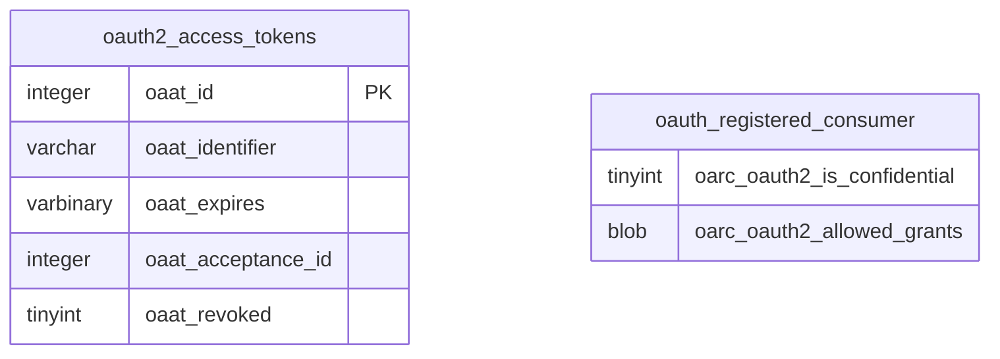

# Introduction to <SwmToken path="schema/oauth2_access_tokens.sql" pos="1:10:10" line-data="-- Access tokens used on OAuth2 requests">`OAuth2`</SwmToken>

<SwmToken path="schema/oauth2_access_tokens.sql" pos="1:10:10" line-data="-- Access tokens used on OAuth2 requests">`OAuth2`</SwmToken> is a protocol used for authorization, allowing third-party applications to access user data without exposing user credentials. It is widely used to grant websites or applications limited access to user information without exposing passwords.

# <SwmToken path="schema/oauth2_access_tokens.sql" pos="1:10:10" line-data="-- Access tokens used on OAuth2 requests">`OAuth2`</SwmToken> Access Tokens

The <SwmToken path="schema/oauth2_access_tokens.sql" pos="2:13:13" line-data="CREATE TABLE IF NOT EXISTS /*_*/oauth2_access_tokens (">`oauth2_access_tokens`</SwmToken> table stores access tokens used in <SwmToken path="schema/oauth2_access_tokens.sql" pos="1:10:10" line-data="-- Access tokens used on OAuth2 requests">`OAuth2`</SwmToken> requests. Each token has a unique identifier (<SwmToken path="schema/oauth2_access_tokens.sql" pos="5:1:1" line-data="    oaat_identifier varchar(255) NOT NULL,">`oaat_identifier`</SwmToken>), an expiration timestamp (<SwmToken path="schema/oauth2_access_tokens.sql" pos="7:1:1" line-data="    oaat_expires varbinary(14) NOT NULL,">`oaat_expires`</SwmToken>), and other relevant fields. This table is crucial for managing the lifecycle of access tokens.

<SwmSnippet path="/schema/oauth2_access_tokens.sql" line="1">

---

The <SwmToken path="schema/oauth2_access_tokens.sql" pos="2:13:13" line-data="CREATE TABLE IF NOT EXISTS /*_*/oauth2_access_tokens (">`oauth2_access_tokens`</SwmToken> table is created to store access tokens used in <SwmToken path="schema/oauth2_access_tokens.sql" pos="1:10:10" line-data="-- Access tokens used on OAuth2 requests">`OAuth2`</SwmToken> requests. Each token has a unique identifier and other relevant fields.

```plsql
-- Access tokens used on OAuth2 requests
CREATE TABLE IF NOT EXISTS /*_*/oauth2_access_tokens (
    oaat_id integer unsigned NOT NULL PRIMARY KEY auto_increment,
    -- Access token
    oaat_identifier varchar(255) NOT NULL,
```

---

</SwmSnippet>

# Indexes for Optimization

Indexes such as <SwmToken path="schema/oauth2_access_tokens.sql" pos="5:1:1" line-data="    oaat_identifier varchar(255) NOT NULL,">`oaat_identifier`</SwmToken> and <SwmToken path="schema/oauth2_access_tokens.sql" pos="9:1:1" line-data="    oaat_acceptance_id integer unsigned NOT NULL,">`oaat_acceptance_id`</SwmToken> are created on the <SwmToken path="schema/oauth2_access_tokens.sql" pos="2:13:13" line-data="CREATE TABLE IF NOT EXISTS /*_*/oauth2_access_tokens (">`oauth2_access_tokens`</SwmToken> table to optimize queries related to token identification and acceptance. These indexes improve the performance of database operations involving access tokens.

<SwmSnippet path="/schema/oauth2_access_tokens.sql" line="14">

---

Indexes are created on the <SwmToken path="schema/oauth2_access_tokens.sql" pos="15:6:6" line-data="    ON /*_*/oauth2_access_tokens (oaat_identifier);">`oauth2_access_tokens`</SwmToken> table to optimize queries related to token identification and acceptance.

```plsql
CREATE UNIQUE INDEX /*i*/oaat_identifier
    ON /*_*/oauth2_access_tokens (oaat_identifier);

CREATE INDEX /*i*/oaat_acceptance_id
    ON /*_*/oauth2_access_tokens (oaat_acceptance_id);
```

---

</SwmSnippet>

# Confidential Clients and Allowed Grants

The <SwmToken path="schema/oauth2_is_confidential.sql" pos="1:7:7" line-data="ALTER TABLE /*_*/oauth_registered_consumer">`oauth_registered_consumer`</SwmToken> table is modified to include fields like <SwmToken path="schema/oauth2_is_confidential.sql" pos="2:3:3" line-data="    ADD oarc_oauth2_is_confidential TINYINT NOT NULL DEFAULT 1;">`oarc_oauth2_is_confidential`</SwmToken> to specify whether an <SwmToken path="schema/oauth2_access_tokens.sql" pos="1:10:10" line-data="-- Access tokens used on OAuth2 requests">`OAuth2`</SwmToken> client is confidential. Additionally, the <SwmToken path="schema/oauth2_allowed_grants.sql" pos="2:3:3" line-data="    ADD oarc_oauth2_allowed_grants BLOB NULL;">`oarc_oauth2_allowed_grants`</SwmToken> field specifies what grants are allowed for the <SwmToken path="schema/oauth2_access_tokens.sql" pos="1:10:10" line-data="-- Access tokens used on OAuth2 requests">`OAuth2`</SwmToken> client.

<SwmSnippet path="/schema/oauth2_is_confidential.sql" line="1">

---

The <SwmToken path="schema/oauth2_is_confidential.sql" pos="1:7:7" line-data="ALTER TABLE /*_*/oauth_registered_consumer">`oauth_registered_consumer`</SwmToken> table is modified to include the <SwmToken path="schema/oauth2_is_confidential.sql" pos="2:3:3" line-data="    ADD oarc_oauth2_is_confidential TINYINT NOT NULL DEFAULT 1;">`oarc_oauth2_is_confidential`</SwmToken> field, which specifies whether an <SwmToken path="schema/oauth2_access_tokens.sql" pos="1:10:10" line-data="-- Access tokens used on OAuth2 requests">`OAuth2`</SwmToken> client is confidential.

```plsql
ALTER TABLE /*_*/oauth_registered_consumer
    ADD oarc_oauth2_is_confidential TINYINT NOT NULL DEFAULT 1;
```

---

</SwmSnippet>

<SwmSnippet path="/schema/oauth2_allowed_grants.sql" line="1">

---

The <SwmToken path="schema/oauth2_allowed_grants.sql" pos="1:7:7" line-data="ALTER TABLE /*_*/oauth_registered_consumer">`oauth_registered_consumer`</SwmToken> table is modified to include the <SwmToken path="schema/oauth2_allowed_grants.sql" pos="2:3:3" line-data="    ADD oarc_oauth2_allowed_grants BLOB NULL;">`oarc_oauth2_allowed_grants`</SwmToken> field, which specifies what grants are allowed for an <SwmToken path="schema/oauth2_access_tokens.sql" pos="1:10:10" line-data="-- Access tokens used on OAuth2 requests">`OAuth2`</SwmToken> client.

```plsql
ALTER TABLE /*_*/oauth_registered_consumer
    ADD oarc_oauth2_allowed_grants BLOB NULL;
```

---

</SwmSnippet>

# Main Functions

There are several main functions in <SwmToken path="schema/oauth2_access_tokens.sql" pos="1:10:10" line-data="-- Access tokens used on OAuth2 requests">`OAuth2`</SwmToken>, including token management, client confidentiality, and allowed grants. These functions are essential for the secure and efficient operation of the <SwmToken path="schema/oauth2_access_tokens.sql" pos="1:10:10" line-data="-- Access tokens used on OAuth2 requests">`OAuth2`</SwmToken> protocol.

## Token Management

Token management involves storing and managing access tokens in the <SwmToken path="schema/oauth2_access_tokens.sql" pos="2:13:13" line-data="CREATE TABLE IF NOT EXISTS /*_*/oauth2_access_tokens (">`oauth2_access_tokens`</SwmToken> table. This includes fields such as <SwmToken path="schema/oauth2_access_tokens.sql" pos="3:1:1" line-data="    oaat_id integer unsigned NOT NULL PRIMARY KEY auto_increment,">`oaat_id`</SwmToken>, <SwmToken path="schema/oauth2_access_tokens.sql" pos="5:1:1" line-data="    oaat_identifier varchar(255) NOT NULL,">`oaat_identifier`</SwmToken>, <SwmToken path="schema/oauth2_access_tokens.sql" pos="7:1:1" line-data="    oaat_expires varbinary(14) NOT NULL,">`oaat_expires`</SwmToken>, <SwmToken path="schema/oauth2_access_tokens.sql" pos="9:1:1" line-data="    oaat_acceptance_id integer unsigned NOT NULL,">`oaat_acceptance_id`</SwmToken>, and <SwmToken path="schema/oauth2_access_tokens.sql" pos="11:1:1" line-data="    oaat_revoked tinyint NOT NULL DEFAULT 0">`oaat_revoked`</SwmToken> to manage token details. Indexes like <SwmToken path="schema/oauth2_access_tokens.sql" pos="5:1:1" line-data="    oaat_identifier varchar(255) NOT NULL,">`oaat_identifier`</SwmToken> and <SwmToken path="schema/oauth2_access_tokens.sql" pos="9:1:1" line-data="    oaat_acceptance_id integer unsigned NOT NULL,">`oaat_acceptance_id`</SwmToken> optimize queries related to token identification and acceptance.

<SwmSnippet path="/schema/oauth2_access_tokens.sql" line="1">

---

The <SwmToken path="schema/oauth2_access_tokens.sql" pos="2:13:13" line-data="CREATE TABLE IF NOT EXISTS /*_*/oauth2_access_tokens (">`oauth2_access_tokens`</SwmToken> table is used to store access tokens for <SwmToken path="schema/oauth2_access_tokens.sql" pos="1:10:10" line-data="-- Access tokens used on OAuth2 requests">`OAuth2`</SwmToken> requests. It includes fields such as <SwmToken path="schema/oauth2_access_tokens.sql" pos="3:1:1" line-data="    oaat_id integer unsigned NOT NULL PRIMARY KEY auto_increment,">`oaat_id`</SwmToken>, <SwmToken path="schema/oauth2_access_tokens.sql" pos="5:1:1" line-data="    oaat_identifier varchar(255) NOT NULL,">`oaat_identifier`</SwmToken>, <SwmToken path="schema/oauth2_access_tokens.sql" pos="7:1:1" line-data="    oaat_expires varbinary(14) NOT NULL,">`oaat_expires`</SwmToken>, <SwmToken path="schema/oauth2_access_tokens.sql" pos="9:1:1" line-data="    oaat_acceptance_id integer unsigned NOT NULL,">`oaat_acceptance_id`</SwmToken>, and <SwmToken path="schema/oauth2_access_tokens.sql" pos="11:1:1" line-data="    oaat_revoked tinyint NOT NULL DEFAULT 0">`oaat_revoked`</SwmToken> to manage token details. Indexes like <SwmToken path="schema/oauth2_access_tokens.sql" pos="5:1:1" line-data="    oaat_identifier varchar(255) NOT NULL,">`oaat_identifier`</SwmToken> and <SwmToken path="schema/oauth2_access_tokens.sql" pos="9:1:1" line-data="    oaat_acceptance_id integer unsigned NOT NULL,">`oaat_acceptance_id`</SwmToken> optimize queries related to token identification and acceptance.

```plsql
-- Access tokens used on OAuth2 requests
CREATE TABLE IF NOT EXISTS /*_*/oauth2_access_tokens (
    oaat_id integer unsigned NOT NULL PRIMARY KEY auto_increment,
    -- Access token
    oaat_identifier varchar(255) NOT NULL,
    -- Expiration timestamp
    oaat_expires varbinary(14) NOT NULL,
    -- Identifier of the acceptance that allows this access token to be created
    oaat_acceptance_id integer unsigned NOT NULL,
    -- Indicates if the access token has been revoked
    oaat_revoked tinyint NOT NULL DEFAULT 0
) /*$wgDBTableOptions*/;

CREATE UNIQUE INDEX /*i*/oaat_identifier
    ON /*_*/oauth2_access_tokens (oaat_identifier);

CREATE INDEX /*i*/oaat_acceptance_id
    ON /*_*/oauth2_access_tokens (oaat_acceptance_id);
```

---

</SwmSnippet>

## Client Confidentiality

Client confidentiality is managed by modifying the <SwmToken path="schema/oauth2_is_confidential.sql" pos="1:7:7" line-data="ALTER TABLE /*_*/oauth_registered_consumer">`oauth_registered_consumer`</SwmToken> table to include the <SwmToken path="schema/oauth2_is_confidential.sql" pos="2:3:3" line-data="    ADD oarc_oauth2_is_confidential TINYINT NOT NULL DEFAULT 1;">`oarc_oauth2_is_confidential`</SwmToken> field. This field specifies whether an <SwmToken path="schema/oauth2_access_tokens.sql" pos="1:10:10" line-data="-- Access tokens used on OAuth2 requests">`OAuth2`</SwmToken> client is confidential, ensuring that sensitive client information is protected.

<SwmSnippet path="/schema/oauth2_is_confidential.sql" line="1">

---

The <SwmPath>[schema/oauth2_is_confidential.sql](schema/oauth2_is_confidential.sql)</SwmPath> file modifies the <SwmToken path="schema/oauth2_is_confidential.sql" pos="1:7:7" line-data="ALTER TABLE /*_*/oauth_registered_consumer">`oauth_registered_consumer`</SwmToken> table to include the <SwmToken path="schema/oauth2_is_confidential.sql" pos="2:3:3" line-data="    ADD oarc_oauth2_is_confidential TINYINT NOT NULL DEFAULT 1;">`oarc_oauth2_is_confidential`</SwmToken> field, which specifies whether an <SwmToken path="schema/oauth2_access_tokens.sql" pos="1:10:10" line-data="-- Access tokens used on OAuth2 requests">`OAuth2`</SwmToken> client is confidential.

```plsql
ALTER TABLE /*_*/oauth_registered_consumer
    ADD oarc_oauth2_is_confidential TINYINT NOT NULL DEFAULT 1;
```

---

</SwmSnippet>

## Allowed Grants

Allowed grants are specified by modifying the <SwmToken path="schema/oauth2_is_confidential.sql" pos="1:7:7" line-data="ALTER TABLE /*_*/oauth_registered_consumer">`oauth_registered_consumer`</SwmToken> table to include the <SwmToken path="schema/oauth2_allowed_grants.sql" pos="2:3:3" line-data="    ADD oarc_oauth2_allowed_grants BLOB NULL;">`oarc_oauth2_allowed_grants`</SwmToken> field. This field specifies what grants are allowed for an <SwmToken path="schema/oauth2_access_tokens.sql" pos="1:10:10" line-data="-- Access tokens used on OAuth2 requests">`OAuth2`</SwmToken> client, ensuring that only authorized grants are used.

<SwmSnippet path="/schema/oauth2_allowed_grants.sql" line="1">

---

The <SwmPath>[schema/oauth2_allowed_grants.sql](schema/oauth2_allowed_grants.sql)</SwmPath> file modifies the <SwmToken path="schema/oauth2_allowed_grants.sql" pos="1:7:7" line-data="ALTER TABLE /*_*/oauth_registered_consumer">`oauth_registered_consumer`</SwmToken> table to include the <SwmToken path="schema/oauth2_allowed_grants.sql" pos="2:3:3" line-data="    ADD oarc_oauth2_allowed_grants BLOB NULL;">`oarc_oauth2_allowed_grants`</SwmToken> field, which specifies what grants are allowed for an <SwmToken path="schema/oauth2_access_tokens.sql" pos="1:10:10" line-data="-- Access tokens used on OAuth2 requests">`OAuth2`</SwmToken> client.

```plsql
ALTER TABLE /*_*/oauth_registered_consumer
    ADD oarc_oauth2_allowed_grants BLOB NULL;
```

---

</SwmSnippet>

&nbsp;

*This is an auto-generated document by Swimm AI 🌊 and has not yet been verified by a human*

<SwmMeta version="3.0.0" repo-id="Z2l0aHViJTNBJTNBbWVkaWF3aWtpLWV4dGVuc2lvbnMtT0F1dGglM0ElM0FTd2ltbS1EZW1v" repo-name="mediawiki-extensions-OAuth"><sup>Powered by [Swimm](/)</sup></SwmMeta>
