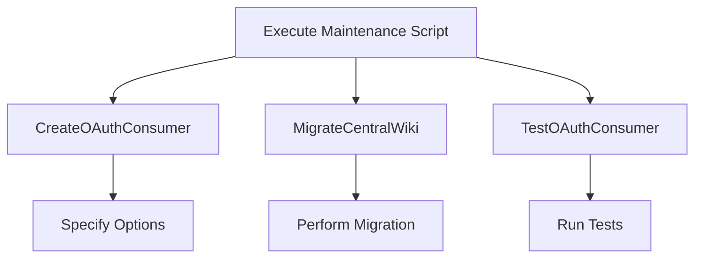

# Maintenance Overview

Maintenance refers to the scripts and tasks that help manage and support the <SwmToken path="maintenance/migrateCentralWiki.php" pos="29:6:6" line-data="use MediaWiki\Extension\OAuth\Backend\Consumer;">`OAuth`</SwmToken> extension's functionality. These scripts are located in the <SwmToken path="maintenance/migrateCentralWiki.php" pos="26:6:6" line-data="require_once &quot;$IP/maintenance/Maintenance.php&quot;;">`maintenance`</SwmToken> directory and include tasks such as creating <SwmToken path="maintenance/migrateCentralWiki.php" pos="29:6:6" line-data="use MediaWiki\Extension\OAuth\Backend\Consumer;">`OAuth`</SwmToken> consumers, migrating central wiki data, and testing <SwmToken path="maintenance/migrateCentralWiki.php" pos="29:6:6" line-data="use MediaWiki\Extension\OAuth\Backend\Consumer;">`OAuth`</SwmToken> consumers.

# Creating <SwmToken path="maintenance/migrateCentralWiki.php" pos="29:6:6" line-data="use MediaWiki\Extension\OAuth\Backend\Consumer;">`OAuth`</SwmToken> Consumers

The `CreateOAuthConsumer` script extends the <SwmToken path="maintenance/migrateCentralWiki.php" pos="26:6:6" line-data="require_once &quot;$IP/maintenance/Maintenance.php&quot;;">`maintenance`</SwmToken> class and provides functionality to create an <SwmToken path="maintenance/migrateCentralWiki.php" pos="29:6:6" line-data="use MediaWiki\Extension\OAuth\Backend\Consumer;">`OAuth`</SwmToken> consumer. It includes options for specifying user details, application information, and grants.

The <SwmToken path="maintenance/migrateCentralWiki.php" pos="47:5:5" line-data="	public function execute() {">`execute`</SwmToken> method in this class handles the creation process, including validating the user, preparing the data, and submitting it to the `ConsumerSubmitControl`. If the `approve` option is provided, the script will also approve the newly created <SwmToken path="maintenance/migrateCentralWiki.php" pos="29:6:6" line-data="use MediaWiki\Extension\OAuth\Backend\Consumer;">`OAuth`</SwmToken> consumer. The output of the script can be formatted as JSON if the `jsonOnSuccess` option is used, otherwise, it will be printed in a readable format.

# Migrating Central Wiki Data

The <SwmToken path="maintenance/migrateCentralWiki.php" pos="34:2:2" line-data="class MigrateCentralWiki extends Maintenance {">`MigrateCentralWiki`</SwmToken> script is used to migrate central wiki data. It requires the <SwmToken path="maintenance/migrateCentralWiki.php" pos="26:8:10" line-data="require_once &quot;$IP/maintenance/Maintenance.php&quot;;">`Maintenance.php`</SwmToken> file and uses various classes from the <SwmToken path="maintenance/migrateCentralWiki.php" pos="29:6:6" line-data="use MediaWiki\Extension\OAuth\Backend\Consumer;">`OAuth`</SwmToken> extension to perform the migration.

<SwmSnippet path="/maintenance/migrateCentralWiki.php" line="26">

---

The <SwmToken path="maintenance/migrateCentralWiki.php" pos="34:2:2" line-data="class MigrateCentralWiki extends Maintenance {">`MigrateCentralWiki`</SwmToken> script imports necessary classes and extends the <SwmToken path="maintenance/migrateCentralWiki.php" pos="26:6:6" line-data="require_once &quot;$IP/maintenance/Maintenance.php&quot;;">`maintenance`</SwmToken> class to perform the migration of central wiki data.

```hack
require_once "$IP/maintenance/Maintenance.php";

use Maintenance;
use MediaWiki\Extension\OAuth\Backend\Consumer;
use MediaWiki\Extension\OAuth\Backend\ConsumerAcceptance;
```

---

</SwmSnippet>

# Testing <SwmToken path="maintenance/migrateCentralWiki.php" pos="29:6:6" line-data="use MediaWiki\Extension\OAuth\Backend\Consumer;">`OAuth`</SwmToken> Consumers

The <SwmToken path="maintenance/testOAuthConsumer.php" pos="23:2:2" line-data="class TestOAuthConsumer extends Maintenance {">`TestOAuthConsumer`</SwmToken> script is used to test <SwmToken path="maintenance/migrateCentralWiki.php" pos="29:6:6" line-data="use MediaWiki\Extension\OAuth\Backend\Consumer;">`OAuth`</SwmToken> consumers. It imports necessary classes from the <SwmToken path="maintenance/migrateCentralWiki.php" pos="29:6:6" line-data="use MediaWiki\Extension\OAuth\Backend\Consumer;">`OAuth`</SwmToken> extension to perform the tests.

<SwmSnippet path="/maintenance/testOAuthConsumer.php" line="5">

---

The <SwmToken path="maintenance/testOAuthConsumer.php" pos="23:2:2" line-data="class TestOAuthConsumer extends Maintenance {">`TestOAuthConsumer`</SwmToken> script imports necessary classes and extends the <SwmToken path="maintenance/testOAuthConsumer.php" pos="5:2:2" line-data="use Maintenance;">`Maintenance`</SwmToken> class to test <SwmToken path="maintenance/testOAuthConsumer.php" pos="6:6:6" line-data="use MediaWiki\Extension\OAuth\Lib\OAuthConsumer;">`OAuth`</SwmToken> consumers.

```hack
use Maintenance;
use MediaWiki\Extension\OAuth\Lib\OAuthConsumer;
use MediaWiki\Extension\OAuth\Lib\OAuthException;
use MediaWiki\Extension\OAuth\Lib\OAuthRequest;
use MediaWiki\Extension\OAuth\Lib\OAuthSignatureMethodHmacSha1;
```

---

</SwmSnippet>

&nbsp;

*This is an auto-generated document by Swimm AI 🌊 and has not yet been verified by a human*

<SwmMeta version="3.0.0" repo-id="Z2l0aHViJTNBJTNBbWVkaWF3aWtpLWV4dGVuc2lvbnMtT0F1dGglM0ElM0FTd2ltbS1EZW1v" repo-name="mediawiki-extensions-OAuth"><sup>Powered by [Swimm](/)</sup></SwmMeta>
