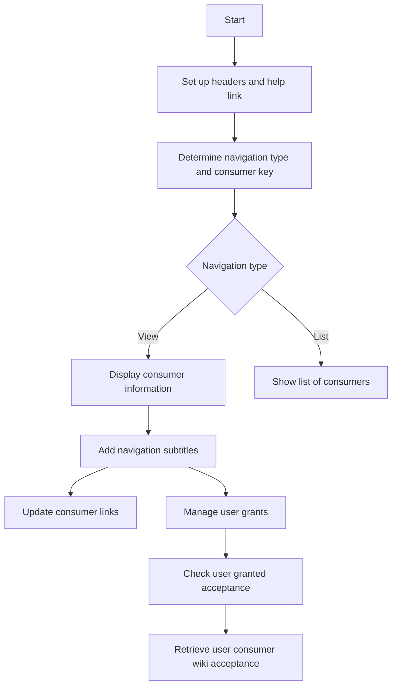

This document will cover the process of executing the main flow for managing OAuth consumers in MediaWiki. We'll cover:

1. Setting up headers and help link
2. Determining navigation type and consumer key
3. Displaying consumer information
4. Adding navigation subtitles
5. Updating consumer links
6. Managing user grants

Technical document: <SwmLink doc-title="Executing the Main Flow">[Executing the Main Flow](/.swm/executing-the-main-flow.8teffz74.sw.md)</SwmLink>

# [Setting up headers and help link](https://app.swimm.io/repos/Z2l0aHViJTNBJTNBbWVkaWF3aWtpLWV4dGVuc2lvbnMtT0F1dGglM0ElM0FTd2ltbS1EZW1v/docs/8teffz74#executing-the-main-flow)

The first step in the main flow is to set up the headers and add a help link. This ensures that the user interface is properly initialized and that users have access to help documentation if needed. This step is crucial for providing a consistent and user-friendly experience.

# [Determining navigation type and consumer key](https://app.swimm.io/repos/Z2l0aHViJTNBJTNBbWVkaWF3aWtpLWV4dGVuc2lvbnMtT0F1dGglM0ElM0FTd2ltbS1EZW1v/docs/8teffz74#executing-the-main-flow)

Next, the system determines the type of navigation and the consumer key based on the URL parameters. This step is important because it dictates what information will be displayed to the user. The navigation type can either be 'view' for detailed consumer information or 'list' for a list of consumers.

# [Displaying consumer information](https://app.swimm.io/repos/Z2l0aHViJTNBJTNBbWVkaWF3aWtpLWV4dGVuc2lvbnMtT0F1dGglM0ElM0FTd2ltbS1EZW1v/docs/8teffz74#showing-consumer-information)

If the navigation type is 'view', the system retrieves and displays detailed information about a specific OAuth consumer. This includes checking for a valid consumer key, retrieving the consumer's grants, and displaying various details such as the consumer's name, version, status, and description. This step ensures that users can see all relevant information about a specific consumer.

# [Adding navigation subtitles](https://app.swimm.io/repos/Z2l0aHViJTNBJTNBbWVkaWF3aWtpLWV4dGVuc2lvbnMtT0F1dGglM0ElM0FTd2ltbS1EZW1v/docs/8teffz74#adding-navigation-subtitle)

The system then adds a subtitle with navigation links related to the consumer. These links allow users to update the consumer, manage the consumer, and manage their grants. This step enhances the user experience by providing easy access to related actions.

# [Updating consumer links](https://app.swimm.io/repos/Z2l0aHViJTNBJTNBbWVkaWF3aWtpLWV4dGVuc2lvbnMtT0F1dGglM0ElM0FTd2ltbS1EZW1v/docs/8teffz74#updating-consumer-link)

The system generates a link for updating the consumer if the user has the necessary permissions. This ensures that only authorized users can make changes to the consumer, maintaining the integrity and security of the system.

# [Managing user grants](https://app.swimm.io/repos/Z2l0aHViJTNBJTNBbWVkaWF3aWtpLWV4dGVuc2lvbnMtT0F1dGglM0ElM0FTd2ltbS1EZW1v/docs/8teffz74#managing-user-grants-link)

The system generates a link for managing the user's grants for the consumer if the user has granted acceptance. This allows users to easily manage their permissions and grants, providing better control over their data and interactions with the consumer.

# [Checking user granted acceptance](https://app.swimm.io/repos/Z2l0aHViJTNBJTNBbWVkaWF3aWtpLWV4dGVuc2lvbnMtT0F1dGglM0ElM0FTd2ltbS1EZW1v/docs/8teffz74#checking-user-granted-acceptance)

The system checks if the user has granted acceptance for the consumer, either for the current wiki or for all wikis. This step is crucial for ensuring that the user has the necessary permissions to interact with the consumer.

# [Retrieving user consumer wiki acceptance](https://app.swimm.io/repos/Z2l0aHViJTNBJTNBbWVkaWF3aWtpLWV4dGVuc2lvbnMtT0F1dGglM0ElM0FTd2ltbS1EZW1v/docs/8teffz74#retrieving-user-consumer-wiki-acceptance)

Finally, the system retrieves the acceptance record for the user and consumer for a specific wiki. It queries the database and returns the acceptance record if found. This step ensures that the system has up-to-date information about the user's permissions and grants.

&nbsp;

*This is an auto-generated document by Swimm 🌊 and has not yet been verified by a human*

<SwmMeta version="3.0.0" repo-id="Z2l0aHViJTNBJTNBbWVkaWF3aWtpLWV4dGVuc2lvbnMtT0F1dGglM0ElM0FTd2ltbS1EZW1v" repo-name="mediawiki-extensions-OAuth">Powered by [Swimm](/)</SwmMeta>
