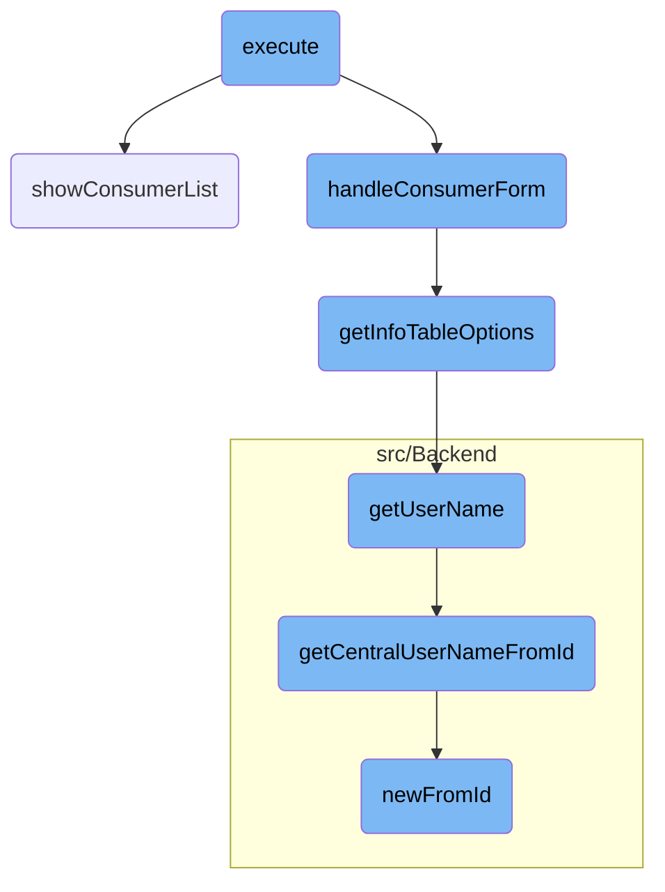
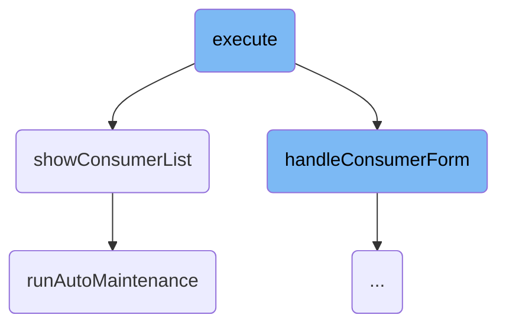
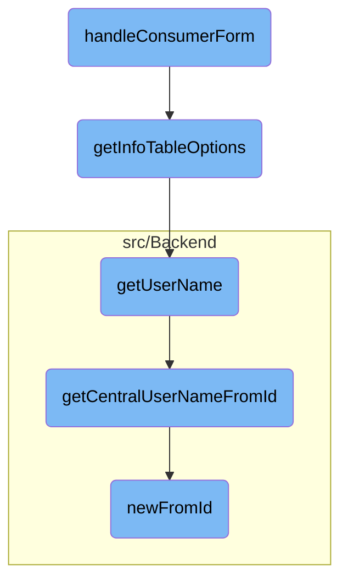

This document explains the process of managing <SwmToken path="src/Frontend/SpecialPages/SpecialMWOAuthManageConsumers.php" pos="94:10:10" line-data="		$this-&gt;addHelpLink( &#39;Help:OAuth&#39; );">`OAuth`</SwmToken> consumer forms and displaying consumer lists. The process involves checking user permissions, handling specific consumer forms based on URL parameters, and displaying a paginated list of <SwmToken path="src/Frontend/SpecialPages/SpecialMWOAuthManageConsumers.php" pos="94:10:10" line-data="		$this-&gt;addHelpLink( &#39;Help:OAuth&#39; );">`OAuth`</SwmToken> consumers. Additionally, it includes periodic maintenance to clean up expired consumer requests.

The flow starts by checking if the user has the necessary permissions and if the system is not in <SwmToken path="src/Backend/MWOAuthDAO.php" pos="192:31:33" line-data="			throw new DBReadOnlyError( $dbw, __CLASS__ . &quot;: tried to save while db is read-only&quot; );">`read-only`</SwmToken> mode. Depending on the URL parameters, it either processes a specific consumer form or shows a list of consumers. If a consumer form is being handled, it sets up the form options and processes the submitted action. If a list of consumers is being displayed, it generates the list and occasionally runs maintenance to clean up old entries.

Here is a high level diagram of the flow, showing only the most important functions:



# Flow drill down

First, we'll zoom into this section of the flow:



<SwmSnippet path="/src/Frontend/SpecialPages/SpecialMWOAuthManageConsumers.php" line="88">

---

## Handling Consumer Forms

The <SwmToken path="src/Frontend/SpecialPages/SpecialMWOAuthManageConsumers.php" pos="88:5:5" line-data="	public function execute( $par ) {">`execute`</SwmToken> function is responsible for managing the flow of handling <SwmToken path="src/Frontend/SpecialPages/SpecialMWOAuthManageConsumers.php" pos="94:10:10" line-data="		$this-&gt;addHelpLink( &#39;Help:OAuth&#39; );">`OAuth`</SwmToken> consumer forms and displaying consumer lists. It first checks user permissions and configuration settings. Depending on the URL parameters, it either handles a specific consumer form or shows a list of consumers.

```hack
	public function execute( $par ) {
		$user = $this->getUser();
		$permissionManager = MediaWikiServices::getInstance()->getPermissionManager();

		$this->setHeaders();
		$this->getOutput()->disallowUserJs();
		$this->addHelpLink( 'Help:OAuth' );
		$this->requireNamedUser( 'mwoauth-available-only-to-registered' );

		if ( !$permissionManager->userHasRight( $user, 'mwoauthmanageconsumer' ) ) {
			throw new PermissionsError( 'mwoauthmanageconsumer' );
		}

		if ( $this->getConfig()->get( 'MWOAuthReadOnly' ) ) {
			throw new ErrorPageError( 'mwoauth-error', 'mwoauth-db-readonly' );
		}

		// Format is Special:OAuthManageConsumers[/<stage>|/<consumer key>]
		// B/C format is Special:OAuthManageConsumers/<stage>/<consumer key>
		$consumerKey = null;
		$navigation = $par !== null ? explode( '/', $par ) : [];
```

---

</SwmSnippet>

<SwmSnippet path="/src/Frontend/SpecialPages/SpecialMWOAuthManageConsumers.php" line="468">

---

## Showing Consumer List

The <SwmToken path="src/Frontend/SpecialPages/SpecialMWOAuthManageConsumers.php" pos="471:5:5" line-data="	protected function showConsumerList() {">`showConsumerList`</SwmToken> function displays a paginated list of <SwmToken path="src/Frontend/SpecialPages/SpecialMWOAuthManageConsumers.php" pos="94:10:10" line-data="		$this-&gt;addHelpLink( &#39;Help:OAuth&#39; );">`OAuth`</SwmToken> consumers. It uses the <SwmToken path="src/Frontend/SpecialPages/SpecialMWOAuthManageConsumers.php" pos="472:8:8" line-data="		$pager = new ManageConsumersPager( $this, [], $this-&gt;stage );">`ManageConsumersPager`</SwmToken> to generate the list and adds it to the output. If there are no consumers to display, it shows a message indicating the absence of consumers in the current stage. Additionally, it occasionally triggers the <SwmToken path="src/Frontend/SpecialPages/SpecialMWOAuthManageConsumers.php" pos="485:3:3" line-data="			Utils::runAutoMaintenance( Utils::getCentralDB( DB_PRIMARY ) );">`runAutoMaintenance`</SwmToken> function to prune old deleted items.

```hack
	/**
	 * Show a paged list of consumers with links to details
	 */
	protected function showConsumerList() {
		$pager = new ManageConsumersPager( $this, [], $this->stage );
		if ( $pager->getNumRows() ) {
			$this->getOutput()->addHTML( $pager->getNavigationBar() );
			$this->getOutput()->addHTML( $pager->getBody() );
			$this->getOutput()->addHTML( $pager->getNavigationBar() );
		} else {
			// Messages: mwoauthmanageconsumers-none-proposed, mwoauthmanageconsumers-none-rejected,
			// mwoauthmanageconsumers-none-expired, mwoauthmanageconsumers-none-approved,
			// mwoauthmanageconsumers-none-disabled
			$this->getOutput()->addWikiMsg( "mwoauthmanageconsumers-none-{$this->stageKey}" );
		}
		# Every 30th view, prune old deleted items
		if ( mt_rand( 0, 29 ) == 0 ) {
			Utils::runAutoMaintenance( Utils::getCentralDB( DB_PRIMARY ) );
		}
	}
```

---

</SwmSnippet>

<SwmSnippet path="/src/Backend/Utils.php" line="161">

---

### Running Auto Maintenance

The <SwmToken path="src/Backend/Utils.php" pos="165:7:7" line-data="	public static function runAutoMaintenance( IDatabase $dbw ) {">`runAutoMaintenance`</SwmToken> function is called to clean up expired <SwmToken path="src/Frontend/SpecialPages/SpecialMWOAuthManageConsumers.php" pos="94:10:10" line-data="		$this-&gt;addHelpLink( &#39;Help:OAuth&#39; );">`OAuth`</SwmToken> consumer requests. It updates the database to mark proposed consumers as expired if they have passed the expiration age. This helps in maintaining the database by removing outdated entries.

```hack
	/**
	 * @param IDatabase $dbw
	 * @return void
	 */
	public static function runAutoMaintenance( IDatabase $dbw ) {
		global $wgMWOAuthRequestExpirationAge;

		if ( $wgMWOAuthRequestExpirationAge <= 0 ) {
			return;
		}

		$cutoff = time() - $wgMWOAuthRequestExpirationAge;
		$fname = __METHOD__;
		DeferredUpdates::addUpdate(
			new AutoCommitUpdate(
				$dbw,
				__METHOD__,
				static function ( IDatabase $dbw ) use ( $cutoff, $fname ) {
					$dbw->newUpdateQueryBuilder()
						->update( 'oauth_registered_consumer' )
						->set( [
```

---

</SwmSnippet>

Now, lets zoom into this section of the flow:



<SwmSnippet path="/src/Frontend/SpecialPages/SpecialMWOAuthManageConsumers.php" line="233">

---

## Handling Consumer Form

The <SwmToken path="src/Frontend/SpecialPages/SpecialMWOAuthManageConsumers.php" pos="239:5:5" line-data="	protected function handleConsumerForm( $consumerKey ) {">`handleConsumerForm`</SwmToken> function is responsible for displaying and processing the form that allows administrators to approve, reject, disable, or <SwmToken path="src/Frontend/SpecialPages/SpecialMWOAuthManageConsumers.php" pos="234:17:19" line-data="	 * Show the form to approve/reject/disable/re-enable consumers">`re-enable`</SwmToken> <SwmToken path="src/Frontend/SpecialPages/SpecialMWOAuthManageConsumers.php" pos="94:10:10" line-data="		$this-&gt;addHelpLink( &#39;Help:OAuth&#39; );">`OAuth`</SwmToken> consumers. It first checks the user's permissions and the current state of the consumer. Depending on whether the consumer is pending approval or already <SwmToken path="src/Frontend/SpecialPages/SpecialMWOAuthManageConsumers.php" pos="51:17:19" line-data=" * their approval/rejection and also for listing approved/disabled consumers">`approved/disabled`</SwmToken>, it sets up the appropriate form options. The form is then displayed to the user, and upon submission, the selected action is processed.

```hack
	/**
	 * Show the form to approve/reject/disable/re-enable consumers
	 *
	 * @param string $consumerKey
	 * @throws PermissionsError
	 */
	protected function handleConsumerForm( $consumerKey ) {
		$user = $this->getUser();
		$dbr = Utils::getCentralDB( DB_REPLICA );
		$cmrAc = ConsumerAccessControl::wrap(
			Consumer::newFromKey( $dbr, $consumerKey ), $this->getContext() );
		$permissionManager = MediaWikiServices::getInstance()->getPermissionManager();

		if ( !$cmrAc ) {
			$this->getOutput()->addWikiMsg( 'mwoauth-invalid-consumer-key' );
			return;
		} elseif ( $cmrAc->getDeleted()
			&& !$permissionManager->userHasRight( $user, 'mwoauthviewsuppressed' ) ) {
			throw new PermissionsError( 'mwoauthviewsuppressed' );
		}
		$startingStage = $cmrAc->getStage();
```

---

</SwmSnippet>

<SwmSnippet path="/src/Frontend/SpecialPages/SpecialMWOAuthManageConsumers.php" line="362">

---

## Getting Info Table Options

The <SwmToken path="src/Frontend/SpecialPages/SpecialMWOAuthManageConsumers.php" pos="366:5:5" line-data="	protected function getInfoTableOptions( $cmrAc ) {">`getInfoTableOptions`</SwmToken> function generates the options for the information table displayed in the consumer management form. It gathers various details about the consumer, such as the owner, version, description, and <SwmToken path="src/Frontend/SpecialPages/SpecialMWOAuthManageConsumers.php" pos="94:10:10" line-data="		$this-&gt;addHelpLink( &#39;Help:OAuth&#39; );">`OAuth`</SwmToken> version, and formats them for display. This information helps administrators make informed decisions about the consumer.

```hack
	/**
	 * @param ConsumerAccessControl $cmrAc
	 * @return array
	 */
	protected function getInfoTableOptions( $cmrAc ) {
		$owner = $cmrAc->getUserName();
		$lang = $this->getLanguage();

		$link = $this->getLinkRenderer()->makeKnownLink(
			$title = SpecialPage::getTitleFor( 'OAuthListConsumers' ),
			$this->msg( 'mwoauthmanageconsumers-search-publisher' )->text(),
			[],
			[ 'publisher' => $owner ]
		);
		$ownerLink = $cmrAc->escapeForHtml( $owner ) . ' ' .
			$this->msg( 'parentheses' )->rawParams( $link )->escaped();
		$ownerOnly = $cmrAc->getDAO()->getOwnerOnly();
		$restrictions = $cmrAc->getRestrictions();

		$options = [
			// Messages: mwoauth-consumer-stage-proposed, mwoauth-consumer-stage-rejected,
```

---

</SwmSnippet>

<SwmSnippet path="/src/Control/ConsumerAccessControl.php" line="226">

---

## Retrieving User Name

The <SwmToken path="src/Control/ConsumerAccessControl.php" pos="234:5:5" line-data="	public function getUserName( $audience = false ) {">`getUserName`</SwmToken> function retrieves the username of the consumer's owner. It performs a database lookup to get the central username based on the user ID. This is used to display the owner's name in the consumer information table.

```hack
	// accessors for common formatting

	/**
	 * Owner username.
	 * Note that this method triggers a DB lookup.
	 * @param User|bool $audience show hidden names based on this user, or false for public
	 * @return string|Message
	 */
	public function getUserName( $audience = false ) {
		return $this->get( 'userId', static function ( $id ) use ( $audience ) {
			return Utils::getCentralUserNameFromId( $id, $audience );
		} );
	}
```

---

</SwmSnippet>

<SwmSnippet path="/src/Backend/Utils.php" line="254">

---

## Getting Central User Name from ID

The <SwmToken path="src/Backend/Utils.php" pos="262:7:7" line-data="	public static function getCentralUserNameFromId( $userId, $audience = false ) {">`getCentralUserNameFromId`</SwmToken> function fetches the central username for a given user ID. It checks if the user ID is part of a shared user ID system and retrieves the username accordingly. If the username is hidden, it checks the permissions of the audience to determine if the hidden name can be shown.

```hack
	/**
	 * Given a central wiki user ID, get a central username
	 *
	 * @param int $userId
	 * @param bool|User|string $audience show hidden names based on this user, or false for public
	 * @throws MWException
	 * @return string|bool Username, false if not found, empty string if name is hidden
	 */
	public static function getCentralUserNameFromId( $userId, $audience = false ) {
		global $wgMWOAuthSharedUserIDs, $wgMWOAuthSharedUserSource;

		// global ID required via hook
		if ( $wgMWOAuthSharedUserIDs ) {
			$lookup = MediaWikiServices::getInstance()
				->getCentralIdLookupFactory()
				->getLookup( $wgMWOAuthSharedUserSource );
			$name = $lookup->nameFromCentralId(
				$userId,
				$audience === 'raw'
					? CentralIdLookup::AUDIENCE_RAW
					: ( $audience ?: CentralIdLookup::AUDIENCE_PUBLIC )
```

---

</SwmSnippet>

<SwmSnippet path="/src/Backend/MWOAuthDAO.php" line="96">

---

## Creating Consumer from ID

The <SwmToken path="src/Backend/MWOAuthDAO.php" pos="103:9:9" line-data="	final public static function newFromId( IDatabase $db, $id, $flags = 0 ) {">`newFromId`</SwmToken> function creates a new consumer object from a given ID. It performs a database query to fetch the consumer's details and initializes a new consumer object with the retrieved data. This is used to get the consumer object based on the consumer key provided in the form.

```hack
	/**
	 * @param IDatabase $db
	 * @param int $id
	 * @param int $flags IDBAccessObject::READ_* bitfield
	 * @return static|bool Returns false if not found
	 * @throws DBError
	 */
	final public static function newFromId( IDatabase $db, $id, $flags = 0 ) {
		$queryBuilder = $db->newSelectQueryBuilder()
			->select( array_values( static::getFieldColumnMap() ) )
			->from( static::getTable() )
			->where( [ static::getIdColumn() => (int)$id ] )
			->caller( __METHOD__ );
		if ( $flags & IDBAccessObject::READ_LOCKING ) {
			$queryBuilder->forUpdate();
		}
		$row = $queryBuilder->fetchRow();

		if ( $row ) {
			$class = static::getConsumerClass( (array)$row );
			$consumer = new $class();
```

---

</SwmSnippet>

&nbsp;

*This is an auto-generated document by Swimm AI 🌊 and has not yet been verified by a human*

<SwmMeta version="3.0.0" repo-id="Z2l0aHViJTNBJTNBbWVkaWF3aWtpLWV4dGVuc2lvbnMtT0F1dGglM0ElM0FTd2ltbS1EZW1v" repo-name="mediawiki-extensions-OAuth"><sup>Powered by [Swimm](/)</sup></SwmMeta>
