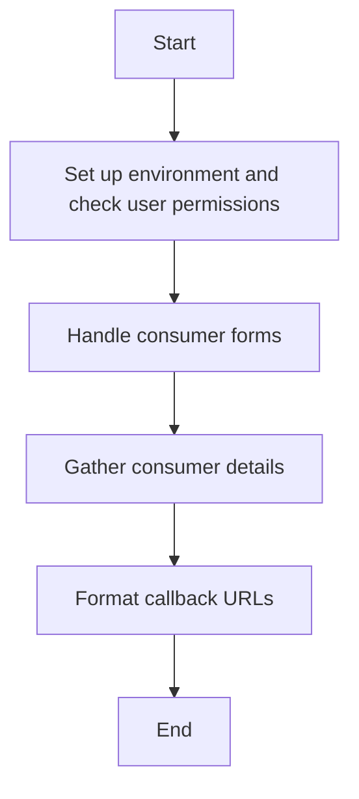

This document will cover the process of managing OAuth consumers, which includes:

1. Setting up the environment and checking user permissions
2. Handling consumer forms
3. Gathering consumer details
4. Formatting callback URLs.

Technical document: <SwmLink doc-title="Managing OAuth Consumers">[Managing OAuth Consumers](/.swm/managing-oauth-consumers.z1h3ci5e.sw.md)</SwmLink>

# [Setting up the environment and checking user permissions](https://app.swimm.io/repos/Z2l0aHViJTNBJTNBbWVkaWF3aWtpLWV4dGVuc2lvbnMtT0F1dGglM0ElM0FTd2ltbS1EZW1v/docs/z1h3ci5e#executing-the-main-logic)

The process begins by setting up the environment and verifying user permissions. This ensures that only authorized users can manage OAuth consumers. If the user does not have the necessary permissions, an error is displayed, and the process is halted. This step is crucial for maintaining security and preventing unauthorized access.

# [Handling consumer forms](https://app.swimm.io/repos/Z2l0aHViJTNBJTNBbWVkaWF3aWtpLWV4dGVuc2lvbnMtT0F1dGglM0ElM0FTd2ltbS1EZW1v/docs/z1h3ci5e#handling-the-consumer-form)

In this step, the system manages the approval, rejection, disabling, or re-enabling of OAuth consumers. The system checks the current status of the consumer and the user's permissions. Based on this information, it generates a form with appropriate options for the user to take action. This allows administrators to control which third-party applications can interact with MediaWiki on behalf of users.

# [Gathering consumer details](https://app.swimm.io/repos/Z2l0aHViJTNBJTNBbWVkaWF3aWtpLWV4dGVuc2lvbnMtT0F1dGglM0ElM0FTd2ltbS1EZW1v/docs/z1h3ci5e#getting-info-table-options)

Next, the system gathers various details about the OAuth consumer, such as the owner, version, and callback URL. These details are used to populate an information table in the consumer form. This step provides administrators with all the necessary information to make informed decisions about managing the consumer.

# [Formatting callback URLs](https://app.swimm.io/repos/Z2l0aHViJTNBJTNBbWVkaWF3aWtpLWV4dGVuc2lvbnMtT0F1dGglM0ElM0FTd2ltbS1EZW1v/docs/z1h3ci5e#formatting-the-callback-url)

Finally, the system formats the callback URL for the OAuth consumer. If the URL has a special meaning or potential issues, a warning is added to alert the user. This ensures that administrators are aware of any potential problems with the callback URL, which is crucial for maintaining secure and reliable interactions between MediaWiki and third-party applications.

&nbsp;

*This is an auto-generated document by Swimm 🌊 and has not yet been verified by a human*

<SwmMeta version="3.0.0" repo-id="Z2l0aHViJTNBJTNBbWVkaWF3aWtpLWV4dGVuc2lvbnMtT0F1dGglM0ElM0FTd2ltbS1EZW1v" repo-name="mediawiki-extensions-OAuth">Powered by [Swimm](/)</SwmMeta>
