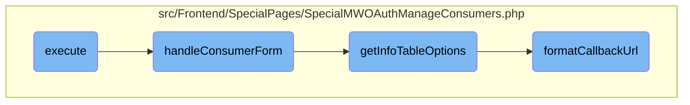

This document explains the process of managing `OAuth` consumers, including setting up the environment, handling consumer forms, gathering consumer details, and formatting callback <SwmToken path="src/Frontend/SpecialPages/SpecialMWOAuthManageConsumers.php" pos="451:7:7" line-data="	 * to callback URLs with a special meaning.">`URLs`</SwmToken>.

# Flow drill down



<SwmSnippet path="/src/Frontend/SpecialPages/SpecialMWOAuthManageConsumers.php" line="88">

---

## Executing the Main Logic

First, the <SwmToken path="src/Frontend/SpecialPages/SpecialMWOAuthManageConsumers.php" pos="88:5:5" line-data="	public function execute( $par ) {">`execute`</SwmToken> function sets up the environment by checking user permissions and configuration settings. It then determines the appropriate action based on the URL parameters, such as handling a specific consumer form or showing the main hub.

```hack
	public function execute( $par ) {
		$user = $this->getUser();
		$permissionManager = MediaWikiServices::getInstance()->getPermissionManager();

		$this->setHeaders();
		$this->getOutput()->disallowUserJs();
		$this->addHelpLink( 'Help:OAuth' );
		$this->requireNamedUser( 'mwoauth-available-only-to-registered' );

		if ( !$permissionManager->userHasRight( $user, 'mwoauthmanageconsumer' ) ) {
			throw new PermissionsError( 'mwoauthmanageconsumer' );
		}

		if ( $this->getConfig()->get( 'MWOAuthReadOnly' ) ) {
			throw new ErrorPageError( 'mwoauth-error', 'mwoauth-db-readonly' );
		}

		// Format is Special:OAuthManageConsumers[/<stage>|/<consumer key>]
		// B/C format is Special:OAuthManageConsumers/<stage>/<consumer key>
		$consumerKey = null;
		$navigation = $par !== null ? explode( '/', $par ) : [];
```

---

</SwmSnippet>

<SwmSnippet path="/src/Frontend/SpecialPages/SpecialMWOAuthManageConsumers.php" line="233">

---

## Handling the Consumer Form

Next, the <SwmToken path="src/Frontend/SpecialPages/SpecialMWOAuthManageConsumers.php" pos="239:5:5" line-data="	protected function handleConsumerForm( $consumerKey ) {">`handleConsumerForm`</SwmToken> function manages the approval, rejection, disabling, or re-enabling of consumers. It checks the consumer's current stage and permissions, then generates a form with appropriate options for the user to take action on the consumer.

```hack
	/**
	 * Show the form to approve/reject/disable/re-enable consumers
	 *
	 * @param string $consumerKey
	 * @throws PermissionsError
	 */
	protected function handleConsumerForm( $consumerKey ) {
		$user = $this->getUser();
		$dbr = Utils::getCentralDB( DB_REPLICA );
		$cmrAc = ConsumerAccessControl::wrap(
			Consumer::newFromKey( $dbr, $consumerKey ), $this->getContext() );
		$permissionManager = MediaWikiServices::getInstance()->getPermissionManager();

		if ( !$cmrAc ) {
			$this->getOutput()->addWikiMsg( 'mwoauth-invalid-consumer-key' );
			return;
		} elseif ( $cmrAc->getDeleted()
			&& !$permissionManager->userHasRight( $user, 'mwoauthviewsuppressed' ) ) {
			throw new PermissionsError( 'mwoauthviewsuppressed' );
		}
		$startingStage = $cmrAc->getStage();
```

---

</SwmSnippet>

<SwmSnippet path="/src/Frontend/SpecialPages/SpecialMWOAuthManageConsumers.php" line="362">

---

## Getting Info Table Options

Then, the <SwmToken path="src/Frontend/SpecialPages/SpecialMWOAuthManageConsumers.php" pos="366:5:5" line-data="	protected function getInfoTableOptions( $cmrAc ) {">`getInfoTableOptions`</SwmToken> function gathers various details about the consumer, such as the owner, version, and callback URL. These details are used to populate the information table in the consumer form.

```hack
	/**
	 * @param ConsumerAccessControl $cmrAc
	 * @return array
	 */
	protected function getInfoTableOptions( $cmrAc ) {
		$owner = $cmrAc->getUserName();
		$lang = $this->getLanguage();

		$link = $this->getLinkRenderer()->makeKnownLink(
			$title = SpecialPage::getTitleFor( 'OAuthListConsumers' ),
			$this->msg( 'mwoauthmanageconsumers-search-publisher' )->text(),
			[],
			[ 'publisher' => $owner ]
		);
		$ownerLink = $cmrAc->escapeForHtml( $owner ) . ' ' .
			$this->msg( 'parentheses' )->rawParams( $link )->escaped();
		$ownerOnly = $cmrAc->getDAO()->getOwnerOnly();
		$restrictions = $cmrAc->getRestrictions();

		$options = [
			// Messages: mwoauth-consumer-stage-proposed, mwoauth-consumer-stage-rejected,
```

---

</SwmSnippet>

<SwmSnippet path="/src/Frontend/SpecialPages/SpecialMWOAuthManageConsumers.php" line="449">

---

## Formatting the Callback URL

Finally, the <SwmToken path="src/Frontend/SpecialPages/SpecialMWOAuthManageConsumers.php" pos="455:5:5" line-data="	protected function formatCallbackUrl( ConsumerAccessControl $cmrAc ) {">`formatCallbackUrl`</SwmToken> function formats the callback URL for the consumer. It adds a warning if the URL has a special meaning, ensuring that users are aware of any potential issues with the callback URL.

```hack
	/**
	 * Format a callback URL. Usually this doesn't do anything nontrivial, but it adds a warning
	 * to callback URLs with a special meaning.
	 * @param ConsumerAccessControl $cmrAc
	 * @return HtmlSnippet|string Formatted callback URL, as a plaintext or HTML string
	 */
	protected function formatCallbackUrl( ConsumerAccessControl $cmrAc ) {
		$url = $cmrAc->getCallbackUrl();
		if ( $cmrAc->getDAO()->getCallbackIsPrefix() ) {
			$urlParts = wfParseUrl( $cmrAc->getDAO()->getCallbackUrl() );
			if ( ( $urlParts['port'] ?? null ) === 1 ) {
				$warning = Html::element( 'span', [ 'class' => 'warning' ],
					$this->msg( 'mwoauth-consumer-callbackurl-warning' )->text() );
				$url = new HtmlSnippet( $url . ' ' . $warning );
			}
		}
		return $url;
	}
```

---

</SwmSnippet>

&nbsp;

*This is an auto-generated document by Swimm 🌊 and has not yet been verified by a human*

<SwmMeta version="3.0.0" repo-id="Z2l0aHViJTNBJTNBbWVkaWF3aWtpLWV4dGVuc2lvbnMtT0F1dGglM0ElM0FTd2ltbS1EZW1v" repo-name="mediawiki-extensions-OAuth"><sup>Powered by [Swimm](https://app.swimm.io/)</sup></SwmMeta>
