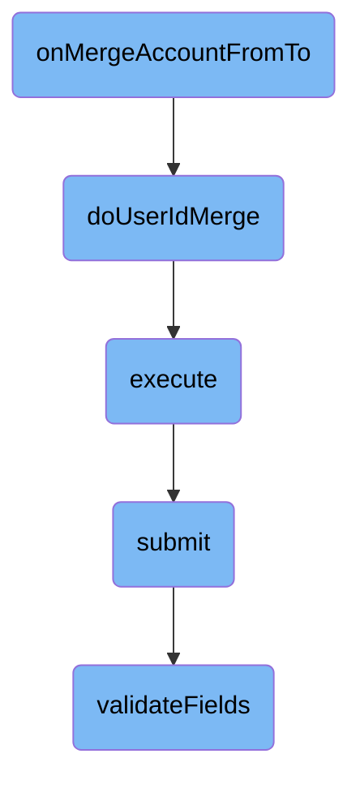

This document explains the process of merging two user accounts. The process involves initiating the merge, updating <SwmToken path="src/Backend/Hooks.php" pos="3:6:6" line-data="namespace MediaWiki\Extension\OAuth\Backend;">`OAuth`</SwmToken> consumer data, executing the merge, submitting the data, and validating the fields.

The flow starts by initiating the merge of two user accounts. It then updates the <SwmToken path="src/Backend/Hooks.php" pos="3:6:6" line-data="namespace MediaWiki\Extension\OAuth\Backend;">`OAuth`</SwmToken> consumer data to reflect the new user ID. Next, the merge process is executed, assuming the user is authenticated. The data is then submitted, and finally, the required fields are validated to ensure everything is correct.

# Flow drill down



<SwmSnippet path="/src/Backend/Hooks.php" line="115">

---

## Merging User Accounts

The <SwmToken path="src/Backend/Hooks.php" pos="115:7:7" line-data="	public static function onMergeAccountFromTo( User $oUser, User $nUser ) {">`onMergeAccountFromTo`</SwmToken> function is responsible for initiating the process of merging two user accounts. It checks if the global variable <SwmToken path="src/Backend/Hooks.php" pos="116:3:4" line-data="		global $wgMWOAuthSharedUserIDs;">`$wgMWOAuthSharedUserIDs`</SwmToken> is set. If not, it retrieves the <SwmToken path="src/Backend/Hooks.php" pos="208:22:22" line-data="			// There is actually a central wiki, requiring global user IDs via hook">`IDs`</SwmToken> of the old and new user accounts and calls the <SwmToken path="src/Backend/Hooks.php" pos="122:3:3" line-data="				self::doUserIdMerge( $oldid, $newid );">`doUserIdMerge`</SwmToken> function to handle the merging process.

```hack
	public static function onMergeAccountFromTo( User $oUser, User $nUser ) {
		global $wgMWOAuthSharedUserIDs;

		if ( !$wgMWOAuthSharedUserIDs ) {
			$oldid = $oUser->getId();
			$newid = $nUser->getId();
			if ( $oldid && $newid ) {
				self::doUserIdMerge( $oldid, $newid );
			}
		}

		return true;
	}
```

---

</SwmSnippet>

<SwmSnippet path="/src/Backend/Hooks.php" line="129">

---

## Updating <SwmToken path="src/Backend/Hooks.php" pos="3:6:6" line-data="namespace MediaWiki\Extension\OAuth\Backend;">`OAuth`</SwmToken> Consumer Data

The <SwmToken path="src/Backend/Hooks.php" pos="129:7:7" line-data="	protected static function doUserIdMerge( $oldid, $newid ) {">`doUserIdMerge`</SwmToken> function updates the <SwmToken path="src/Backend/Hooks.php" pos="3:6:6" line-data="namespace MediaWiki\Extension\OAuth\Backend;">`OAuth`</SwmToken> consumer data associated with the old user ID to the new user ID. It performs two main tasks: updating the <SwmToken path="src/Backend/Hooks.php" pos="133:6:6" line-data="			-&gt;update( &#39;oauth_registered_consumer&#39; )">`oauth_registered_consumer`</SwmToken> table to set the new user ID and deleting any acceptance tokens associated with the old user ID from the <SwmToken path="src/Backend/Hooks.php" pos="140:6:6" line-data="			-&gt;deleteFrom( &#39;oauth_accepted_consumer&#39; )">`oauth_accepted_consumer`</SwmToken> table.

```hack
	protected static function doUserIdMerge( $oldid, $newid ) {
		$dbw = Utils::getCentralDB( DB_PRIMARY );
		// Merge any consumers register to this user
		$dbw->newUpdateQueryBuilder()
			->update( 'oauth_registered_consumer' )
			->set( [ 'oarc_user_id' => $newid ] )
			->where( [ 'oarc_user_id' => $oldid ] )
			->caller( __METHOD__ )
			->execute();
		// Delete any acceptance tokens by the old user ID
		$dbw->newDeleteQueryBuilder()
			->deleteFrom( 'oauth_accepted_consumer' )
			->where( [ 'oaac_user_id' => $oldid ] )
			->caller( __METHOD__ )
			->execute();
	}
```

---

</SwmSnippet>

<SwmSnippet path="/src/Rest/Handler/AbstractClientHandler.php" line="24">

---

## Executing the Merge

The <SwmToken path="src/Rest/Handler/AbstractClientHandler.php" pos="28:5:5" line-data="	public function execute(): ResponseInterface {">`execute`</SwmToken> function handles the execution of the merge process. It assumes the user is authenticated and has a valid session. It creates a <SwmToken path="src/Rest/Handler/AbstractClientHandler.php" pos="34:8:8" line-data="		$control = new ConsumerSubmitControl(">`ConsumerSubmitControl`</SwmToken> object and calls its <SwmToken path="src/Rest/Handler/AbstractClientHandler.php" pos="40:9:9" line-data="		$status = $control-&gt;submit();">`submit`</SwmToken> method. If the submission is successful, it returns a JSON response with the consumer data. If there are errors, it throws appropriate HTTP exceptions.

```hack
	/**
	 * @return ResponseInterface
	 * @throws HttpException
	 */
	public function execute(): ResponseInterface {
		// At this point we assume user is authenticated and has valid session
		// Authentication can be achieved over CentralAuth or Access token in authorization header
		$responseFactory = $this->getResponseFactory();
		$params = $this->getUnifiedParams();

		$control = new ConsumerSubmitControl(
			RequestContext::getMain(),
			$params,
			Utils::getCentralDB( DB_PRIMARY )
		);

		$status = $control->submit();
		if ( $status->isGood() ) {
			$value = $status->getValue();
			if ( isset( $value['result']['consumer'] ) ) {
				/** @var ClientEntity $client */
```

---

</SwmSnippet>

<SwmSnippet path="/src/Control/SubmitControl.php" line="58">

---

## Submitting the Data

The <SwmToken path="src/Control/SubmitControl.php" pos="59:11:11" line-data="	 * Attempt to validate and submit this data">`submit`</SwmToken> function in <SwmToken path="src/Rest/Handler/AbstractClientHandler.php" pos="83:9:9" line-data="	 * expected by the SubmitControl">`SubmitControl`</SwmToken> validates and submits the data. It checks basic permissions, validates the action and parameters, and routes the submission handling to the appropriate internal function. If any validation fails, it returns a failure status.

```hack
	/**
	 * Attempt to validate and submit this data
	 *
	 * This will check basic permissions, validate the action and parameters
	 * and route the submission handling to the internal subclass function.
	 *
	 * @throws MWException
	 * @return Status
	 */
	public function submit() {
		$status = $this->checkBasePermissions();
		if ( !$status->isOK() ) {
			return $status;
		}

		$action = $this->vals['action'];
		$required = $this->getRequiredFields();
		if ( !isset( $required[$action] ) ) {
			// @TODO: check for field-specific message first
			return $this->failure( 'invalid_field_action', 'mwoauth-invalid-field', 'action' );
		}
```

---

</SwmSnippet>

<SwmSnippet path="/src/Control/SubmitControl.php" line="253">

---

## Validating Fields

The <SwmToken path="src/Control/SubmitControl.php" pos="260:5:5" line-data="	protected function validateFields( array $required ) {">`validateFields`</SwmToken> function checks that the required fields for the action are present and valid. It iterates over the required fields, ensuring each field is set and meets the validation criteria. If any field is missing or invalid, it returns a failure status.

```hack
	/**
	 * Check that the action is valid and that the required fields are valid
	 *
	 * @param array $required (field => regex or callback)
	 * @phan-param array<string,string|callable(mixed,array):bool|StatusValue> $required
	 * @return Status
	 */
	protected function validateFields( array $required ) {
		foreach ( $required as $field => $validator ) {
			if ( !isset( $this->vals[$field] ) ) {
				return $this->failure( "missing_field_$field", 'mwoauth-missing-field', $field );
			} elseif ( !is_scalar( $this->vals[$field] )
				&& !in_array( $field, [ 'restrictions', 'oauth2GrantTypes' ], true )
			) {
				return $this->failure( "invalid_field_$field", 'mwoauth-invalid-field', $field );
			}
			if ( is_string( $this->vals[$field] ) ) {
				$this->vals[$field] = trim( $this->vals[$field] );
			}
			$validationResult = $this->getValidationResult( $validator, $this->vals[$field], $this->vals );
			if ( $validationResult === false ) {
```

---

</SwmSnippet>

&nbsp;

*This is an auto-generated document by Swimm AI 🌊 and has not yet been verified by a human*

<SwmMeta version="3.0.0" repo-id="Z2l0aHViJTNBJTNBbWVkaWF3aWtpLWV4dGVuc2lvbnMtT0F1dGglM0ElM0FTd2ltbS1EZW1v" repo-name="mediawiki-extensions-OAuth"><sup>Powered by [Swimm](/)</sup></SwmMeta>
