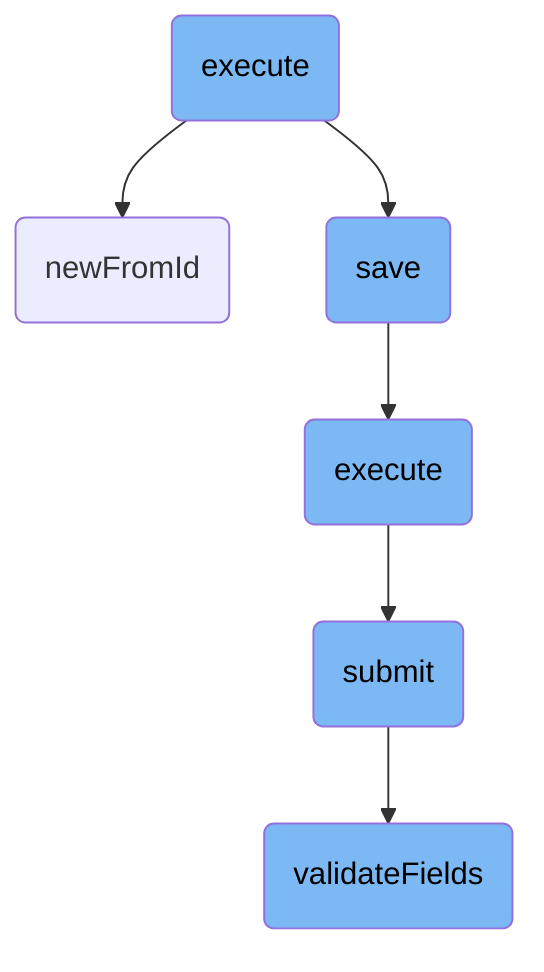
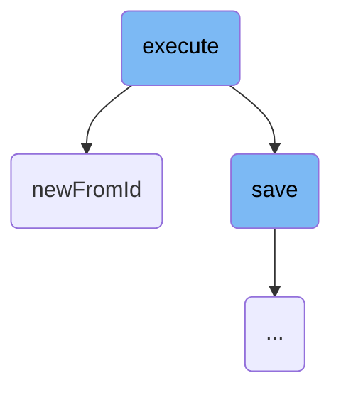
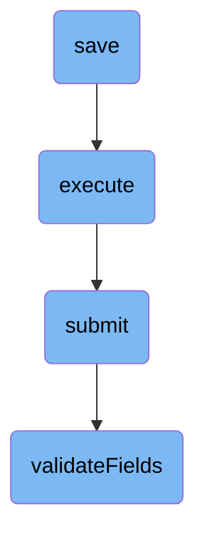

In this document, we will explain the process of migrating <SwmToken path="maintenance/migrateCentralWiki.php" pos="3:6:6" line-data="namespace MediaWiki\Extension\OAuth;">`OAuth`</SwmToken> consumer data from an old wiki to a target wiki. The process involves several steps, including retrieving the old and target wiki options, determining the table to be migrated, connecting to the databases, fetching the maximum ID values, and handling batch processing.

The flow starts by retrieving the old and target wiki options and determining the table to be migrated. It then connects to the databases of both wikis and fetches the maximum ID values from the specified table. If there are new rows to migrate, it iterates over each ID, retrieves the corresponding consumer data, updates its origin, sets it as pending, and saves it to the target database. The process also includes handling batch processing and waiting for replication if needed.

Here is a high level diagram of the flow, showing only the most important functions:



# Flow drill down

First, we'll zoom into this section of the flow:



<SwmSnippet path="/maintenance/migrateCentralWiki.php" line="47">

---

## Migrating <SwmToken path="maintenance/migrateCentralWiki.php" pos="3:6:6" line-data="namespace MediaWiki\Extension\OAuth;">`OAuth`</SwmToken> Consumer Data

The <SwmToken path="maintenance/migrateCentralWiki.php" pos="47:5:5" line-data="	public function execute() {">`execute`</SwmToken> function is responsible for migrating <SwmToken path="maintenance/migrateCentralWiki.php" pos="3:6:6" line-data="namespace MediaWiki\Extension\OAuth;">`OAuth`</SwmToken> consumer data from an old wiki to a target wiki. It first retrieves the old and target wiki options and determines the table to be migrated. Depending on the table, it sets the appropriate ID key and class. It then connects to the databases of both wikis and fetches the maximum ID values from the specified table. If there are new rows to migrate, it iterates over each ID, retrieves the corresponding consumer data using <SwmToken path="src/Backend/MWOAuthDAO.php" pos="103:9:9" line-data="	final public static function newFromId( IDatabase $db, $id, $flags = 0 ) {">`newFromId`</SwmToken>, updates its origin, sets it as pending, and saves it to the target database. The function also handles batch processing and waits for replication if needed.

```hack
	public function execute() {
		$oldWiki = $this->getOption( 'old' );
		$targetWiki = $this->getOption( 'target' );
		$table = $this->getOption( 'table' );

		if ( $table === 'oauth_registered_consumer' ) {
			$idKey = 'oarc_id';
			$cmrClass = Consumer::class;
			$type = 'consumer';
		} elseif ( $table === 'oauth_accepted_consumer' ) {
			$idKey = 'oaac_id';
			$cmrClass = ConsumerAcceptance::class;
			$type = 'grant';
		} else {
			$this->fatalError( "Invalid table name. Must be one of 'oauth_registered_consumer' " .
				"or 'oauth_accepted_consumer'.\n" );
		}

		$lbFactory = MediaWikiServices::getInstance()->getDBLoadBalancerFactory();
		$oldDb = $lbFactory->getMainLB( $oldWiki )->getConnection( DB_PRIMARY, [], $oldWiki );
		$targetDb = $lbFactory->getMainLB( $targetWiki )
```

---

</SwmSnippet>

<SwmSnippet path="/src/Backend/MWOAuthDAO.php" line="96">

---

### Retrieving Consumer Data by ID

The <SwmToken path="src/Backend/MWOAuthDAO.php" pos="103:9:9" line-data="	final public static function newFromId( IDatabase $db, $id, $flags = 0 ) {">`newFromId`</SwmToken> function retrieves consumer data from the database based on the given ID. It constructs a query to select the relevant fields from the table and fetches the row corresponding to the ID. If a row is found, it creates an instance of the appropriate consumer class, loads the data from the row, and returns the consumer object. If no row is found, it returns false. This function is crucial for fetching the consumer data that needs to be migrated in the <SwmToken path="maintenance/migrateCentralWiki.php" pos="47:5:5" line-data="	public function execute() {">`execute`</SwmToken> function.

```hack
	/**
	 * @param IDatabase $db
	 * @param int $id
	 * @param int $flags IDBAccessObject::READ_* bitfield
	 * @return static|bool Returns false if not found
	 * @throws DBError
	 */
	final public static function newFromId( IDatabase $db, $id, $flags = 0 ) {
		$queryBuilder = $db->newSelectQueryBuilder()
			->select( array_values( static::getFieldColumnMap() ) )
			->from( static::getTable() )
			->where( [ static::getIdColumn() => (int)$id ] )
			->caller( __METHOD__ );
		if ( $flags & IDBAccessObject::READ_LOCKING ) {
			$queryBuilder->forUpdate();
		}
		$row = $queryBuilder->fetchRow();

		if ( $row ) {
			$class = static::getConsumerClass( (array)$row );
			$consumer = new $class();
```

---

</SwmSnippet>

Now, lets zoom into this section of the flow:



<SwmSnippet path="/src/Backend/MWOAuthDAO.php" line="186">

---

## Handling database save operations

The <SwmToken path="src/Backend/MWOAuthDAO.php" pos="186:5:5" line-data="	public function save( IDatabase $dbw ) {">`save`</SwmToken> function is responsible for saving <SwmToken path="maintenance/migrateCentralWiki.php" pos="3:6:6" line-data="namespace MediaWiki\Extension\OAuth;">`OAuth`</SwmToken> consumer data to the database. It first checks if the database is in <SwmToken path="src/Backend/MWOAuthDAO.php" pos="192:31:33" line-data="			throw new DBReadOnlyError( $dbw, __CLASS__ . &quot;: tried to save while db is read-only&quot; );">`read-only`</SwmToken> mode and throws an error if it is. If the object originates from the database and has pending changes, it performs an update; otherwise, it performs an insert for new objects.

```hack
	public function save( IDatabase $dbw ) {
		global $wgMWOAuthReadOnly;

		$uniqueId = $this->getIdValue();
		$idColumn = static::getIdColumn();
		if ( $wgMWOAuthReadOnly ) {
			throw new DBReadOnlyError( $dbw, __CLASS__ . ": tried to save while db is read-only" );
		}
		if ( $this->daoOrigin === 'db' ) {
			if ( $this->daoPending ) {
				$this->logger->debug( get_class( $this ) . ': performing DB update; object changed.' );
				$dbw->newUpdateQueryBuilder()
					->update( static::getTable() )
					->set( $this->getRowArray( $dbw ) )
					->where( [ $idColumn => $uniqueId ] )
					->caller( __METHOD__ )
					->execute();
				$this->daoPending = false;
				return $dbw->affectedRows() > 0;
			} else {
				$this->logger->debug( get_class( $this ) . ': skipping DB update; object unchanged.' );
```

---

</SwmSnippet>

<SwmSnippet path="/src/Rest/Handler/AbstractClientHandler.php" line="28">

---

## Executing the client handler

The <SwmToken path="src/Rest/Handler/AbstractClientHandler.php" pos="28:5:5" line-data="	public function execute(): ResponseInterface {">`execute`</SwmToken> function in the client handler is responsible for processing the <SwmToken path="maintenance/migrateCentralWiki.php" pos="3:6:6" line-data="namespace MediaWiki\Extension\OAuth;">`OAuth`</SwmToken> consumer submission. It creates a <SwmToken path="src/Rest/Handler/AbstractClientHandler.php" pos="34:8:8" line-data="		$control = new ConsumerSubmitControl(">`ConsumerSubmitControl`</SwmToken> object, calls its <SwmToken path="src/Rest/Handler/AbstractClientHandler.php" pos="40:9:9" line-data="		$status = $control-&gt;submit();">`submit`</SwmToken> method, and handles the response. If the submission is successful, it returns a JSON response with the consumer data; otherwise, it throws an appropriate HTTP exception.

```hack
	public function execute(): ResponseInterface {
		// At this point we assume user is authenticated and has valid session
		// Authentication can be achieved over CentralAuth or Access token in authorization header
		$responseFactory = $this->getResponseFactory();
		$params = $this->getUnifiedParams();

		$control = new ConsumerSubmitControl(
			RequestContext::getMain(),
			$params,
			Utils::getCentralDB( DB_PRIMARY )
		);

		$status = $control->submit();
		if ( $status->isGood() ) {
			$value = $status->getValue();
			if ( isset( $value['result']['consumer'] ) ) {
				/** @var ClientEntity $client */
				$client = $value['result']['consumer'];
				$data = [
					'name' => $client->getName(),
					'client_key' => $client->getConsumerKey(),
```

---

</SwmSnippet>

<SwmSnippet path="/src/Control/SubmitControl.php" line="67">

---

## Submitting the control

The <SwmToken path="src/Control/SubmitControl.php" pos="67:5:5" line-data="	public function submit() {">`submit`</SwmToken> function in <SwmToken path="src/Rest/Handler/AbstractClientHandler.php" pos="83:9:9" line-data="	 * expected by the SubmitControl">`SubmitControl`</SwmToken> validates and processes the submission data. It checks basic permissions, validates the action and required fields, and routes the submission to the appropriate internal function. If any validation fails, it returns a failure status.

```hack
	public function submit() {
		$status = $this->checkBasePermissions();
		if ( !$status->isOK() ) {
			return $status;
		}

		$action = $this->vals['action'];
		$required = $this->getRequiredFields();
		if ( !isset( $required[$action] ) ) {
			// @TODO: check for field-specific message first
			return $this->failure( 'invalid_field_action', 'mwoauth-invalid-field', 'action' );
		}

		$status = $this->validateFields( $required[$action] );
		if ( !$status->isOK() ) {
			return $status;
		}

		$status = $this->processAction( $action );
		if ( $status instanceof Status ) {
			return $status;
```

---

</SwmSnippet>

<SwmSnippet path="/src/Control/SubmitControl.php" line="260">

---

### Validating fields

The <SwmToken path="src/Control/SubmitControl.php" pos="260:5:5" line-data="	protected function validateFields( array $required ) {">`validateFields`</SwmToken> function checks that the required fields for the action are present and valid. It iterates over the required fields, validates each one using the provided validator, and returns a success status if all fields are valid. If any field is missing or invalid, it returns a failure status.

```hack
	protected function validateFields( array $required ) {
		foreach ( $required as $field => $validator ) {
			if ( !isset( $this->vals[$field] ) ) {
				return $this->failure( "missing_field_$field", 'mwoauth-missing-field', $field );
			} elseif ( !is_scalar( $this->vals[$field] )
				&& !in_array( $field, [ 'restrictions', 'oauth2GrantTypes' ], true )
			) {
				return $this->failure( "invalid_field_$field", 'mwoauth-invalid-field', $field );
			}
			if ( is_string( $this->vals[$field] ) ) {
				$this->vals[$field] = trim( $this->vals[$field] );
			}
			$validationResult = $this->getValidationResult( $validator, $this->vals[$field], $this->vals );
			if ( $validationResult === false ) {
				$message = $this->getDefaultValidationError( $field, $this->vals[$field] );
				return $this->failure( "invalid_field_$field", $message );
			} elseif ( $validationResult instanceof ApiMessage ) {
				return $this->failure( $validationResult->getApiCode(), $validationResult, $field );
			}
		}
		return $this->success();
```

---

</SwmSnippet>

&nbsp;

*This is an auto-generated document by Swimm AI 🌊 and has not yet been verified by a human*

<SwmMeta version="3.0.0" repo-id="Z2l0aHViJTNBJTNBbWVkaWF3aWtpLWV4dGVuc2lvbnMtT0F1dGglM0ElM0FTd2ltbS1EZW1v" repo-name="mediawiki-extensions-OAuth"><sup>Powered by [Swimm](/)</sup></SwmMeta>
