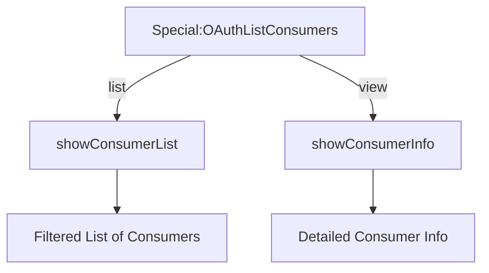

# What is `OAuth` Consumer Management

`OAuth` Consumer Management is a feature in <SwmToken path="src/Frontend/SpecialPages/SpecialMWOAuthListConsumers.php" pos="3:2:2" line-data="namespace MediaWiki\Extension\OAuth\Frontend\SpecialPages;">`MediaWiki`</SwmToken> that allows administrators to manage `OAuth` consumer requests. This includes approving, rejecting, disabling, or re-enabling `OAuth` consumers. The management interface is provided through a special page called <SwmToken path="src/Frontend/SpecialPages/SpecialMWOAuthListConsumers.php" pos="50:2:2" line-data="class SpecialMWOAuthListConsumers extends SpecialPage {">`SpecialMWOAuthListConsumers`</SwmToken>.

# Purpose of <SwmToken path="src/Frontend/SpecialPages/SpecialMWOAuthListConsumers.php" pos="50:2:2" line-data="class SpecialMWOAuthListConsumers extends SpecialPage {">`SpecialMWOAuthListConsumers`</SwmToken>

The <SwmToken path="src/Frontend/SpecialPages/SpecialMWOAuthListConsumers.php" pos="50:2:2" line-data="class SpecialMWOAuthListConsumers extends SpecialPage {">`SpecialMWOAuthListConsumers`</SwmToken> page is designed to list and manage `OAuth` consumer requests. It allows administrators to handle various actions such as approval, rejection, and disabling of `OAuth` consumers. The page can display both pending consumer requests and already approved or disabled consumers.

# How <SwmToken path="src/Frontend/SpecialPages/SpecialMWOAuthListConsumers.php" pos="50:2:2" line-data="class SpecialMWOAuthListConsumers extends SpecialPage {">`SpecialMWOAuthListConsumers`</SwmToken> Works

<SwmSnippet path="/src/Frontend/SpecialPages/SpecialMWOAuthListConsumers.php" line="62">

---

The <SwmToken path="src/Frontend/SpecialPages/SpecialMWOAuthListConsumers.php" pos="62:5:5" line-data="	public function execute( $par ) {">`execute`</SwmToken> function sets up the page headers and help links, and determines the type of action to perform based on the URL parameters. If the action type is 'view', it calls <SwmToken path="src/Frontend/SpecialPages/SpecialMWOAuthListConsumers.php" pos="75:4:4" line-data="				$this-&gt;showConsumerInfo( $consumerKey );">`showConsumerInfo`</SwmToken> to display detailed information about a specific consumer. If no specific action type is provided, it defaults to calling <SwmToken path="src/Frontend/SpecialPages/SpecialMWOAuthListConsumers.php" pos="78:4:4" line-data="				$this-&gt;showConsumerList();">`showConsumerList`</SwmToken> to display a paged list of consumers.

```hack
	public function execute( $par ) {
		$this->setHeaders();
		$this->addHelpLink( 'Help:OAuth' );

		// Format is Special:OAuthListConsumers[/list|/view/[<consumer key>]]
		$navigation = $par !== null ? explode( '/', $par ) : [];
		$type = $navigation[0] ?? null;
		$consumerKey = $navigation[1] ?? '';

		$this->showConsumerListForm();

		switch ( $type ) {
			case 'view':
				$this->showConsumerInfo( $consumerKey );
				break;
			default:
				$this->showConsumerList();
				break;
		}

		$this->getOutput()->addModuleStyles( 'ext.MWOAuth.styles' );
```

---

</SwmSnippet>

# Filtering and Displaying Consumers

The <SwmToken path="src/Frontend/SpecialPages/SpecialMWOAuthListConsumers.php" pos="71:4:4" line-data="		$this-&gt;showConsumerListForm();">`showConsumerListForm`</SwmToken> function generates a form to filter the list of consumers by name, publisher, and stage. The <SwmToken path="src/Frontend/SpecialPages/SpecialMWOAuthListConsumers.php" pos="78:4:4" line-data="				$this-&gt;showConsumerList();">`showConsumerList`</SwmToken> function retrieves the filtered list of consumers and displays it, including navigation links and details for each consumer.



# Accessing <SwmToken path="src/Frontend/SpecialPages/SpecialMWOAuthListConsumers.php" pos="50:2:2" line-data="class SpecialMWOAuthListConsumers extends SpecialPage {">`SpecialMWOAuthListConsumers`</SwmToken>

<SwmToken path="src/Frontend/SpecialPages/SpecialMWOAuthListConsumers.php" pos="50:2:2" line-data="class SpecialMWOAuthListConsumers extends SpecialPage {">`SpecialMWOAuthListConsumers`</SwmToken> can be accessed via the URL format <SwmToken path="src/Frontend/SpecialPages/SpecialMWOAuthListConsumers.php" pos="66:7:23" line-data="		// Format is Special:OAuthListConsumers[/list|/view/[&lt;consumer key&gt;]]">`Special:OAuthListConsumers[/list|/view/[<consumer key>]]`</SwmToken>. Depending on the action type provided in the URL, it either displays a list of consumers or detailed information about a specific consumer.

&nbsp;

*This is an auto-generated document by Swimm 🌊 and has not yet been verified by a human*

<SwmMeta version="3.0.0" repo-id="Z2l0aHViJTNBJTNBbWVkaWF3aWtpLWV4dGVuc2lvbnMtT0F1dGglM0ElM0FTd2ltbS1EZW1v" repo-name="mediawiki-extensions-OAuth"><sup>Powered by [Swimm](https://app.swimm.io/)</sup></SwmMeta>
