```mermaid
graph TD;
    A[User] -->|Requests OAuth Consumer Registration| B[SpecialMWOAuthConsumerRegistration];
    B -->|Checks Permissions| C[PermissionManager];
    B -->|Handles Actions| D[Execute Function];
    D -->|Propose New Consumer| E[ProposeOAuth Function];
    D -->|Update Existing Consumer| F[Update Consumer Logic];
    D -->|List User's Consumers| G[List Consumers Logic];
    B -->|Displays Navigation Links| H[Navigation Links];

%% Swimm:
%% graph TD;
%%     A[User] -->|Requests <SwmToken path="src/Frontend/SpecialPages/SpecialMWOAuthConsumerRegistration.php" pos="459:11:11" line-data="			throw new InvalidArgumentException( &#39;Invalid OAuth version&#39; );">`OAuth`</SwmToken> Consumer Registration| B[SpecialMWOAuthConsumerRegistration];
%%     B -->|Checks Permissions| C[PermissionManager];
%%     B -->|Handles Actions| D[Execute Function];
%%     D -->|Propose New Consumer| E[ProposeOAuth Function];
%%     D -->|Update Existing Consumer| F[Update Consumer Logic];
%%     D -->|List User's Consumers| G[List Consumers Logic];
%%     B -->|Displays Navigation Links| H[Navigation Links];
```

# Overview

The <SwmToken path="src/Frontend/SpecialPages/SpecialMWOAuthConsumerRegistration.php" pos="58:2:2" line-data="class SpecialMWOAuthConsumerRegistration extends SpecialPage {">`SpecialMWOAuthConsumerRegistration`</SwmToken> is a special page in <SwmToken path="src/Frontend/SpecialPages/SpecialMWOAuthConsumerRegistration.php" pos="3:2:2" line-data="namespace MediaWiki\Extension\OAuth\Frontend\SpecialPages;">`MediaWiki`</SwmToken> that provides a registration request form and a consumer update form for <SwmToken path="src/Frontend/SpecialPages/SpecialMWOAuthConsumerRegistration.php" pos="459:11:11" line-data="			throw new InvalidArgumentException( &#39;Invalid OAuth version&#39; );">`OAuth`</SwmToken> consumers. It ensures that the user has the necessary permissions and that their email is confirmed before allowing them to execute actions on the page. The page handles different actions such as proposing a new consumer, updating an existing consumer, and listing the user's consumers.

# Permissions and User Validation

The function <SwmToken path="src/Frontend/SpecialPages/SpecialMWOAuthConsumerRegistration.php" pos="78:5:5" line-data="	public function userCanExecute( User $user ) {">`userCanExecute`</SwmToken> checks if the user's email is confirmed before allowing them to execute actions on the page.

<SwmSnippet path="/src/Frontend/SpecialPages/SpecialMWOAuthConsumerRegistration.php" line="78">

---

The <SwmToken path="src/Frontend/SpecialPages/SpecialMWOAuthConsumerRegistration.php" pos="78:5:5" line-data="	public function userCanExecute( User $user ) {">`userCanExecute`</SwmToken> function ensures that only users with confirmed emails can execute actions on the page.

```hack
	public function userCanExecute( User $user ) {
		return $user->isEmailConfirmed();
	}
```

---

</SwmSnippet>

# Handling Different Actions

The <SwmToken path="src/Frontend/SpecialPages/SpecialMWOAuthConsumerRegistration.php" pos="86:5:5" line-data="	public function execute( $par ) {">`execute`</SwmToken> function handles different actions such as proposing a new consumer, updating an existing consumer, and listing the user's consumers. It also manages redirects to HTTPS and sets up the page headers and modules.

<SwmSnippet path="/src/Frontend/SpecialPages/SpecialMWOAuthConsumerRegistration.php" line="127">

---

The <SwmToken path="src/Frontend/SpecialPages/SpecialMWOAuthConsumerRegistration.php" pos="86:5:5" line-data="	public function execute( $par ) {">`execute`</SwmToken> function uses a switch statement to handle different actions based on the value of <SwmToken path="src/Frontend/SpecialPages/SpecialMWOAuthConsumerRegistration.php" pos="127:5:6" line-data="		switch ( $action ) {">`$action`</SwmToken>.

```hack
		switch ( $action ) {
			case 'propose':
				if ( !$this->permissionManager->userHasRight( $user, 'mwoauthproposeconsumer' ) ) {
					throw new PermissionsError( 'mwoauthproposeconsumer' );
				}

				if ( $subPage === '' ) {
					$this->getOutput()->addWikiMsg( 'mwoauthconsumerregistration-propose-text' );
					break;
				}

				$allWikis = Utils::getAllWikiNames();
				$showGrants = $this->grantsInfo->getValidGrants();
				if ( $subPage === 'oauth2' ) {
					$this->proposeOAuth( Consumer::OAUTH_VERSION_2, $user, $allWikis, $lang, $showGrants );
					break;
				} elseif ( $subPage === 'oauth1a' ) {
					$this->proposeOAuth( Consumer::OAUTH_VERSION_1, $user, $allWikis, $lang, $showGrants );
					break;
				} else {
					$this->getOutput()->redirect( 'Special:OAuthConsumerRegistration/propose' );
```

---

</SwmSnippet>

# Proposing a New Consumer

For proposing a new consumer, the user must have the 'mwoauthproposeconsumer' right. The form adapts based on the <SwmToken path="src/Frontend/SpecialPages/SpecialMWOAuthConsumerRegistration.php" pos="459:11:11" line-data="			throw new InvalidArgumentException( &#39;Invalid OAuth version&#39; );">`OAuth`</SwmToken> version (either <SwmToken path="src/Frontend/SpecialPages/SpecialMWOAuthConsumerRegistration.php" pos="459:11:11" line-data="			throw new InvalidArgumentException( &#39;Invalid OAuth version&#39; );">`OAuth`</SwmToken> 1.0a or <SwmToken path="src/Frontend/SpecialPages/SpecialMWOAuthConsumerRegistration.php" pos="459:11:11" line-data="			throw new InvalidArgumentException( &#39;Invalid OAuth version&#39; );">`OAuth`</SwmToken> 2.0).

<SwmSnippet path="/src/Frontend/SpecialPages/SpecialMWOAuthConsumerRegistration.php" line="128">

---

The <SwmToken path="src/Frontend/SpecialPages/SpecialMWOAuthConsumerRegistration.php" pos="86:5:5" line-data="	public function execute( $par ) {">`execute`</SwmToken> function checks if the user has the 'mwoauthproposeconsumer' right and adapts the form based on the <SwmToken path="src/Frontend/SpecialPages/SpecialMWOAuthConsumerRegistration.php" pos="459:11:11" line-data="			throw new InvalidArgumentException( &#39;Invalid OAuth version&#39; );">`OAuth`</SwmToken> version.

```hack
			case 'propose':
				if ( !$this->permissionManager->userHasRight( $user, 'mwoauthproposeconsumer' ) ) {
					throw new PermissionsError( 'mwoauthproposeconsumer' );
				}

				if ( $subPage === '' ) {
					$this->getOutput()->addWikiMsg( 'mwoauthconsumerregistration-propose-text' );
					break;
				}

				$allWikis = Utils::getAllWikiNames();
				$showGrants = $this->grantsInfo->getValidGrants();
				if ( $subPage === 'oauth2' ) {
					$this->proposeOAuth( Consumer::OAUTH_VERSION_2, $user, $allWikis, $lang, $showGrants );
					break;
				} elseif ( $subPage === 'oauth1a' ) {
					$this->proposeOAuth( Consumer::OAUTH_VERSION_1, $user, $allWikis, $lang, $showGrants );
					break;
				} else {
					$this->getOutput()->redirect( 'Special:OAuthConsumerRegistration/propose' );
				}
```

---

</SwmSnippet>

# Updating an Existing Consumer

For updating a consumer, the user must have the 'mwoauthupdateownconsumer' right. The system checks if the consumer key is valid and belongs to the user.

<SwmSnippet path="/src/Frontend/SpecialPages/SpecialMWOAuthConsumerRegistration.php" line="150">

---

The <SwmToken path="src/Frontend/SpecialPages/SpecialMWOAuthConsumerRegistration.php" pos="86:5:5" line-data="	public function execute( $par ) {">`execute`</SwmToken> function checks if the user has the 'mwoauthupdateownconsumer' right and validates the consumer key.

```hack
			case 'update':
				if ( !$this->permissionManager->userHasRight( $user, 'mwoauthupdateownconsumer' ) ) {
					throw new PermissionsError( 'mwoauthupdateownconsumer' );
				}

				$dbr = Utils::getCentralDB( DB_REPLICA );
				$cmrAc = ConsumerAccessControl::wrap(
				Consumer::newFromKey( $dbr, $subPage ), $this->getContext() );
				if ( !$cmrAc ) {
					$this->getOutput()->addWikiMsg( 'mwoauth-invalid-consumer-key' );
					break;
				} elseif ( $cmrAc->getDAO()->getDeleted()
				&& !$this->permissionManager->userHasRight( $user, 'mwoauthviewsuppressed' )
				) {
					throw new PermissionsError( 'mwoauthviewsuppressed' );
				} elseif ( $cmrAc->getDAO()->getUserId() !== $centralUserId ) {
					// Do not show private information to other users
					$this->getOutput()->addWikiMsg( 'mwoauth-invalid-consumer-key' );
					break;
				}
				$oldSecretKey = $cmrAc->getDAO()->getSecretKey();
```

---

</SwmSnippet>

# Listing User's Consumers

The list action displays a list of the user's consumers.

<SwmSnippet path="/src/Frontend/SpecialPages/SpecialMWOAuthConsumerRegistration.php" line="289">

---

The <SwmToken path="src/Frontend/SpecialPages/SpecialMWOAuthConsumerRegistration.php" pos="86:5:5" line-data="	public function execute( $par ) {">`execute`</SwmToken> function handles the 'list' action to display a list of the user's consumers.

```hack
			case 'list':
				$pager = new ListMyConsumersPager( $this, [], $centralUserId );
				if ( $pager->getNumRows() ) {
					$this->getOutput()->addHTML( $pager->getNavigationBar() );
					$this->getOutput()->addHTML( $pager->getBody() );
					$this->getOutput()->addHTML( $pager->getNavigationBar() );
				} else {
					$this->getOutput()->addWikiMsg( "mwoauthconsumerregistration-none" );
				}
				# Every 30th view, prune old deleted items
				if ( mt_rand( 0, 29 ) == 0 ) {
					Utils::runAutoMaintenance( Utils::getCentralDB( DB_PRIMARY ) );
				}
				break;
```

---

</SwmSnippet>

# Navigation Links

The page includes navigation links to help users navigate between proposing, updating, and listing consumers.

<SwmSnippet path="/src/Frontend/SpecialPages/SpecialMWOAuthConsumerRegistration.php" line="319">

---

The <SwmToken path="src/Frontend/SpecialPages/SpecialMWOAuthConsumerRegistration.php" pos="319:5:5" line-data="	protected function addSubtitleLinks( $action, $subPage ) {">`addSubtitleLinks`</SwmToken> function adds navigation links to help users navigate between different actions.

```hack
	protected function addSubtitleLinks( $action, $subPage ) {
		$listLinks = [];
		if ( $action === 'propose' && $subPage ) {
			if ( $subPage === 'oauth1a' ) {
				$listLinks[] = $this->msg( 'mwoauthconsumerregistration-propose-oauth1' )->escaped();
				$listLinks[] = $this->getLinkRenderer()->makeKnownLink(
					$this->getPageTitle( 'propose/oauth2' ),
					$this->msg( 'mwoauthconsumerregistration-propose-oauth2' )->text()
				);
			} elseif ( $subPage === 'oauth2' ) {
				$listLinks[] = $this->getLinkRenderer()->makeKnownLink(
					$this->getPageTitle( 'propose/oauth1a' ),
					$this->msg( 'mwoauthconsumerregistration-propose-oauth1' )->text()
				);
				$listLinks[] = $this->msg( 'mwoauthconsumerregistration-propose-oauth2' )->escaped();
			}
		} else {
			$listLinks[] = $this->getLinkRenderer()->makeKnownLink(
				$this->getPageTitle( 'propose/oauth1a' ),
				$this->msg( 'mwoauthconsumerregistration-propose-oauth1' )->text()
			);
```

---

</SwmSnippet>

# Main Functions

The main functions of the <SwmToken path="src/Frontend/SpecialPages/SpecialMWOAuthConsumerRegistration.php" pos="58:2:2" line-data="class SpecialMWOAuthConsumerRegistration extends SpecialPage {">`SpecialMWOAuthConsumerRegistration`</SwmToken> class include the constructor, <SwmToken path="src/Frontend/SpecialPages/SpecialMWOAuthConsumerRegistration.php" pos="86:5:5" line-data="	public function execute( $par ) {">`execute`</SwmToken>, and <SwmToken path="src/Frontend/SpecialPages/SpecialMWOAuthConsumerRegistration.php" pos="141:4:4" line-data="					$this-&gt;proposeOAuth( Consumer::OAUTH_VERSION_2, $user, $allWikis, $lang, $showGrants );">`proposeOAuth`</SwmToken>.

## \__construct

The <SwmToken path="src/Frontend/SpecialPages/SpecialMWOAuthConsumerRegistration.php" pos="63:5:5" line-data="	public function __construct(">`__construct`</SwmToken> function initializes the <SwmToken path="src/Frontend/SpecialPages/SpecialMWOAuthConsumerRegistration.php" pos="58:2:2" line-data="class SpecialMWOAuthConsumerRegistration extends SpecialPage {">`SpecialMWOAuthConsumerRegistration`</SwmToken> class with the necessary dependencies: <SwmToken path="src/Frontend/SpecialPages/SpecialMWOAuthConsumerRegistration.php" pos="64:1:1" line-data="		PermissionManager $permissionManager,">`PermissionManager`</SwmToken>, <SwmToken path="src/Frontend/SpecialPages/SpecialMWOAuthConsumerRegistration.php" pos="65:1:1" line-data="		GrantsInfo $grantsInfo,">`GrantsInfo`</SwmToken>, and <SwmToken path="src/Frontend/SpecialPages/SpecialMWOAuthConsumerRegistration.php" pos="66:1:1" line-data="		GrantsLocalization $grantsLocalization">`GrantsLocalization`</SwmToken>. It sets up the special page with the name <SwmToken path="src/Frontend/SpecialPages/SpecialMWOAuthConsumerRegistration.php" pos="68:7:7" line-data="		parent::__construct( &#39;OAuthConsumerRegistration&#39; );">`OAuthConsumerRegistration`</SwmToken>.

<SwmSnippet path="/src/Frontend/SpecialPages/SpecialMWOAuthConsumerRegistration.php" line="63">

---

The <SwmToken path="src/Frontend/SpecialPages/SpecialMWOAuthConsumerRegistration.php" pos="63:5:5" line-data="	public function __construct(">`__construct`</SwmToken> function sets up the special page with the necessary dependencies.

```hack
	public function __construct(
		PermissionManager $permissionManager,
		GrantsInfo $grantsInfo,
		GrantsLocalization $grantsLocalization
	) {
		parent::__construct( 'OAuthConsumerRegistration' );
		$this->permissionManager = $permissionManager;
		$this->grantsInfo = $grantsInfo;
		$this->grantsLocalization = $grantsLocalization;
	}
```

---

</SwmSnippet>

## execute

The <SwmToken path="src/Frontend/SpecialPages/SpecialMWOAuthConsumerRegistration.php" pos="86:5:5" line-data="	public function execute( $par ) {">`execute`</SwmToken> function handles the main logic for the special page. It ensures the user is logged in, checks permissions, and handles different actions such as proposing a new consumer, updating an existing consumer, and listing the user's consumers.

<SwmSnippet path="/src/Frontend/SpecialPages/SpecialMWOAuthConsumerRegistration.php" line="86">

---

The <SwmToken path="src/Frontend/SpecialPages/SpecialMWOAuthConsumerRegistration.php" pos="86:5:5" line-data="	public function execute( $par ) {">`execute`</SwmToken> function ensures the user is logged in, checks permissions, and handles different actions.

```hack
	public function execute( $par ) {
		$this->requireNamedUser( 'mwoauth-named-account-required-reason' );
		$this->checkPermissions();

		$request = $this->getRequest();
		$user = $this->getUser();
		$lang = $this->getLanguage();
		$centralUserId = Utils::getCentralIdFromLocalUser( $user );

		// Redirect to HTTPs if attempting to access this page via HTTP.
		// Proposals and updates to consumers can involve sending new secrets.
		if ( $this->getConfig()->get( 'MWOAuthSecureTokenTransfer' )
			&& $request->detectProtocol() == 'http'
			&& substr( wfExpandUrl( '/', PROTO_HTTPS ), 0, 8 ) === 'https://'
		) {
			$redirUrl = str_replace( 'http://', 'https://', $request->getFullRequestURL() );
			$this->getOutput()->redirect( $redirUrl );
			$this->getOutput()->addVaryHeader( 'X-Forwarded-Proto' );
			return;
		}
```

---

</SwmSnippet>

## <SwmToken path="src/Frontend/SpecialPages/SpecialMWOAuthConsumerRegistration.php" pos="141:4:4" line-data="					$this-&gt;proposeOAuth( Consumer::OAUTH_VERSION_2, $user, $allWikis, $lang, $showGrants );">`proposeOAuth`</SwmToken>

The <SwmToken path="src/Frontend/SpecialPages/SpecialMWOAuthConsumerRegistration.php" pos="141:4:4" line-data="					$this-&gt;proposeOAuth( Consumer::OAUTH_VERSION_2, $user, $allWikis, $lang, $showGrants );">`proposeOAuth`</SwmToken> function handles the logic for proposing a new <SwmToken path="src/Frontend/SpecialPages/SpecialMWOAuthConsumerRegistration.php" pos="459:11:11" line-data="			throw new InvalidArgumentException( &#39;Invalid OAuth version&#39; );">`OAuth`</SwmToken> consumer. It validates the <SwmToken path="src/Frontend/SpecialPages/SpecialMWOAuthConsumerRegistration.php" pos="459:11:11" line-data="			throw new InvalidArgumentException( &#39;Invalid OAuth version&#39; );">`OAuth`</SwmToken> version, sets up the form descriptor with the necessary fields, and displays the form. If the form submission is successful, it processes the new consumer and redirects the user back to the main page.

<SwmSnippet path="/src/Frontend/SpecialPages/SpecialMWOAuthConsumerRegistration.php" line="457">

---

The <SwmToken path="src/Frontend/SpecialPages/SpecialMWOAuthConsumerRegistration.php" pos="457:5:5" line-data="	private function proposeOAuth( int $oauthVersion, User $user, $allWikis, $lang, $showGrants ) {">`proposeOAuth`</SwmToken> function sets up the form descriptor and processes the new consumer.

```hack
	private function proposeOAuth( int $oauthVersion, User $user, $allWikis, $lang, $showGrants ) {
		if ( !in_array( $oauthVersion, [ Consumer::OAUTH_VERSION_1, Consumer::OAUTH_VERSION_2 ] ) ) {
			throw new InvalidArgumentException( 'Invalid OAuth version' );
		}
		$dbw = Utils::getCentralDB( DB_PRIMARY );
		$control = new ConsumerSubmitControl( $this->getContext(), [], $dbw );

		$grantNames = $this->grantsLocalization->getGrantDescriptionsWithClasses(
			$showGrants, $this->getLanguage() );
		$formDescriptor = [
			'oauthVersion' => [
				'class' => HTMLHiddenField::class,
				'default' => $oauthVersion,
			],
			'name' => [
				'type' => 'text',
				'label-message' => 'mwoauth-consumer-name',
				'size' => '45',
				'required' => true
			],
			'version' => [
```

---

</SwmSnippet>

&nbsp;

*This is an auto-generated document by Swimm AI 🌊 and has not yet been verified by a human*

<SwmMeta version="3.0.0" repo-id="Z2l0aHViJTNBJTNBbWVkaWF3aWtpLWV4dGVuc2lvbnMtT0F1dGglM0ElM0FTd2ltbS1EZW1v" repo-name="mediawiki-extensions-OAuth"><sup>Powered by [Swimm](/)</sup></SwmMeta>
