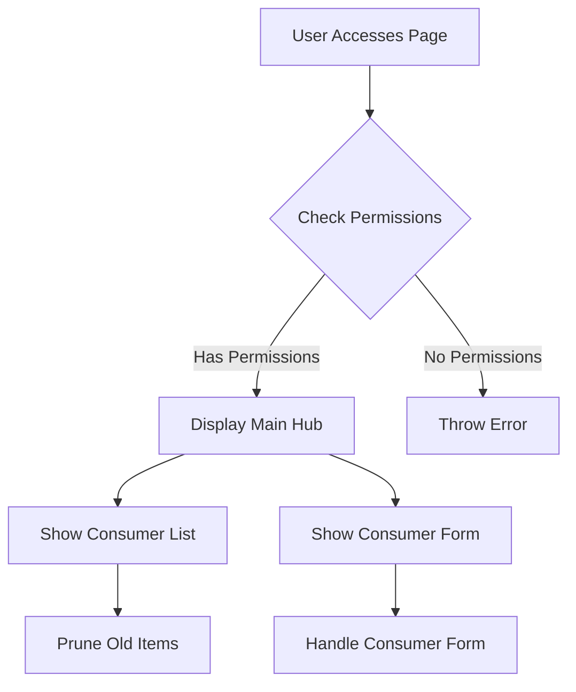

# Overview

<SwmToken path="src/Frontend/SpecialPages/SpecialMWOAuthManageConsumers.php" pos="53:2:2" line-data="class SpecialMWOAuthManageConsumers extends SpecialPage {">`SpecialMWOAuthManageConsumers`</SwmToken> is a special page designed to manage `OAuth` consumer requests. It allows administrators to view, approve, reject, or disable consumer applications. The page categorizes consumer requests into different stages, such as proposed, rejected, expired, approved, and disabled. These stages help in organizing the requests into actionable queues or lists.

# Access and Permissions

When a user accesses the page, it checks their permissions to ensure they have the right to manage `OAuth` consumers. If the user lacks the necessary permissions, an error is thrown.

# Page Functionalities

The page can display a main hub, a list of consumers, or a specific consumer form based on the URL parameters. The main hub provides an overview of the different queues and lists of consumers.

<SwmSnippet path="/src/Frontend/SpecialPages/SpecialMWOAuthManageConsumers.php" line="233">

---

The function <SwmToken path="src/Frontend/SpecialPages/SpecialMWOAuthManageConsumers.php" pos="239:5:5" line-data="	protected function handleConsumerForm( $consumerKey ) {">`handleConsumerForm`</SwmToken> manages the approval, rejection, or disabling of a specific consumer. It ensures the user has the necessary permissions and displays a form for the user to take action on the consumer request.

```hack
	/**
	 * Show the form to approve/reject/disable/re-enable consumers
	 *
	 * @param string $consumerKey
	 * @throws PermissionsError
	 */
	protected function handleConsumerForm( $consumerKey ) {
		$user = $this->getUser();
		$dbr = Utils::getCentralDB( DB_REPLICA );
		$cmrAc = ConsumerAccessControl::wrap(
			Consumer::newFromKey( $dbr, $consumerKey ), $this->getContext() );
		$permissionManager = MediaWikiServices::getInstance()->getPermissionManager();

		if ( !$cmrAc ) {
			$this->getOutput()->addWikiMsg( 'mwoauth-invalid-consumer-key' );
			return;
		} elseif ( $cmrAc->getDeleted()
			&& !$permissionManager->userHasRight( $user, 'mwoauthviewsuppressed' ) ) {
			throw new PermissionsError( 'mwoauthviewsuppressed' );
		}
		$startingStage = $cmrAc->getStage();
```

---

</SwmSnippet>

# The <SwmToken path="/src/Frontend/SpecialPages/SpecialMWOAuthManageConsumers.php" pos="88:5:5" line-data="	public function execute( $par ) {">`execute`</SwmToken> method



&nbsp;

_This is an auto-generated document by Swimm 🌊 and has not yet been verified by a human_

<SwmMeta version="3.0.0" repo-id="Z2l0aHViJTNBJTNBbWVkaWF3aWtpLWV4dGVuc2lvbnMtT0F1dGglM0ElM0FTd2ltbS1EZW1v" repo-name="mediawiki-extensions-OAuth"><sup>Powered by [Swimm](https://app.swimm.io/)</sup></SwmMeta>
