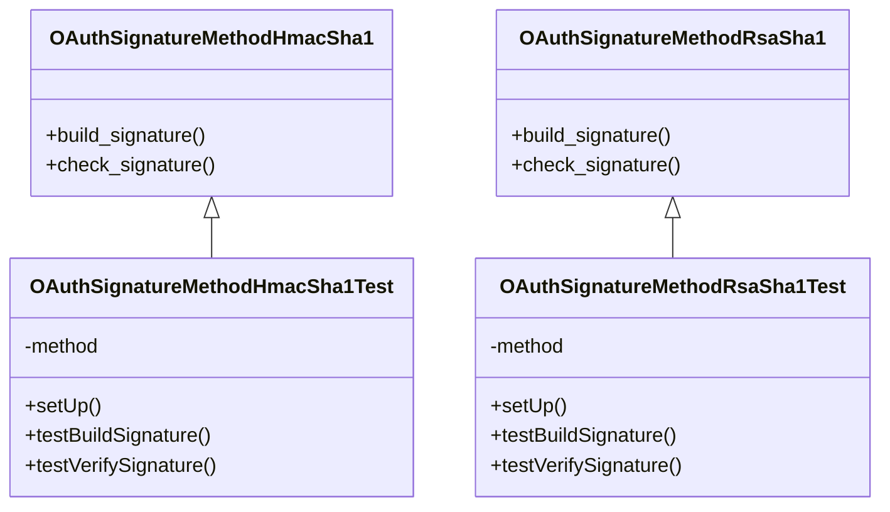

# Overview

<SwmToken path="tests/phpunit/Lib/OAuthSignatureMethodHmacSha1Test.php" pos="50:13:13" line-data="		// Tests taken from http://wiki.oauth.net/TestCases section 9.2 (&quot;HMAC-SHA1&quot;)">`oauth`</SwmToken> Signature is a key component in the <SwmToken path="tests/phpunit/Lib/OAuthSignatureMethodHmacSha1Test.php" pos="50:13:13" line-data="		// Tests taken from http://wiki.oauth.net/TestCases section 9.2 (&quot;HMAC-SHA1&quot;)">`oauth`</SwmToken> protocol, ensuring the integrity and authenticity of the requests made by clients. It is used to sign requests using various methods such as <SwmToken path="tests/phpunit/Lib/OAuthSignatureMethodHmacSha1Test.php" pos="50:27:29" line-data="		// Tests taken from http://wiki.oauth.net/TestCases section 9.2 (&quot;HMAC-SHA1&quot;)">`HMAC-SHA1`</SwmToken> and <SwmToken path="tests/phpunit/Lib/OAuthSignatureMethodRsaSha1Test.php" pos="62:21:23" line-data="			$this-&gt;markTestSkipped(&#39;OpenSSL not available, can\&#39;t test RSA-SHA1 functionality&#39;);">`RSA-SHA1`</SwmToken>, which are implemented in the library.

# <SwmToken path="tests/phpunit/Lib/OAuthSignatureMethodHmacSha1Test.php" pos="42:10:10" line-data="		$this-&gt;method = new OAuthSignatureMethodHmacSha1();">`OAuthSignatureMethodHmacSha1`</SwmToken>

The <SwmToken path="tests/phpunit/Lib/OAuthSignatureMethodHmacSha1Test.php" pos="42:10:10" line-data="		$this-&gt;method = new OAuthSignatureMethodHmacSha1();">`OAuthSignatureMethodHmacSha1`</SwmToken> class provides the functionality to generate and verify signatures using the <SwmToken path="tests/phpunit/Lib/OAuthSignatureMethodHmacSha1Test.php" pos="50:27:29" line-data="		// Tests taken from http://wiki.oauth.net/TestCases section 9.2 (&quot;HMAC-SHA1&quot;)">`HMAC-SHA1`</SwmToken> algorithm. This ensures that the requests are not tampered with during transmission and that they originate from a trusted source.

<SwmSnippet path="/tests/phpunit/Lib/OAuthSignatureMethodHmacSha1Test.php" line="38">

---

The <SwmToken path="tests/phpunit/Lib/OAuthSignatureMethodHmacSha1Test.php" pos="38:2:2" line-data="class OAuthSignatureMethodHmacSha1Test extends TestCase {">`OAuthSignatureMethodHmacSha1Test`</SwmToken> class sets up the testing environment for the <SwmToken path="tests/phpunit/Lib/OAuthSignatureMethodHmacSha1Test.php" pos="50:27:29" line-data="		// Tests taken from http://wiki.oauth.net/TestCases section 9.2 (&quot;HMAC-SHA1&quot;)">`HMAC-SHA1`</SwmToken> signature method.

```hack
class OAuthSignatureMethodHmacSha1Test extends TestCase {
	private $method;

	protected function setUp() : void {
		$this->method = new OAuthSignatureMethodHmacSha1();
	}
```

---

</SwmSnippet>

# <SwmToken path="tests/phpunit/Lib/OAuthSignatureMethodRsaSha1Test.php" pos="34:15:15" line-data=" * @covers \MediaWiki\Extension\OAuth\Lib\OAuthSignatureMethodRsaSha1">`OAuthSignatureMethodRsaSha1`</SwmToken>

The <SwmToken path="tests/phpunit/Lib/OAuthSignatureMethodRsaSha1Test.php" pos="34:15:15" line-data=" * @covers \MediaWiki\Extension\OAuth\Lib\OAuthSignatureMethodRsaSha1">`OAuthSignatureMethodRsaSha1`</SwmToken> class handles the generation and verification of signatures using the <SwmToken path="tests/phpunit/Lib/OAuthSignatureMethodRsaSha1Test.php" pos="62:21:23" line-data="			$this-&gt;markTestSkipped(&#39;OpenSSL not available, can\&#39;t test RSA-SHA1 functionality&#39;);">`RSA-SHA1`</SwmToken> algorithm. This class ensures that the requests are secure and originate from a trusted source.

<SwmSnippet path="/tests/phpunit/Lib/OAuthSignatureMethodRsaSha1Test.php" line="36">

---

The <SwmToken path="tests/phpunit/Lib/OAuthSignatureMethodRsaSha1Test.php" pos="36:2:2" line-data="class OAuthSignatureMethodRsaSha1Test extends TestCase {">`OAuthSignatureMethodRsaSha1Test`</SwmToken> class sets up the testing environment for the <SwmToken path="tests/phpunit/Lib/OAuthSignatureMethodRsaSha1Test.php" pos="62:21:23" line-data="			$this-&gt;markTestSkipped(&#39;OpenSSL not available, can\&#39;t test RSA-SHA1 functionality&#39;);">`RSA-SHA1`</SwmToken> signature method.

```hack
class OAuthSignatureMethodRsaSha1Test extends TestCase {
	private $method;

	protected function setUp() : void {
		$this->method = new MockOAuthSignatureMethodRsaSha1();
	}
```

---

</SwmSnippet>

# Main Functions

There are several main functions in this folder. Some of them are <SwmToken path="tests/phpunit/Lib/OAuthSignatureMethodHmacSha1Test.php" pos="45:5:5" line-data="	public function testIdentifyAsHmacSha1() {">`testIdentifyAsHmacSha1`</SwmToken>, <SwmToken path="tests/phpunit/Lib/OAuthSignatureMethodHmacSha1Test.php" pos="49:5:5" line-data="	public function testBuildSignature() {">`testBuildSignature`</SwmToken>, <SwmToken path="tests/phpunit/Lib/OAuthSignatureMethodHmacSha1Test.php" pos="69:5:5" line-data="	public function testVerifySignature() {">`testVerifySignature`</SwmToken>, <SwmToken path="tests/phpunit/Lib/OAuthSignatureMethodRsaSha1Test.php" pos="43:5:5" line-data="	public function testIdentifyAsRsaSha1() {">`testIdentifyAsRsaSha1`</SwmToken>, <SwmToken path="tests/phpunit/Lib/OAuthSignatureMethodHmacSha1Test.php" pos="49:5:5" line-data="	public function testBuildSignature() {">`testBuildSignature`</SwmToken>, and <SwmToken path="tests/phpunit/Lib/OAuthSignatureMethodHmacSha1Test.php" pos="69:5:5" line-data="	public function testVerifySignature() {">`testVerifySignature`</SwmToken>. We will dive a little into <SwmToken path="tests/phpunit/Lib/OAuthSignatureMethodHmacSha1Test.php" pos="49:5:5" line-data="	public function testBuildSignature() {">`testBuildSignature`</SwmToken> and <SwmToken path="tests/phpunit/Lib/OAuthSignatureMethodHmacSha1Test.php" pos="69:5:5" line-data="	public function testVerifySignature() {">`testVerifySignature`</SwmToken>.

## <SwmToken path="tests/phpunit/Lib/OAuthSignatureMethodHmacSha1Test.php" pos="49:5:5" line-data="	public function testBuildSignature() {">`testBuildSignature`</SwmToken> for <SwmToken path="tests/phpunit/Lib/OAuthSignatureMethodHmacSha1Test.php" pos="50:27:29" line-data="		// Tests taken from http://wiki.oauth.net/TestCases section 9.2 (&quot;HMAC-SHA1&quot;)">`HMAC-SHA1`</SwmToken>

The <SwmToken path="tests/phpunit/Lib/OAuthSignatureMethodHmacSha1Test.php" pos="49:5:5" line-data="	public function testBuildSignature() {">`testBuildSignature`</SwmToken> function tests the <SwmToken path="tests/phpunit/Lib/OAuthSignatureMethodHmacSha1Test.php" pos="54:17:17" line-data="		$this-&gt;assertEquals(&#39;egQqG5AJep5sJ7anhXju1unge2I=&#39;, $this-&gt;method-&gt;build_signature( $request, $consumer, $token) );">`build_signature`</SwmToken> method of the <SwmToken path="tests/phpunit/Lib/OAuthSignatureMethodHmacSha1Test.php" pos="42:10:10" line-data="		$this-&gt;method = new OAuthSignatureMethodHmacSha1();">`OAuthSignatureMethodHmacSha1`</SwmToken> class. It verifies that the generated signature matches the expected value for given inputs.

<SwmSnippet path="/tests/phpunit/Lib/OAuthSignatureMethodHmacSha1Test.php" line="49">

---

The <SwmToken path="tests/phpunit/Lib/OAuthSignatureMethodHmacSha1Test.php" pos="49:5:5" line-data="	public function testBuildSignature() {">`testBuildSignature`</SwmToken> function in the <SwmToken path="tests/phpunit/Lib/OAuthSignatureMethodHmacSha1Test.php" pos="38:2:2" line-data="class OAuthSignatureMethodHmacSha1Test extends TestCase {">`OAuthSignatureMethodHmacSha1Test`</SwmToken> class verifies the generated signature against expected values.

```hack
	public function testBuildSignature() {
		// Tests taken from http://wiki.oauth.net/TestCases section 9.2 ("HMAC-SHA1")
		$request  = new MockOAuthBaseStringRequest('bs');
		$consumer = new OAuthConsumer('__unused__', 'cs');
		$token    = NULL;
		$this->assertEquals('egQqG5AJep5sJ7anhXju1unge2I=', $this->method->build_signature( $request, $consumer, $token) );

		$request  = new MockOAuthBaseStringRequest('bs');
		$consumer = new OAuthConsumer('__unused__', 'cs');
		$token    = new OAuthToken('__unused__', 'ts');
		$this->assertEquals('VZVjXceV7JgPq/dOTnNmEfO0Fv8=', $this->method->build_signature( $request, $consumer, $token) );

		$request  = new MockOAuthBaseStringRequest('GET&http%3A%2F%2Fphotos.example.net%2Fphotos&file%3Dvacation.jpg%26'
			. 'oauth_consumer_key%3Ddpf43f3p2l4k3l03%26oauth_nonce%3Dkllo9940pd9333jh%26oauth_signature_method%3DHMAC-SHA1%26'
			. 'oauth_timestamp%3D1191242096%26oauth_token%3Dnnch734d00sl2jdk%26oauth_version%3D1.0%26size%3Doriginal');
		$consumer = new OAuthConsumer('__unused__', 'kd94hf93k423kf44');
		$token    = new OAuthToken('__unused__', 'pfkkdhi9sl3r4s00');
		$this->assertEquals('tR3+Ty81lMeYAr/Fid0kMTYa/WM=', $this->method->build_signature( $request, $consumer, $token) );
```

---

</SwmSnippet>

## <SwmToken path="tests/phpunit/Lib/OAuthSignatureMethodHmacSha1Test.php" pos="69:5:5" line-data="	public function testVerifySignature() {">`testVerifySignature`</SwmToken> for <SwmToken path="tests/phpunit/Lib/OAuthSignatureMethodHmacSha1Test.php" pos="50:27:29" line-data="		// Tests taken from http://wiki.oauth.net/TestCases section 9.2 (&quot;HMAC-SHA1&quot;)">`HMAC-SHA1`</SwmToken>

The <SwmToken path="tests/phpunit/Lib/OAuthSignatureMethodHmacSha1Test.php" pos="69:5:5" line-data="	public function testVerifySignature() {">`testVerifySignature`</SwmToken> function tests the <SwmToken path="tests/phpunit/Lib/OAuthSignatureMethodHmacSha1Test.php" pos="75:12:12" line-data="		$this-&gt;assertTrue( $this-&gt;method-&gt;check_signature( $request, $consumer, $token, $signature) );">`check_signature`</SwmToken> method of the <SwmToken path="tests/phpunit/Lib/OAuthSignatureMethodHmacSha1Test.php" pos="42:10:10" line-data="		$this-&gt;method = new OAuthSignatureMethodHmacSha1();">`OAuthSignatureMethodHmacSha1`</SwmToken> class. It ensures that the provided signature is correctly verified against the expected value.

<SwmSnippet path="/tests/phpunit/Lib/OAuthSignatureMethodHmacSha1Test.php" line="69">

---

The <SwmToken path="tests/phpunit/Lib/OAuthSignatureMethodHmacSha1Test.php" pos="69:5:5" line-data="	public function testVerifySignature() {">`testVerifySignature`</SwmToken> function in the <SwmToken path="tests/phpunit/Lib/OAuthSignatureMethodHmacSha1Test.php" pos="38:2:2" line-data="class OAuthSignatureMethodHmacSha1Test extends TestCase {">`OAuthSignatureMethodHmacSha1Test`</SwmToken> class ensures the provided signature is correctly verified.

```hack
	public function testVerifySignature() {
		// Tests taken from http://wiki.oauth.net/TestCases section 9.2 ("HMAC-SHA1")
		$request   = new MockOAuthBaseStringRequest('bs');
		$consumer  = new OAuthConsumer('__unused__', 'cs');
		$token     = NULL;
		$signature = 'egQqG5AJep5sJ7anhXju1unge2I=';
		$this->assertTrue( $this->method->check_signature( $request, $consumer, $token, $signature) );

		$request   = new MockOAuthBaseStringRequest('bs');
		$consumer  = new OAuthConsumer('__unused__', 'cs');
		$token     = new OAuthToken('__unused__', 'ts');
		$signature = 'VZVjXceV7JgPq/dOTnNmEfO0Fv8=';
		$this->assertTrue($this->method->check_signature( $request, $consumer, $token, $signature) );

		$request   = new MockOAuthBaseStringRequest('GET&http%3A%2F%2Fphotos.example.net%2Fphotos&file%3Dvacation.jpg%26'
			. 'oauth_consumer_key%3Ddpf43f3p2l4k3l03%26oauth_nonce%3Dkllo9940pd9333jh%26oauth_signature_method%3DHMAC-SHA1%26'
			. 'oauth_timestamp%3D1191242096%26oauth_token%3Dnnch734d00sl2jdk%26oauth_version%3D1.0%26size%3Doriginal');
		$consumer  = new OAuthConsumer('__unused__', 'kd94hf93k423kf44');
		$token     = new OAuthToken('__unused__', 'pfkkdhi9sl3r4s00');
		$signature = 'tR3+Ty81lMeYAr/Fid0kMTYa/WM=';
		$this->assertTrue($this->method->check_signature( $request, $consumer, $token, $signature) );
```

---

</SwmSnippet>

## <SwmToken path="tests/phpunit/Lib/OAuthSignatureMethodHmacSha1Test.php" pos="49:5:5" line-data="	public function testBuildSignature() {">`testBuildSignature`</SwmToken> for <SwmToken path="tests/phpunit/Lib/OAuthSignatureMethodRsaSha1Test.php" pos="62:21:23" line-data="			$this-&gt;markTestSkipped(&#39;OpenSSL not available, can\&#39;t test RSA-SHA1 functionality&#39;);">`RSA-SHA1`</SwmToken>

The <SwmToken path="tests/phpunit/Lib/OAuthSignatureMethodHmacSha1Test.php" pos="49:5:5" line-data="	public function testBuildSignature() {">`testBuildSignature`</SwmToken> function tests the <SwmToken path="tests/phpunit/Lib/OAuthSignatureMethodHmacSha1Test.php" pos="54:17:17" line-data="		$this-&gt;assertEquals(&#39;egQqG5AJep5sJ7anhXju1unge2I=&#39;, $this-&gt;method-&gt;build_signature( $request, $consumer, $token) );">`build_signature`</SwmToken> method of the <SwmToken path="tests/phpunit/Lib/OAuthSignatureMethodRsaSha1Test.php" pos="34:15:15" line-data=" * @covers \MediaWiki\Extension\OAuth\Lib\OAuthSignatureMethodRsaSha1">`OAuthSignatureMethodRsaSha1`</SwmToken> class. It verifies that the generated signature matches the expected value for given inputs.

## <SwmToken path="tests/phpunit/Lib/OAuthSignatureMethodHmacSha1Test.php" pos="69:5:5" line-data="	public function testVerifySignature() {">`testVerifySignature`</SwmToken> for <SwmToken path="tests/phpunit/Lib/OAuthSignatureMethodRsaSha1Test.php" pos="62:21:23" line-data="			$this-&gt;markTestSkipped(&#39;OpenSSL not available, can\&#39;t test RSA-SHA1 functionality&#39;);">`RSA-SHA1`</SwmToken>

The <SwmToken path="tests/phpunit/Lib/OAuthSignatureMethodHmacSha1Test.php" pos="69:5:5" line-data="	public function testVerifySignature() {">`testVerifySignature`</SwmToken> function tests the <SwmToken path="tests/phpunit/Lib/OAuthSignatureMethodHmacSha1Test.php" pos="75:12:12" line-data="		$this-&gt;assertTrue( $this-&gt;method-&gt;check_signature( $request, $consumer, $token, $signature) );">`check_signature`</SwmToken> method of the <SwmToken path="tests/phpunit/Lib/OAuthSignatureMethodRsaSha1Test.php" pos="34:15:15" line-data=" * @covers \MediaWiki\Extension\OAuth\Lib\OAuthSignatureMethodRsaSha1">`OAuthSignatureMethodRsaSha1`</SwmToken> class. It ensures that the provided signature is correctly verified against the expected value.

<SwmSnippet path="/tests/phpunit/Lib/OAuthSignatureMethodRsaSha1Test.php" line="60">

---

The <SwmToken path="tests/phpunit/Lib/OAuthSignatureMethodRsaSha1Test.php" pos="60:5:5" line-data="	public function testVerifySignature() {">`testVerifySignature`</SwmToken> function in the <SwmToken path="tests/phpunit/Lib/OAuthSignatureMethodRsaSha1Test.php" pos="36:2:2" line-data="class OAuthSignatureMethodRsaSha1Test extends TestCase {">`OAuthSignatureMethodRsaSha1Test`</SwmToken> class ensures the provided signature is correctly verified.

```hack
	public function testVerifySignature() {
		if( ! function_exists('openssl_get_privatekey') ) {
			$this->markTestSkipped('OpenSSL not available, can\'t test RSA-SHA1 functionality');
		}

		// Tests taken from http://wiki.oauth.net/TestCases section 9.3 ("RSA-SHA1")
		$request   = new MockOAuthBaseStringRequest('GET&http%3A%2F%2Fphotos.example.net%2Fphotos&file%3Dvacaction.jpg%26oauth_consumer_key%3Ddpf43f3p2l4k3l03%26oauth_nonce%3D13917289812797014437%26oauth_signature_method%3DRSA-SHA1%26oauth_timestamp%3D1196666512%26oauth_version%3D1.0%26size%3Doriginal');
		$consumer  = new OAuthConsumer('dpf43f3p2l4k3l03', '__unused__');
		$token     = NULL;
		$signature = 'jvTp/wX1TYtByB1m+Pbyo0lnCOLIsyGCH7wke8AUs3BpnwZJtAuEJkvQL2/9n4s5wUmUl4aCI4BwpraNx4RtEXMe5qg5T1LVTGliMRpKasKsW//e+RinhejgCuzoH26dyF8iY2ZZ/5D1ilgeijhV/vBka5twt399mXwaYdCwFYE=';
		$this->assertTrue($this->method->check_signature( $request, $consumer, $token, $signature) );
```

---

</SwmSnippet>

&nbsp;

*This is an auto-generated document by Swimm AI 🌊 and has not yet been verified by a human*

<SwmMeta version="3.0.0" repo-id="Z2l0aHViJTNBJTNBbWVkaWF3aWtpLWV4dGVuc2lvbnMtT0F1dGglM0ElM0FTd2ltbS1EZW1v" repo-name="mediawiki-extensions-OAuth"><sup>Powered by [Swimm](/)</sup></SwmMeta>
