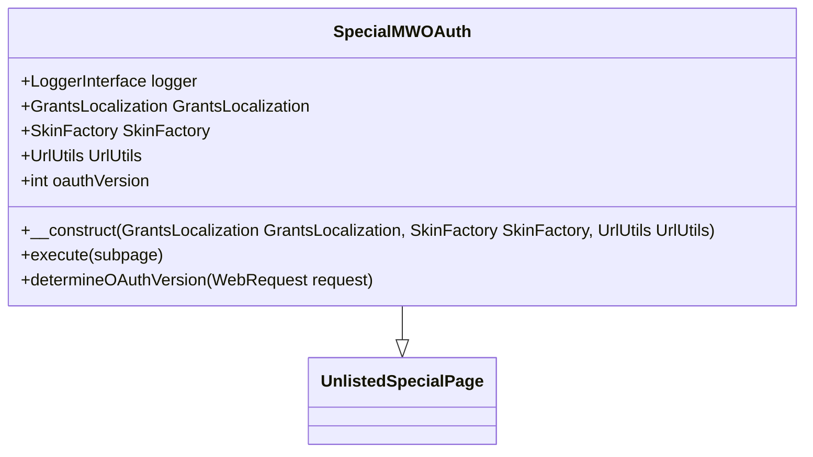

# Overview

The <SwmToken path="src/Frontend/SpecialPages/SpecialMWOAuth.php" pos="62:2:2" line-data="class SpecialMWOAuth extends UnlistedSpecialPage {">`SpecialMWOAuth`</SwmToken> class is a special page in <SwmToken path="src/Frontend/SpecialPages/SpecialMWOAuth.php" pos="3:2:2" line-data="namespace MediaWiki\Extension\OAuth\Frontend\SpecialPages;">`MediaWiki`</SwmToken> that handles <SwmToken path="src/Frontend/SpecialPages/SpecialMWOAuth.php" pos="60:9:9" line-data=" * Page that handles OAuth consumer authorization and token exchange">`OAuth`</SwmToken> consumer authorization and token exchange. It extends the <SwmToken path="src/Frontend/SpecialPages/SpecialMWOAuth.php" pos="62:6:6" line-data="class SpecialMWOAuth extends UnlistedSpecialPage {">`UnlistedSpecialPage`</SwmToken> class and is responsible for various OAuth-related functionalities, including managing <SwmToken path="src/Frontend/SpecialPages/SpecialMWOAuth.php" pos="60:9:9" line-data=" * Page that handles OAuth consumer authorization and token exchange">`OAuth`</SwmToken> versions, initiating request tokens, approving authorization, and handling token exchanges.

<SwmSnippet path="/src/Frontend/SpecialPages/SpecialMWOAuth.php" line="59">

---

# Class Definition

The <SwmToken path="src/Frontend/SpecialPages/SpecialMWOAuth.php" pos="62:2:2" line-data="class SpecialMWOAuth extends UnlistedSpecialPage {">`SpecialMWOAuth`</SwmToken> class extends <SwmToken path="src/Frontend/SpecialPages/SpecialMWOAuth.php" pos="62:6:6" line-data="class SpecialMWOAuth extends UnlistedSpecialPage {">`UnlistedSpecialPage`</SwmToken> and includes properties for logging, localization, skin management, and URL utilities. It defaults to using <SwmToken path="src/Frontend/SpecialPages/SpecialMWOAuth.php" pos="68:12:12" line-data="	/** @var int Defaults to OAuth1 */">`OAuth1`</SwmToken>.

```hack
/**
 * Page that handles OAuth consumer authorization and token exchange
 */
class SpecialMWOAuth extends UnlistedSpecialPage {
	protected LoggerInterface $logger;
	private GrantsLocalization $grantsLocalization;
	private SkinFactory $skinFactory;
	private UrlUtils $urlUtils;

	/** @var int Defaults to OAuth1 */
	protected $oauthVersion = Consumer::OAUTH_VERSION_1;
```

---

</SwmSnippet>

<SwmSnippet path="/src/Frontend/SpecialPages/SpecialMWOAuth.php" line="71">

---

# Constructor

The constructor initializes the <SwmToken path="src/Frontend/SpecialPages/SpecialMWOAuth.php" pos="62:2:2" line-data="class SpecialMWOAuth extends UnlistedSpecialPage {">`SpecialMWOAuth`</SwmToken> class with dependencies like <SwmToken path="src/Frontend/SpecialPages/SpecialMWOAuth.php" pos="72:1:1" line-data="		GrantsLocalization $grantsLocalization,">`GrantsLocalization`</SwmToken>, <SwmToken path="src/Frontend/SpecialPages/SpecialMWOAuth.php" pos="73:1:1" line-data="		SkinFactory $skinFactory,">`SkinFactory`</SwmToken>, and <SwmToken path="src/Frontend/SpecialPages/SpecialMWOAuth.php" pos="74:1:1" line-data="		UrlUtils $urlUtils">`UrlUtils`</SwmToken>. It also sets up the logger for debugging purposes.

```hack
	public function __construct(
		GrantsLocalization $grantsLocalization,
		SkinFactory $skinFactory,
		UrlUtils $urlUtils
	) {
		parent::__construct( 'OAuth' );
		$this->logger = LoggerFactory::getInstance( 'OAuth' );
		$this->grantsLocalization = $grantsLocalization;
		$this->skinFactory = $skinFactory;
		$this->urlUtils = $urlUtils;
	}
```

---

</SwmSnippet>

<SwmSnippet path="/src/Frontend/SpecialPages/SpecialMWOAuth.php" line="96">

---

# Execute Method

The <SwmToken path="src/Frontend/SpecialPages/SpecialMWOAuth.php" pos="96:5:5" line-data="	public function execute( $subpage ) {">`execute`</SwmToken> method handles the main logic for the special page. It sets up the page headers, manages user requests, and determines the <SwmToken path="src/Frontend/SpecialPages/SpecialMWOAuth.php" pos="116:5:5" line-data="		// https://oauth.net/core/1.0a/#response_parameters">`oauth`</SwmToken> version to use. It also formats the response based on the requested format.

```hack
	public function execute( $subpage ) {
		if ( $this->getRequest()->getRawVal( 'display' ) === 'popup' ) {
			// Replace the default skin with a "micro-skin" that omits most of the interface. (T362706)
			// In the future, we might allow normal skins to serve this mode too, if they advise that
			// they support it by setting a skin option, so that colors and fonts could stay consistent.
			$this->getContext()->setSkin( $this->skinFactory->makeSkin( 'authentication-popup' ) );
		}

		$this->setHeaders();

		$user = $this->getUser();
		$request = $this->getRequest();

		$output = $this->getOutput();
		$output->disallowUserJs();

		$config = $this->getConfig();

		// 'raw' for plaintext, 'html' or 'json'.
		// For the initiate and token endpoints, 'raw' also handles the formatting required by
		// https://oauth.net/core/1.0a/#response_parameters
```

---

</SwmSnippet>

<SwmSnippet path="/src/Frontend/SpecialPages/SpecialMWOAuth.php" line="852">

---

# Determine <SwmToken path="src/Frontend/SpecialPages/SpecialMWOAuth.php" pos="853:9:9" line-data="	 * Get the requested OAuth version from the request">`OAuth`</SwmToken> Version

The <SwmToken path="src/Frontend/SpecialPages/SpecialMWOAuth.php" pos="858:5:5" line-data="	private function determineOAuthVersion( WebRequest $request ) {">`determineOAuthVersion`</SwmToken> method retrieves the requested <SwmToken path="src/Frontend/SpecialPages/SpecialMWOAuth.php" pos="853:9:9" line-data="	 * Get the requested OAuth version from the request">`OAuth`</SwmToken> version from the user request and sets it for the current session.

```hack
	/**
	 * Get the requested OAuth version from the request
	 *
	 * @param WebRequest $request
	 * @return int
	 */
	private function determineOAuthVersion( WebRequest $request ) {
		$this->oauthVersion = $request->getInt( 'oauth_version', Consumer::OAUTH_VERSION_1 );

		return $this->oauthVersion;
	}
```

---

</SwmSnippet>

&nbsp;

*This is an auto-generated document by Swimm AI 🌊 and has not yet been verified by a human*

<SwmMeta version="3.0.0" repo-id="Z2l0aHViJTNBJTNBbWVkaWF3aWtpLWV4dGVuc2lvbnMtT0F1dGglM0ElM0FTd2ltbS1EZW1v" repo-name="mediawiki-extensions-OAuth"><sup>Powered by [Swimm](/)</sup></SwmMeta>
