```mermaid
classDiagram
    OAuthToken --> OAuthTokenTest
    OAuthToken : +string to_string()
    OAuthToken : +string __construct(string key, string secret)
    OAuthTokenTest : +void testSerialize()
    OAuthTokenTest : +void testConvertToString()

%% Swimm:
%% classDiagram
%%     <SwmToken path="tests/phpunit/Lib/OAuthTokenTest.php" pos="38:8:8" line-data="		$token = new OAuthToken(&#39;token&#39;, &#39;secret&#39;);">`OAuthToken`</SwmToken> --> <SwmToken path="tests/phpunit/Lib/OAuthTokenTest.php" pos="36:2:2" line-data="class OAuthTokenTest extends TestCase {">`OAuthTokenTest`</SwmToken>
%%     <SwmToken path="tests/phpunit/Lib/OAuthTokenTest.php" pos="38:8:8" line-data="		$token = new OAuthToken(&#39;token&#39;, &#39;secret&#39;);">`OAuthToken`</SwmToken> : +string <SwmToken path="tests/phpunit/Lib/OAuthTokenTest.php" pos="39:20:22" line-data="		$this-&gt;assertEquals(&#39;oauth_token=token&amp;oauth_token_secret=secret&#39;, $token-&gt;to_string());">`to_string()`</SwmToken>
%%     <SwmToken path="tests/phpunit/Lib/OAuthTokenTest.php" pos="38:8:8" line-data="		$token = new OAuthToken(&#39;token&#39;, &#39;secret&#39;);">`OAuthToken`</SwmToken> : +string __construct(string key, string secret)
%%     <SwmToken path="tests/phpunit/Lib/OAuthTokenTest.php" pos="36:2:2" line-data="class OAuthTokenTest extends TestCase {">`OAuthTokenTest`</SwmToken> : +void <SwmToken path="tests/phpunit/Lib/OAuthTokenTest.php" pos="37:5:7" line-data="	public function testSerialize() {">`testSerialize()`</SwmToken>
%%     <SwmToken path="tests/phpunit/Lib/OAuthTokenTest.php" pos="36:2:2" line-data="class OAuthTokenTest extends TestCase {">`OAuthTokenTest`</SwmToken> : +void <SwmToken path="tests/phpunit/Lib/OAuthTokenTest.php" pos="44:5:7" line-data="	public function testConvertToString() {">`testConvertToString()`</SwmToken>
```

# Understanding <SwmToken path="tests/phpunit/Lib/OAuthTokenTest.php" pos="3:6:6" line-data="namespace MediaWiki\Extension\OAuth\Tests\Lib;">`OAuth`</SwmToken> Token

The <SwmToken path="tests/phpunit/Lib/OAuthTokenTest.php" pos="38:8:8" line-data="		$token = new OAuthToken(&#39;token&#39;, &#39;secret&#39;);">`OAuthToken`</SwmToken> class is used to represent the token and secret pair required for <SwmToken path="tests/phpunit/Lib/OAuthTokenTest.php" pos="3:6:6" line-data="namespace MediaWiki\Extension\OAuth\Tests\Lib;">`OAuth`</SwmToken> authentication. It provides methods to serialize the token and secret into a string format suitable for transmission. The class also supports converting the token and secret into a URL-encoded string. This functionality is essential for securely passing authentication credentials between the client and server.

<SwmSnippet path="/tests/phpunit/Lib/OAuthTokenTest.php" line="37">

---

The <SwmToken path="tests/phpunit/Lib/OAuthTokenTest.php" pos="37:5:5" line-data="	public function testSerialize() {">`testSerialize`</SwmToken> function in the <SwmToken path="tests/phpunit/Lib/OAuthTokenTest.php" pos="36:2:2" line-data="class OAuthTokenTest extends TestCase {">`OAuthTokenTest`</SwmToken> class demonstrates how to use the <SwmToken path="tests/phpunit/Lib/OAuthTokenTest.php" pos="38:8:8" line-data="		$token = new OAuthToken(&#39;token&#39;, &#39;secret&#39;);">`OAuthToken`</SwmToken> class to serialize tokens. This ensures that the token and secret can be correctly formatted for secure transmission.

```hack
	public function testSerialize() {
		$token = new OAuthToken('token', 'secret');
		$this->assertEquals('oauth_token=token&oauth_token_secret=secret', $token->to_string());

		$token = new OAuthToken('token&', 'secret%');
		$this->assertEquals('oauth_token=token%26&oauth_token_secret=secret%25', $token->to_string());
	}
```

---

</SwmSnippet>

<SwmSnippet path="/src/Lib/OAuthToken.php" line="37">

---

The constructor of the <SwmToken path="tests/phpunit/Lib/OAuthTokenTest.php" pos="38:8:8" line-data="		$token = new OAuthToken(&#39;token&#39;, &#39;secret&#39;);">`OAuthToken`</SwmToken> class initializes the token and secret.

```hack
	 */
	function __construct( $key, $secret ) {
		$this->key = $key;
		$this->secret = $secret;
	}
```

---

</SwmSnippet>

<SwmSnippet path="/src/Lib/OAuthToken.php" line="44">

---

The <SwmToken path="src/Lib/OAuthToken.php" pos="47:3:3" line-data="	function to_string() {">`to_string`</SwmToken> method generates the basic string serialization of a token that a server would respond to <SwmToken path="src/Lib/OAuthToken.php" pos="45:9:9" line-data="	 * would respond to request_token and access_token calls with">`request_token`</SwmToken> and <SwmToken path="src/Lib/OAuthToken.php" pos="45:13:13" line-data="	 * would respond to request_token and access_token calls with">`access_token`</SwmToken> calls with.

```hack
	 * generates the basic string serialization of a token that a server
	 * would respond to request_token and access_token calls with
	 */
	function to_string() {
		return "oauth_token=" . OAuthUtil::urlencode_rfc3986(
			$this->key
		) . "&oauth_token_secret=" . OAuthUtil::urlencode_rfc3986( $this->secret );
```

---

</SwmSnippet>

## URL-encoding

URL-encoding is the process of converting the <SwmToken path="tests/phpunit/Lib/OAuthTokenTest.php" pos="3:6:6" line-data="namespace MediaWiki\Extension\OAuth\Tests\Lib;">`OAuth`</SwmToken> token and secret into a URL-encoded string. This ensures that the credentials are safely encoded for transmission over the web.

<SwmSnippet path="/tests/phpunit/Lib/OAuthTokenTest.php" line="44">

---

The <SwmToken path="tests/phpunit/Lib/OAuthTokenTest.php" pos="44:5:5" line-data="	public function testConvertToString() {">`testConvertToString`</SwmToken> function in the <SwmToken path="tests/phpunit/Lib/OAuthTokenTest.php" pos="36:2:2" line-data="class OAuthTokenTest extends TestCase {">`OAuthTokenTest`</SwmToken> class demonstrates how to use the <SwmToken path="tests/phpunit/Lib/OAuthTokenTest.php" pos="45:8:8" line-data="		$token = new OAuthToken(&#39;token&#39;, &#39;secret&#39;);">`OAuthToken`</SwmToken> class to convert tokens to a URL-encoded string format.

```hack
	public function testConvertToString() {
		$token = new OAuthToken('token', 'secret');
		$this->assertEquals('oauth_token=token&oauth_token_secret=secret', (string) $token);

		$token = new OAuthToken('token&', 'secret%');
		$this->assertEquals('oauth_token=token%26&oauth_token_secret=secret%25', (string) $token);
	}
```

---

</SwmSnippet>

&nbsp;

*This is an auto-generated document by Swimm AI 🌊 and has not yet been verified by a human*

<SwmMeta version="3.0.0" repo-id="Z2l0aHViJTNBJTNBbWVkaWF3aWtpLWV4dGVuc2lvbnMtT0F1dGglM0ElM0FTd2ltbS1EZW1v" repo-name="mediawiki-extensions-OAuth"><sup>Powered by [Swimm](/)</sup></SwmMeta>
