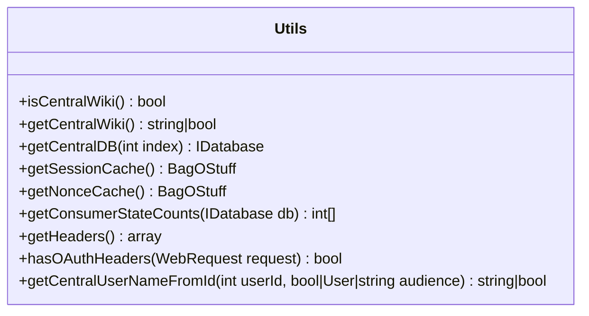

# Overview

The <SwmToken path="src/Backend/Utils.php" pos="26:2:2" line-data="class Utils {">`Utils`</SwmToken> class provides a collection of static utility functions specifically for <SwmToken path="src/Backend/Utils.php" pos="78:13:13" line-data="	 * Get the cache type for OAuth 1.0 nonces">`OAuth`</SwmToken> operations. These functions are essential for various backend components such as `Hooks`, <SwmToken path="src/Backend/Utils.php" pos="102:1:1" line-data="			Consumer::STAGE_APPROVED =&gt; 0,">`Consumer`</SwmToken>, <SwmToken path="src/Backend/Utils.php" pos="251:5:5" line-data="		return new MWOAuthDataStore( $dbr, $dbw, self::getSessionCache(), self::getNonceCache() );">`MWOAuthDataStore`</SwmToken>, and <SwmToken path="src/Backend/Utils.php" pos="236:6:6" line-data="	 * @return MWOAuthServer with default configurations">`MWOAuthServer`</SwmToken> to facilitate OAuth-related operations.

<SwmSnippet path="/src/Backend/Utils.php" line="27">

---

# Checking Central Wiki

The function <SwmToken path="src/Backend/Utils.php" pos="30:7:7" line-data="	public static function isCentralWiki() {">`isCentralWiki`</SwmToken> checks if the current wiki is the central wiki by comparing the current wiki ID with the central wiki ID.

```hack
	/**
	 * @return bool
	 */
	public static function isCentralWiki() {
		global $wgMWOAuthCentralWiki;

		return ( WikiMap::getCurrentWikiId() === $wgMWOAuthCentralWiki );
	}
```

---

</SwmSnippet>

<SwmSnippet path="/src/Backend/Utils.php" line="36">

---

# Retrieving Central Wiki ID

The function <SwmToken path="src/Backend/Utils.php" pos="39:7:7" line-data="	public static function getCentralWiki() {">`getCentralWiki`</SwmToken> retrieves the central wiki ID from the global configuration.

```hack
	/**
	 * @return string|bool
	 */
	public static function getCentralWiki() {
		global $wgMWOAuthCentralWiki;

		return $wgMWOAuthCentralWiki;
	}
```

---

</SwmSnippet>

<SwmSnippet path="/src/Backend/Utils.php" line="45">

---

# Obtaining Database Connections

The function <SwmToken path="src/Backend/Utils.php" pos="49:7:7" line-data="	public static function getCentralDB( $index ) {">`getCentralDB`</SwmToken> obtains a database connection to the central wiki, considering whether to use the primary or replica database.

```hack
	/**
	 * @param int $index DB_PRIMARY/DB_REPLICA
	 * @return IDatabase
	 */
	public static function getCentralDB( $index ) {
		$lbFactory = MediaWikiServices::getInstance()->getDBLoadBalancerFactory();

		// T244415: Use the primary database if there were changes
		if ( $index === DB_REPLICA && $lbFactory->hasOrMadeRecentPrimaryChanges() ) {
			$index = DB_PRIMARY;
		}
		$wikiId = self::getCentralWiki();
		if ( WikiMap::isCurrentWikiId( $wikiId ) ) {
			$wikiId = false;
		}

		return $lbFactory->getMainLB( $wikiId )->getConnection(
			$index, [], $wikiId );
	}
```

---

</SwmSnippet>

<SwmSnippet path="/src/Backend/Utils.php" line="65">

---

# Managing Session and Nonce Caches

The functions <SwmToken path="src/Backend/Utils.php" pos="68:7:7" line-data="	public static function getSessionCache() {">`getSessionCache`</SwmToken> and <SwmToken path="src/Backend/Utils.php" pos="81:7:7" line-data="	public static function getNonceCache() {">`getNonceCache`</SwmToken> manage session and nonce caches, respectively, which are essential for OAuth's token management and request validation.

```hack
	/**
	 * @return BagOStuff
	 */
	public static function getSessionCache() {
		global $wgMWOAuthSessionCacheType;
		global $wgSessionCacheType;

		$sessionCacheType = $wgMWOAuthSessionCacheType ?? $wgSessionCacheType;
		return MediaWikiServices::getInstance()
			->getObjectCacheFactory()->getInstance( $sessionCacheType );
	}

	/**
	 * Get the cache type for OAuth 1.0 nonces
	 * @return BagOStuff
	 */
	public static function getNonceCache() {
		global $wgMWOAuthNonceCacheType, $wgMWOAuthSessionCacheType, $wgSessionCacheType;

		$cacheType = $wgMWOAuthNonceCacheType
			?? $wgMWOAuthSessionCacheType ?? $wgSessionCacheType;
```

---

</SwmSnippet>

<SwmSnippet path="/src/Backend/Utils.php" line="90">

---

# Handling <SwmToken path="src/Backend/Utils.php" pos="78:13:13" line-data="	 * Get the cache type for OAuth 1.0 nonces">`OAuth`</SwmToken> Consumer States

The function <SwmToken path="src/Backend/Utils.php" pos="94:7:7" line-data="	public static function getConsumerStateCounts( IDatabase $db ) {">`getConsumerStateCounts`</SwmToken> handles <SwmToken path="src/Backend/Utils.php" pos="78:13:13" line-data="	 * Get the cache type for OAuth 1.0 nonces">`OAuth`</SwmToken> consumer states by counting the number of consumers in different stages.

```hack
	/**
	 * @param IDatabase $db
	 * @return int[]
	 */
	public static function getConsumerStateCounts( IDatabase $db ) {
		$res = $db->newSelectQueryBuilder()
			->select( [ 'oarc_stage', 'count' => 'COUNT(*)' ] )
			->from( 'oauth_registered_consumer' )
			->groupBy( 'oarc_stage' )
			->caller( __METHOD__ )
			->fetchResultSet();
		$table = [
			Consumer::STAGE_APPROVED => 0,
			Consumer::STAGE_DISABLED => 0,
			Consumer::STAGE_EXPIRED  => 0,
			Consumer::STAGE_PROPOSED => 0,
			Consumer::STAGE_REJECTED => 0,
		];
		foreach ( $res as $row ) {
			$table[(int)$row->oarc_stage] = (int)$row->count;
		}
```

---

</SwmSnippet>

<SwmSnippet path="/src/Backend/Utils.php" line="114">

---

# Sanitizing Request Headers

The function <SwmToken path="src/Backend/Utils.php" pos="122:7:7" line-data="	public static function getHeaders() {">`getHeaders`</SwmToken> sanitizes request headers to ensure they are in a consistent format.

```hack
	/**
	 * Get request headers.
	 * Sanitizes the output of apache_request_headers because
	 * we always want the keys to be Cased-Like-This and arh()
	 * returns the headers in the same case as they are in the
	 * request
	 * @return array Header name => value
	 */
	public static function getHeaders() {
		$request = RequestContext::getMain()->getRequest();
		$headers = $request->getAllHeaders();

		$out = [];
		foreach ( $headers as $key => $value ) {
			$key = str_replace(
				" ",
				"-",
				ucwords( strtolower( str_replace( "-", " ", $key ) ) )
			);
			$out[$key] = $value;
		}
```

---

</SwmSnippet>

<SwmSnippet path="/src/Backend/Utils.php" line="138">

---

# Verifying <SwmToken path="src/Backend/Utils.php" pos="139:13:13" line-data="	 * Test this request for an OAuth Authorization header">`OAuth`</SwmToken> Authorization Headers

The function <SwmToken path="src/Backend/Utils.php" pos="143:7:7" line-data="	public static function hasOAuthHeaders( WebRequest $request ) {">`hasOAuthHeaders`</SwmToken> verifies if a request contains <SwmToken path="src/Backend/Utils.php" pos="139:13:13" line-data="	 * Test this request for an OAuth Authorization header">`OAuth`</SwmToken> authorization headers.

```hack
	/**
	 * Test this request for an OAuth Authorization header
	 * @param WebRequest $request the MediaWiki request
	 * @return bool true if a header was found
	 */
	public static function hasOAuthHeaders( WebRequest $request ) {
		$header = $request->getHeader( 'Authorization' );

		return $header !== false && strpos( $header, 'OAuth ' ) === 0;
	}
```

---

</SwmSnippet>

<SwmSnippet path="/src/Backend/Utils.php" line="254">

---

# Managing User Information

The function <SwmToken path="src/Backend/Utils.php" pos="262:7:7" line-data="	public static function getCentralUserNameFromId( $userId, $audience = false ) {">`getCentralUserNameFromId`</SwmToken> retrieves the central username for a given user ID, considering whether the name should be hidden based on the audience.

```hack
	/**
	 * Given a central wiki user ID, get a central username
	 *
	 * @param int $userId
	 * @param bool|User|string $audience show hidden names based on this user, or false for public
	 * @throws MWException
	 * @return string|bool Username, false if not found, empty string if name is hidden
	 */
	public static function getCentralUserNameFromId( $userId, $audience = false ) {
		global $wgMWOAuthSharedUserIDs, $wgMWOAuthSharedUserSource;

		// global ID required via hook
		if ( $wgMWOAuthSharedUserIDs ) {
			$lookup = MediaWikiServices::getInstance()
				->getCentralIdLookupFactory()
				->getLookup( $wgMWOAuthSharedUserSource );
			$name = $lookup->nameFromCentralId(
				$userId,
				$audience === 'raw'
					? CentralIdLookup::AUDIENCE_RAW
					: ( $audience ?: CentralIdLookup::AUDIENCE_PUBLIC )
```

---

</SwmSnippet>

&nbsp;

*This is an auto-generated document by Swimm AI 🌊 and has not yet been verified by a human*

<SwmMeta version="3.0.0" repo-id="Z2l0aHViJTNBJTNBbWVkaWF3aWtpLWV4dGVuc2lvbnMtT0F1dGglM0ElM0FTd2ltbS1EZW1v" repo-name="mediawiki-extensions-OAuth"><sup>Powered by [Swimm](/)</sup></SwmMeta>
