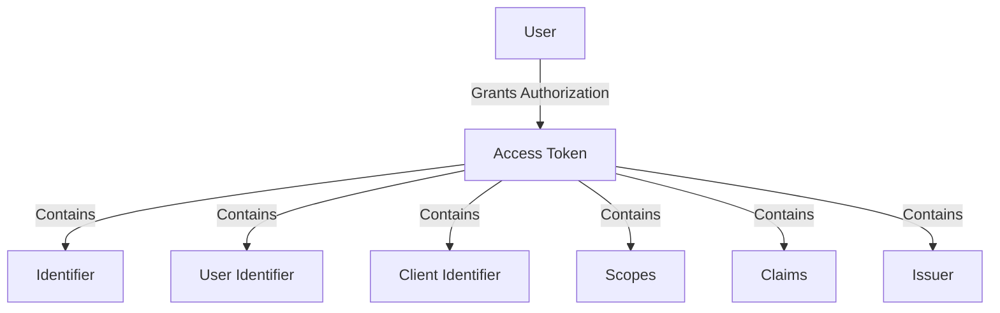

# Overview of Access Token

An Access Token is a key entity used to represent the authorization granted to a client by a user. It encapsulates the permissions (scopes) and claims associated with the user. The Access Token is essential for managing and validating user permissions in the system.

## Access Token Identifier

The Access Token contains an identifier, which is a unique string used to distinguish it from other tokens. This identifier is set using the <SwmToken path="tests/phpunit/Entity/AccessTokenEntityTest.php" pos="41:4:4" line-data="		$accessToken-&gt;setIdentifier( $identifier );">`setIdentifier`</SwmToken> method.

## User Identifier

The Access Token is associated with a specific user, identified by the user identifier. This user identifier is passed during the creation of the Access Token and can be retrieved using the <SwmToken path="tests/phpunit/Entity/AccessTokenEntityTest.php" pos="52:4:4" line-data="			$accessToken-&gt;getUserIdentifier(),">`getUserIdentifier`</SwmToken> method.

<SwmSnippet path="/tests/phpunit/Entity/AccessTokenEntityTest.php" line="38">

---

The user identifier is retrieved using the <SwmToken path="tests/phpunit/Entity/AccessTokenEntityTest.php" pos="52:4:4" line-data="			$accessToken-&gt;getUserIdentifier(),">`getUserIdentifier`</SwmToken> method.

```hack
			$this->getTestUser()->getUser()->getId()
		);
```

---

</SwmSnippet>

<SwmSnippet path="/tests/phpunit/Entity/AccessTokenEntityTest.php" line="30">

---

The client identifier is retrieved using the <SwmToken path="tests/phpunit/Entity/AccessTokenEntityTest.php" pos="56:9:9" line-data="			&#39;dummykey&#39;, $accessToken-&gt;getClient()-&gt;getIdentifier(),">`getClient`</SwmToken> method.

```hack
			MockClientEntity::newMock( $this->getTestUser()->getUser(), [
				'consumerKey' => 'dummykey'
			] ),
```

---

</SwmSnippet>

## Scopes

The Access Token includes a set of scopes, which define the permissions granted to the client. These scopes are passed during the creation of the Access Token and can be retrieved using the <SwmToken path="tests/phpunit/Entity/AccessTokenEntityTest.php" pos="61:7:7" line-data="		}, $accessToken-&gt;getScopes() );">`getScopes`</SwmToken> method.

## Claims

The Access Token can have multiple claims, which are additional pieces of information about the user. These claims are added using the <SwmToken path="tests/phpunit/Entity/AccessTokenEntityTest.php" pos="43:4:4" line-data="			$accessToken-&gt;addClaim( $claim );">`addClaim`</SwmToken> method and can be retrieved using the <SwmToken path="tests/phpunit/Entity/AccessTokenEntityTest.php" pos="67:9:9" line-data="		$tokenClaims = $accessToken-&gt;getClaims();">`getClaims`</SwmToken> method.

<SwmSnippet path="/tests/phpunit/Entity/AccessTokenEntityTest.php" line="42">

---

The claims are added using the <SwmToken path="tests/phpunit/Entity/AccessTokenEntityTest.php" pos="43:4:4" line-data="			$accessToken-&gt;addClaim( $claim );">`addClaim`</SwmToken> method.

```hack
		foreach ( $claims as $claim ) {
			$accessToken->addClaim( $claim );
		}
```

---

</SwmSnippet>

## Issuer

The Access Token has an issuer, which is the entity that issued the token. The issuer can be set and retrieved using the <SwmToken path="tests/phpunit/Entity/AccessTokenEntityTest.php" pos="75:4:4" line-data="		$accessToken-&gt;setIssuer( &#39;new_dummy&#39; );">`setIssuer`</SwmToken> and <SwmToken path="tests/phpunit/Entity/AccessTokenEntityTest.php" pos="74:15:15" line-data="		$this-&gt;assertSame( &#39;dummy&#39;, $accessToken-&gt;getIssuer() );">`getIssuer`</SwmToken> methods, respectively.

<SwmSnippet path="/tests/phpunit/Entity/AccessTokenEntityTest.php" line="74">

---

The issuer is set and retrieved using the <SwmToken path="tests/phpunit/Entity/AccessTokenEntityTest.php" pos="75:4:4" line-data="		$accessToken-&gt;setIssuer( &#39;new_dummy&#39; );">`setIssuer`</SwmToken> and <SwmToken path="tests/phpunit/Entity/AccessTokenEntityTest.php" pos="74:15:15" line-data="		$this-&gt;assertSame( &#39;dummy&#39;, $accessToken-&gt;getIssuer() );">`getIssuer`</SwmToken> methods.

```hack
		$this->assertSame( 'dummy', $accessToken->getIssuer() );
		$accessToken->setIssuer( 'new_dummy' );
		$this->assertSame( 'new_dummy', $accessToken->getIssuer() );
```

---

</SwmSnippet>

## Main Functions

The main functions associated with the Access Token include setting and retrieving the identifier, user identifier, client identifier, scopes, claims, and issuer.

### <SwmToken path="tests/phpunit/Entity/AccessTokenEntityTest.php" pos="41:4:4" line-data="		$accessToken-&gt;setIdentifier( $identifier );">`setIdentifier`</SwmToken>

The <SwmToken path="tests/phpunit/Entity/AccessTokenEntityTest.php" pos="41:4:4" line-data="		$accessToken-&gt;setIdentifier( $identifier );">`setIdentifier`</SwmToken> function sets a unique identifier for the Access Token.

<SwmSnippet path="/src/Entity/AccessTokenEntity.php" line="41">

---

The <SwmToken path="tests/phpunit/Entity/AccessTokenEntityTest.php" pos="41:4:4" line-data="		$accessToken-&gt;setIdentifier( $identifier );">`setIdentifier`</SwmToken> function is defined here.

```hack
	 * @param string|int|null $userIdentifier
```

---

</SwmSnippet>

### <SwmToken path="tests/phpunit/Entity/AccessTokenEntityTest.php" pos="52:4:4" line-data="			$accessToken-&gt;getUserIdentifier(),">`getUserIdentifier`</SwmToken>

The <SwmToken path="tests/phpunit/Entity/AccessTokenEntityTest.php" pos="52:4:4" line-data="			$accessToken-&gt;getUserIdentifier(),">`getUserIdentifier`</SwmToken> function retrieves the user identifier associated with the Access Token.

<SwmSnippet path="/src/Entity/AccessTokenEntity.php" line="52">

---

The <SwmToken path="tests/phpunit/Entity/AccessTokenEntityTest.php" pos="52:4:4" line-data="			$accessToken-&gt;getUserIdentifier(),">`getUserIdentifier`</SwmToken> function is defined here.

```hack
		);
```

---

</SwmSnippet>

### <SwmToken path="tests/phpunit/Entity/AccessTokenEntityTest.php" pos="56:9:9" line-data="			&#39;dummykey&#39;, $accessToken-&gt;getClient()-&gt;getIdentifier(),">`getClient`</SwmToken>

The <SwmToken path="tests/phpunit/Entity/AccessTokenEntityTest.php" pos="56:9:9" line-data="			&#39;dummykey&#39;, $accessToken-&gt;getClient()-&gt;getIdentifier(),">`getClient`</SwmToken> function retrieves the client identifier associated with the Access Token.

<SwmSnippet path="/src/Entity/AccessTokenEntity.php" line="56">

---

The <SwmToken path="tests/phpunit/Entity/AccessTokenEntityTest.php" pos="56:9:9" line-data="			&#39;dummykey&#39;, $accessToken-&gt;getClient()-&gt;getIdentifier(),">`getClient`</SwmToken> function is defined here.

```hack
		if ( $clientEntity->getOwnerOnly() ) {
```

---

</SwmSnippet>

### <SwmToken path="tests/phpunit/Entity/AccessTokenEntityTest.php" pos="61:7:7" line-data="		}, $accessToken-&gt;getScopes() );">`getScopes`</SwmToken>

The <SwmToken path="tests/phpunit/Entity/AccessTokenEntityTest.php" pos="61:7:7" line-data="		}, $accessToken-&gt;getScopes() );">`getScopes`</SwmToken> function retrieves the scopes associated with the Access Token.

<SwmSnippet path="/src/Entity/AccessTokenEntity.php" line="61">

---

The <SwmToken path="tests/phpunit/Entity/AccessTokenEntityTest.php" pos="61:7:7" line-data="		}, $accessToken-&gt;getScopes() );">`getScopes`</SwmToken> function is defined here.

```hack
				);
```

---

</SwmSnippet>

### <SwmToken path="tests/phpunit/Entity/AccessTokenEntityTest.php" pos="43:4:4" line-data="			$accessToken-&gt;addClaim( $claim );">`addClaim`</SwmToken>

The <SwmToken path="tests/phpunit/Entity/AccessTokenEntityTest.php" pos="43:4:4" line-data="			$accessToken-&gt;addClaim( $claim );">`addClaim`</SwmToken> function adds a claim to the Access Token.

<SwmSnippet path="/src/Entity/AccessTokenEntity.php" line="43">

---

The <SwmToken path="tests/phpunit/Entity/AccessTokenEntityTest.php" pos="43:4:4" line-data="			$accessToken-&gt;addClaim( $claim );">`addClaim`</SwmToken> function is defined here.

```hack
	 */
```

---

</SwmSnippet>

### <SwmToken path="tests/phpunit/Entity/AccessTokenEntityTest.php" pos="67:9:9" line-data="		$tokenClaims = $accessToken-&gt;getClaims();">`getClaims`</SwmToken>

The <SwmToken path="tests/phpunit/Entity/AccessTokenEntityTest.php" pos="67:9:9" line-data="		$tokenClaims = $accessToken-&gt;getClaims();">`getClaims`</SwmToken> function retrieves the claims associated with the Access Token.

<SwmSnippet path="/src/Entity/AccessTokenEntity.php" line="68">

---

The <SwmToken path="tests/phpunit/Entity/AccessTokenEntityTest.php" pos="67:9:9" line-data="		$tokenClaims = $accessToken-&gt;getClaims();">`getClaims`</SwmToken> function is defined here.

```hack
			foreach ( $scopes as $scope ) {
```

---

</SwmSnippet>

### <SwmToken path="tests/phpunit/Entity/AccessTokenEntityTest.php" pos="75:4:4" line-data="		$accessToken-&gt;setIssuer( &#39;new_dummy&#39; );">`setIssuer`</SwmToken>

The <SwmToken path="tests/phpunit/Entity/AccessTokenEntityTest.php" pos="75:4:4" line-data="		$accessToken-&gt;setIssuer( &#39;new_dummy&#39; );">`setIssuer`</SwmToken> function sets the issuer of the Access Token.

<SwmSnippet path="/src/Entity/AccessTokenEntity.php" line="75">

---

The <SwmToken path="tests/phpunit/Entity/AccessTokenEntityTest.php" pos="75:4:4" line-data="		$accessToken-&gt;setIssuer( &#39;new_dummy&#39; );">`setIssuer`</SwmToken> function is defined here.

```hack
		}
```

---

</SwmSnippet>

### <SwmToken path="tests/phpunit/Entity/AccessTokenEntityTest.php" pos="74:15:15" line-data="		$this-&gt;assertSame( &#39;dummy&#39;, $accessToken-&gt;getIssuer() );">`getIssuer`</SwmToken>

The <SwmToken path="tests/phpunit/Entity/AccessTokenEntityTest.php" pos="74:15:15" line-data="		$this-&gt;assertSame( &#39;dummy&#39;, $accessToken-&gt;getIssuer() );">`getIssuer`</SwmToken> function retrieves the issuer of the Access Token.

<SwmSnippet path="/src/Entity/AccessTokenEntity.php" line="1">

---

The <SwmToken path="tests/phpunit/Entity/AccessTokenEntityTest.php" pos="74:15:15" line-data="		$this-&gt;assertSame( &#39;dummy&#39;, $accessToken-&gt;getIssuer() );">`getIssuer`</SwmToken> function is defined here.

```hack
<?php

namespace MediaWiki\Extension\OAuth\Entity;

use InvalidArgumentException;
use League\OAuth2\Server\CryptKey;
use League\OAuth2\Server\Entities\AccessTokenEntityInterface;
use League\OAuth2\Server\Entities\ScopeEntityInterface;
use League\OAuth2\Server\Entities\Traits\AccessTokenTrait;
use League\OAuth2\Server\Entities\Traits\EntityTrait;
use League\OAuth2\Server\Entities\Traits\TokenEntityTrait;
use League\OAuth2\Server\Exception\OAuthServerException;
use MediaWiki\Extension\OAuth\Backend\ConsumerAcceptance;
use MediaWiki\Extension\OAuth\Backend\Utils;
use MediaWiki\MediaWikiServices;
use MediaWiki\User\User;
```

---

</SwmSnippet>

&nbsp;

*This is an auto-generated document by Swimm AI 🌊 and has not yet been verified by a human*

<SwmMeta version="3.0.0" repo-id="Z2l0aHViJTNBJTNBbWVkaWF3aWtpLWV4dGVuc2lvbnMtT0F1dGglM0ElM0FTd2ltbS1EZW1v" repo-name="mediawiki-extensions-OAuth"><sup>Powered by [Swimm](/)</sup></SwmMeta>
