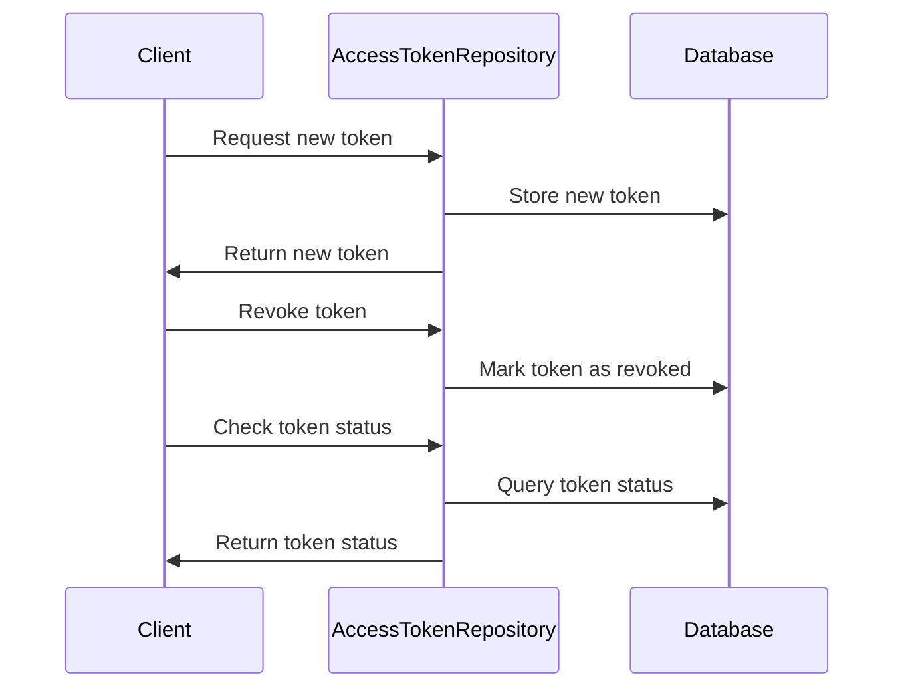

# Overview of <SwmToken path="tests/phpunit/Repository/AccessTokenRepositoryTest.php" pos="8:10:10" line-data="use MediaWiki\Extension\OAuth\Repository\AccessTokenRepository;">`AccessTokenRepository`</SwmToken>

The <SwmToken path="tests/phpunit/Repository/AccessTokenRepositoryTest.php" pos="8:10:10" line-data="use MediaWiki\Extension\OAuth\Repository\AccessTokenRepository;">`AccessTokenRepository`</SwmToken> is responsible for managing access tokens within the <SwmToken path="tests/phpunit/Repository/AccessTokenRepositoryTest.php" pos="3:6:6" line-data="namespace MediaWiki\Extension\OAuth\Tests\Repository;">`OAuth`</SwmToken> extension. It provides methods to persist new access tokens, revoke existing tokens, and check if a token has been revoked. The repository interacts with the database to store and retrieve access token information, ensuring that tokens are correctly issued to clients and maintaining their validity and revocation status.

## Persisting a New Access Token

To persist a new access token, use the <SwmToken path="tests/phpunit/Repository/AccessTokenRepositoryTest.php" pos="39:6:6" line-data="		$this-&gt;accessTokenRepo-&gt;persistNewAccessToken( $this-&gt;accessToken );">`persistNewAccessToken`</SwmToken> method. This method stores the token in the database and ensures it is available for future validation.

<SwmSnippet path="/tests/phpunit/Repository/AccessTokenRepositoryTest.php" line="38">

---

The <SwmToken path="tests/phpunit/Repository/AccessTokenRepositoryTest.php" pos="39:6:6" line-data="		$this-&gt;accessTokenRepo-&gt;persistNewAccessToken( $this-&gt;accessToken );">`persistNewAccessToken`</SwmToken> function is used to store a new access token in the database. This function ensures that the token is saved and can be retrieved or validated later.

```hack
	public function testPersistingToken() {
		$this->accessTokenRepo->persistNewAccessToken( $this->accessToken );

		$this->assertFalse(
			$this->accessTokenRepo->isAccessTokenRevoked( $this->accessToken->getIdentifier() ),
			'Access token should not be revoked'
		);
	}
```

---

</SwmSnippet>

## Revoking an Access Token

To revoke an access token, use the <SwmToken path="tests/phpunit/Repository/AccessTokenRepositoryTest.php" pos="48:6:6" line-data="		$this-&gt;accessTokenRepo-&gt;revokeAccessToken( $this-&gt;accessToken-&gt;getIdentifier() );">`revokeAccessToken`</SwmToken> method. This method marks the token as revoked in the database, making it invalid for future use.

<SwmSnippet path="/tests/phpunit/Repository/AccessTokenRepositoryTest.php" line="47">

---

The <SwmToken path="tests/phpunit/Repository/AccessTokenRepositoryTest.php" pos="48:6:6" line-data="		$this-&gt;accessTokenRepo-&gt;revokeAccessToken( $this-&gt;accessToken-&gt;getIdentifier() );">`revokeAccessToken`</SwmToken> function is used to mark an access token as revoked. This function updates the token's status in the database, making it invalid for future use.

```hack
	public function testRevokingToken() {
		$this->accessTokenRepo->revokeAccessToken( $this->accessToken->getIdentifier() );

		$this->assertTrue(
			$this->accessTokenRepo->isAccessTokenRevoked( $this->accessToken->getIdentifier() ),
			'Access token should be revoked'
		);
```

---

</SwmSnippet>

## Checking Token Revocation Status

To check if an access token has been revoked, use the <SwmToken path="tests/phpunit/Repository/AccessTokenRepositoryTest.php" pos="42:6:6" line-data="			$this-&gt;accessTokenRepo-&gt;isAccessTokenRevoked( $this-&gt;accessToken-&gt;getIdentifier() ),">`isAccessTokenRevoked`</SwmToken> method. This method queries the database to determine the revocation status of the token.

<SwmSnippet path="/tests/phpunit/Repository/AccessTokenRepositoryTest.php" line="41">

---

The <SwmToken path="tests/phpunit/Repository/AccessTokenRepositoryTest.php" pos="42:6:6" line-data="			$this-&gt;accessTokenRepo-&gt;isAccessTokenRevoked( $this-&gt;accessToken-&gt;getIdentifier() ),">`isAccessTokenRevoked`</SwmToken> function checks if a given access token has been revoked. It queries the database to determine the token's current status.

```hack
		$this->assertFalse(
			$this->accessTokenRepo->isAccessTokenRevoked( $this->accessToken->getIdentifier() ),
			'Access token should not be revoked'
		);
```

---

</SwmSnippet>

## Generating a New Token

To generate a new access token for a client, use the <SwmToken path="tests/phpunit/Repository/AccessTokenRepositoryTest.php" pos="58:11:11" line-data="		$token = $this-&gt;accessTokenRepo-&gt;getNewToken( $client, [] );">`getNewToken`</SwmToken> method. This method creates a new token, assigns it to the client, and sets its issuer.

<SwmSnippet path="/tests/phpunit/Repository/AccessTokenRepositoryTest.php" line="56">

---

The <SwmToken path="tests/phpunit/Repository/AccessTokenRepositoryTest.php" pos="58:11:11" line-data="		$token = $this-&gt;accessTokenRepo-&gt;getNewToken( $client, [] );">`getNewToken`</SwmToken> function generates a new access token for a client. It creates a token with the specified client and issuer information, ensuring that the token is ready for use.

```hack
	public function testGetNewToken() {
		$client = MockClientEntity::newMock( $this->getTestUser()->getUser() );
		$token = $this->accessTokenRepo->getNewToken( $client, [] );
		$this->assertSame( 'dummy', $token->getIssuer() );
		$this->assertSame( $client, $token->getClient() );
	}
```

---

</SwmSnippet>

&nbsp;

*This is an auto-generated document by Swimm AI 🌊 and has not yet been verified by a human*

<SwmMeta version="3.0.0" repo-id="Z2l0aHViJTNBJTNBbWVkaWF3aWtpLWV4dGVuc2lvbnMtT0F1dGglM0ElM0FTd2ltbS1EZW1v" repo-name="mediawiki-extensions-OAuth"><sup>Powered by [Swimm](/)</sup></SwmMeta>
