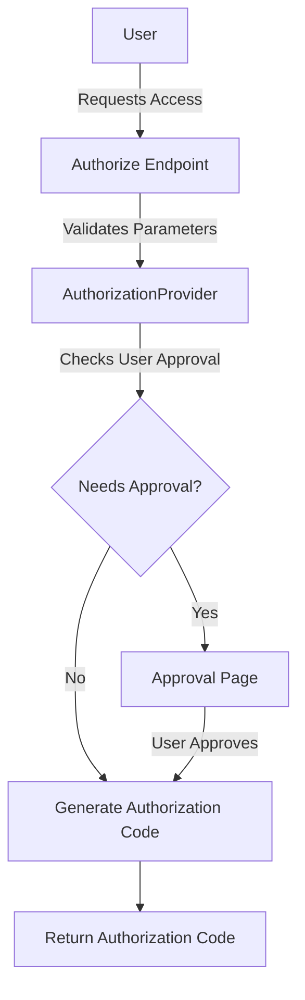

<SwmSnippet path="/src/Rest/Handler/Authorize.php" line="24">

---

# Handling Authorization Requests

The <SwmToken path="src/Rest/Handler/Authorize.php" pos="24:9:9" line-data=" * Handles the oauth2/authorize endpoint, which displays an authorization dialog to the user if">`authorize`</SwmToken> class manages the `/oauth2/authorize` endpoint, displaying an authorization dialog to the user and returning an authorization code for access token exchange.

```hack
 * Handles the oauth2/authorize endpoint, which displays an authorization dialog to the user if
 * needed (by redirecting to Special:OAuth/approve), and returns an authorization code that can be
 * traded for the access token.
 */
```

---

</SwmSnippet>

<SwmSnippet path="/src/Rest/Handler/Authorize.php" line="32">

---

# Processing Authorization

The <SwmToken path="src/Rest/Handler/Authorize.php" pos="34:5:5" line-data="	public function execute() {">`execute`</SwmToken> method in the <SwmToken path="src/Rest/Handler/Authorize.php" pos="24:9:9" line-data=" * Handles the oauth2/authorize endpoint, which displays an authorization dialog to the user if">`authorize`</SwmToken> class processes the authorization request by validating parameters, checking user authentication, and determining if user approval is needed.

```hack
	 * @inheritDoc
	 */
	public function execute() {
		$response = new Response();

		try {
			if ( $this->queuedError ) {
				throw $this->queuedError;
			}
			$request = ServerRequest::fromGlobals()->withQueryParams(
				$this->getValidatedParams()
			);
			// Note: Owner-only clients can only use client_credentials grant
			// so would be rejected from this endpoint with invalid_client error
			// automatically, no need for additional checks
			if ( !$this->user instanceof User || !$this->user->isNamed() ) {
				return $this->getLoginRedirectResponse();
			}

			$authProvider = $this->getAuthorizationProvider();
			$authProvider->setUser( $this->user );
```

---

</SwmSnippet>

If user approval is required, the user is redirected to a special approval page. If the user approves the request, an authorization code is generated and returned.

<SwmSnippet path="/src/AuthorizationProvider/AuthorizationProvider.php" line="19">

---

# Managing Authorization

The <SwmToken path="src/AuthorizationProvider/AuthorizationProvider.php" pos="19:4:4" line-data="abstract class AuthorizationProvider implements IAuthorizationProvider {">`AuthorizationProvider`</SwmToken> class manages the authorization process, including setting the user, checking if user approval is needed, and authorizing the request.

```hack
abstract class AuthorizationProvider implements IAuthorizationProvider {
	/**
	 * @var AuthorizationServer
	 */
	protected $server;

	/**
	 * @var Config|null
	 */
	protected $config;

	/**
	 * @var User
	 */
	protected $user;

	/**
	 * @var LoggerInterface
	 */
	protected $logger;
```

---

</SwmSnippet>

<SwmSnippet path="/src/AuthorizationServerFactory.php" line="13">

---

# Creating Authorization Server

The <SwmToken path="src/AuthorizationServerFactory.php" pos="13:2:2" line-data="class AuthorizationServerFactory {">`AuthorizationServerFactory`</SwmToken> class creates instances of the <SwmToken path="src/AuthorizationProvider/AuthorizationProvider.php" pos="21:6:6" line-data="	 * @var AuthorizationServer">`AuthorizationServer`</SwmToken>, which handles the core authorization logic.

```hack
class AuthorizationServerFactory {
	/** @var string */
	protected $privateKey;
	/** @var string */
	protected $encryptionKey;
	/** @var string */
	private $canonicalServer;

	/**
	 * @return static
	 */
	public static function factory() {
		$services = MediaWikiServices::getInstance();
		$extConfig = $services->getConfigFactory()->makeConfig( 'mwoauth' );
		$mainConfig = $services->getMainConfig();
		$privateKey = $extConfig->get( 'OAuth2PrivateKey' );
		$encryptionKey = $extConfig->get( 'OAuthSecretKey' ) ?? $mainConfig->get( 'SecretKey' );
		$canonicalServer = $mainConfig->get( 'CanonicalServer' );
		return new static( $privateKey, $encryptionKey, $canonicalServer );
```

---

</SwmSnippet>

<SwmSnippet path="/src/Frontend/SpecialPages/SpecialMWOAuth.php" line="60">

---

# Authorization in <SwmToken path="src/Frontend/SpecialPages/SpecialMWOAuth.php" pos="60:9:9" line-data=" * Page that handles OAuth consumer authorization and token exchange">`OAuth`</SwmToken>

The <SwmToken path="src/Frontend/SpecialPages/SpecialMWOAuth.php" pos="62:2:2" line-data="class SpecialMWOAuth extends UnlistedSpecialPage {">`SpecialMWOAuth`</SwmToken> class handles <SwmToken path="src/Frontend/SpecialPages/SpecialMWOAuth.php" pos="60:9:9" line-data=" * Page that handles OAuth consumer authorization and token exchange">`OAuth`</SwmToken> consumer authorization and token exchange, ensuring that only authorized users can obtain tokens.

```hack
 * Page that handles OAuth consumer authorization and token exchange
 */
```

---

</SwmSnippet>

&nbsp;

*This is an auto-generated document by Swimm AI 🌊 and has not yet been verified by a human*

<SwmMeta version="3.0.0" repo-id="Z2l0aHViJTNBJTNBbWVkaWF3aWtpLWV4dGVuc2lvbnMtT0F1dGglM0ElM0FTd2ltbS1EZW1v" repo-name="mediawiki-extensions-OAuth"><sup>Powered by [Swimm](/)</sup></SwmMeta>
