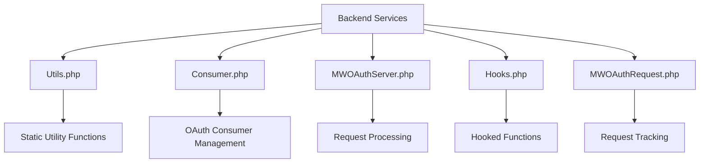

# Overview of Backend Services

Backend services refer to the server-side components that handle the core functionality of the <SwmToken path="src/Backend/Utils.php" pos="10:6:6" line-data="use MediaWiki\Extension\OAuth\Lib\OAuthSignatureMethodHmacSha1;">`OAuth`</SwmToken> extension. These services manage tasks such as database interactions, user authentication, and request handling.

# Utility Functions

The <SwmPath>[src/Backend/Utils.php](src/Backend/Utils.php)</SwmPath> file contains static utility functions that provide various backend services, such as checking if the current wiki is the central wiki, retrieving session caches, and managing <SwmToken path="src/Backend/Utils.php" pos="10:6:6" line-data="use MediaWiki\Extension\OAuth\Lib\OAuthSignatureMethodHmacSha1;">`OAuth`</SwmToken> headers.

<SwmSnippet path="/src/Backend/Utils.php" line="9">

---

The <SwmPath>[src/Backend/Utils.php](src/Backend/Utils.php)</SwmPath> file imports several necessary classes and functions to perform its utility operations.

```hack
use MediaWiki\Extension\Notifications\Model\Event;
use MediaWiki\Extension\OAuth\Lib\OAuthSignatureMethodHmacSha1;
use MediaWiki\MediaWikiServices;
use MediaWiki\Request\WebRequest;
use MediaWiki\Title\Title;
```

---

</SwmSnippet>

# <SwmToken path="src/Backend/Utils.php" pos="10:6:6" line-data="use MediaWiki\Extension\OAuth\Lib\OAuthSignatureMethodHmacSha1;">`OAuth`</SwmToken> Consumer Management

The <SwmPath>[src/Backend/Consumer.php](src/Backend/Consumer.php)</SwmPath> file represents an <SwmToken path="src/Backend/Utils.php" pos="10:6:6" line-data="use MediaWiki\Extension\OAuth\Lib\OAuthSignatureMethodHmacSha1;">`OAuth`</SwmToken> consumer and includes properties and methods for managing <SwmToken path="src/Backend/Utils.php" pos="10:6:6" line-data="use MediaWiki\Extension\OAuth\Lib\OAuthSignatureMethodHmacSha1;">`OAuth`</SwmToken> consumer data, such as consumer keys, user <SwmToken path="src/Backend/Consumer.php" pos="117:7:7" line-data="	 * Maps stage ids to human-readable names which describe them as a state">`ids`</SwmToken>, and callback <SwmToken path="src/Backend/Consumer.php" pos="67:28:28" line-data="	 * @var bool OAuth callback URL is a prefix and we allow all URLs which">`URLs`</SwmToken>.

<SwmSnippet path="/src/Backend/Consumer.php" line="28">

---

The <SwmPath>[src/Backend/Consumer.php](src/Backend/Consumer.php)</SwmPath> file imports various classes required for managing <SwmToken path="src/Backend/Consumer.php" pos="28:6:6" line-data="use MediaWiki\Extension\OAuth\Entity\ClientEntity as OAuth2Client;">`OAuth`</SwmToken> consumer data.

```hack
use MediaWiki\Extension\OAuth\Entity\ClientEntity as OAuth2Client;
use MediaWiki\Linker\Linker;
use MediaWiki\MediaWikiServices;
use MediaWiki\Message\Message;
use MediaWiki\SpecialPage\SpecialPage;
```

---

</SwmSnippet>

# Request Processing

The <SwmPath>[src/Backend/MWOAuthServer.php](src/Backend/MWOAuthServer.php)</SwmPath> file extends the <SwmToken path="src/Backend/MWOAuthServer.php" pos="5:10:10" line-data="use MediaWiki\Extension\OAuth\Lib\OAuthServer;">`OAuthServer`</SwmToken> class and includes methods for processing request tokens, verifying requests, and ensuring callback URL validity.

<SwmSnippet path="/src/Backend/MWOAuthServer.php" line="1">

---

The <SwmPath>[src/Backend/MWOAuthServer.php](src/Backend/MWOAuthServer.php)</SwmPath> file imports necessary classes and extends the <SwmToken path="src/Backend/MWOAuthServer.php" pos="5:10:10" line-data="use MediaWiki\Extension\OAuth\Lib\OAuthServer;">`OAuthServer`</SwmToken> class to handle request processing.

```hack
<?php

namespace MediaWiki\Extension\OAuth\Backend;

use MediaWiki\Extension\OAuth\Lib\OAuthServer;
use MediaWiki\Linker\Linker;
use MediaWiki\Message\Message;
use MediaWiki\SpecialPage\SpecialPage;
use MediaWiki\User\User;
```

---

</SwmSnippet>

# Hooked Functions

The <SwmPath>[src/Backend/Hooks.php](src/Backend/Hooks.php)</SwmPath> file contains hooked functions for an <SwmToken path="src/Backend/Utils.php" pos="10:6:6" line-data="use MediaWiki\Extension\OAuth\Lib\OAuthSignatureMethodHmacSha1;">`OAuth`</SwmToken> environment, such as reserving change tags, merging user accounts, and setting up configurations after cache.

<SwmSnippet path="/src/Backend/Hooks.php" line="1">

---

The <SwmPath>[src/Backend/Hooks.php](src/Backend/Hooks.php)</SwmPath> file imports various hooks and functions necessary for the <SwmToken path="src/Backend/Hooks.php" pos="3:6:6" line-data="namespace MediaWiki\Extension\OAuth\Backend;">`OAuth`</SwmToken> environment.

```hack
<?php

namespace MediaWiki\Extension\OAuth\Backend;

use MediaWiki\Api\Hook\ApiRsdServiceApisHook;
use MediaWiki\ChangeTags\Hook\ChangeTagCanCreateHook;
use MediaWiki\ChangeTags\Hook\ChangeTagsListActiveHook;
use MediaWiki\ChangeTags\Hook\ListDefinedTagsHook;
use MediaWiki\Extension\OAuth\Frontend\OAuthLogFormatter;
use MediaWiki\Hook\SetupAfterCacheHook;
```

---

</SwmSnippet>

# Request Tracking

The <SwmPath>[src/Backend/MWOAuthRequest.php](src/Backend/MWOAuthRequest.php)</SwmPath> file extends the <SwmToken path="src/Backend/MWOAuthRequest.php" pos="5:10:10" line-data="use MediaWiki\Extension\OAuth\Lib\OAuthRequest;">`OAuthRequest`</SwmToken> class and includes methods for tracking the source IP of requests and parsing request parameters.

<SwmSnippet path="/src/Backend/MWOAuthRequest.php" line="1">

---

The <SwmPath>[src/Backend/MWOAuthRequest.php](src/Backend/MWOAuthRequest.php)</SwmPath> file imports necessary classes and extends the <SwmToken path="src/Backend/MWOAuthRequest.php" pos="5:10:10" line-data="use MediaWiki\Extension\OAuth\Lib\OAuthRequest;">`OAuthRequest`</SwmToken> class to handle request tracking.

```hack
<?php

namespace MediaWiki\Extension\OAuth\Backend;

use MediaWiki\Extension\OAuth\Lib\OAuthRequest;
use MediaWiki\Extension\OAuth\Lib\OAuthUtil;
use MediaWiki\Request\WebRequest;

/**
 * @file
```

---

</SwmSnippet>

&nbsp;

*This is an auto-generated document by Swimm AI 🌊 and has not yet been verified by a human*

<SwmMeta version="3.0.0" repo-id="Z2l0aHViJTNBJTNBbWVkaWF3aWtpLWV4dGVuc2lvbnMtT0F1dGglM0ElM0FTd2ltbS1EZW1v" repo-name="mediawiki-extensions-OAuth"><sup>Powered by [Swimm](/)</sup></SwmMeta>
