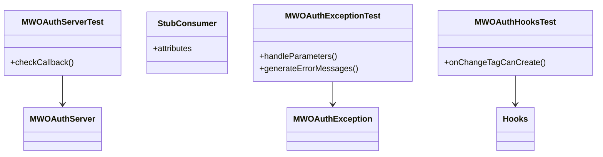

# What are Backend Tests

Backend tests refer to the testing of backend components and functionalities within the <SwmToken path="tests/phpunit/Backend/MWOAuthServerTest.php" pos="24:2:2" line-data="namespace MediaWiki\Extension\OAuth\Tests\Backend;">`MediaWiki`</SwmToken> <SwmToken path="tests/phpunit/Backend/MWOAuthServerTest.php" pos="24:6:6" line-data="namespace MediaWiki\Extension\OAuth\Tests\Backend;">`OAuth`</SwmToken> extension. These tests ensure that the backend logic works as expected and handles various scenarios correctly.

<SwmSnippet path="/tests/phpunit/Backend/MWOAuthServerTest.php" line="24">

---

# <SwmToken path="tests/phpunit/Backend/MWOAuthServerTest.php" pos="35:2:2" line-data="class MWOAuthServerTest extends TestCase {">`MWOAuthServerTest`</SwmToken>

The <SwmToken path="tests/phpunit/Backend/MWOAuthServerTest.php" pos="35:2:2" line-data="class MWOAuthServerTest extends TestCase {">`MWOAuthServerTest`</SwmToken> class tests the <SwmToken path="tests/phpunit/Backend/MWOAuthServerTest.php" pos="27:10:10" line-data="use MediaWiki\Extension\OAuth\Backend\MWOAuthServer;">`MWOAuthServer`</SwmToken> class, specifically focusing on the <SwmToken path="tests/phpunit/Backend/MWOAuthServerTest.php" pos="53:16:16" line-data="		$method = new ReflectionMethod( $fixture, &#39;checkCallback&#39; );">`checkCallback`</SwmToken> method to ensure it handles callback URLs correctly.

```hack
namespace MediaWiki\Extension\OAuth\Tests\Backend;

use MediaWiki\Extension\OAuth\Backend\MWOAuthException;
use MediaWiki\Extension\OAuth\Backend\MWOAuthServer;
use PHPUnit\Framework\TestCase;
use ReflectionMethod;
```

---

</SwmSnippet>

<SwmSnippet path="/tests/phpunit/Backend/StubConsumer.php" line="24">

---

# <SwmToken path="tests/phpunit/Backend/MWOAuthServerTest.php" pos="46:8:8" line-data="		$consumer = new StubConsumer( [">`StubConsumer`</SwmToken>

The <SwmToken path="tests/phpunit/Backend/MWOAuthServerTest.php" pos="46:8:8" line-data="		$consumer = new StubConsumer( [">`StubConsumer`</SwmToken> class is used to simulate a consumer object with various attributes for testing purposes.

```hack
namespace MediaWiki\Extension\OAuth\Tests\Backend;
```

---

</SwmSnippet>

&nbsp;

*This is an auto-generated document by Swimm AI 🌊 and has not yet been verified by a human*

<SwmMeta version="3.0.0" repo-id="Z2l0aHViJTNBJTNBbWVkaWF3aWtpLWV4dGVuc2lvbnMtT0F1dGglM0ElM0FTd2ltbS1EZW1v" repo-name="mediawiki-extensions-OAuth"><sup>Powered by [Swimm](/)</sup></SwmMeta>
