```mermaid
graph TD;
 A[Set $wgMWOAuthReadOnly to true] --> B[Run MigrateCentralWiki script];
 B --> C[Move oauth_registered_consumer and oauth_accepted_consumer tables];
 C --> D[Update cluster config to point to new central wiki];
 D --> E[Set $wgMWOAuthReadOnly to false];
 E --> F[Migrate OAuth logs using importCentralWikiLogs.php];
 F --> G[Done!];

%% Swimm:
%% graph TD;
%%  A[Set <SwmToken path="maintenance/migrateCentralWiki.php" pos="11:8:9" line-data=" * 1. Set $wgMWOAuthReadOnly = true for all wikis in your running config">`$wgMWOAuthReadOnly`</SwmToken> to true] --> B[Run <SwmToken path="maintenance/migrateCentralWiki.php" pos="34:2:2" line-data="class MigrateCentralWiki extends Maintenance {">`MigrateCentralWiki`</SwmToken> script];
%%  B --> C[Move <SwmToken path="maintenance/migrateCentralWiki.php" pos="42:7:7" line-data="			&#39;Table name (oauth_registered_consumer or oauth_accepted_consumer)&#39;, true, true );">`oauth_registered_consumer`</SwmToken> and <SwmToken path="maintenance/migrateCentralWiki.php" pos="42:11:11" line-data="			&#39;Table name (oauth_registered_consumer or oauth_accepted_consumer)&#39;, true, true );">`oauth_accepted_consumer`</SwmToken> tables];
%%  C --> D[Update cluster config to point to new central wiki];
%%  D --> E[Set <SwmToken path="maintenance/migrateCentralWiki.php" pos="11:8:9" line-data=" * 1. Set $wgMWOAuthReadOnly = true for all wikis in your running config">`$wgMWOAuthReadOnly`</SwmToken> to false];
%%  E --> F[Migrate <SwmToken path="maintenance/migrateCentralWiki.php" pos="38:2:2" line-data="			&quot;OAuth should be in Read Only mode while this is running.&quot; );">`OAuth`</SwmToken> logs using importCentralWikiLogs.php];
%%  F --> G[Done!];
```

# Overview of Central Wiki Migration

Central Wiki Migration is a process to migrate the <SwmToken path="maintenance/migrateCentralWiki.php" pos="42:7:7" line-data="			&#39;Table name (oauth_registered_consumer or oauth_accepted_consumer)&#39;, true, true );">`oauth_registered_consumer`</SwmToken> and <SwmToken path="maintenance/migrateCentralWiki.php" pos="42:11:11" line-data="			&#39;Table name (oauth_registered_consumer or oauth_accepted_consumer)&#39;, true, true );">`oauth_accepted_consumer`</SwmToken> tables to a new database with minimal downtime. The migration involves setting the <SwmToken path="maintenance/migrateCentralWiki.php" pos="11:8:9" line-data=" * 1. Set $wgMWOAuthReadOnly = true for all wikis in your running config">`$wgMWOAuthReadOnly`</SwmToken> configuration to true for all wikis to ensure that <SwmToken path="maintenance/migrateCentralWiki.php" pos="38:2:2" line-data="			&quot;OAuth should be in Read Only mode while this is running.&quot; );">`OAuth`</SwmToken> is in read-only mode during the migration.

# <SwmToken path="maintenance/migrateCentralWiki.php" pos="34:2:2" line-data="class MigrateCentralWiki extends Maintenance {">`MigrateCentralWiki`</SwmToken> Class

The <SwmToken path="maintenance/migrateCentralWiki.php" pos="34:2:2" line-data="class MigrateCentralWiki extends Maintenance {">`MigrateCentralWiki`</SwmToken> class in <SwmPath>[maintenance/migrateCentralWiki.php](maintenance/migrateCentralWiki.php)</SwmPath> is responsible for handling the migration process. It sets up the necessary options and ensures that the <SwmToken path="maintenance/migrateCentralWiki.php" pos="38:2:2" line-data="			&quot;OAuth should be in Read Only mode while this is running.&quot; );">`OAuth`</SwmToken> extension is enabled.

<SwmSnippet path="/maintenance/migrateCentralWiki.php" line="34">

---

The <SwmToken path="maintenance/migrateCentralWiki.php" pos="34:2:2" line-data="class MigrateCentralWiki extends Maintenance {">`MigrateCentralWiki`</SwmToken> class sets up the necessary options and ensures that the <SwmToken path="maintenance/migrateCentralWiki.php" pos="38:2:2" line-data="			&quot;OAuth should be in Read Only mode while this is running.&quot; );">`OAuth`</SwmToken> extension is enabled.

```hack
class MigrateCentralWiki extends Maintenance {
	public function __construct() {
		parent::__construct();
		$this->addDescription( "Migrate central wiki from one wiki to another. " .
			"OAuth should be in Read Only mode while this is running." );
		$this->addOption( 'old', 'Previous central wiki', true, true );
		$this->addOption( 'target', 'New central wiki', true, true );
		$this->addOption( 'table',
			'Table name (oauth_registered_consumer or oauth_accepted_consumer)', true, true );
		$this->setBatchSize( 200 );
		$this->requireExtension( "OAuth" );
	}
```

---

</SwmSnippet>

# execute Function

The <SwmToken path="maintenance/migrateCentralWiki.php" pos="47:5:5" line-data="	public function execute() {">`execute`</SwmToken> function in the <SwmToken path="maintenance/migrateCentralWiki.php" pos="34:2:2" line-data="class MigrateCentralWiki extends Maintenance {">`MigrateCentralWiki`</SwmToken> class performs the actual migration by moving data from the old central wiki to the new central wiki. It uses the <SwmToken path="maintenance/migrateCentralWiki.php" pos="32:4:4" line-data="use MediaWiki\MediaWikiServices;">`MediaWikiServices`</SwmToken> to get database connections for both the old and new wikis and iterates over the data to migrate it.

# Migration Process

The migration process involves several steps:

1. Set <SwmToken path="maintenance/migrateCentralWiki.php" pos="11:8:9" line-data=" * 1. Set $wgMWOAuthReadOnly = true for all wikis in your running config">`$wgMWOAuthReadOnly`</SwmToken> to true.
2. Run the <SwmToken path="maintenance/migrateCentralWiki.php" pos="34:2:2" line-data="class MigrateCentralWiki extends Maintenance {">`MigrateCentralWiki`</SwmToken> script.
3. Move <SwmToken path="maintenance/migrateCentralWiki.php" pos="42:7:7" line-data="			&#39;Table name (oauth_registered_consumer or oauth_accepted_consumer)&#39;, true, true );">`oauth_registered_consumer`</SwmToken> and <SwmToken path="maintenance/migrateCentralWiki.php" pos="42:11:11" line-data="			&#39;Table name (oauth_registered_consumer or oauth_accepted_consumer)&#39;, true, true );">`oauth_accepted_consumer`</SwmToken> tables.
4. Update cluster config to point to the new central wiki.
5. Set <SwmToken path="maintenance/migrateCentralWiki.php" pos="11:8:9" line-data=" * 1. Set $wgMWOAuthReadOnly = true for all wikis in your running config">`$wgMWOAuthReadOnly`</SwmToken> to false.
6. Migrate <SwmToken path="maintenance/migrateCentralWiki.php" pos="38:2:2" line-data="			&quot;OAuth should be in Read Only mode while this is running.&quot; );">`OAuth`</SwmToken> logs using <SwmToken path="maintenance/migrateCentralWiki.php" pos="15:16:18" line-data=" * 5. Migrate the OAuth logs using importCentralWikiLogs.php.">`importCentralWikiLogs.php`</SwmToken>.

# Running the Migration Script

The <SwmToken path="maintenance/migrateCentralWiki.php" pos="34:2:2" line-data="class MigrateCentralWiki extends Maintenance {">`MigrateCentralWiki`</SwmToken> class is instantiated and executed when the maintenance script is run.

<SwmSnippet path="/maintenance/migrateCentralWiki.php" line="109">

---

The <SwmToken path="maintenance/migrateCentralWiki.php" pos="109:5:5" line-data="$maintClass = MigrateCentralWiki::class;">`MigrateCentralWiki`</SwmToken> class is instantiated and executed when the maintenance script is run.

```hack
$maintClass = MigrateCentralWiki::class;
require_once RUN_MAINTENANCE_IF_MAIN;
```

---

</SwmSnippet>

&nbsp;

*This is an auto-generated document by Swimm AI 🌊 and has not yet been verified by a human*

<SwmMeta version="3.0.0" repo-id="Z2l0aHViJTNBJTNBbWVkaWF3aWtpLWV4dGVuc2lvbnMtT0F1dGglM0ElM0FTd2ltbS1EZW1v" repo-name="mediawiki-extensions-OAuth"><sup>Powered by [Swimm](/)</sup></SwmMeta>
