```mermaid
classDiagram
    class OAuthTestUtils {
        +buildHTTPRequest()
        +resetHTTPRequest()
    }
    class MockOAuthDataStore {
        +storeData()
        +retrieveData()
    }
    class MockOAuthBaseStringRequest {
        +getBaseString()
    }
    class OAuthRequestTest {
        +testHTTPRequest()
    }
    class OAuthUtilTest {
        +testOAuthUtil()
    }
    class OAuthConsumerTest {
        +testOAuthConsumer()
    }
    class OAuthServerTest {
        +testOAuthServer()
    }
    class OAuthTokenTest {
        +testOAuthToken()
    }

%% Swimm:
%% classDiagram
%%     class <SwmToken path="tests/phpunit/Lib/OAuthTestUtils.php" pos="11:2:2" line-data="class OAuthTestUtils {">`OAuthTestUtils`</SwmToken> {
%%         +buildHTTPRequest()
%%         +resetHTTPRequest()
%%     }
%%     class <SwmToken path="tests/phpunit/Lib/MockOAuthDataStore.php" pos="12:2:2" line-data="class MockOAuthDataStore extends OAuthDataStore {">`MockOAuthDataStore`</SwmToken> {
%%         +storeData()
%%         +retrieveData()
%%     }
%%     class <SwmToken path="tests/phpunit/Lib/MockOAuthBaseStringRequest.php" pos="9:2:2" line-data="class MockOAuthBaseStringRequest {">`MockOAuthBaseStringRequest`</SwmToken> {
%%         +getBaseString()
%%     }
%%     class <SwmToken path="tests/phpunit/Lib/OAuthRequestTest.php" pos="49:2:2" line-data="class OAuthRequestTest extends TestCase {">`OAuthRequestTest`</SwmToken> {
%%         +testHTTPRequest()
%%     }
%%     class <SwmToken path="tests/phpunit/Lib/OAuthRequestTest.php" pos="188:13:13" line-data="		// This is mostly repeats of OAuthUtilTest::testParseParameters &amp; OAuthUtilTest::TestBuildHttpQuery">`OAuthUtilTest`</SwmToken> {
%%         +testOAuthUtil()
%%     }
%%     class OAuthConsumerTest {
%%         +testOAuthConsumer()
%%     }
%%     class OAuthServerTest {
%%         +testOAuthServer()
%%     }
%%     class OAuthTokenTest {
%%         +testOAuthToken()
%%     }
```

# Overview

The <SwmToken path="tests/phpunit/Lib/OAuthTestUtils.php" pos="3:10:10" line-data="namespace MediaWiki\Extension\OAuth\Tests\Lib;">`Lib`</SwmToken> directory in the tests contains utility classes and mock implementations used for testing various components of the <SwmToken path="tests/phpunit/Lib/OAuthTestUtils.php" pos="3:6:6" line-data="namespace MediaWiki\Extension\OAuth\Tests\Lib;">`OAuth`</SwmToken> extension. These classes help simulate different scenarios and ensure the correct functionality of the components.

# Utility Classes

The <SwmToken path="tests/phpunit/Lib/OAuthTestUtils.php" pos="11:2:2" line-data="class OAuthTestUtils {">`OAuthTestUtils`</SwmToken> class provides methods to build and reset HTTP request variables, which are essential for simulating different request scenarios in tests.

<SwmSnippet path="/tests/phpunit/Lib/OAuthTestUtils.php" line="3">

---

The <SwmToken path="tests/phpunit/Lib/OAuthTestUtils.php" pos="11:2:2" line-data="class OAuthTestUtils {">`OAuthTestUtils`</SwmToken> class is defined in the <SwmPath>[tests/phpunit/Lib/OAuthTestUtils.php](tests/phpunit/Lib/OAuthTestUtils.php)</SwmPath> file.

```hack
namespace MediaWiki\Extension\OAuth\Tests\Lib;

use MediaWiki\Extension\OAuth\Lib\OAuthRequest;
```

---

</SwmSnippet>

# Mock Implementations

The <SwmToken path="tests/phpunit/Lib/MockOAuthDataStore.php" pos="12:2:2" line-data="class MockOAuthDataStore extends OAuthDataStore {">`MockOAuthDataStore`</SwmToken> class is a mock implementation of the <SwmToken path="tests/phpunit/Lib/MockOAuthDataStore.php" pos="6:10:10" line-data="use MediaWiki\Extension\OAuth\Lib\OAuthDataStore;">`OAuthDataStore`</SwmToken> used to simulate data storage and retrieval operations during testing.

<SwmSnippet path="/tests/phpunit/Lib/MockOAuthDataStore.php" line="3">

---

The <SwmToken path="tests/phpunit/Lib/MockOAuthDataStore.php" pos="12:2:2" line-data="class MockOAuthDataStore extends OAuthDataStore {">`MockOAuthDataStore`</SwmToken> class is defined in the <SwmPath>[tests/phpunit/Lib/MockOAuthDataStore.php](tests/phpunit/Lib/MockOAuthDataStore.php)</SwmPath> file.

```hack
namespace MediaWiki\Extension\OAuth\Tests\Lib;

use MediaWiki\Extension\OAuth\Lib\OAuthConsumer;
use MediaWiki\Extension\OAuth\Lib\OAuthDataStore;
use MediaWiki\Extension\OAuth\Lib\OAuthToken;
```

---

</SwmSnippet>

# Testing Signature Methods

The <SwmToken path="tests/phpunit/Lib/MockOAuthBaseStringRequest.php" pos="9:2:2" line-data="class MockOAuthBaseStringRequest {">`MockOAuthBaseStringRequest`</SwmToken> class is used for testing signature methods by providing a simple way to return a predefined base string.

<SwmSnippet path="/tests/phpunit/Lib/MockOAuthBaseStringRequest.php" line="3">

---

The <SwmToken path="tests/phpunit/Lib/MockOAuthBaseStringRequest.php" pos="9:2:2" line-data="class MockOAuthBaseStringRequest {">`MockOAuthBaseStringRequest`</SwmToken> class is defined in the <SwmPath>[tests/phpunit/Lib/MockOAuthBaseStringRequest.php](tests/phpunit/Lib/MockOAuthBaseStringRequest.php)</SwmPath> file.

```hack
namespace MediaWiki\Extension\OAuth\Tests\Lib;
```

---

</SwmSnippet>

# Test Cases

Several test classes contain various test cases to ensure the correct functionality of their respective components.

<SwmSnippet path="/tests/phpunit/Lib/OAuthRequestTest.php" line="26">

---

The <SwmToken path="tests/phpunit/Lib/OAuthRequestTest.php" pos="49:2:2" line-data="class OAuthRequestTest extends TestCase {">`OAuthRequestTest`</SwmToken> class contains various test cases to ensure the correct functionality of the <SwmToken path="tests/phpunit/Lib/OAuthRequestTest.php" pos="30:10:10" line-data="use MediaWiki\Extension\OAuth\Lib\OAuthRequest;">`OAuthRequest`</SwmToken> component.

```hack
namespace MediaWiki\Extension\OAuth\Tests\Lib;

use MediaWiki\Extension\OAuth\Lib\OAuthConsumer;
use MediaWiki\Extension\OAuth\Lib\OAuthException;
use MediaWiki\Extension\OAuth\Lib\OAuthRequest;
```

---

</SwmSnippet>

&nbsp;

*This is an auto-generated document by Swimm AI 🌊 and has not yet been verified by a human*

<SwmMeta version="3.0.0" repo-id="Z2l0aHViJTNBJTNBbWVkaWF3aWtpLWV4dGVuc2lvbnMtT0F1dGglM0ElM0FTd2ltbS1EZW1v" repo-name="mediawiki-extensions-OAuth"><sup>Powered by [Swimm](/)</sup></SwmMeta>
