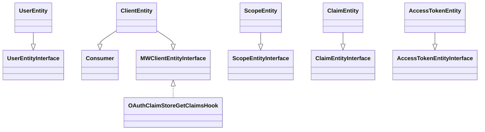

# <SwmToken path="src/Entity/UserEntity.php" pos="3:6:6" line-data="namespace MediaWiki\Extension\OAuth\Entity;">`OAuth`</SwmToken> Entities Overview

<SwmToken path="src/Entity/UserEntity.php" pos="3:6:6" line-data="namespace MediaWiki\Extension\OAuth\Entity;">`OAuth`</SwmToken> entities are classes that represent various components involved in the <SwmToken path="src/Entity/UserEntity.php" pos="3:6:6" line-data="namespace MediaWiki\Extension\OAuth\Entity;">`OAuth`</SwmToken> process. These entities include users, clients, scopes, claims, and access tokens. Each entity class implements specific interfaces to ensure consistent behavior and interaction within the <SwmToken path="src/Entity/UserEntity.php" pos="3:6:6" line-data="namespace MediaWiki\Extension\OAuth\Entity;">`OAuth`</SwmToken> framework.

# <SwmToken path="src/Entity/UserEntity.php" pos="10:2:2" line-data="class UserEntity implements UserEntityInterface {">`UserEntity`</SwmToken> Class

The <SwmToken path="src/Entity/UserEntity.php" pos="10:2:2" line-data="class UserEntity implements UserEntityInterface {">`UserEntity`</SwmToken> class represents a user and implements the <SwmToken path="src/Entity/UserEntity.php" pos="5:10:10" line-data="use League\OAuth2\Server\Entities\UserEntityInterface;">`UserEntityInterface`</SwmToken>. It provides methods to create a user entity from a <SwmToken path="src/Entity/UserEntity.php" pos="3:2:2" line-data="namespace MediaWiki\Extension\OAuth\Entity;">`MediaWiki`</SwmToken> user and retrieve the user's identifier.

# Constructor Method

The <SwmToken path="src/Entity/UserEntity.php" pos="36:5:5" line-data="	public function __construct( $identifier ) {">`__construct`</SwmToken> method initializes the <SwmToken path="src/Entity/UserEntity.php" pos="10:2:2" line-data="class UserEntity implements UserEntityInterface {">`UserEntity`</SwmToken> with an identifier, setting up the necessary data for the entity.

<SwmSnippet path="/src/Entity/UserEntity.php" line="33">

---

The constructor method for <SwmToken path="src/Entity/UserEntity.php" pos="10:2:2" line-data="class UserEntity implements UserEntityInterface {">`UserEntity`</SwmToken> takes an identifier as a parameter and assigns it to the class property.

```hack
	/**
	 * @param int $identifier
	 */
	public function __construct( $identifier ) {
		$this->identifier = $identifier;
	}
```

---

</SwmSnippet>

# ClientEntity Class

The `ClientEntity` class extends the `Consumer` class and implements the `MWClientEntityInterface`. It represents an <SwmToken path="src/Entity/UserEntity.php" pos="3:6:6" line-data="namespace MediaWiki\Extension\OAuth\Entity;">`OAuth`</SwmToken> client and includes methods to get the redirect URI, check if the client is confidential, and validate the client.

# ScopeEntity Class

The `ScopeEntity` class implements the `ScopeEntityInterface` and represents an <SwmToken path="src/Entity/UserEntity.php" pos="3:6:6" line-data="namespace MediaWiki\Extension\OAuth\Entity;">`OAuth`</SwmToken> scope. It includes methods to create a scope entity and serialize it to JSON.

# ClaimEntity Class

The `ClaimEntity` class implements the `ClaimEntityInterface` and represents a claim in the <SwmToken path="src/Entity/UserEntity.php" pos="3:6:6" line-data="namespace MediaWiki\Extension\OAuth\Entity;">`OAuth`</SwmToken> process. It includes methods to construct a claim entity with a name and value.

# AccessTokenEntity Class

The `AccessTokenEntity` class implements the `AccessTokenEntityInterface` and represents an access token. It includes methods to set the client, issuer, and user identifier, and to confirm the client's usability.

# MWClientEntityInterface

The `MWClientEntityInterface` is an empty interface used by `ClientEntity` and `OAuthClaimStoreGetClaimsHook` to avoid leaking `ClientEntityInterface` to other extensions.

&nbsp;

*This is an auto-generated document by Swimm AI 🌊 and has not yet been verified by a human*

<SwmMeta version="3.0.0" repo-id="Z2l0aHViJTNBJTNBbWVkaWF3aWtpLWV4dGVuc2lvbnMtT0F1dGglM0ElM0FTd2ltbS1EZW1v" repo-name="mediawiki-extensions-OAuth"><sup>Powered by [Swimm](/)</sup></SwmMeta>
