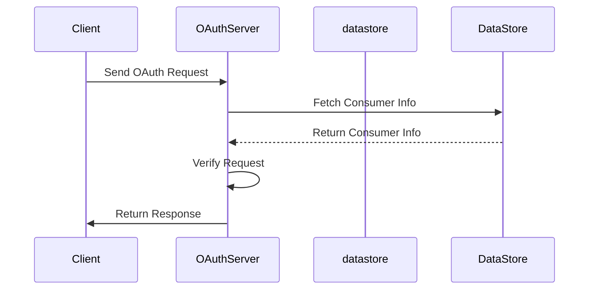

# Overview of <SwmToken path="tests/phpunit/Lib/OAuthServerTest.php" pos="26:6:6" line-data="namespace MediaWiki\Extension\OAuth\Tests\Lib;">`OAuth`</SwmToken> Server in Lib

The <SwmToken path="tests/phpunit/Lib/OAuthServerTest.php" pos="26:6:6" line-data="namespace MediaWiki\Extension\OAuth\Tests\Lib;">`OAuth`</SwmToken> Server is responsible for handling <SwmToken path="tests/phpunit/Lib/OAuthServerTest.php" pos="26:6:6" line-data="namespace MediaWiki\Extension\OAuth\Tests\Lib;">`OAuth`</SwmToken> requests and verifying their validity. It manages the lifecycle of <SwmToken path="tests/phpunit/Lib/OAuthServerTest.php" pos="26:6:6" line-data="namespace MediaWiki\Extension\OAuth\Tests\Lib;">`OAuth`</SwmToken> tokens, including request tokens and access tokens. The server verifies the signatures of incoming requests to ensure they are from trusted consumers. It supports multiple signature methods, such as <SwmToken path="tests/phpunit/Lib/OAuthServerTest.php" pos="189:17:19" line-data="		// We use a server that only supports HMAC-SHA1, but requests with PLAINTEXT signature">`HMAC-SHA1`</SwmToken> and PLAINTEXT. The server also checks for required parameters and validates timestamps to prevent replay attacks. It interacts with a data store to fetch and store <SwmToken path="tests/phpunit/Lib/OAuthServerTest.php" pos="26:6:6" line-data="namespace MediaWiki\Extension\OAuth\Tests\Lib;">`OAuth`</SwmToken> tokens and consumer information.

<SwmSnippet path="/tests/phpunit/Lib/OAuthServerTest.php" line="51">

---

# Initialization

The <SwmToken path="tests/phpunit/Lib/OAuthServerTest.php" pos="26:6:6" line-data="namespace MediaWiki\Extension\OAuth\Tests\Lib;">`OAuth`</SwmToken> Server is initialized with a data store and signature methods are added to it. This setup is essential for the server to handle and verify <SwmToken path="tests/phpunit/Lib/OAuthServerTest.php" pos="26:6:6" line-data="namespace MediaWiki\Extension\OAuth\Tests\Lib;">`OAuth`</SwmToken> requests.

```hack
	protected function setUp() : void {
		$this->consumer       = new OAuthConsumer('key', 'secret');
		$this->request_token  = new OAuthToken('requestkey', 'requestsecret');
		$this->access_token   = new OAuthToken('accesskey', 'accesssecret');

		$this->hmac_sha1      = new OAuthSignatureMethodHmacSha1();
		$this->plaintext      = new OAuthSignatureMethodPlaintext();

		$this->server         = new OAuthServer( new MockOAuthDataStore() );
		$this->server->add_signature_method( $this->hmac_sha1 );
		$this->server->add_signature_method( $this->plaintext );
	}
```

---

</SwmSnippet>

<SwmSnippet path="/tests/phpunit/Lib/OAuthServerTest.php" line="64">

---

# Verifying Requests

The <SwmToken path="tests/phpunit/Lib/OAuthServerTest.php" pos="26:6:6" line-data="namespace MediaWiki\Extension\OAuth\Tests\Lib;">`OAuth`</SwmToken> Server verifies incoming requests by checking their signatures and ensuring they are from trusted consumers. This step is crucial to maintain the security of the <SwmToken path="tests/phpunit/Lib/OAuthServerTest.php" pos="26:6:6" line-data="namespace MediaWiki\Extension\OAuth\Tests\Lib;">`OAuth`</SwmToken> flow.

```hack
	public function testAcceptValidRequest() {
		$request = OAuthRequest::from_consumer_and_token( $this->consumer, $this->access_token, 'POST', 'http://example.com');
		$request->sign_request( $this->plaintext, $this->consumer, $this->access_token );
		[$consumer, $token] = $this->server->verify_request( $request );
		$this->assertEquals( $this->consumer, $consumer );
		$this->assertEquals( $this->access_token, $token );

		$request->sign_request( $this->hmac_sha1, $this->consumer, $this->access_token );
		[$consumer, $token] = $this->server->verify_request( $request );
		$this->assertEquals( $this->consumer, $consumer );
		$this->assertEquals( $this->access_token, $token );
	}
```

---

</SwmSnippet>

<SwmSnippet path="/tests/phpunit/Lib/OAuthServerTest.php" line="212">

---

# Handling Tokens

The <SwmToken path="tests/phpunit/Lib/OAuthServerTest.php" pos="26:6:6" line-data="namespace MediaWiki\Extension\OAuth\Tests\Lib;">`OAuth`</SwmToken> Server handles the creation of request tokens and access tokens. This functionality is key to managing the <SwmToken path="tests/phpunit/Lib/OAuthServerTest.php" pos="26:6:6" line-data="namespace MediaWiki\Extension\OAuth\Tests\Lib;">`OAuth`</SwmToken> token lifecycle.

```hack
	public function testCreateRequestToken() {
		// We request a new Request Token

		$request = OAuthRequest::from_consumer_and_token( $this->consumer, NULL, 'POST', 'http://example.com');
		$request->sign_request( $this->plaintext, $this->consumer, NULL );

		$token = $this->server->fetch_request_token($request);
		$this->assertEquals($this->request_token, $token);
	}
```

---

</SwmSnippet>

# Main Functions

There are several main functions in the <SwmToken path="tests/phpunit/Lib/OAuthServerTest.php" pos="26:6:6" line-data="namespace MediaWiki\Extension\OAuth\Tests\Lib;">`OAuth`</SwmToken> Server. Some of them are <SwmToken path="tests/phpunit/Lib/OAuthServerTest.php" pos="67:17:17" line-data="		[$consumer, $token] = $this-&gt;server-&gt;verify_request( $request );">`verify_request`</SwmToken>, <SwmToken path="tests/phpunit/Lib/OAuthServerTest.php" pos="218:11:11" line-data="		$token = $this-&gt;server-&gt;fetch_request_token($request);">`fetch_request_token`</SwmToken>, and <SwmToken path="tests/phpunit/Lib/OAuthServerTest.php" pos="238:11:11" line-data="		$token = $this-&gt;server-&gt;fetch_access_token($request);">`fetch_access_token`</SwmToken>. We will dive a little into these functions.

<SwmSnippet path="/tests/phpunit/Lib/OAuthServerTest.php" line="64">

---

## <SwmToken path="tests/phpunit/Lib/OAuthServerTest.php" pos="67:17:17" line-data="		[$consumer, $token] = $this-&gt;server-&gt;verify_request( $request );">`verify_request`</SwmToken>

The <SwmToken path="tests/phpunit/Lib/OAuthServerTest.php" pos="67:17:17" line-data="		[$consumer, $token] = $this-&gt;server-&gt;verify_request( $request );">`verify_request`</SwmToken> function is used to verify the validity of an <SwmToken path="tests/phpunit/Lib/OAuthServerTest.php" pos="26:6:6" line-data="namespace MediaWiki\Extension\OAuth\Tests\Lib;">`OAuth`</SwmToken> request. It checks the request's signature, required parameters, and timestamps to ensure the request is legitimate.

```hack
	public function testAcceptValidRequest() {
		$request = OAuthRequest::from_consumer_and_token( $this->consumer, $this->access_token, 'POST', 'http://example.com');
		$request->sign_request( $this->plaintext, $this->consumer, $this->access_token );
		[$consumer, $token] = $this->server->verify_request( $request );
		$this->assertEquals( $this->consumer, $consumer );
		$this->assertEquals( $this->access_token, $token );

		$request->sign_request( $this->hmac_sha1, $this->consumer, $this->access_token );
		[$consumer, $token] = $this->server->verify_request( $request );
		$this->assertEquals( $this->consumer, $consumer );
		$this->assertEquals( $this->access_token, $token );
	}
```

---

</SwmSnippet>

<SwmSnippet path="/tests/phpunit/Lib/OAuthServerTest.php" line="212">

---

## <SwmToken path="tests/phpunit/Lib/OAuthServerTest.php" pos="218:11:11" line-data="		$token = $this-&gt;server-&gt;fetch_request_token($request);">`fetch_request_token`</SwmToken>

The <SwmToken path="tests/phpunit/Lib/OAuthServerTest.php" pos="218:11:11" line-data="		$token = $this-&gt;server-&gt;fetch_request_token($request);">`fetch_request_token`</SwmToken> function is responsible for generating a new request token. This token is used by the consumer to obtain authorization from the user.

```hack
	public function testCreateRequestToken() {
		// We request a new Request Token

		$request = OAuthRequest::from_consumer_and_token( $this->consumer, NULL, 'POST', 'http://example.com');
		$request->sign_request( $this->plaintext, $this->consumer, NULL );

		$token = $this->server->fetch_request_token($request);
		$this->assertEquals($this->request_token, $token);
	}
```

---

</SwmSnippet>

<SwmSnippet path="/tests/phpunit/Lib/OAuthServerTest.php" line="232">

---

## <SwmToken path="tests/phpunit/Lib/OAuthServerTest.php" pos="238:11:11" line-data="		$token = $this-&gt;server-&gt;fetch_access_token($request);">`fetch_access_token`</SwmToken>

The <SwmToken path="tests/phpunit/Lib/OAuthServerTest.php" pos="238:11:11" line-data="		$token = $this-&gt;server-&gt;fetch_access_token($request);">`fetch_access_token`</SwmToken> function is used to generate a new access token. This token allows the consumer to access protected resources on behalf of the user.

```hack
	public function testCreateAccessToken() {
		// We request a new Access Token

		$request = OAuthRequest::from_consumer_and_token( $this->consumer, $this->request_token, 'POST', 'http://example.com');
		$request->sign_request( $this->plaintext, $this->consumer, $this->request_token );

		$token = $this->server->fetch_access_token($request);
		$this->assertEquals($this->access_token, $token);
	}
```

---

</SwmSnippet>

&nbsp;

*This is an auto-generated document by Swimm AI 🌊 and has not yet been verified by a human*

<SwmMeta version="3.0.0" repo-id="Z2l0aHViJTNBJTNBbWVkaWF3aWtpLWV4dGVuc2lvbnMtT0F1dGglM0ElM0FTd2ltbS1EZW1v" repo-name="mediawiki-extensions-OAuth"><sup>Powered by [Swimm](/)</sup></SwmMeta>
