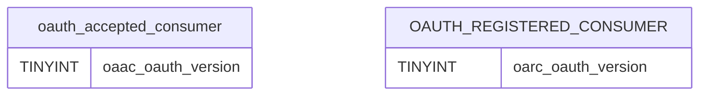

# What is OAuth Version

OAuth Version refers to the version of the OAuth protocol being used by the consumers in the system. It is stored as a TINYINT in the database tables <SwmToken path="schema/oauth_version_accepted.sql" pos="1:7:7" line-data="ALTER TABLE /*_*/oauth_accepted_consumer">`oauth_accepted_consumer`</SwmToken> and `oauth_registered_consumer`. The default value for the OAuth Version is set to 1.

# OAuth Version in Database

The OAuth Version is added to the <SwmToken path="schema/oauth_version_accepted.sql" pos="1:7:7" line-data="ALTER TABLE /*_*/oauth_accepted_consumer">`oauth_accepted_consumer`</SwmToken> table as a TINYINT with a default value of 1.

<SwmSnippet path="/schema/oauth_version_accepted.sql" line="1">

---

The <SwmPath>[schema/oauth_version_accepted.sql](schema/oauth_version_accepted.sql)</SwmPath> file adds the <SwmToken path="schema/oauth_version_accepted.sql" pos="2:3:3" line-data="    ADD oaac_oauth_version TINYINT NOT NULL DEFAULT 1;">`oaac_oauth_version`</SwmToken> column to the <SwmToken path="schema/oauth_version_accepted.sql" pos="1:7:7" line-data="ALTER TABLE /*_*/oauth_accepted_consumer">`oauth_accepted_consumer`</SwmToken> table. This column stores the OAuth version used by accepted consumers, with a default value of 1.

```plsql
ALTER TABLE /*_*/oauth_accepted_consumer
    ADD oaac_oauth_version TINYINT NOT NULL DEFAULT 1;
```

---

</SwmSnippet>

# OAuth Version in Registered Consumers

The OAuth Version is added to the `oauth_registered_consumer` table as a TINYINT with a default value of 1.

&nbsp;

*This is an auto-generated document by Swimm AI 🌊 and has not yet been verified by a human*

<SwmMeta version="3.0.0" repo-id="Z2l0aHViJTNBJTNBbWVkaWF3aWtpLWV4dGVuc2lvbnMtT0F1dGglM0ElM0FTd2ltbS1EZW1v" repo-name="mediawiki-extensions-OAuth"><sup>Powered by [Swimm](/)</sup></SwmMeta>
