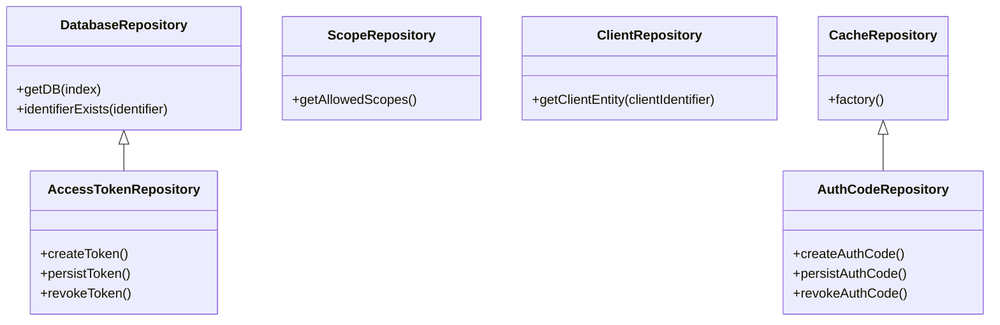

# Understanding Repositories

Repositories are used to manage data access and storage. They provide an abstraction layer between the application and the data source, ensuring that data operations are performed consistently and efficiently.

<SwmSnippet path="/src/Repository/DatabaseRepository.php" line="8">

---

# <SwmToken path="src/Repository/DatabaseRepository.php" pos="8:4:4" line-data="abstract class DatabaseRepository {">`DatabaseRepository`</SwmToken>

The <SwmToken path="src/Repository/DatabaseRepository.php" pos="8:4:4" line-data="abstract class DatabaseRepository {">`DatabaseRepository`</SwmToken> class is an abstract class that provides methods for interacting with the database, such as checking if an identifier exists and retrieving the database connection.

```hack
abstract class DatabaseRepository {

	/**
	 * @param int $index
	 * @return IDatabase
	 */
	public function getDB( $index = DB_REPLICA ) {
		return Utils::getCentralDB( $index );
	}

	/**
	 * Is given identifier stored in the DB
	 *
	 * @param string $identifier
	 * @return bool
	 */
	public function identifierExists( $identifier ) {
		return $this->getDB()->newSelectQueryBuilder()
			->select( $this->getIdentifierField() )
			->from( $this->getTableName() )
			->where( [ $this->getIdentifierField() => $identifier ] )
```

---

</SwmSnippet>

<SwmSnippet path="/src/Repository/ScopeRepository.php" line="16">

---

# <SwmToken path="src/Repository/ScopeRepository.php" pos="16:2:2" line-data="class ScopeRepository implements ScopeRepositoryInterface {">`ScopeRepository`</SwmToken>

The <SwmToken path="src/Repository/ScopeRepository.php" pos="16:2:2" line-data="class ScopeRepository implements ScopeRepositoryInterface {">`ScopeRepository`</SwmToken> class manages <SwmToken path="src/Repository/ClientRepository.php" pos="3:6:6" line-data="namespace MediaWiki\Extension\OAuth\Repository;">`OAuth`</SwmToken> scopes, including retrieving allowed scopes and validating requested scopes.

```hack
class ScopeRepository implements ScopeRepositoryInterface {
	/**
	 * @var string[]
	 */
	protected $allowedScopes = [
		'#default',
		'mwoauth-authonly',
		'mwoauth-authonlyprivate'
	];

	public function __construct() {
		$grantsInfo = MediaWikiServices::getInstance()->getGrantsInfo();
		$this->allowedScopes = array_merge( $this->allowedScopes, $grantsInfo->getValidGrants() );
	}

	/**
	 * @return string[]
	 */
	public function getAllowedScopes() {
		return $this->allowedScopes;
	}
```

---

</SwmSnippet>

<SwmSnippet path="/src/Repository/ClientRepository.php" line="1">

---

# <SwmToken path="src/Repository/ClientRepository.php" pos="10:2:2" line-data="class ClientRepository implements ClientRepositoryInterface {">`ClientRepository`</SwmToken>

The <SwmToken path="src/Repository/ClientRepository.php" pos="10:2:2" line-data="class ClientRepository implements ClientRepositoryInterface {">`ClientRepository`</SwmToken> class handles operations related to <SwmToken path="src/Repository/ClientRepository.php" pos="3:6:6" line-data="namespace MediaWiki\Extension\OAuth\Repository;">`OAuth`</SwmToken> clients, such as retrieving client entities and validating client secrets.

```hack
<?php

namespace MediaWiki\Extension\OAuth\Repository;

use InvalidArgumentException;
use League\OAuth2\Server\Repositories\ClientRepositoryInterface;
use MediaWiki\Extension\OAuth\Backend\Utils;
use MediaWiki\Extension\OAuth\Entity\ClientEntity;

class ClientRepository implements ClientRepositoryInterface {

	/**
	 * Get a client.
	 *
	 * @param string $clientIdentifier The client's identifier
	 *
	 * @return ClientEntity|bool
	 */
	public function getClientEntity( $clientIdentifier ) {
		$client = ClientEntity::newFromKey(
			Utils::getCentralDB( DB_REPLICA ),
```

---

</SwmSnippet>

<SwmSnippet path="/src/Repository/CacheRepository.php" line="8">

---

# <SwmToken path="src/Repository/CacheRepository.php" pos="8:4:4" line-data="abstract class CacheRepository {">`CacheRepository`</SwmToken>

The <SwmToken path="src/Repository/CacheRepository.php" pos="8:4:4" line-data="abstract class CacheRepository {">`CacheRepository`</SwmToken> class provides methods for interacting with a cache storage, including setting, getting, and deleting cache entries.

```hack
abstract class CacheRepository {

	/**
	 * @var BagOStuff
	 */
	protected $cache;

	/**
	 * @return static
	 */
	public static function factory() {
		$cache = Utils::getSessionCache();

		// @phan-suppress-next-line PhanTypeInstantiateAbstractStatic
		return new static( $cache );
	}

	/**
	 * @param BagOStuff $cache
	 */
	protected function __construct( BagOStuff $cache ) {
```

---

</SwmSnippet>

<SwmSnippet path="/src/Repository/AuthCodeRepository.php" line="15">

---

# <SwmToken path="src/Repository/AuthCodeRepository.php" pos="11:2:2" line-data="class AuthCodeRepository extends CacheRepository implements AuthCodeRepositoryInterface {">`AuthCodeRepository`</SwmToken>

The <SwmToken path="src/Repository/AuthCodeRepository.php" pos="11:2:2" line-data="class AuthCodeRepository extends CacheRepository implements AuthCodeRepositoryInterface {">`AuthCodeRepository`</SwmToken> class extends <SwmToken path="src/Repository/CacheRepository.php" pos="8:4:4" line-data="abstract class CacheRepository {">`CacheRepository`</SwmToken> and handles authorization codes, including creating new auth codes, persisting them to storage, and revoking them.

```hack
	 *
	 * @return AuthCodeEntityInterface
```

---

</SwmSnippet>

&nbsp;

*This is an auto-generated document by Swimm AI 🌊 and has not yet been verified by a human*

<SwmMeta version="3.0.0" repo-id="Z2l0aHViJTNBJTNBbWVkaWF3aWtpLWV4dGVuc2lvbnMtT0F1dGglM0ElM0FTd2ltbS1EZW1v" repo-name="mediawiki-extensions-OAuth"><sup>Powered by [Swimm](/)</sup></SwmMeta>
