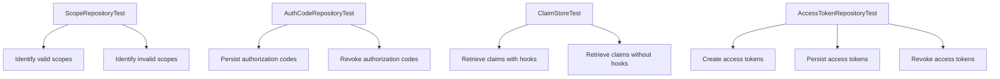

````mermaid

````

# Overview of Repository Tests

The Repository in the tests directory is used to test the functionality of various repository classes within the <SwmToken path="tests/phpunit/Repository/ScopeRepositoryTest.php" pos="3:6:6" line-data="namespace MediaWiki\Extension\OAuth\Tests\Repository;">`OAuth`</SwmToken> extension. These tests ensure that the repository classes correctly handle data related to <SwmToken path="tests/phpunit/Repository/ScopeRepositoryTest.php" pos="3:6:6" line-data="namespace MediaWiki\Extension\OAuth\Tests\Repository;">`OAuth`</SwmToken> entities such as scopes, authorization codes, claims, and access tokens.

## <SwmToken path="tests/phpunit/Repository/ScopeRepositoryTest.php" pos="13:2:2" line-data="class ScopeRepositoryTest extends MediaWikiIntegrationTestCase {">`ScopeRepositoryTest`</SwmToken>

The <SwmToken path="tests/phpunit/Repository/ScopeRepositoryTest.php" pos="13:2:2" line-data="class ScopeRepositoryTest extends MediaWikiIntegrationTestCase {">`ScopeRepositoryTest`</SwmToken> verifies that the <SwmToken path="tests/phpunit/Repository/ScopeRepositoryTest.php" pos="6:10:10" line-data="use MediaWiki\Extension\OAuth\Repository\ScopeRepository;">`ScopeRepository`</SwmToken> class can correctly identify valid and invalid scopes. This ensures that the scopes are properly managed and validated within the <SwmToken path="tests/phpunit/Repository/ScopeRepositoryTest.php" pos="3:6:6" line-data="namespace MediaWiki\Extension\OAuth\Tests\Repository;">`OAuth`</SwmToken> extension.

<SwmSnippet path="/tests/phpunit/Repository/ScopeRepositoryTest.php" line="3">

---

The <SwmToken path="tests/phpunit/Repository/ScopeRepositoryTest.php" pos="13:2:2" line-data="class ScopeRepositoryTest extends MediaWikiIntegrationTestCase {">`ScopeRepositoryTest`</SwmToken> file includes the necessary imports and annotations to test the <SwmToken path="tests/phpunit/Repository/ScopeRepositoryTest.php" pos="6:10:10" line-data="use MediaWiki\Extension\OAuth\Repository\ScopeRepository;">`ScopeRepository`</SwmToken> class.

```hack
namespace MediaWiki\Extension\OAuth\Tests\Repository;

use MediaWiki\Extension\OAuth\Entity\ScopeEntity;
use MediaWiki\Extension\OAuth\Repository\ScopeRepository;
use MediaWikiIntegrationTestCase;

/**
 * @covers \MediaWiki\Extension\OAuth\Repository\ScopeRepository
```

---

</SwmSnippet>

## AuthCodeRepositoryTest

The `AuthCodeRepositoryTest` checks the persistence and revocation of authorization codes using the `AuthCodeRepository` class. This ensures that authorization codes are correctly stored and invalidated when necessary.

## ClaimStoreTest

The `ClaimStoreTest` ensures that the `ClaimStore` class can correctly retrieve claims, both with and without hooks. This is important for verifying that claims are accurately fetched and processed.

## AccessTokenRepositoryTest

The `AccessTokenRepositoryTest` validates the creation, persistence, and revocation of access tokens using the `AccessTokenRepository` class. This ensures that access tokens are properly managed within the <SwmToken path="tests/phpunit/Repository/ScopeRepositoryTest.php" pos="3:6:6" line-data="namespace MediaWiki\Extension\OAuth\Tests\Repository;">`OAuth`</SwmToken> extension.

&nbsp;

*This is an auto-generated document by Swimm AI 🌊 and has not yet been verified by a human*

<SwmMeta version="3.0.0" repo-id="Z2l0aHViJTNBJTNBbWVkaWF3aWtpLWV4dGVuc2lvbnMtT0F1dGglM0ElM0FTd2ltbS1EZW1v" repo-name="mediawiki-extensions-OAuth"><sup>Powered by [Swimm](/)</sup></SwmMeta>
