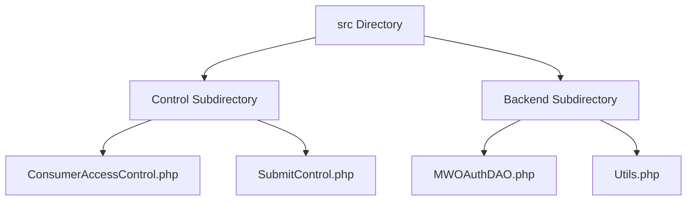

# Overview of src Directory

The `src` directory contains the core logic and functionality for managing consumers in the <SwmToken path="src/Control/ConsumerAccessControl.php" pos="25:26:26" line-data="	 * Consumer key (32-character hexadecimal string that&#39;s used in the OAuth protocol">`OAuth`</SwmToken> extension. It is divided into two main subdirectories: <SwmToken path="src/Control/ConsumerAccessControl.php" pos="3:8:8" line-data="namespace MediaWiki\Extension\OAuth\Control;">`Control`</SwmToken> and <SwmToken path="src/Control/ConsumerAccessControl.php" pos="5:8:8" line-data="use MediaWiki\Extension\OAuth\Backend\Consumer;">`Backend`</SwmToken>.

## Control Subdirectory

The <SwmToken path="src/Control/ConsumerAccessControl.php" pos="3:8:8" line-data="namespace MediaWiki\Extension\OAuth\Control;">`Control`</SwmToken> subdirectory includes classes that handle access control and submission logic for <SwmToken path="src/Control/ConsumerAccessControl.php" pos="25:26:26" line-data="	 * Consumer key (32-character hexadecimal string that&#39;s used in the OAuth protocol">`OAuth`</SwmToken> consumers. Key files in this subdirectory include <SwmPath>[src/Control/ConsumerAccessControl.php](src/Control/ConsumerAccessControl.php)</SwmPath> and <SwmPath>[src/Control/SubmitControl.php](src/Control/SubmitControl.php)</SwmPath>.

<SwmSnippet path="/src/Control/ConsumerAccessControl.php" line="12">

---

The <SwmPath>[src/Control/ConsumerAccessControl.php](src/Control/ConsumerAccessControl.php)</SwmPath> file defines various methods to access consumer-related data fields, ensuring proper permissions are checked before returning data. For example, the <SwmToken path="src/Control/ConsumerAccessControl.php" pos="20:5:5" line-data="	public function getId() {">`getId`</SwmToken> method returns the internal ID (DB primary key) and the <SwmToken path="src/Control/ConsumerAccessControl.php" pos="30:5:5" line-data="	public function getConsumerKey() {">`getConsumerKey`</SwmToken> method returns the consumer key, both of which check for proper permissions before returning data.

```hack
class ConsumerAccessControl extends DAOAccessControl {
	// accessor fields copied from MWOAuthConsumer, except they can return a Message on access error

	/**
	 * Internal ID (DB primary key).
	 * Returns a Message when the user does not have permission to see this field.
	 * @return int|Message
	 */
	public function getId() {
		return $this->get( 'id' );
	}

	/**
	 * Consumer key (32-character hexadecimal string that's used in the OAuth protocol
	 * and in URLs). This is used as the consumer ID for most external purposes.
	 * Returns a Message when the user does not have permission to see this field.
	 * @return string|Message
	 */
	public function getConsumerKey() {
		return $this->get( 'consumerKey' );
	}
```

---

</SwmSnippet>

## Backend Subdirectory

The <SwmToken path="src/Control/ConsumerAccessControl.php" pos="5:8:8" line-data="use MediaWiki\Extension\OAuth\Backend\Consumer;">`Backend`</SwmToken> subdirectory includes utility and data access classes that provide backend support and data operations for the <SwmToken path="src/Control/ConsumerAccessControl.php" pos="25:26:26" line-data="	 * Consumer key (32-character hexadecimal string that&#39;s used in the OAuth protocol">`OAuth`</SwmToken> extension. Key files in this subdirectory include <SwmPath>[src/Backend/MWOAuthDAO.php](src/Backend/MWOAuthDAO.php)</SwmPath> and <SwmPath>[src/Backend/Utils.php](src/Backend/Utils.php)</SwmPath>.

&nbsp;

*This is an auto-generated document by Swimm AI 🌊 and has not yet been verified by a human*

<SwmMeta version="3.0.0" repo-id="Z2l0aHViJTNBJTNBbWVkaWF3aWtpLWV4dGVuc2lvbnMtT0F1dGglM0ElM0FTd2ltbS1EZW1v" repo-name="mediawiki-extensions-OAuth"><sup>Powered by [Swimm](/)</sup></SwmMeta>
