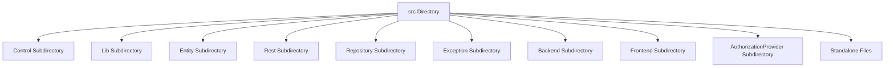

# Overview of the src Directory

The `src` directory contains the main source code for the project, organized into several subdirectories based on functionality. Each subdirectory serves a specific purpose and contains files relevant to that purpose.

# Control Subdirectory

The <SwmToken path="src/Control/Workflow.php" pos="3:8:8" line-data="namespace MediaWiki\Extension\OAuth\Control;">`Control`</SwmToken> subdirectory includes files that manage various control mechanisms, such as <SwmPath>[src/Control/Workflow.php](src/Control/Workflow.php)</SwmPath> and <SwmPath>[src/Control/SubmitControl.php](src/Control/SubmitControl.php)</SwmPath>.

<SwmSnippet path="/src/Control/Workflow.php" line="1">

---

The <SwmPath>[src/Control/Workflow.php](src/Control/Workflow.php)</SwmPath> file is a service class for <SwmToken path="src/Control/Workflow.php" pos="3:6:6" line-data="namespace MediaWiki\Extension\OAuth\Control;">`OAuth`</SwmToken> <SwmToken path="src/Control/Workflow.php" pos="8:10:12" line-data="/** Service class for OAuth workflow-related business logic. */">`workflow-related`</SwmToken> business logic.

```hack
<?php

namespace MediaWiki\Extension\OAuth\Control;

use MediaWiki\Config\ServiceOptions;
use MediaWiki\Extension\OAuth\Backend\Consumer;

/** Service class for OAuth workflow-related business logic. */
class Workflow {
```

---

</SwmSnippet>

<SwmSnippet path="/src/Lib/OAuthToken.php" line="1">

---

The <SwmPath>[src/Lib/OAuthToken.php](src/Lib/OAuthToken.php)</SwmPath> file contains the MIT License and provides functionalities related to <SwmToken path="src/Control/Workflow.php" pos="3:6:6" line-data="namespace MediaWiki\Extension\OAuth\Control;">`OAuth`</SwmToken> tokens.

```hack
<?php
// vim: foldmethod=marker
/**
 * The MIT License
 *
 * Copyright (c) 2007 Andy Smith
 *
 * Permission is hereby granted, free of charge, to any person obtaining a copy
 * of this software and associated documentation files ( the "Software" ), to deal
 * in the Software without restriction, including without limitation the rights
```

---

</SwmSnippet>

# Entity Subdirectory

The <SwmToken path="src/Entity/ClientEntity.php" pos="3:8:8" line-data="namespace MediaWiki\Extension\OAuth\Entity;">`Entity`</SwmToken> subdirectory defines various entities used in the project, such as <SwmPath>[src/Entity/ClientEntity.php](src/Entity/ClientEntity.php)</SwmPath>, <SwmPath>[src/Entity/UserEntity.php](src/Entity/UserEntity.php)</SwmPath>, and <SwmPath>[src/Entity/AccessTokenEntity.php](src/Entity/AccessTokenEntity.php)</SwmPath>.

<SwmSnippet path="/src/Entity/ClientEntity.php" line="1">

---

The <SwmPath>[src/Entity/ClientEntity.php](src/Entity/ClientEntity.php)</SwmPath> file defines the client entity and includes necessary imports and class definitions.

```hack
<?php

namespace MediaWiki\Extension\OAuth\Entity;

use DateInterval;
use DateTimeImmutable;
use Exception;
use League\OAuth2\Server\Entities\AccessTokenEntityInterface;
use League\OAuth2\Server\Entities\ScopeEntityInterface;
use League\OAuth2\Server\Exception\OAuthServerException;
```

---

</SwmSnippet>

# Rest Subdirectory

The <SwmToken path="src/Rest/Handler/ListClients.php" pos="3:8:8" line-data="namespace MediaWiki\Extension\OAuth\Rest\Handler;">`Rest`</SwmToken> subdirectory contains handlers for RESTful API interactions.

# Repository Subdirectory

The <SwmToken path="src/Repository/AccessTokenRepository.php" pos="3:8:8" line-data="namespace MediaWiki\Extension\OAuth\Repository;">`Repository`</SwmToken> subdirectory includes repository classes that handle data storage and retrieval, such as <SwmPath>[src/Repository/AccessTokenRepository.php](src/Repository/AccessTokenRepository.php)</SwmPath> and <SwmPath>[src/Repository/ClientRepository.php](src/Repository/ClientRepository.php)</SwmPath>.

<SwmSnippet path="/src/Repository/AccessTokenRepository.php" line="1">

---

The <SwmPath>[src/Repository/AccessTokenRepository.php](src/Repository/AccessTokenRepository.php)</SwmPath> file defines the repository for access tokens and includes necessary imports and class definitions.

```hack
<?php

namespace MediaWiki\Extension\OAuth\Repository;

use League\OAuth2\Server\Entities\AccessTokenEntityInterface;
use League\OAuth2\Server\Entities\ClientEntityInterface;
use League\OAuth2\Server\Entities\ScopeEntityInterface;
use League\OAuth2\Server\Exception\OAuthServerException;
use League\OAuth2\Server\Exception\UniqueTokenIdentifierConstraintViolationException;
use League\OAuth2\Server\Repositories\AccessTokenRepositoryInterface;
```

---

</SwmSnippet>

# Exception Subdirectory

The <SwmToken path="src/Entity/ClientEntity.php" pos="7:2:2" line-data="use Exception;">`Exception`</SwmToken> subdirectory contains custom exception classes, like <SwmPath>[src/Exception/ClientApprovalDenyException.php](src/Exception/ClientApprovalDenyException.php)</SwmPath>.

<SwmSnippet path="/src/Exception/ClientApprovalDenyException.php" line="1">

---

The <SwmPath>[src/Exception/ClientApprovalDenyException.php](src/Exception/ClientApprovalDenyException.php)</SwmPath> file defines a custom exception for client approval denial.

```hack
<?php

namespace MediaWiki\Extension\OAuth\Exception;

use League\OAuth2\Server\Exception\OAuthServerException;

class ClientApprovalDenyException extends OAuthServerException {

	public function __construct( $redirectUri ) {
		parent::__construct(
```

---

</SwmSnippet>

# Backend Subdirectory

The <SwmToken path="src/Control/Workflow.php" pos="6:8:8" line-data="use MediaWiki\Extension\OAuth\Backend\Consumer;">`Backend`</SwmToken> subdirectory includes backend logic and utilities, such as <SwmPath>[src/Backend/MWOAuthDAO.php](src/Backend/MWOAuthDAO.php)</SwmPath>, <SwmPath>[src/Backend/MWOAuthServer.php](src/Backend/MWOAuthServer.php)</SwmPath>, and <SwmPath>[src/Backend/Utils.php](src/Backend/Utils.php)</SwmPath>.

<SwmSnippet path="/src/Backend/MWOAuthDAO.php" line="1">

---

The <SwmPath>[src/Backend/MWOAuthDAO.php](src/Backend/MWOAuthDAO.php)</SwmPath> file includes backend logic for <SwmToken path="src/Backend/MWOAuthDAO.php" pos="3:6:6" line-data="namespace MediaWiki\Extension\OAuth\Backend;">`OAuth`</SwmToken> data access objects.

```hack
<?php

namespace MediaWiki\Extension\OAuth\Backend;

use Exception;
use IDBAccessObject;
use LogicException;
use MediaWiki\Context\IContextSource;
use MediaWiki\Logger\LoggerFactory;
use MediaWiki\Message\Message;
```

---

</SwmSnippet>

# Frontend Subdirectory

The `Frontend` subdirectory contains frontend-related code, including special pages, pagers, and UI utilities.

# <SwmToken path="src/Rest/Handler/AccessToken.php" pos="7:8:8" line-data="use MediaWiki\Extension\OAuth\AuthorizationProvider\Grant\AuthorizationCodeAccessTokens;">`AuthorizationProvider`</SwmToken> Subdirectory

The <SwmToken path="src/Rest/Handler/AccessToken.php" pos="7:8:8" line-data="use MediaWiki\Extension\OAuth\AuthorizationProvider\Grant\AuthorizationCodeAccessTokens;">`AuthorizationProvider`</SwmToken> subdirectory includes classes related to authorization, such as <SwmPath>[src/AuthorizationProvider/Grant/ClientCredentials.php](src/AuthorizationProvider/Grant/ClientCredentials.php)</SwmPath> and <SwmPath>[src/AuthorizationProvider/Grant/AuthorizationCodeAccessTokens.php](src/AuthorizationProvider/Grant/AuthorizationCodeAccessTokens.php)</SwmPath>.

# Standalone Files

The `src` directory also contains several standalone files like <SwmPath>[src/Response.php](src/Response.php)</SwmPath>, <SwmPath>[src/Setup.php](src/Setup.php)</SwmPath>, and <SwmPath>[src/OAuthServices.php](src/OAuthServices.php)</SwmPath>, which provide various functionalities across the project.

<SwmSnippet path="/src/Setup.php" line="1">

---

The <SwmPath>[src/Setup.php](src/Setup.php)</SwmPath> file contains hooked functions for an <SwmToken path="src/Setup.php" pos="3:6:6" line-data="namespace MediaWiki\Extension\OAuth;">`OAuth`</SwmToken> environment and prevents redirects to canonical titles.

```hack
<?php

namespace MediaWiki\Extension\OAuth;

use MediaWiki\Extension\OAuth\Backend\Utils;
use MediaWiki\Hook\TestCanonicalRedirectHook;
use MediaWiki\Output\OutputPage;
use MediaWiki\Request\WebRequest;
use MediaWiki\Title\Title;

/**
 * Class containing hooked functions for an OAuth environment
 */
class Setup implements TestCanonicalRedirectHook {
	/**
	 * Prevent redirects to canonical titles, since that's not what the OAuth
	 * request signed.
	 * @param WebRequest $request
	 * @param Title $title
	 * @param OutputPage $output
	 * @return bool
```

---

</SwmSnippet>

# <SwmToken path="src/Control/Workflow.php" pos="3:6:6" line-data="namespace MediaWiki\Extension\OAuth\Control;">`OAuth`</SwmToken> Endpoints

The `src` directory includes handlers for various <SwmToken path="src/Control/Workflow.php" pos="3:6:6" line-data="namespace MediaWiki\Extension\OAuth\Control;">`OAuth`</SwmToken> endpoints, such as <SwmToken path="src/Rest/Handler/ListClients.php" pos="19:7:9" line-data=" * Handles the oauth2/consumers endpoint, which returns">`oauth2/consumers`</SwmToken> and <SwmToken path="src/Rest/Handler/AccessToken.php" pos="16:7:9" line-data=" * Handles the oauth2/access_token endpoint, which can be used after the user has returned from">`oauth2/access_token`</SwmToken>.

<SwmSnippet path="/src/Rest/Handler/ListClients.php" line="18">

---

The <SwmToken path="src/Rest/Handler/ListClients.php" pos="22:2:2" line-data="class ListClients extends SimpleHandler {">`ListClients`</SwmToken> class handles the <SwmToken path="src/Rest/Handler/ListClients.php" pos="19:7:9" line-data=" * Handles the oauth2/consumers endpoint, which returns">`oauth2/consumers`</SwmToken> endpoint, which returns a list of registered consumers for the user.

```hack
/**
 * Handles the oauth2/consumers endpoint, which returns
 * a list of registered consumers for the user
 */
```

---

</SwmSnippet>

<SwmSnippet path="/src/Rest/Handler/AccessToken.php" line="15">

---

The <SwmToken path="src/Entity/ClientEntity.php" pos="171:2:2" line-data="		$accessToken = null;">`accessToken`</SwmToken> class handles the <SwmToken path="src/Rest/Handler/AccessToken.php" pos="16:7:9" line-data=" * Handles the oauth2/access_token endpoint, which can be used after the user has returned from">`oauth2/access_token`</SwmToken> endpoint, which trades the received authorization code for an access token.

```hack
/**
 * Handles the oauth2/access_token endpoint, which can be used after the user has returned from
 * the authorization dialog to trade the off the received authorization code for an access token.
```

---

</SwmSnippet>

&nbsp;

*This is an auto-generated document by Swimm AI 🌊 and has not yet been verified by a human*

<SwmMeta version="3.0.0" repo-id="Z2l0aHViJTNBJTNBbWVkaWF3aWtpLWV4dGVuc2lvbnMtT0F1dGglM0ElM0FTd2ltbS1EZW1v" repo-name="mediawiki-extensions-OAuth"><sup>Powered by [Swimm](/)</sup></SwmMeta>
