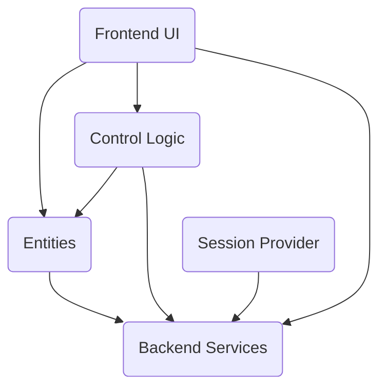

The mediawiki-extensions-OAuth repository is an extension for MediaWiki that provides OAuth functionality, allowing MediaWiki to act as an OAuth provider, supporting both the OAuth 1.0a and OAuth 2.0 protocol versions. It allows third party developers to securely develop applications ("consumers"), to which users can give a limited set of permissions ("grants"), so that the application can use the MediaWiki action API on the user's behalf.

## OAuth Access Flow

- <SwmLink doc-title="OAuth Access Overview">[OAuth Access Overview](/.swm/oauth-access-overview.e7methbw.sw.md)</SwmLink>
- <SwmLink doc-title="Access Token Initialization Flow">[Access Token Initialization Flow](/.swm/access-token-initialization-flow.z9j73h48.sw.md)</SwmLink>

## Main Components

### Rest API

- <SwmLink doc-title="Rest API Directory">[Rest API Directory](/.swm/rest-api-directory.nqwsx032.sw.md)</SwmLink>
- **Authorize**
  - <SwmLink doc-title="Authorization Process">[Authorization Process](/.swm/authorization-process.9o3bg6kk.sw.md)</SwmLink>

### Authorization Providers

- <SwmLink doc-title="Authorization Providers Overview">[Authorization Providers Overview](/.swm/authorization-providers-overview.tkjryjs1.sw.md)</SwmLink>
- **Classes**
  - <SwmLink doc-title="The AuthorizationCodeAccessTokens class">[The AuthorizationCodeAccessTokens class](/.swm/the-authorizationcodeaccesstokens-class.qv46n.sw.md)</SwmLink>

## Frontend

- **Ui hooks**
  - <SwmLink doc-title="Understanding UI Hooks">[Understanding UI Hooks](/.swm/understanding-ui-hooks.6l02vm1n.sw.md)</SwmLink>
- **Pagers**
  - <SwmLink doc-title="Usage of Pagers">[Usage of Pagers](/.swm/usage-of-pagers.9ae2nabu.sw.md)</SwmLink>
- **Special Pages**\
  Special pages are dynamically generated pages that perform specific functions. They are not regular wiki pages but are created by the software on demand
  - **Specialmwo auth**
    - <SwmLink doc-title="OAuth Special Page">[OAuth Special Page](/.swm/oauth-special-page.vil85yuk.sw.md)</SwmLink>
  - **Specialmwo auth list consumers**
    - <SwmLink doc-title="OAuth Consumer Management Overview">[OAuth Consumer Management Overview](/.swm/oauth-consumer-management-overview.dz3c4qi6.sw.md)</SwmLink>
    - <SwmLink doc-title="Executing the Main Flow">[Executing the Main Flow](/.swm/executing-the-main-flow.8teffz74.sw.md)</SwmLink>
  - **Specialmwo auth manage consumers**
    - <SwmLink doc-title="Managing OAuth Consumers">[Managing OAuth Consumers](/.swm/managing-oauth-consumers.7h2sg899.sw.md)</SwmLink>
    - <SwmLink doc-title="Managing OAuth Consumers">[Managing OAuth Consumers](/.swm/managing-oauth-consumers.z1h3ci5e.sw.md)</SwmLink>

### Backend Services

- **Mwo auth server**
  - <SwmLink doc-title="Getting Started with MWOAuthServer">[Getting Started with MWOAuthServer](/.swm/getting-started-with-mwoauthserver.eqe9tljl.sw.md)</SwmLink>
- **Consumer**
  - <SwmLink doc-title="Exploring OAuth Consumer">[Exploring OAuth Consumer](/.swm/exploring-oauth-consumer.q6znccic.sw.md)</SwmLink>
- **Flows**
  - <SwmLink doc-title="User Authorization (OAuth 1) Flow">[User Authorization (OAuth 1) Flow](/.swm/user-authorization-oauth-1-flow.y0vmfsb7.sw.md)</SwmLink>
  - <SwmLink doc-title="Fetching Access Token Flow">[Fetching Access Token Flow](/.swm/fetching-access-token-flow.8r4p0vp3.sw.md)</SwmLink>

&nbsp;

*This is an auto-generated document by Swimm 🌊 and has not yet been verified by a human*

<SwmMeta version="3.0.0" repo-id="Z2l0aHViJTNBJTNBbWVkaWF3aWtpLWV4dGVuc2lvbnMtT0F1dGglM0ElM0FTd2ltbS1EZW1v" repo-name="mediawiki-extensions-OAuth">Powered by [Swimm](https://app.swimm.io/)</SwmMeta>
