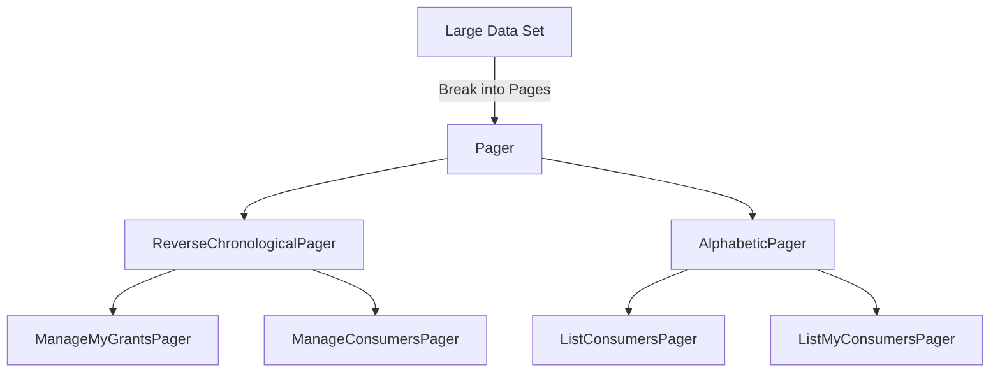

# Understanding Pagination Management

Pagers are used to manage the display of large sets of data by breaking them into smaller, more manageable pages. They are implemented in the <SwmToken path="src/Frontend/Pagers/ManageMyGrantsPager.php" pos="3:2:10" line-data="namespace MediaWiki\Extension\OAuth\Frontend\Pagers;">`MediaWiki\Extension\OAuth\Frontend\Pagers`</SwmToken> namespace and utilize classes like <SwmToken path="src/Frontend/Pagers/ManageMyGrantsPager.php" pos="34:6:6" line-data="class ManageMyGrantsPager extends ReverseChronologicalPager {">`ReverseChronologicalPager`</SwmToken> and <SwmToken path="src/Frontend/Pagers/ListConsumersPager.php" pos="8:6:6" line-data="use MediaWiki\Pager\AlphabeticPager;">`AlphabeticPager`</SwmToken> to handle different sorting and pagination requirements. For example, <SwmToken path="src/Frontend/Pagers/ManageMyGrantsPager.php" pos="34:2:2" line-data="class ManageMyGrantsPager extends ReverseChronologicalPager {">`ManageMyGrantsPager`</SwmToken> and `ManageConsumersPager` are specific implementations that handle the pagination of grants and consumers respectively. These pagers are essential for providing a user-friendly interface when dealing with extensive lists, ensuring that the data is presented in a structured and accessible manner.

<SwmSnippet path="/src/Frontend/Pagers/ManageMyGrantsPager.php" line="31">

---

## <SwmToken path="src/Frontend/Pagers/ManageMyGrantsPager.php" pos="34:2:2" line-data="class ManageMyGrantsPager extends ReverseChronologicalPager {">`ManageMyGrantsPager`</SwmToken>

<SwmToken path="src/Frontend/Pagers/ManageMyGrantsPager.php" pos="34:2:2" line-data="class ManageMyGrantsPager extends ReverseChronologicalPager {">`ManageMyGrantsPager`</SwmToken> is a specific implementation that handles the pagination of grants for a user. It sets conditions for the query and initializes the pager with a default limit of 20 entries. The class extends <SwmToken path="src/Frontend/Pagers/ManageMyGrantsPager.php" pos="34:6:6" line-data="class ManageMyGrantsPager extends ReverseChronologicalPager {">`ReverseChronologicalPager`</SwmToken> and sets conditions such as <SwmToken path="src/Frontend/Pagers/ManageMyGrantsPager.php" pos="48:11:15" line-data="		$this-&gt;mConds[] = &#39;oaac_consumer_id = oarc_id&#39;;">`oaac_consumer_id = oarc_id`</SwmToken> and <SwmToken path="src/Frontend/Pagers/ManageMyGrantsPager.php" pos="49:7:7" line-data="		$this-&gt;mConds[&#39;oaac_user_id&#39;] = $centralUserId;">`oaac_user_id`</SwmToken> to filter the grants for the specific user.

```hack
/**
 * Query to list out consumers that have an access token for this user
 */
class ManageMyGrantsPager extends ReverseChronologicalPager {
	/** @var SpecialMWOAuthManageMyGrants */
	public $mForm;
	/** @var array */
	public $mConds;

	/**
	 * @param SpecialMWOAuthManageMyGrants $form
	 * @param array $conds
	 * @param int $centralUserId
	 */
	public function __construct( $form, $conds, $centralUserId ) {
		$this->mForm = $form;
		$this->mConds = $conds;
		$this->mConds[] = 'oaac_consumer_id = oarc_id';
		$this->mConds['oaac_user_id'] = $centralUserId;

		$permissionManager = MediaWikiServices::getInstance()->getPermissionManager();
```

---

</SwmSnippet>

<SwmSnippet path="/src/Frontend/Pagers/ListConsumersPager.php" line="12">

---

## <SwmToken path="src/Frontend/Pagers/ListConsumersPager.php" pos="34:2:2" line-data="class ListConsumersPager extends AlphabeticPager {">`ListConsumersPager`</SwmToken>

<SwmToken path="src/Frontend/Pagers/ListConsumersPager.php" pos="34:2:2" line-data="class ListConsumersPager extends AlphabeticPager {">`ListConsumersPager`</SwmToken> is used to list out consumers with conditions based on name, user ID, and stage. It uses <SwmToken path="src/Frontend/Pagers/ListConsumersPager.php" pos="8:6:6" line-data="use MediaWiki\Pager\AlphabeticPager;">`AlphabeticPager`</SwmToken> for sorting and sets a default limit of 20 entries. This pager is useful for displaying a list of consumers in an alphabetical order.

```hack
/**
 * (c) Aaron Schulz 2013, GPL
 *
 * This program is free software; you can redistribute it and/or modify
 * it under the terms of the GNU General Public License as published by
 * the Free Software Foundation; either version 2 of the License, or
 * (at your option) any later version.
 *
 * This program is distributed in the hope that it will be useful,
 * but WITHOUT ANY WARRANTY; without even the implied warranty of
 * MERCHANTABILITY or FITNESS FOR A PARTICULAR PURPOSE. See the
 * GNU General Public License for more details.
 *
 * You should have received a copy of the GNU General Public License along
 * with this program; if not, write to the Free Software Foundation, Inc.,
 * 59 Temple Place - Suite 330, Boston, MA 02111-1307, USA.
 * http://www.gnu.org/copyleft/gpl.html
 */

/**
 * Query to list out consumers
```

---

</SwmSnippet>

&nbsp;

*This is an auto-generated document by Swimm AI 🌊 and has not yet been verified by a human*

<SwmMeta version="3.0.0" repo-id="Z2l0aHViJTNBJTNBbWVkaWF3aWtpLWV4dGVuc2lvbnMtT0F1dGglM0ElM0FTd2ltbS1EZW1v" repo-name="mediawiki-extensions-OAuth"><sup>Powered by [Swimm](/)</sup></SwmMeta>
