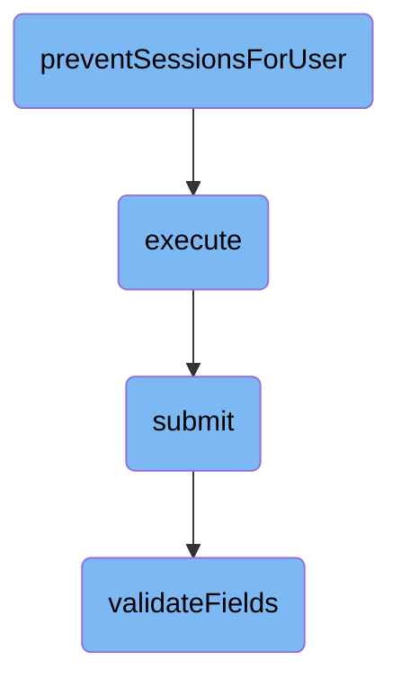

In this document, we will explain the process of preventing sessions for a user. This process involves removing user approvals and consumers, executing the session prevention, submitting the control, and validating fields.

The flow starts by removing any approvals for the user's consumers and deleting the consumers themselves to ensure the user cannot create new sessions. It then assumes the user is authenticated and has a valid session, creates a control object, and calls its submit method. The submission is validated, permissions are checked, and the action is routed to the appropriate internal function. Finally, the required fields for the action are validated to ensure they are present and valid.

# Flow drill down



<SwmSnippet path="/src/SessionProvider.php" line="293">

---

## Removing user approvals and consumers

The function <SwmToken path="src/SessionProvider.php" pos="293:5:5" line-data="	public function preventSessionsForUser( $username ) {">`preventSessionsForUser`</SwmToken> is responsible for removing any approvals for the user's consumers and deleting the consumers themselves. This ensures that the user cannot create new sessions with these consumers. It starts by getting the user's central ID and database connection. It then performs a series of delete operations within an atomic transaction to ensure data integrity. If any error occurs, the transaction is rolled back.

```hack
	public function preventSessionsForUser( $username ) {
		$id = Utils::getCentralIdFromUserName( $username );
		$dbw = Utils::getCentralDB( DB_PRIMARY );

		$dbw->startAtomic( __METHOD__ );
		try {
			// Remove any approvals for the user's consumers before deleting them
			$dbw->deleteJoin(
				'oauth_accepted_consumer',
				'oauth_registered_consumer',
				'oaac_consumer_id',
				'oarc_id',
				[ 'oarc_user_id' => $id ],
				__METHOD__
			);
			$dbw->newDeleteQueryBuilder()
				->deleteFrom( 'oauth_registered_consumer' )
				->where( [ 'oarc_user_id' => $id ] )
				->caller( __METHOD__ )
				->execute();

```

---

</SwmSnippet>

<SwmSnippet path="/src/Rest/Handler/AbstractClientHandler.php" line="24">

---

## Executing the session prevention

The <SwmToken path="src/Rest/Handler/AbstractClientHandler.php" pos="28:5:5" line-data="	public function execute(): ResponseInterface {">`execute`</SwmToken> function assumes the user is authenticated and has a valid session. It creates a <SwmToken path="src/Rest/Handler/AbstractClientHandler.php" pos="34:8:8" line-data="		$control = new ConsumerSubmitControl(">`ConsumerSubmitControl`</SwmToken> object and calls its <SwmToken path="src/Rest/Handler/AbstractClientHandler.php" pos="40:9:9" line-data="		$status = $control-&gt;submit();">`submit`</SwmToken> method. If the submission is successful, it returns a JSON response with the consumer's details. If there are any errors, appropriate HTTP exceptions are thrown.

```hack
	/**
	 * @return ResponseInterface
	 * @throws HttpException
	 */
	public function execute(): ResponseInterface {
		// At this point we assume user is authenticated and has valid session
		// Authentication can be achieved over CentralAuth or Access token in authorization header
		$responseFactory = $this->getResponseFactory();
		$params = $this->getUnifiedParams();

		$control = new ConsumerSubmitControl(
			RequestContext::getMain(),
			$params,
			Utils::getCentralDB( DB_PRIMARY )
		);

		$status = $control->submit();
		if ( $status->isGood() ) {
			$value = $status->getValue();
			if ( isset( $value['result']['consumer'] ) ) {
				/** @var ClientEntity $client */
```

---

</SwmSnippet>

<SwmSnippet path="/src/Control/SubmitControl.php" line="58">

---

### Submitting the control

The <SwmToken path="src/Control/SubmitControl.php" pos="59:11:11" line-data="	 * Attempt to validate and submit this data">`submit`</SwmToken> function in <SwmToken path="src/Rest/Handler/AbstractClientHandler.php" pos="83:9:9" line-data="	 * expected by the SubmitControl">`SubmitControl`</SwmToken> validates the action and parameters, checks permissions, and routes the submission to the appropriate internal function. If any validation or permission check fails, it returns a failure status.

```hack
	/**
	 * Attempt to validate and submit this data
	 *
	 * This will check basic permissions, validate the action and parameters
	 * and route the submission handling to the internal subclass function.
	 *
	 * @throws MWException
	 * @return Status
	 */
	public function submit() {
		$status = $this->checkBasePermissions();
		if ( !$status->isOK() ) {
			return $status;
		}

		$action = $this->vals['action'];
		$required = $this->getRequiredFields();
		if ( !isset( $required[$action] ) ) {
			// @TODO: check for field-specific message first
			return $this->failure( 'invalid_field_action', 'mwoauth-invalid-field', 'action' );
		}
```

---

</SwmSnippet>

<SwmSnippet path="/src/Control/SubmitControl.php" line="253">

---

### Validating fields

The <SwmToken path="src/Control/SubmitControl.php" pos="260:5:5" line-data="	protected function validateFields( array $required ) {">`validateFields`</SwmToken> function checks that the required fields for the action are present and valid. It iterates over the required fields and applies the appropriate validation logic. If any field is missing or invalid, it returns a failure status.

```hack
	/**
	 * Check that the action is valid and that the required fields are valid
	 *
	 * @param array $required (field => regex or callback)
	 * @phan-param array<string,string|callable(mixed,array):bool|StatusValue> $required
	 * @return Status
	 */
	protected function validateFields( array $required ) {
		foreach ( $required as $field => $validator ) {
			if ( !isset( $this->vals[$field] ) ) {
				return $this->failure( "missing_field_$field", 'mwoauth-missing-field', $field );
			} elseif ( !is_scalar( $this->vals[$field] )
				&& !in_array( $field, [ 'restrictions', 'oauth2GrantTypes' ], true )
			) {
				return $this->failure( "invalid_field_$field", 'mwoauth-invalid-field', $field );
			}
			if ( is_string( $this->vals[$field] ) ) {
				$this->vals[$field] = trim( $this->vals[$field] );
			}
			$validationResult = $this->getValidationResult( $validator, $this->vals[$field], $this->vals );
			if ( $validationResult === false ) {
```

---

</SwmSnippet>

&nbsp;

*This is an auto-generated document by Swimm AI 🌊 and has not yet been verified by a human*

<SwmMeta version="3.0.0" repo-id="Z2l0aHViJTNBJTNBbWVkaWF3aWtpLWV4dGVuc2lvbnMtT0F1dGglM0ElM0FTd2ltbS1EZW1v" repo-name="mediawiki-extensions-OAuth"><sup>Powered by [Swimm](/)</sup></SwmMeta>
