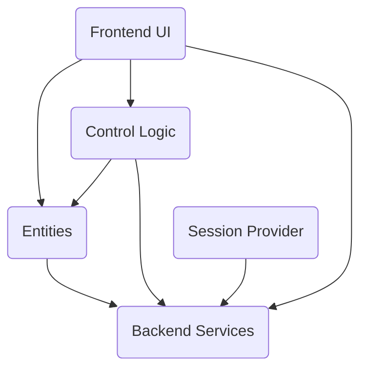

The mediawiki-extensions-OAuth repository is an extension for MediaWiki that provides OAuth functionality, allowing MediaWiki to act as an OAuth provider, supporting both the OAuth 1.0a and OAuth 2.0 protocol versions. It allows third party developers to securely develop applications ("consumers"), to which users can give a limited set of permissions ("grants"), so that the application can use the MediaWiki action API on the user's behalf.

### OAuth Access

- <SwmLink doc-title="Access Token Initialization Flow">[Access Token Initialization Flow](/.swm/access-token-initialization-flow.p7he0wcx.sw.md)</SwmLink>

## Main Components

### Frontend UI

- **Special pages**\
  Special pages are dynamically generated pages that perform specific functions. They are not regular wiki pages but are created by the software on demand
  - **Specialmwo auth list consumers**
    - <SwmLink doc-title="Managing OAuth Consumers Flow">[Managing OAuth Consumers Flow](/.swm/managing-oauth-consumers-flow.ru4kkxvk.sw.md)</SwmLink>
  - **Specialmwo auth manage consumers**
    - <SwmLink doc-title="Managing OAuth Consumers">[Managing OAuth Consumers](/.swm/managing-oauth-consumers.ol3l5q44.sw.md)</SwmLink>

### Backend Services

- **Flows**
  - <SwmLink doc-title="Fetching Access Token Flow">[Fetching Access Token Flow](/.swm/fetching-access-token-flow.n4iori1p.sw.md)</SwmLink>

&nbsp;

*This is an auto-generated document by Swimm 🌊 and has not yet been verified by a human*

<SwmMeta version="3.0.0" repo-id="Z2l0aHViJTNBJTNBbWVkaWF3aWtpLWV4dGVuc2lvbnMtT0F1dGglM0ElM0FTd2ltbS1EZW1v" repo-name="mediawiki-extensions-OAuth">Powered by [Swimm](https://app.swimm.io/)</SwmMeta>
