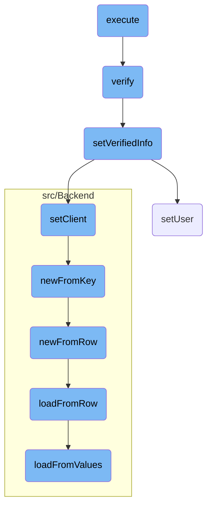
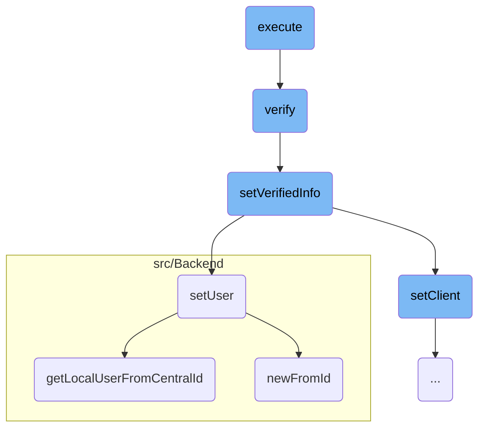
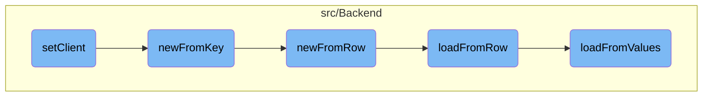

This document explains the process of executing a request. The process involves initiating the request, verifying it, and setting the necessary user and client information for further processing.

The flow starts with initiating the request, which involves creating a new response and preparing the request with authorization headers. Next, the request is verified to ensure it is authentic. If the verification is successful, the system extracts and sets various pieces of information from the request, such as user and client details, to ensure all necessary information is available for further processing.

Here is a high level diagram of the flow, showing only the most important functions:



# Flow drill down

First, we'll zoom into this section of the flow:



<SwmSnippet path="/src/Rest/Handler/Resource.php" line="72">

---

## Executing the Request

The <SwmToken path="src/Rest/Handler/Resource.php" pos="72:5:5" line-data="	public function execute() {">`execute`</SwmToken> function initiates the request execution by creating a new response and preparing the request with the necessary authorization headers. It then calls the <SwmToken path="src/Rest/Handler/Resource.php" pos="80:8:8" line-data="		return $this-&gt;resourceServer-&gt;verify( $request, $response, $callback );">`verify`</SwmToken> function to authenticate the request.

```hack
	public function execute() {
		$response = new Response();
		$request = ServerRequest::fromGlobals()->withHeader(
			'authorization',
			$this->getRequest()->getHeader( 'authorization' )
		);

		$callback = [ $this, 'doExecuteProtected' ];
		return $this->resourceServer->verify( $request, $response, $callback );
```

---

</SwmSnippet>

<SwmSnippet path="/src/ResourceServer.php" line="81">

---

## Verifying the Request

The <SwmToken path="src/ResourceServer.php" pos="81:5:5" line-data="	public function verify( $request, $response, $callback ) {">`verify`</SwmToken> function is responsible for verifying the request. It sets the <SwmToken path="src/ResourceServer.php" pos="82:4:4" line-data="		$this-&gt;verified = false;">`verified`</SwmToken> flag to false initially and then invokes the middleware to process the request. If the request is successfully verified, it calls the <SwmToken path="src/ResourceServer.php" pos="88:4:4" line-data="				$this-&gt;setVerifiedInfo( $request );">`setVerifiedInfo`</SwmToken> function to extract and set relevant information from the request.

```hack
	public function verify( $request, $response, $callback ) {
		$this->verified = false;

		return $this->middleware->__invoke(
			$request,
			$response,
			function ( $request, $response ) use ( $callback ) {
				$this->setVerifiedInfo( $request );
				return $callback( $request, $response );
			}
		);
```

---

</SwmSnippet>

<SwmSnippet path="/src/ResourceServer.php" line="149">

---

## Setting Verified Information

The <SwmToken path="src/ResourceServer.php" pos="155:5:5" line-data="	public function setVerifiedInfo( ServerRequestInterface $request ) {">`setVerifiedInfo`</SwmToken> function extracts and sets various pieces of information from the verified request, such as the user, client, scopes, and access token ID. This function ensures that all necessary information is available for further processing.

```hack
	/**
	 * Read out the verified request and get relevant information
	 *
	 * @param ServerRequestInterface $request
	 * @throws HttpException
	 */
	public function setVerifiedInfo( ServerRequestInterface $request ) {
		$this->setUser( $request );
		$this->setClient( $request );
		$this->setScopes( $request );
		$this->setAccessTokenId( $request );

		$this->verified = true;
	}
```

---

</SwmSnippet>

<SwmSnippet path="/src/ResourceServer.php" line="164">

---

### Setting User Information

The <SwmToken path="src/ResourceServer.php" pos="170:5:5" line-data="	private function setUser( ServerRequestInterface $request ) {">`setUser`</SwmToken> function sets the authorized user in the global context. It retrieves the user ID from the request attributes and attempts to get the local user using the <SwmToken path="src/ResourceServer.php" pos="179:8:8" line-data="			$user = Utils::getLocalUserFromCentralId( $userId );">`getLocalUserFromCentralId`</SwmToken> function. If no user ID is present, it sets an anonymous user.

```hack
	/**
	 * Set authorized user to the global context
	 *
	 * @param ServerRequestInterface $request
	 * @throws HttpException
	 */
	private function setUser( ServerRequestInterface $request ) {
		$userId = $request->getAttribute( 'oauth_user_id', 0 );
		if ( !$userId ) {
			// Set anon user when no user id is present in the AT (machine grant)
			$this->user = User::newFromId( 0 );
			return;
		}

		try {
			$user = Utils::getLocalUserFromCentralId( $userId );
		} catch ( MWException $ex ) {
			throw new HttpException( $ex->getMessage(), 403 );
		}

		$this->user = $user;
```

---

</SwmSnippet>

<SwmSnippet path="/src/Backend/Utils.php" line="295">

---

### Getting Local User from Central ID

The <SwmToken path="src/Backend/Utils.php" pos="301:7:7" line-data="	public static function getLocalUserFromCentralId( $userId ) {">`getLocalUserFromCentralId`</SwmToken> function retrieves a local user object given a central wiki user ID. It uses a central ID lookup service to find the local user and ensures that the user is attached before returning the user object.

```hack
	/**
	 * Given a central wiki user ID, get a local User object
	 *
	 * @param int $userId
	 * @return User|false False if not found
	 */
	public static function getLocalUserFromCentralId( $userId ) {
		global $wgMWOAuthSharedUserIDs, $wgMWOAuthSharedUserSource;

		// global ID required via hook
		if ( $wgMWOAuthSharedUserIDs ) {
			$lookup = MediaWikiServices::getInstance()
				->getCentralIdLookupFactory()
				->getLookup( $wgMWOAuthSharedUserSource );
			$user = $lookup->localUserFromCentralId( $userId );
			if ( $user === null || !$lookup->isAttached( $user ) ) {
				return false;
			}
			return User::newFromIdentity( $user );
		}

```

---

</SwmSnippet>

<SwmSnippet path="/src/Backend/MWOAuthDAO.php" line="96">

---

### Creating User from ID

The <SwmToken path="src/Backend/MWOAuthDAO.php" pos="103:9:9" line-data="	final public static function newFromId( IDatabase $db, $id, $flags = 0 ) {">`newFromId`</SwmToken> function creates a user object from a given ID by querying the database. It constructs a query to fetch the user data and, if found, loads the user object from the retrieved row.

```hack
	/**
	 * @param IDatabase $db
	 * @param int $id
	 * @param int $flags IDBAccessObject::READ_* bitfield
	 * @return static|bool Returns false if not found
	 * @throws DBError
	 */
	final public static function newFromId( IDatabase $db, $id, $flags = 0 ) {
		$queryBuilder = $db->newSelectQueryBuilder()
			->select( array_values( static::getFieldColumnMap() ) )
			->from( static::getTable() )
			->where( [ static::getIdColumn() => (int)$id ] )
			->caller( __METHOD__ );
		if ( $flags & IDBAccessObject::READ_LOCKING ) {
			$queryBuilder->forUpdate();
		}
		$row = $queryBuilder->fetchRow();

		if ( $row ) {
			$class = static::getConsumerClass( (array)$row );
			$consumer = new $class();
```

---

</SwmSnippet>

Now, lets zoom into this section of the flow:



<SwmSnippet path="/src/ResourceServer.php" line="193">

---

## Setting the Client Entity

The <SwmToken path="src/ResourceServer.php" pos="193:5:5" line-data="	private function setClient( ServerRequestInterface $request ) {">`setClient`</SwmToken> function is responsible for setting the <SwmToken path="src/ResourceServer.php" pos="194:8:8" line-data="		$this-&gt;client = ClientEntity::newFromKey(">`ClientEntity`</SwmToken> from a validated request. It retrieves the client ID from the request attributes and uses it to initialize the <SwmToken path="src/ResourceServer.php" pos="194:8:8" line-data="		$this-&gt;client = ClientEntity::newFromKey(">`ClientEntity`</SwmToken>. If the client is invalid or does not support <SwmToken path="src/Rest/Handler/Resource.php" pos="3:6:6" line-data="namespace MediaWiki\Extension\OAuth\Rest\Handler;">`OAuth`</SwmToken> version 2, an <SwmToken path="src/ResourceServer.php" pos="199:5:5" line-data="			throw new HttpException( &#39;Client represented by given access token is invalid&#39;, 403 );">`HttpException`</SwmToken> is thrown.

```hack
	private function setClient( ServerRequestInterface $request ) {
		$this->client = ClientEntity::newFromKey(
			Utils::getCentralDB( DB_REPLICA ),
			$request->getAttribute( 'oauth_client_id' )
		);
		if ( !$this->client || $this->client->getOAuthVersion() !== Consumer::OAUTH_VERSION_2 ) {
			throw new HttpException( 'Client represented by given access token is invalid', 403 );
		}
	}
```

---

</SwmSnippet>

<SwmSnippet path="/src/Backend/Consumer.php" line="221">

---

### Creating Client Entity from Key

The <SwmToken path="src/Backend/Consumer.php" pos="221:7:7" line-data="	public static function newFromKey( IDatabase $db, $key, $flags = 0 ) {">`newFromKey`</SwmToken> function in <SwmPath>[src/Backend/Consumer.php](src/Backend/Consumer.php)</SwmPath> is used to create a <SwmToken path="src/ResourceServer.php" pos="198:23:23" line-data="		if ( !$this-&gt;client || $this-&gt;client-&gt;getOAuthVersion() !== Consumer::OAUTH_VERSION_2 ) {">`Consumer`</SwmToken> object from a database key. It constructs a query to fetch the consumer data from the database and, if successful, calls <SwmToken path="src/Backend/Consumer.php" pos="233:5:5" line-data="			return static::newFromRow( $db, $row );">`newFromRow`</SwmToken> to create the <SwmToken path="src/ResourceServer.php" pos="198:23:23" line-data="		if ( !$this-&gt;client || $this-&gt;client-&gt;getOAuthVersion() !== Consumer::OAUTH_VERSION_2 ) {">`Consumer`</SwmToken> object.

```hack
	public static function newFromKey( IDatabase $db, $key, $flags = 0 ) {
		$queryBuilder = $db->newSelectQueryBuilder()
			->select( array_values( static::getFieldColumnMap() ) )
			->from( static::getTable() )
			->where( [ 'oarc_consumer_key' => (string)$key ] )
			->caller( __METHOD__ );
		if ( $flags & IDBAccessObject::READ_LOCKING ) {
			$queryBuilder->forUpdate();
		}
		$row = $queryBuilder->fetchRow();

		if ( $row ) {
			return static::newFromRow( $db, $row );
		} else {
			return false;
		}
	}
```

---

</SwmSnippet>

<SwmSnippet path="/src/Backend/MWOAuthDAO.php" line="89">

---

### Creating Consumer from Row

The <SwmToken path="src/Backend/MWOAuthDAO.php" pos="89:9:9" line-data="	final public static function newFromRow( IDatabase $db, $row ) {">`newFromRow`</SwmToken> function in <SwmPath>[src/Backend/MWOAuthDAO.php](src/Backend/MWOAuthDAO.php)</SwmPath> creates a new consumer object from a database row. It determines the appropriate consumer class and initializes it by calling <SwmToken path="src/Backend/MWOAuthDAO.php" pos="92:4:4" line-data="		$consumer-&gt;loadFromRow( $db, $row );">`loadFromRow`</SwmToken>.

```hack
	final public static function newFromRow( IDatabase $db, $row ) {
		$class = static::getConsumerClass( (array)$row );
		$consumer = new $class();
		$consumer->loadFromRow( $db, $row );
		return $consumer;
	}
```

---

</SwmSnippet>

<SwmSnippet path="/src/Backend/MWOAuthDAO.php" line="380">

---

### Loading Data from Row

The <SwmToken path="src/Backend/MWOAuthDAO.php" pos="380:7:7" line-data="	final protected function loadFromRow( IDatabase $db, $row ) {">`loadFromRow`</SwmToken> function decodes the database row and maps the data to the consumer object's fields. It then calls <SwmToken path="src/Backend/MWOAuthDAO.php" pos="386:4:4" line-data="		$this-&gt;loadFromValues( $values );">`loadFromValues`</SwmToken> to finalize the loading process.

```hack
	final protected function loadFromRow( IDatabase $db, $row ) {
		$row = $this->decodeRow( $db, (array)$row );
		$values = [];
		foreach ( static::getFieldColumnMap() as $field => $column ) {
			$values[$field] = $row[$column];
		}
		$this->loadFromValues( $values );
		$this->daoOrigin = 'db';
		$this->daoPending = false;
	}
```

---

</SwmSnippet>

<SwmSnippet path="/src/Backend/MWOAuthDAO.php" line="356">

---

### Loading Values into Consumer

The <SwmToken path="src/Backend/MWOAuthDAO.php" pos="356:7:7" line-data="	final protected function loadFromValues( array $values ) {">`loadFromValues`</SwmToken> function ensures that all required fields are present in the values array and assigns them to the consumer object. It also normalizes the values and sets the object's state to indicate that it has been loaded from the database.

```hack
	final protected function loadFromValues( array $values ) {
		foreach ( static::getFieldColumnMap() as $field => $column ) {
			if ( !array_key_exists( $field, $values ) ) {
				throw new MWException( get_class( $this ) . " requires '$field' field." );
			}
			$this->$field = $values[$field];
		}
		$this->normalizeValues();
		$this->daoOrigin = 'new';
		$this->daoPending = true;
	}
```

---

</SwmSnippet>

&nbsp;

*This is an auto-generated document by Swimm AI 🌊 and has not yet been verified by a human*

<SwmMeta version="3.0.0" repo-id="Z2l0aHViJTNBJTNBbWVkaWF3aWtpLWV4dGVuc2lvbnMtT0F1dGglM0ElM0FTd2ltbS1EZW1v" repo-name="mediawiki-extensions-OAuth"><sup>Powered by [Swimm](/)</sup></SwmMeta>
