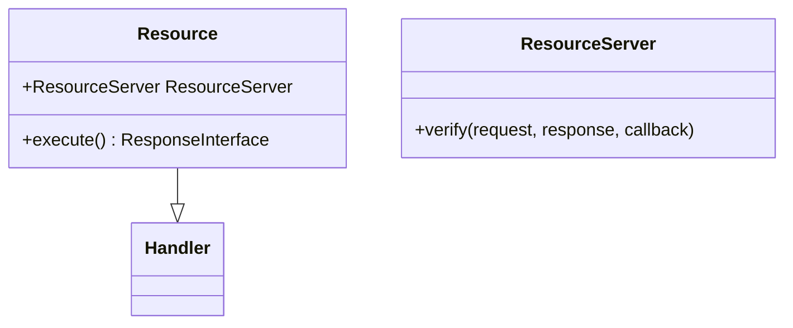

# Overview

Resources refer to various components and functionalities that are essential for the <SwmToken path="src/Rest/Handler/Resource.php" pos="3:6:6" line-data="namespace MediaWiki\Extension\OAuth\Rest\Handler;">`OAuth`</SwmToken> extension to operate. These include server-side handlers, client-side scripts, and styles.

# Resource Class

The <SwmToken path="src/Rest/Handler/Resource.php" pos="19:9:9" line-data=" * Handles the oauth2/resource/profile and oauth2/resource/scope endpoints, which return">`resource`</SwmToken> class handles endpoints that return information about the user and the grants of the application. It interacts with the <SwmToken path="src/Rest/Handler/Resource.php" pos="34:6:6" line-data="	/** @var ResourceServer */">`ResourceServer`</SwmToken> to verify requests and provide appropriate responses.

# <SwmToken path="src/Rest/Handler/Resource.php" pos="34:6:6" line-data="	/** @var ResourceServer */">`ResourceServer`</SwmToken> Field

The <SwmToken path="src/Rest/Handler/Resource.php" pos="34:6:6" line-data="	/** @var ResourceServer */">`ResourceServer`</SwmToken> field in the <SwmToken path="src/Rest/Handler/Resource.php" pos="19:9:9" line-data=" * Handles the oauth2/resource/profile and oauth2/resource/scope endpoints, which return">`resource`</SwmToken> class is an instance of <SwmToken path="src/Rest/Handler/Resource.php" pos="34:6:6" line-data="	/** @var ResourceServer */">`ResourceServer`</SwmToken>, responsible for verifying <SwmToken path="src/Rest/Handler/Resource.php" pos="3:6:6" line-data="namespace MediaWiki\Extension\OAuth\Rest\Handler;">`OAuth`</SwmToken> requests and managing user and client information.

<SwmSnippet path="/src/Rest/Handler/Resource.php" line="32">

---

The <SwmToken path="src/Rest/Handler/Resource.php" pos="34:6:6" line-data="	/** @var ResourceServer */">`ResourceServer`</SwmToken> field is defined in the <SwmToken path="src/Rest/Handler/Resource.php" pos="19:9:9" line-data=" * Handles the oauth2/resource/profile and oauth2/resource/scope endpoints, which return">`resource`</SwmToken> class and is used to verify <SwmToken path="src/Rest/Handler/Resource.php" pos="3:6:6" line-data="namespace MediaWiki\Extension\OAuth\Rest\Handler;">`OAuth`</SwmToken> requests.

```hack
	private const TYPE_SCOPES = 'scopes';

	/** @var ResourceServer */
	protected $resourceServer;
```

---

</SwmSnippet>

# Execute Function

The <SwmToken path="src/Rest/Handler/Resource.php" pos="72:5:5" line-data="	public function execute() {">`execute`</SwmToken> function in the <SwmToken path="src/Rest/Handler/Resource.php" pos="19:9:9" line-data=" * Handles the oauth2/resource/profile and oauth2/resource/scope endpoints, which return">`resource`</SwmToken> class processes incoming requests by verifying them with the <SwmToken path="src/Rest/Handler/Resource.php" pos="34:6:6" line-data="	/** @var ResourceServer */">`ResourceServer`</SwmToken> and then executing the appropriate callback to handle the request.

<SwmSnippet path="/src/Rest/Handler/Resource.php" line="69">

---

The <SwmToken path="src/Rest/Handler/Resource.php" pos="72:5:5" line-data="	public function execute() {">`execute`</SwmToken> function verifies the incoming request with the <SwmToken path="src/Rest/Handler/Resource.php" pos="80:6:6" line-data="		return $this-&gt;resourceServer-&gt;verify( $request, $response, $callback );">`resourceServer`</SwmToken> and executes the appropriate callback to handle the request.

```hack
	/**
	 * @return ResponseInterface
	 */
	public function execute() {
		$response = new Response();
		$request = ServerRequest::fromGlobals()->withHeader(
			'authorization',
			$this->getRequest()->getHeader( 'authorization' )
		);

		$callback = [ $this, 'doExecuteProtected' ];
		return $this->resourceServer->verify( $request, $response, $callback );
```

---

</SwmSnippet>

&nbsp;

*This is an auto-generated document by Swimm AI 🌊 and has not yet been verified by a human*

<SwmMeta version="3.0.0" repo-id="Z2l0aHViJTNBJTNBbWVkaWF3aWtpLWV4dGVuc2lvbnMtT0F1dGglM0ElM0FTd2ltbS1EZW1v" repo-name="mediawiki-extensions-OAuth"><sup>Powered by [Swimm](/)</sup></SwmMeta>
