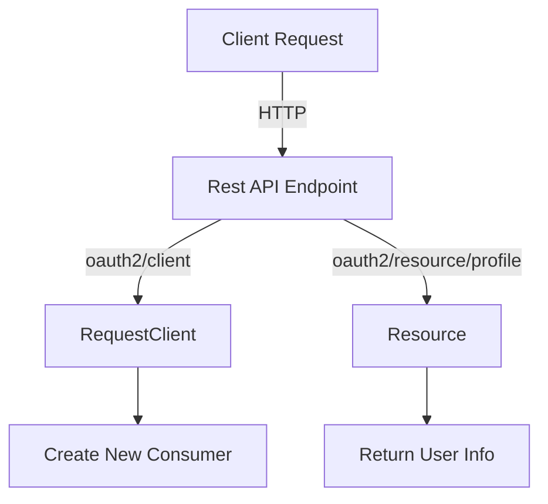

# Overview

The Rest API is used to handle various <SwmToken path="src/Rest/Handler/AbstractClientHandler.php" pos="18:5:5" line-data=" * on OAuth 2.0 clients over the REST API.">`OAuth`</SwmToken> <SwmToken path="src/Rest/Handler/AbstractClientHandler.php" pos="18:7:9" line-data=" * on OAuth 2.0 clients over the REST API.">`2.0`</SwmToken> endpoints, such as client creation, token issuance, and resource access. This document will cover the key classes and endpoints involved in the Rest API functionality.

<SwmSnippet path="/src/Rest/Handler/AbstractClientHandler.php" line="16">

---

# <SwmToken path="src/Rest/Handler/RequestClient.php" pos="17:6:6" line-data="class RequestClient extends AbstractClientHandler {">`AbstractClientHandler`</SwmToken>

The <SwmToken path="src/Rest/Handler/RequestClient.php" pos="17:6:6" line-data="class RequestClient extends AbstractClientHandler {">`AbstractClientHandler`</SwmToken> class serves as the base for all operations on <SwmToken path="src/Rest/Handler/AbstractClientHandler.php" pos="18:5:5" line-data=" * on OAuth 2.0 clients over the REST API.">`OAuth`</SwmToken> <SwmToken path="src/Rest/Handler/AbstractClientHandler.php" pos="18:7:9" line-data=" * on OAuth 2.0 clients over the REST API.">`2.0`</SwmToken> clients, providing client initialization and parameter mapping.

```hack
/**
 * This class serves as the base class for all operations
 * on OAuth 2.0 clients over the REST API.
 * It provides client initialization and basic checks on it,
 * as well as parameter name mapping between OAuth 2.0 and 1.0 terminology
 */
```

---

</SwmSnippet>

<SwmSnippet path="/src/Rest/Handler/AuthenticationHandler.php" line="24">

---

# <SwmToken path="src/Rest/Handler/AuthenticationHandler.php" pos="24:4:4" line-data="abstract class AuthenticationHandler extends Handler {">`AuthenticationHandler`</SwmToken>

The <SwmToken path="src/Rest/Handler/AuthenticationHandler.php" pos="24:4:4" line-data="abstract class AuthenticationHandler extends Handler {">`AuthenticationHandler`</SwmToken> class provides the base functionality for handling authentication-related requests, including error handling and validation.

```hack
abstract class AuthenticationHandler extends Handler {

	/**
	 * @var User
	 */
	protected $user;

	/**
	 * @var Config
	 */
	protected $config;

	/**
	 * @var OAuthServerException|null
	 */
	protected $queuedError;

	/**
	 * @return AuthenticationHandler
	 */
	public static function factory() {
```

---

</SwmSnippet>

<SwmSnippet path="/src/Rest/Handler/RequestClient.php" line="16">

---

# <SwmToken path="src/Rest/Handler/RequestClient.php" pos="17:2:2" line-data="class RequestClient extends AbstractClientHandler {">`RequestClient`</SwmToken>

The <SwmToken path="src/Rest/Handler/RequestClient.php" pos="17:2:2" line-data="class RequestClient extends AbstractClientHandler {">`RequestClient`</SwmToken> class handles the <SwmToken path="src/Rest/Handler/RequestClient.php" pos="14:7:9" line-data=" * Handles the oauth2/client endpoint, which creates">`oauth2/client`</SwmToken> endpoint, which is responsible for creating new consumers for users.

```hack
 */
class RequestClient extends AbstractClientHandler {
```

---

</SwmSnippet>

<SwmSnippet path="/src/Rest/Handler/Resource.php" line="3">

---

# Resource

The <SwmToken path="src/Rest/Handler/Resource.php" pos="19:9:9" line-data=" * Handles the oauth2/resource/profile and oauth2/resource/scope endpoints, which return">`resource`</SwmToken> class manages the <SwmToken path="src/Rest/Handler/Resource.php" pos="19:7:11" line-data=" * Handles the oauth2/resource/profile and oauth2/resource/scope endpoints, which return">`oauth2/resource/profile`</SwmToken> and <SwmToken path="src/Rest/Handler/Resource.php" pos="19:15:19" line-data=" * Handles the oauth2/resource/profile and oauth2/resource/scope endpoints, which return">`oauth2/resource/scope`</SwmToken> endpoints, returning information about the user and application grants.

```hack
namespace MediaWiki\Extension\OAuth\Rest\Handler;

use FormatJson;
use GuzzleHttp\Psr7\ServerRequest;
use MediaWiki\Extension\OAuth\Backend\MWOAuthException;
```

---

</SwmSnippet>

# <SwmToken path="src/Rest/Handler/AbstractClientHandler.php" pos="18:5:5" line-data=" * on OAuth 2.0 clients over the REST API.">`OAuth`</SwmToken> <SwmToken path="src/Rest/Handler/AbstractClientHandler.php" pos="18:7:9" line-data=" * on OAuth 2.0 clients over the REST API.">`2.0`</SwmToken> Endpoints

The Rest API includes several <SwmToken path="src/Rest/Handler/AbstractClientHandler.php" pos="18:5:5" line-data=" * on OAuth 2.0 clients over the REST API.">`OAuth`</SwmToken> <SwmToken path="src/Rest/Handler/AbstractClientHandler.php" pos="18:7:9" line-data=" * on OAuth 2.0 clients over the REST API.">`2.0`</SwmToken> endpoints that handle different aspects of the <SwmToken path="src/Rest/Handler/AbstractClientHandler.php" pos="18:5:5" line-data=" * on OAuth 2.0 clients over the REST API.">`OAuth`</SwmToken> <SwmToken path="src/Rest/Handler/AbstractClientHandler.php" pos="18:7:9" line-data=" * on OAuth 2.0 clients over the REST API.">`2.0`</SwmToken> protocol.

<SwmSnippet path="/src/Rest/Handler/AccessToken.php" line="15">

---

## <SwmToken path="src/Rest/Handler/AccessToken.php" pos="16:7:9" line-data=" * Handles the oauth2/access_token endpoint, which can be used after the user has returned from">`oauth2/access_token`</SwmToken>

The <SwmToken path="src/Rest/Handler/AccessToken.php" pos="16:7:9" line-data=" * Handles the oauth2/access_token endpoint, which can be used after the user has returned from">`oauth2/access_token`</SwmToken> endpoint is used to trade an authorization code for an access token. This endpoint supports different grant types such as <SwmToken path="src/Rest/Handler/AccessToken.php" pos="22:10:10" line-data="	private const GRANT_TYPE_AUTHORIZATION_CODE = &#39;authorization_code&#39;;">`authorization_code`</SwmToken>, <SwmToken path="src/Rest/Handler/AccessToken.php" pos="21:10:10" line-data="	private const GRANT_TYPE_CLIENT_CREDENTIALS = &#39;client_credentials&#39;;">`client_credentials`</SwmToken>, and <SwmToken path="src/Rest/Handler/AccessToken.php" pos="23:10:10" line-data="	private const GRANT_TYPE_REFRESH_TOKEN = &#39;refresh_token&#39;;">`refresh_token`</SwmToken>.

```hack
/**
 * Handles the oauth2/access_token endpoint, which can be used after the user has returned from
 * the authorization dialog to trade the off the received authorization code for an access token.
 */
```

---

</SwmSnippet>

<SwmSnippet path="/src/Rest/Handler/ListClients.php" line="18">

---

## <SwmToken path="src/Rest/Handler/ListClients.php" pos="19:7:9" line-data=" * Handles the oauth2/consumers endpoint, which returns">`oauth2/consumers`</SwmToken>

The <SwmToken path="src/Rest/Handler/ListClients.php" pos="19:7:9" line-data=" * Handles the oauth2/consumers endpoint, which returns">`oauth2/consumers`</SwmToken> endpoint returns a list of registered consumers for the user.

```hack
/**
 * Handles the oauth2/consumers endpoint, which returns
 * a list of registered consumers for the user
 */
```

---

</SwmSnippet>

&nbsp;

*This is an auto-generated document by Swimm AI 🌊 and has not yet been verified by a human*

<SwmMeta version="3.0.0" repo-id="Z2l0aHViJTNBJTNBbWVkaWF3aWtpLWV4dGVuc2lvbnMtT0F1dGglM0ElM0FTd2ltbS1EZW1v" repo-name="mediawiki-extensions-OAuth"><sup>Powered by [Swimm](/)</sup></SwmMeta>
