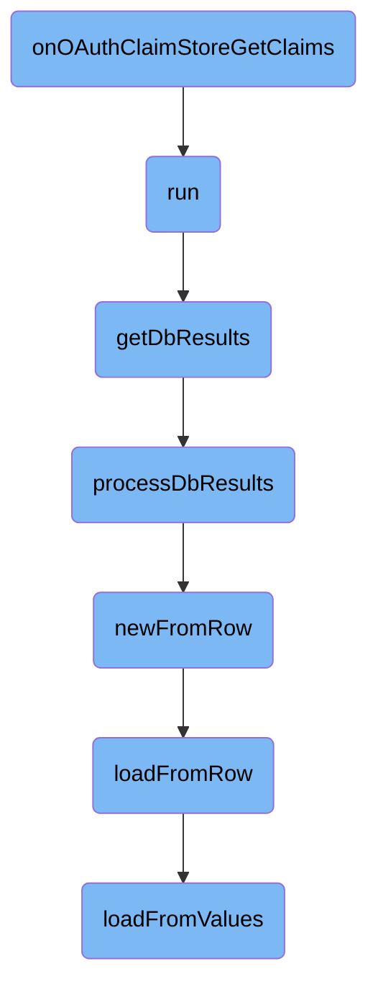

This document explains the process of retrieving <SwmToken path="src/HookRunner.php" pos="3:6:6" line-data="namespace MediaWiki\Extension\OAuth;">`OAuth`</SwmToken> claims based on the provided grant type, client entity, and user identifier. The process involves running the main logic, retrieving database results, processing these results, and creating consumer objects from the database rows.

The flow starts by running the main logic to get the current user and their central ID. If the central ID is found, it retrieves the database results for the user. These results are then processed to extract and format the consumer data. Finally, consumer objects are created from the database rows, and the data is loaded into these objects.

# Flow drill down



<SwmSnippet path="/src/HookRunner.php" line="23">

---

## Retrieving <SwmToken path="src/HookRunner.php" pos="3:6:6" line-data="namespace MediaWiki\Extension\OAuth;">`OAuth`</SwmToken> Claims

The function <SwmToken path="src/HookRunner.php" pos="29:5:5" line-data="	public function onOAuthClaimStoreGetClaims(">`onOAuthClaimStoreGetClaims`</SwmToken> is responsible for retrieving <SwmToken path="src/HookRunner.php" pos="3:6:6" line-data="namespace MediaWiki\Extension\OAuth;">`OAuth`</SwmToken> claims based on the provided grant type, client entity, and user identifier. It uses the hook container to run the <SwmToken path="src/HookRunner.php" pos="33:2:2" line-data="			&#39;OAuthClaimStoreGetClaims&#39;,">`OAuthClaimStoreGetClaims`</SwmToken> hook, passing the necessary parameters to gather the claims.

```hack
	/**
	 * @param string $grantType
	 * @param MWClientEntityInterface $clientEntity
	 * @param array &$privateClaims
	 * @param string|null $userIdentifier
	 */
	public function onOAuthClaimStoreGetClaims(
		string $grantType, MWClientEntityInterface $clientEntity, array &$privateClaims, $userIdentifier = null
	) {
		$this->hookContainer->run(
			'OAuthClaimStoreGetClaims',
			[ $grantType, $clientEntity, &$privateClaims, $userIdentifier ]
		);
	}
```

---

</SwmSnippet>

<SwmSnippet path="/src/Rest/Handler/ListClients.php" line="72">

---

## Running the Main Logic

The <SwmToken path="src/Rest/Handler/ListClients.php" pos="76:5:5" line-data="	public function run(): ResponseInterface {">`run`</SwmToken> function initiates the process by getting the current user and their central ID. If the central ID is not found, it throws an exception. Otherwise, it retrieves the database results for the user and returns them as a JSON response.

```hack
	/**
	 * @return ResponseInterface
	 * @throws LocalizedHttpException
	 */
	public function run(): ResponseInterface {
		// @todo Inject this, when there is a good way to do that, see T239753
		$user = RequestContext::getMain()->getUser();

		$centralId = Utils::getCentralIdFromUserName( $user->getName() );
		$responseFactory = $this->getResponseFactory();

		if ( !$centralId ) {
			throw new LocalizedHttpException(
				new MessageValue( 'rest-nonexistent-user', [ $user->getName() ] ), 404
			);
		}
		$response = $this->getDbResults( $centralId );

		return $responseFactory->createJson( $response );
	}
```

---

</SwmSnippet>

<SwmSnippet path="/src/Rest/Handler/ListClients.php" line="117">

---

## Retrieving Database Results

The <SwmToken path="src/Rest/Handler/ListClients.php" pos="121:5:5" line-data="	private function getDbResults( int $centralId ) {">`getDbResults`</SwmToken> function queries the database to retrieve <SwmToken path="src/HookRunner.php" pos="3:6:6" line-data="namespace MediaWiki\Extension\OAuth;">`OAuth`</SwmToken> consumer data for the user based on their central ID. It constructs the query conditions and fetches the results, which are then processed to extract relevant consumer information.

```hack
	/**
	 * @param int $centralId the user id of calling user
	 * @return array the results
	 */
	private function getDbResults( int $centralId ) {
		$dbr = $this->loadBalancer->getConnection( DB_REPLICA );

		$params = $this->getValidatedParams();
		$limit = $params['limit'];
		$offset = $params['offset'];

		$oauthVersion = $params['oauth_version'];
		$conds = [ 'oarc_user_id' => $centralId ];
		if ( $oauthVersion !== null ) {
			$conds['oarc_oauth_version'] = (int)$oauthVersion;
		}

		$res = $dbr->newSelectQueryBuilder()
			->select( array_values( $this->propertyMapping ) )
			->from( 'oauth_registered_consumer' )
			->where( $conds )
```

---

</SwmSnippet>

<SwmSnippet path="/src/Rest/Handler/ListClients.php" line="157">

---

## Processing Database Results

The <SwmToken path="src/Rest/Handler/ListClients.php" pos="161:5:5" line-data="	private function processDbResults( $res ) {">`processDbResults`</SwmToken> function processes the raw database results to extract and format the consumer data. It iterates over each row, wraps the consumer data with access control, and gathers various attributes such as email, name, version, and more. The processed data is then returned as an array.

```hack
	/**
	 * @param IResultWrapper $res database results, or an empty array if none
	 * @return array consumer data
	 */
	private function processDbResults( $res ) {
		$consumers = [];
		$requestContext = RequestContext::getMain();
		$user = $requestContext->getUser();

		foreach ( $res as $row ) {

			$consumer = [];

			$cmrAc = ConsumerAccessControl::wrap(
				Consumer::newFromRow( Utils::getCentralDB( DB_REPLICA ), $row ),
				$requestContext
			);

			if ( !$cmrAc ) {
				continue;
			}
```

---

</SwmSnippet>

<SwmSnippet path="/src/Backend/MWOAuthDAO.php" line="84">

---

## Creating Consumer from Row

The <SwmToken path="src/Backend/MWOAuthDAO.php" pos="89:9:9" line-data="	final public static function newFromRow( IDatabase $db, $row ) {">`newFromRow`</SwmToken> function creates a new consumer object from a database row. It determines the appropriate consumer class and loads the data from the row into the consumer object.

```hack
	/**
	 * @param IDatabase $db
	 * @param array|stdClass $row
	 * @return static
	 */
	final public static function newFromRow( IDatabase $db, $row ) {
		$class = static::getConsumerClass( (array)$row );
		$consumer = new $class();
		$consumer->loadFromRow( $db, $row );
		return $consumer;
	}
```

---

</SwmSnippet>

<SwmSnippet path="/src/Backend/MWOAuthDAO.php" line="375">

---

## Loading Data from Row

The <SwmToken path="src/Backend/MWOAuthDAO.php" pos="380:7:7" line-data="	final protected function loadFromRow( IDatabase $db, $row ) {">`loadFromRow`</SwmToken> function decodes the database row and maps the data to the consumer object's fields. It then calls <SwmToken path="src/Backend/MWOAuthDAO.php" pos="386:4:4" line-data="		$this-&gt;loadFromValues( $values );">`loadFromValues`</SwmToken> to finalize the loading process.

```hack
	/**
	 * @param IDatabase $db
	 * @param stdClass|array $row
	 * @return void
	 */
	final protected function loadFromRow( IDatabase $db, $row ) {
		$row = $this->decodeRow( $db, (array)$row );
		$values = [];
		foreach ( static::getFieldColumnMap() as $field => $column ) {
			$values[$field] = $row[$column];
		}
		$this->loadFromValues( $values );
		$this->daoOrigin = 'db';
		$this->daoPending = false;
	}
```

---

</SwmSnippet>

<SwmSnippet path="/src/Backend/MWOAuthDAO.php" line="353">

---

## Loading Data from Values

The <SwmToken path="src/Backend/MWOAuthDAO.php" pos="356:7:7" line-data="	final protected function loadFromValues( array $values ) {">`loadFromValues`</SwmToken> function takes an array of values and assigns them to the corresponding fields in the consumer object. It ensures that all required fields are present and normalizes the values.

```hack
	/**
	 * @param array $values
	 */
	final protected function loadFromValues( array $values ) {
		foreach ( static::getFieldColumnMap() as $field => $column ) {
			if ( !array_key_exists( $field, $values ) ) {
				throw new MWException( get_class( $this ) . " requires '$field' field." );
			}
			$this->$field = $values[$field];
		}
		$this->normalizeValues();
		$this->daoOrigin = 'new';
		$this->daoPending = true;
	}
```

---

</SwmSnippet>

&nbsp;

*This is an auto-generated document by Swimm AI 🌊 and has not yet been verified by a human*

<SwmMeta version="3.0.0" repo-id="Z2l0aHViJTNBJTNBbWVkaWF3aWtpLWV4dGVuc2lvbnMtT0F1dGglM0ElM0FTd2ltbS1EZW1v" repo-name="mediawiki-extensions-OAuth"><sup>Powered by [Swimm](/)</sup></SwmMeta>
