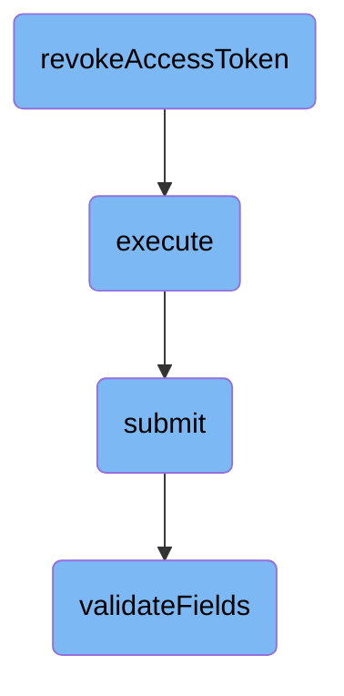

In this document, we will explain the process of revoking an access token. The process involves several steps, including checking if the token exists, updating the database, and validating the necessary fields.

The flow starts by checking if the access token exists. If it does, the system updates the database to mark the token as revoked. Then, it validates the fields to ensure everything is correct. If all validations pass, the revocation is executed, and a response is generated.

# Flow drill down



<SwmSnippet path="/src/Repository/AccessTokenRepository.php" line="75">

---

## Revoking the Access Token

The <SwmToken path="src/Repository/AccessTokenRepository.php" pos="80:5:5" line-data="	public function revokeAccessToken( $tokenId ) {">`revokeAccessToken`</SwmToken> function is responsible for revoking a user's access token. It first checks if the token identifier exists using <SwmToken path="src/Repository/AccessTokenRepository.php" pos="81:8:8" line-data="		if ( $this-&gt;identifierExists( $tokenId ) ) {">`identifierExists`</SwmToken>. If the token exists, it updates the database to set the token's <SwmToken path="src/Repository/AccessTokenRepository.php" pos="84:9:9" line-data="				-&gt;set( [ static::FIELD_REVOKED =&gt; 1 ] )">`FIELD_REVOKED`</SwmToken> field to 1, effectively revoking the token.

```hack
	/**
	 * Revoke an access token.
	 *
	 * @param string $tokenId
	 */
	public function revokeAccessToken( $tokenId ) {
		if ( $this->identifierExists( $tokenId ) ) {
			$this->getDB( DB_PRIMARY )->newUpdateQueryBuilder()
				->update( $this->getTableName() )
				->set( [ static::FIELD_REVOKED => 1 ] )
				->where( [ $this->getIdentifierField() => $tokenId ] )
				->caller( __METHOD__ )
				->execute();
		}
	}
```

---

</SwmSnippet>

<SwmSnippet path="/src/Rest/Handler/AbstractClientHandler.php" line="24">

---

## Executing the Revocation

The <SwmToken path="src/Rest/Handler/AbstractClientHandler.php" pos="28:5:5" line-data="	public function execute(): ResponseInterface {">`execute`</SwmToken> function handles the execution of the revocation process. It assumes the user is authenticated and has a valid session. It creates a <SwmToken path="src/Rest/Handler/AbstractClientHandler.php" pos="34:8:8" line-data="		$control = new ConsumerSubmitControl(">`ConsumerSubmitControl`</SwmToken> object and calls its <SwmToken path="src/Rest/Handler/AbstractClientHandler.php" pos="40:9:9" line-data="		$status = $control-&gt;submit();">`submit`</SwmToken> method. If the submission is successful, it processes the result and returns a JSON response. If there are errors, it throws appropriate HTTP exceptions.

```hack
	/**
	 * @return ResponseInterface
	 * @throws HttpException
	 */
	public function execute(): ResponseInterface {
		// At this point we assume user is authenticated and has valid session
		// Authentication can be achieved over CentralAuth or Access token in authorization header
		$responseFactory = $this->getResponseFactory();
		$params = $this->getUnifiedParams();

		$control = new ConsumerSubmitControl(
			RequestContext::getMain(),
			$params,
			Utils::getCentralDB( DB_PRIMARY )
		);

		$status = $control->submit();
		if ( $status->isGood() ) {
			$value = $status->getValue();
			if ( isset( $value['result']['consumer'] ) ) {
				/** @var ClientEntity $client */
```

---

</SwmSnippet>

<SwmSnippet path="/src/Control/SubmitControl.php" line="58">

---

### Submitting the Revocation

The <SwmToken path="src/Control/SubmitControl.php" pos="59:11:11" line-data="	 * Attempt to validate and submit this data">`submit`</SwmToken> function attempts to validate and submit the revocation data. It checks basic permissions, validates the action and parameters, and routes the submission handling to the internal subclass function. If the action is not handled, it throws an <SwmToken path="src/Control/SubmitControl.php" pos="64:6:6" line-data="	 * @throws MWException">`MWException`</SwmToken>.

```hack
	/**
	 * Attempt to validate and submit this data
	 *
	 * This will check basic permissions, validate the action and parameters
	 * and route the submission handling to the internal subclass function.
	 *
	 * @throws MWException
	 * @return Status
	 */
	public function submit() {
		$status = $this->checkBasePermissions();
		if ( !$status->isOK() ) {
			return $status;
		}

		$action = $this->vals['action'];
		$required = $this->getRequiredFields();
		if ( !isset( $required[$action] ) ) {
			// @TODO: check for field-specific message first
			return $this->failure( 'invalid_field_action', 'mwoauth-invalid-field', 'action' );
		}
```

---

</SwmSnippet>

<SwmSnippet path="/src/Control/SubmitControl.php" line="253">

---

### Validating the Fields

The <SwmToken path="src/Control/SubmitControl.php" pos="260:5:5" line-data="	protected function validateFields( array $required ) {">`validateFields`</SwmToken> function checks that the action is valid and that the required fields are present and valid. It iterates over the required fields and validates each one using the provided validators. If any field is missing or invalid, it returns a failure status; otherwise, it returns a success status.

```hack
	/**
	 * Check that the action is valid and that the required fields are valid
	 *
	 * @param array $required (field => regex or callback)
	 * @phan-param array<string,string|callable(mixed,array):bool|StatusValue> $required
	 * @return Status
	 */
	protected function validateFields( array $required ) {
		foreach ( $required as $field => $validator ) {
			if ( !isset( $this->vals[$field] ) ) {
				return $this->failure( "missing_field_$field", 'mwoauth-missing-field', $field );
			} elseif ( !is_scalar( $this->vals[$field] )
				&& !in_array( $field, [ 'restrictions', 'oauth2GrantTypes' ], true )
			) {
				return $this->failure( "invalid_field_$field", 'mwoauth-invalid-field', $field );
			}
			if ( is_string( $this->vals[$field] ) ) {
				$this->vals[$field] = trim( $this->vals[$field] );
			}
			$validationResult = $this->getValidationResult( $validator, $this->vals[$field], $this->vals );
			if ( $validationResult === false ) {
```

---

</SwmSnippet>

&nbsp;

*This is an auto-generated document by Swimm AI 🌊 and has not yet been verified by a human*

<SwmMeta version="3.0.0" repo-id="Z2l0aHViJTNBJTNBbWVkaWF3aWtpLWV4dGVuc2lvbnMtT0F1dGglM0ElM0FTd2ltbS1EZW1v" repo-name="mediawiki-extensions-OAuth"><sup>Powered by [Swimm](/)</sup></SwmMeta>
