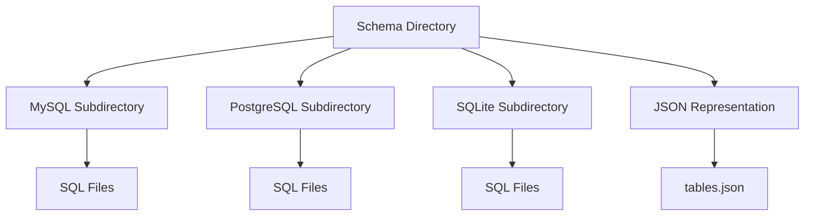

# Schema Overview

The schema defines the structure of the database tables used in the project. It includes details about the tables, columns, data types, and constraints. The schema is essential for ensuring that the database structure is consistent across different environments and database systems. It helps in managing database migrations and updates.

# Schema Directory

The schema directory contains subdirectories for different database systems such as MySQL, PostgreSQL, and SQLite. Each subdirectory includes SQL files for creating and updating the database tables.

<SwmSnippet path="/schema/mysql/tables-generated.sql" line="1">

---

The MySQL subdirectory contains SQL files like <SwmPath>[schema/mysql/tables-generated.sql](schema/mysql/tables-generated.sql)</SwmPath>, which is automatically generated using <SwmToken path="schema/mysql/tables-generated.sql" pos="1:14:18" line-data="-- This file is automatically generated using maintenance/generateSchemaSql.php.">`maintenance/generateSchemaSql.php`</SwmToken>. This file should not be modified directly.

```plsql
-- This file is automatically generated using maintenance/generateSchemaSql.php.
-- Source: schema/tables.json
-- Do not modify this file directly.
-- See https://www.mediawiki.org/wiki/Manual:Schema_changes
CREATE TABLE /*_*/oauth_registered_consumer (
```

---

</SwmSnippet>

# JSON Representation

The <SwmPath>[schema/tables.json](schema/tables.json)</SwmPath> file provides a JSON representation of the database schema. It includes the table names, column definitions, data types, and additional options like auto-increment and not-null constraints.

<SwmSnippet path="/schema/tables.json" line="1">

---

An example from <SwmPath>[schema/tables.json](schema/tables.json)</SwmPath> shows the structure of the <SwmToken path="schema/tables.json" pos="3:7:7" line-data="		&quot;name&quot;: &quot;oauth_registered_consumer&quot;,">`oauth_registered_consumer`</SwmToken> table, including its columns and constraints.

```json
[
	{
		"name": "oauth_registered_consumer",
		"comment": "Client consumers (proposed as well as and accepted)",
		"columns": [
			{
				"name": "oarc_id",
				"comment": "Internal numeric consumer ID (1:1 with oarc_consumer_key)",
				"type": "integer",
				"options": { "autoincrement": true, "notnull": true, "unsigned": true }
```

---

</SwmSnippet>

&nbsp;

*This is an auto-generated document by Swimm AI 🌊 and has not yet been verified by a human*

<SwmMeta version="3.0.0" repo-id="Z2l0aHViJTNBJTNBbWVkaWF3aWtpLWV4dGVuc2lvbnMtT0F1dGglM0ElM0FTd2ltbS1EZW1v" repo-name="mediawiki-extensions-OAuth"><sup>Powered by [Swimm](/)</sup></SwmMeta>
