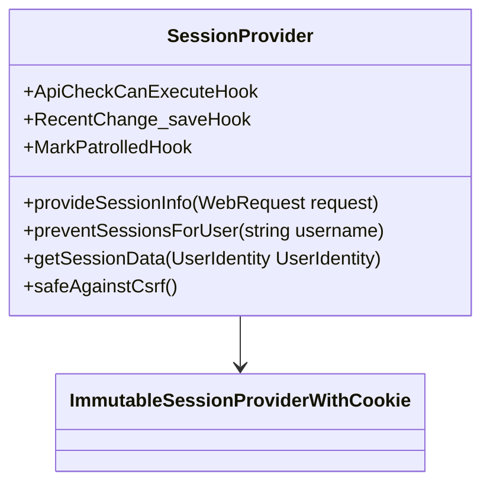

# Session Management Overview

Session management refers to the handling of user sessions, particularly through <SwmToken path="src/SessionProvider.php" pos="38:9:9" line-data=" * Session provider for OAuth">`OAuth`</SwmToken> headers included in requests. The <SwmToken path="src/SessionProvider.php" pos="51:2:2" line-data="class SessionProvider">`SessionProvider`</SwmToken> class extends <SwmToken path="src/SessionProvider.php" pos="40:13:13" line-data=" * This is a fairly standard ImmutableSessionProviderWithCookie implementation:">`ImmutableSessionProviderWithCookie`</SwmToken> and determines user identity based on these headers.

<SwmSnippet path="/src/SessionProvider.php" line="37">

---

# <SwmToken path="src/SessionProvider.php" pos="51:2:2" line-data="class SessionProvider">`SessionProvider`</SwmToken> Class

The <SwmToken path="src/SessionProvider.php" pos="51:2:2" line-data="class SessionProvider">`SessionProvider`</SwmToken> class ensures that requests with invalid <SwmToken path="src/SessionProvider.php" pos="38:9:9" line-data=" * Session provider for OAuth">`OAuth`</SwmToken> headers fail by returning a bogus <SwmToken path="src/SessionProvider.php" pos="44:9:9" line-data=" * returning a bogus SessionInfo and then hooking ApiBeforeMain to throw a">`SessionInfo`</SwmToken> and hooking <SwmToken path="src/SessionProvider.php" pos="44:17:17" line-data=" * returning a bogus SessionInfo and then hooking ApiBeforeMain to throw a">`ApiBeforeMain`</SwmToken> to throw a fatal exception after <SwmToken path="src/SessionProvider.php" pos="45:9:9" line-data=" * fatal exception after MediaWiki is ready to handle it.">`MediaWiki`</SwmToken> is ready to handle it.

```hack
/**
 * Session provider for OAuth
 *
 * This is a fairly standard ImmutableSessionProviderWithCookie implementation:
 * the user identity is determined by the OAuth headers included in the
 * request. But since we want to make sure to fail the request when OAuth
 * headers are present but invalid, this takes the somewhat unusual step of
 * returning a bogus SessionInfo and then hooking ApiBeforeMain to throw a
 * fatal exception after MediaWiki is ready to handle it.
 *
 * It also takes advantage of the getAllowedUserRights() method for authz
 * purposes (limiting the rights to those included in the grant), and
 * registers some hooks to tag actions made via the provider.
 */
class SessionProvider
	extends ImmutableSessionProviderWithCookie
	implements ApiCheckCanExecuteHook, RecentChange_saveHook, MarkPatrolledHook
{
```

---

</SwmSnippet>

<SwmSnippet path="/src/SessionProvider.php" line="68">

---

# <SwmToken path="src/SessionProvider.php" pos="68:5:5" line-data="	public function provideSessionInfo( WebRequest $request ) {">`provideSessionInfo`</SwmToken> Function

The <SwmToken path="src/SessionProvider.php" pos="68:5:5" line-data="	public function provideSessionInfo( WebRequest $request ) {">`provideSessionInfo`</SwmToken> function is responsible for determining the <SwmToken path="src/SessionProvider.php" pos="71:7:7" line-data="			// Not an OAuth request">`OAuth`</SwmToken> version of the request and handling the session information accordingly. If the request is not an <SwmToken path="src/SessionProvider.php" pos="71:7:7" line-data="			// Not an OAuth request">`OAuth`</SwmToken> request, it returns null.

```hack
	public function provideSessionInfo( WebRequest $request ) {
		$oauthVersion = $this->getOAuthVersionFromRequest( $request );
		if ( $oauthVersion === null ) {
			// Not an OAuth request
			return null;
		}

		// OAuth is restricted to be API-only.
		if ( !defined( 'MW_API' ) && !defined( 'MW_REST_API' ) ) {
			$globalRequest = RequestContext::getMain()->getRequest();
			if ( $request !== $globalRequest ) {
				// We are looking at something other than the global request. No easy way to
				// find out the title, and showing an error should be handled in the global
				// request anyway. Bail out.
				return null;
			}
			// The global Title object is not set up yet.
			$title = Title::newFromText( $request->getText( 'title' ) );
			if ( $title && $title->isSpecial( 'OAuth' ) ) {
				// Some Special:OAuth subpages expect an OAuth request header, but process it
				// manually, not via SessionManager. We mustn't break those.
```

---

</SwmSnippet>

<SwmSnippet path="/src/SessionProvider.php" line="293">

---

# <SwmToken path="src/SessionProvider.php" pos="293:5:5" line-data="	public function preventSessionsForUser( $username ) {">`preventSessionsForUser`</SwmToken> Function

The <SwmToken path="src/SessionProvider.php" pos="293:5:5" line-data="	public function preventSessionsForUser( $username ) {">`preventSessionsForUser`</SwmToken> function is used to prevent sessions for a specific user by removing any approvals for the user's consumers and deleting them from the database.

```hack
	public function preventSessionsForUser( $username ) {
		$id = Utils::getCentralIdFromUserName( $username );
		$dbw = Utils::getCentralDB( DB_PRIMARY );

		$dbw->startAtomic( __METHOD__ );
		try {
			// Remove any approvals for the user's consumers before deleting them
			$dbw->deleteJoin(
				'oauth_accepted_consumer',
				'oauth_registered_consumer',
				'oaac_consumer_id',
				'oarc_id',
				[ 'oarc_user_id' => $id ],
				__METHOD__
			);
			$dbw->newDeleteQueryBuilder()
				->deleteFrom( 'oauth_registered_consumer' )
				->where( [ 'oarc_user_id' => $id ] )
				->caller( __METHOD__ )
				->execute();
```

---

</SwmSnippet>

<SwmSnippet path="/src/SessionProvider.php" line="338">

---

# <SwmToken path="src/SessionProvider.php" pos="338:5:5" line-data="	private function getSessionData( UserIdentity $userIdentity = null ) {">`getSessionData`</SwmToken> Function

The <SwmToken path="src/SessionProvider.php" pos="338:5:5" line-data="	private function getSessionData( UserIdentity $userIdentity = null ) {">`getSessionData`</SwmToken> function fetches the access data for the current user session, if any, and returns the provider metadata.

```hack
	private function getSessionData( UserIdentity $userIdentity = null ) {
		if ( $userIdentity ) {
			$user = User::newFromIdentity( $userIdentity );
			$session = $user->getRequest()->getSession();
			if ( $session->getProvider() === $this &&
				$user->equals( $session->getUser() )
			) {
				return $session->getProviderMetadata();
			}
		} else {
			$session = SessionManager::getGlobalSession();
			if ( $session->getProvider() === $this ) {
				return $session->getProviderMetadata();
			}
		}

		return null;
	}
```

---

</SwmSnippet>

<SwmSnippet path="/src/SessionProvider.php" line="467">

---

# <SwmToken path="src/SessionProvider.php" pos="471:5:5" line-data="	public function safeAgainstCsrf() {">`safeAgainstCsrf`</SwmToken> Function

The <SwmToken path="src/SessionProvider.php" pos="471:5:5" line-data="	public function safeAgainstCsrf() {">`safeAgainstCsrf`</SwmToken> function indicates that <SwmToken path="src/SessionProvider.php" pos="467:3:3" line-data="	 * OAuth tokens already protect against CSRF. CSRF tokens are not required.">`OAuth`</SwmToken> tokens already protect against CSRF, so additional CSRF tokens are not required.

```hack
	 * OAuth tokens already protect against CSRF. CSRF tokens are not required.
	 *
	 * @return bool true
	 */
	public function safeAgainstCsrf() {
		return true;
	}
```

---

</SwmSnippet>

&nbsp;

*This is an auto-generated document by Swimm AI 🌊 and has not yet been verified by a human*

<SwmMeta version="3.0.0" repo-id="Z2l0aHViJTNBJTNBbWVkaWF3aWtpLWV4dGVuc2lvbnMtT0F1dGglM0ElM0FTd2ltbS1EZW1v" repo-name="mediawiki-extensions-OAuth"><sup>Powered by [Swimm](/)</sup></SwmMeta>
