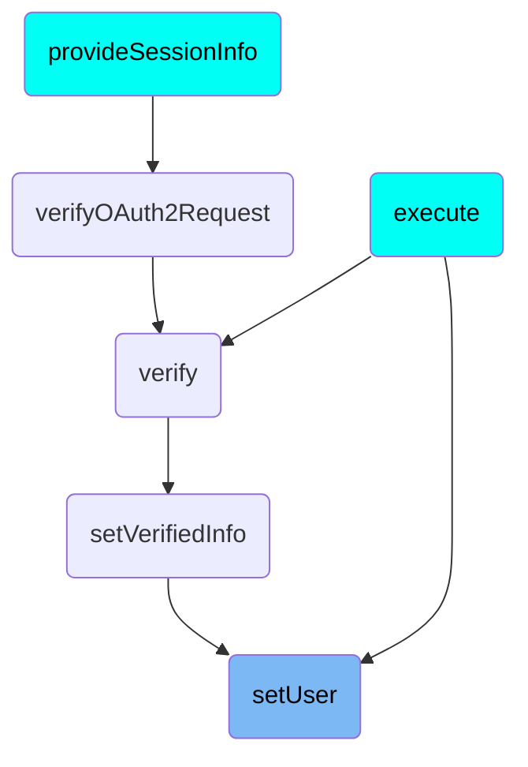

This document explains the process of setting an authorized user. The process involves retrieving the user ID from the request, checking if it is present, and then either setting an anonymous user or retrieving the local user from the central ID and setting it as the authorized user.

The flow starts by getting the user ID from the request. If the user ID is not present, an anonymous user is set. If the user ID is present, the system tries to get the local user from the central ID. If successful, this user is set as the authorized user.

# Flow drill down

```mermaid
graph TD;
      subgraph srcBackend["src/Backend"]
f7d9d35fb9a32604fc6247562205af8702fbff55e112e782d38e7dce5c823979(setUser):::mainFlowStyle --> 87ff512c3313ec90ee214019b59efa77cb95e87fae0cf4be4cbc6b33d9e220f0(getLocalUserFromCentralId):::mainFlowStyle
end

subgraph srcBackend["src/Backend"]
87ff512c3313ec90ee214019b59efa77cb95e87fae0cf4be4cbc6b33d9e220f0(getLocalUserFromCentralId):::mainFlowStyle --> 43c48b970d260d7719d066eaf7593ea6943487605518d02f618b78bcb6f08b80(newFromId):::mainFlowStyle
end

subgraph srcBackend["src/Backend"]
43c48b970d260d7719d066eaf7593ea6943487605518d02f618b78bcb6f08b80(newFromId):::mainFlowStyle --> e79256a1bafbf5a265f4f3035dafa462ed7e577d48c1464b0a9d05b3c5babd10(loadFromRow):::mainFlowStyle
end

subgraph srcBackend["src/Backend"]
e79256a1bafbf5a265f4f3035dafa462ed7e577d48c1464b0a9d05b3c5babd10(loadFromRow):::mainFlowStyle --> 9994407af64e72e459c9cff5adf212a0927d1bff56beb11fc47206261f6845b9(loadFromValues):::mainFlowStyle
end

subgraph srcBackend["src/Backend"]
9994407af64e72e459c9cff5adf212a0927d1bff56beb11fc47206261f6845b9(loadFromValues):::mainFlowStyle --> fd5404bf247b11b4179918dcf0a1c0f3f0744647ffbafcebfdd4c99a20fd189b(getFieldColumnMap):::mainFlowStyle
end


      classDef mainFlowStyle color:#000000,fill:#7CB9F4
classDef rootsStyle color:#000000,fill:#00FFF4
classDef Style1 color:#000000,fill:#00FFAA
classDef Style2 color:#000000,fill:#FFFF00
classDef Style3 color:#000000,fill:#AA7CB9
```



<SwmSnippet path="/src/ResourceServer.php" line="170">

---

## Setting the Authorized User

The <SwmToken path="src/ResourceServer.php" pos="170:5:5" line-data="	private function setUser( ServerRequestInterface $request ) {">`setUser`</SwmToken> function is responsible for setting the authorized user in the global context. It retrieves the user ID from the request and checks if it is present. If not, it sets an anonymous user. If a user ID is present, it attempts to get the local user from the central ID and sets it as the authorized user.

```hack
	private function setUser( ServerRequestInterface $request ) {
		$userId = $request->getAttribute( 'oauth_user_id', 0 );
		if ( !$userId ) {
			// Set anon user when no user id is present in the AT (machine grant)
			$this->user = User::newFromId( 0 );
			return;
		}

		try {
			$user = Utils::getLocalUserFromCentralId( $userId );
		} catch ( MWException $ex ) {
			throw new HttpException( $ex->getMessage(), 403 );
		}

		$this->user = $user;
	}
```

---

</SwmSnippet>

<SwmSnippet path="/src/Backend/Utils.php" line="301">

---

## Retrieving Local User from Central ID

The <SwmToken path="src/Backend/Utils.php" pos="301:7:7" line-data="	public static function getLocalUserFromCentralId( $userId ) {">`getLocalUserFromCentralId`</SwmToken> function retrieves a local user object given a central wiki user ID. It checks if global user IDs are required and uses a lookup service to find the local user. If the user is found and attached, it returns a new user object; otherwise, it returns false.

```hack
	public static function getLocalUserFromCentralId( $userId ) {
		global $wgMWOAuthSharedUserIDs, $wgMWOAuthSharedUserSource;

		// global ID required via hook
		if ( $wgMWOAuthSharedUserIDs ) {
			$lookup = MediaWikiServices::getInstance()
				->getCentralIdLookupFactory()
				->getLookup( $wgMWOAuthSharedUserSource );
			$user = $lookup->localUserFromCentralId( $userId );
			if ( $user === null || !$lookup->isAttached( $user ) ) {
				return false;
			}
			return User::newFromIdentity( $user );
		}

		return User::newFromId( $userId );
	}
```

---

</SwmSnippet>

<SwmSnippet path="/src/Backend/MWOAuthDAO.php" line="103">

---

## Creating User from ID

The <SwmToken path="src/Backend/MWOAuthDAO.php" pos="103:9:9" line-data="	final public static function newFromId( IDatabase $db, $id, $flags = 0 ) {">`newFromId`</SwmToken> function creates a new user object from a given ID. It builds a query to select the user data from the database and fetches the row. If the row is found, it creates a new user object and loads the data from the row.

```hack
	final public static function newFromId( IDatabase $db, $id, $flags = 0 ) {
		$queryBuilder = $db->newSelectQueryBuilder()
			->select( array_values( static::getFieldColumnMap() ) )
			->from( static::getTable() )
			->where( [ static::getIdColumn() => (int)$id ] )
			->caller( __METHOD__ );
		if ( $flags & IDBAccessObject::READ_LOCKING ) {
			$queryBuilder->forUpdate();
		}
		$row = $queryBuilder->fetchRow();

		if ( $row ) {
			$class = static::getConsumerClass( (array)$row );
			$consumer = new $class();
			$consumer->loadFromRow( $db, $row );
			return $consumer;
		} else {
			return false;
		}
	}
```

---

</SwmSnippet>

<SwmSnippet path="/src/Backend/MWOAuthDAO.php" line="380">

---

## Loading Data from Row

The <SwmToken path="src/Backend/MWOAuthDAO.php" pos="380:7:7" line-data="	final protected function loadFromRow( IDatabase $db, $row ) {">`loadFromRow`</SwmToken> function loads user data from a database row. It decodes the row data and maps the values to the user object fields using the field-column map.

```hack
	final protected function loadFromRow( IDatabase $db, $row ) {
		$row = $this->decodeRow( $db, (array)$row );
		$values = [];
		foreach ( static::getFieldColumnMap() as $field => $column ) {
			$values[$field] = $row[$column];
		}
		$this->loadFromValues( $values );
		$this->daoOrigin = 'db';
		$this->daoPending = false;
	}
```

---

</SwmSnippet>

<SwmSnippet path="/src/Backend/MWOAuthDAO.php" line="356">

---

## Loading Data from Values

The <SwmToken path="src/Backend/MWOAuthDAO.php" pos="356:7:7" line-data="	final protected function loadFromValues( array $values ) {">`loadFromValues`</SwmToken> function loads user data from an array of values. It ensures that all required fields are present and assigns the values to the corresponding fields in the user object.

```hack
	final protected function loadFromValues( array $values ) {
		foreach ( static::getFieldColumnMap() as $field => $column ) {
			if ( !array_key_exists( $field, $values ) ) {
				throw new MWException( get_class( $this ) . " requires '$field' field." );
			}
			$this->$field = $values[$field];
		}
		$this->normalizeValues();
		$this->daoOrigin = 'new';
		$this->daoPending = true;
	}
```

---

</SwmSnippet>

<SwmSnippet path="/src/Backend/MWOAuthDAO.php" line="305">

---

## Getting Field-Column Map

The <SwmToken path="src/Backend/MWOAuthDAO.php" pos="305:9:9" line-data="	final protected static function getFieldColumnMap() {">`getFieldColumnMap`</SwmToken> function returns the mapping of user object fields to database columns. This map is used to load data from the database into the user object.

```hack
	final protected static function getFieldColumnMap() {
		$schema = static::getSchema();
		return $schema['fieldColumnMap'];
	}
```

---

</SwmSnippet>

# Where is this flow used?

This flow is used multiple times in the codebase as represented in the following diagram:



&nbsp;

*This is an auto-generated document by Swimm AI 🌊 and has not yet been verified by a human*

<SwmMeta version="3.0.0" repo-id="Z2l0aHViJTNBJTNBbWVkaWF3aWtpLWV4dGVuc2lvbnMtT0F1dGglM0ElM0FTd2ltbS1EZW1v" repo-name="mediawiki-extensions-OAuth"><sup>Powered by [Swimm](/)</sup></SwmMeta>
