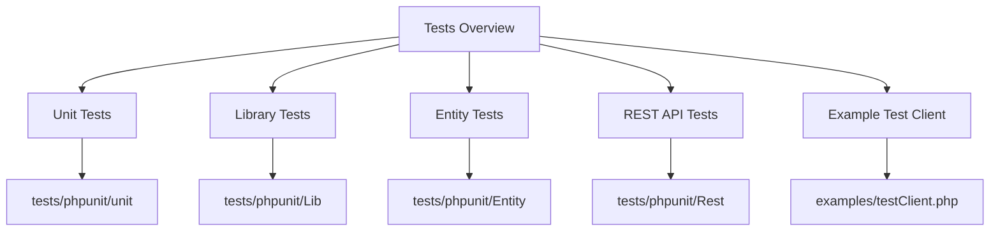

# Tests Overview

Tests are used to ensure the functionality and reliability of the codebase. They help in identifying bugs and verifying that the code behaves as expected.

## Unit Tests

The <SwmPath>[tests/phpunit/unit/](tests/phpunit/unit/)</SwmPath> directory contains unit tests, such as <SwmPath>[tests/phpunit/unit/HookRunnerTest.php](tests/phpunit/unit/HookRunnerTest.php)</SwmPath>, which test individual components in isolation to ensure they work correctly.

## Library Tests

The <SwmPath>[tests/phpunit/Lib/](tests/phpunit/Lib/)</SwmPath> directory includes tests for library classes, such as <SwmPath>[tests/phpunit/Lib/OAuthRequestTest.php](tests/phpunit/Lib/OAuthRequestTest.php)</SwmPath>, which verifies the behavior of the <SwmToken path="tests/phpunit/Lib/OAuthRequestTest.php" pos="30:10:10" line-data="use MediaWiki\Extension\OAuth\Lib\OAuthRequest;">`OAuthRequest`</SwmToken> class.

<SwmSnippet path="/tests/phpunit/Lib/OAuthRequestTest.php" line="49">

---

The <SwmPath>[tests/phpunit/Lib/OAuthRequestTest.php](tests/phpunit/Lib/OAuthRequestTest.php)</SwmPath> file contains tests that verify the behavior of the <SwmToken path="tests/phpunit/Lib/OAuthRequestTest.php" pos="30:10:10" line-data="use MediaWiki\Extension\OAuth\Lib\OAuthRequest;">`OAuthRequest`</SwmToken> class, ensuring it functions as expected.

```hack
class OAuthRequestTest extends TestCase {

	protected static $globals = [];

	public static function setUpBeforeClass() : void {
		parent::setUpBeforeClass();
		// can't use @backupGlobals because it tries to serialize the arrays
		self::$globals['$_SERVER'] = $_SERVER;
		self::$globals['$_POST'] = $_POST;
		self::$globals['$_GET'] = $_GET;
	}

	public static function tearDownAfterClass() : void {
		$_SERVER = self::$globals['$_SERVER'];
		$_POST = self::$globals['$_POST'];
		$_GET = self::$globals['$_GET'];
		parent::tearDownAfterClass();
	}

	public function testCanGetSingleParameter() {
```

---

</SwmSnippet>

<SwmSnippet path="/tests/phpunit/Entity/UserEntityTest.php" line="1">

---

The <SwmPath>[tests/phpunit/Entity/UserEntityTest.php](tests/phpunit/Entity/UserEntityTest.php)</SwmPath> file tests the <SwmToken path="tests/phpunit/Entity/UserEntityTest.php" pos="5:10:10" line-data="use MediaWiki\Extension\OAuth\Entity\UserEntity;">`UserEntity`</SwmToken> class to ensure it handles data correctly.

```hack
<?php

namespace MediaWiki\Extension\OAuth\Tests\Entity;

use MediaWiki\Extension\OAuth\Entity\UserEntity;
use MediaWikiIntegrationTestCase;

/**
 * @covers \MediaWiki\Extension\OAuth\Entity\UserEntity
 * @group OAuth
 * @group Database
 */
class UserEntityTest extends MediaWikiIntegrationTestCase {

	public function testProperties() {
		$userEntity = UserEntity::newFromMWUser(
			$this->getTestUser()->getUser()
		);

		$this->assertSame(
```

---

</SwmSnippet>

## REST API Tests

The <SwmPath>[tests/phpunit/Rest/](tests/phpunit/Rest/)</SwmPath> directory includes tests for REST API endpoints, such as <SwmPath>[tests/phpunit/Rest/testRoutes.json](tests/phpunit/Rest/testRoutes.json)</SwmPath>, which defines the routes and handlers for the API.

## Example Test Client

The <SwmPath>[examples/testClient.php](examples/testClient.php)</SwmPath> file provides an example of how to test <SwmToken path="tests/phpunit/Entity/UserEntityTest.php" pos="3:6:6" line-data="namespace MediaWiki\Extension\OAuth\Tests\Entity;">`OAuth`</SwmToken> integration with <SwmToken path="tests/phpunit/Entity/UserEntityTest.php" pos="3:2:2" line-data="namespace MediaWiki\Extension\OAuth\Tests\Entity;">`MediaWiki`</SwmToken>, demonstrating the steps to obtain and validate tokens.

<SwmSnippet path="/examples/testClient.php" line="34">

---

The <SwmPath>[examples/testClient.php](examples/testClient.php)</SwmPath> file demonstrates how to test <SwmToken path="tests/phpunit/Entity/UserEntityTest.php" pos="3:6:6" line-data="namespace MediaWiki\Extension\OAuth\Tests\Entity;">`OAuth`</SwmToken> integration with <SwmToken path="examples/testClient.php" pos="47:7:7" line-data=" * with your MediaWiki installation.">`MediaWiki`</SwmToken>, including steps to obtain and validate tokens.

```hack
/**
 * Local to this example
 *
 * Whether you want to also see
 * the objects being sent to the wire.
 */
$moreVerbose = false;

/**
 * Consumer key
 *
 * This is the application key you would
 * get from the application you want to connect
 * with your MediaWiki installation.
 */
$consumerKey = 'dpf43f3p2l4k3l03';

/**
 * Secret
 *
 * This is the generated secret key
```

---

</SwmSnippet>

&nbsp;

*This is an auto-generated document by Swimm AI 🌊 and has not yet been verified by a human*

<SwmMeta version="3.0.0" repo-id="Z2l0aHViJTNBJTNBbWVkaWF3aWtpLWV4dGVuc2lvbnMtT0F1dGglM0ElM0FTd2ltbS1EZW1v" repo-name="mediawiki-extensions-OAuth"><sup>Powered by [Swimm](/)</sup></SwmMeta>
