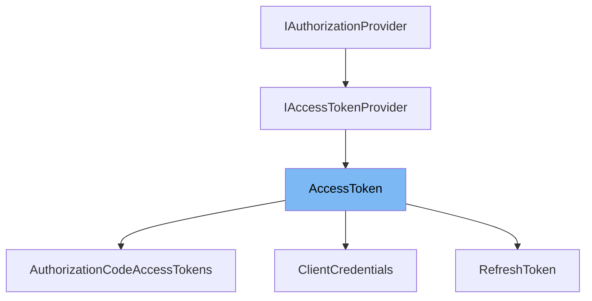

This document will cover the class <SwmToken path="src/AuthorizationProvider/AccessToken.php" pos="9:4:4" line-data="abstract class AccessToken extends AuthorizationProvider implements IAccessTokenProvider {">`AccessToken`</SwmToken> in the <SwmPath>[src/AuthorizationProvider/AccessToken.php](src/AuthorizationProvider/AccessToken.php)</SwmPath> file. We will discuss:

1. What <SwmToken path="src/AuthorizationProvider/AccessToken.php" pos="9:4:4" line-data="abstract class AccessToken extends AuthorizationProvider implements IAccessTokenProvider {">`AccessToken`</SwmToken> is.
2. The variables and functions defined in <SwmToken path="src/AuthorizationProvider/AccessToken.php" pos="9:4:4" line-data="abstract class AccessToken extends AuthorizationProvider implements IAccessTokenProvider {">`AccessToken`</SwmToken>.
3. An example of how to use <SwmToken path="src/AuthorizationProvider/AccessToken.php" pos="9:4:4" line-data="abstract class AccessToken extends AuthorizationProvider implements IAccessTokenProvider {">`AccessToken`</SwmToken> in <SwmToken path="src/Rest/Handler/AccessToken.php" pos="9:12:12" line-data="use MediaWiki\Extension\OAuth\AuthorizationProvider\Grant\RefreshToken;">`RefreshToken`</SwmToken>.



# What is <SwmToken path="src/AuthorizationProvider/AccessToken.php" pos="9:4:4" line-data="abstract class AccessToken extends AuthorizationProvider implements IAccessTokenProvider {">`AccessToken`</SwmToken>

The <SwmToken path="src/AuthorizationProvider/AccessToken.php" pos="9:4:4" line-data="abstract class AccessToken extends AuthorizationProvider implements IAccessTokenProvider {">`AccessToken`</SwmToken> class in <SwmPath>[src/AuthorizationProvider/AccessToken.php](src/AuthorizationProvider/AccessToken.php)</SwmPath> is an abstract class that extends <SwmToken path="src/AuthorizationProvider/AccessToken.php" pos="3:8:8" line-data="namespace MediaWiki\Extension\OAuth\AuthorizationProvider;">`AuthorizationProvider`</SwmToken> and implements the <SwmToken path="src/AuthorizationProvider/AccessToken.php" pos="9:12:12" line-data="abstract class AccessToken extends AuthorizationProvider implements IAccessTokenProvider {">`IAccessTokenProvider`</SwmToken> interface. It is used to handle <SwmToken path="src/AuthorizationProvider/AccessToken.php" pos="30:2:2" line-data="			&quot;OAuth2: Access token request - Grant type {grant}, client id: {client}&quot;, [">`OAuth2`</SwmToken> access token requests, logging these requests, and responding to them appropriately.

<SwmSnippet path="/src/AuthorizationProvider/AccessToken.php" line="18">

---

# Variables and functions

The function <SwmToken path="src/AuthorizationProvider/AccessToken.php" pos="18:5:5" line-data="	public function getAccessTokens(">`getAccessTokens`</SwmToken> is used to handle access token requests. It logs the request and then responds to it using the <SwmToken path="src/AuthorizationProvider/AccessToken.php" pos="30:2:2" line-data="			&quot;OAuth2: Access token request - Grant type {grant}, client id: {client}&quot;, [">`OAuth2`</SwmToken> server. This function takes a <SwmToken path="src/AuthorizationProvider/AccessToken.php" pos="19:1:1" line-data="		ServerRequestInterface $request, ResponseInterface $response">`ServerRequestInterface`</SwmToken> request and a <SwmToken path="src/AuthorizationProvider/AccessToken.php" pos="19:7:7" line-data="		ServerRequestInterface $request, ResponseInterface $response">`ResponseInterface`</SwmToken> response as parameters and returns a <SwmToken path="src/AuthorizationProvider/AccessToken.php" pos="19:7:7" line-data="		ServerRequestInterface $request, ResponseInterface $response">`ResponseInterface`</SwmToken>.

```hack
	public function getAccessTokens(
		ServerRequestInterface $request, ResponseInterface $response
	): ResponseInterface {
		$this->logAccessTokenRequest( $request );
		return $this->server->respondToAccessTokenRequest( $request, $response );
	}
```

---

</SwmSnippet>

<SwmSnippet path="/src/AuthorizationProvider/AccessToken.php" line="28">

---

The function <SwmToken path="src/AuthorizationProvider/AccessToken.php" pos="28:5:5" line-data="	protected function logAccessTokenRequest( ServerRequestInterface $request ) {">`logAccessTokenRequest`</SwmToken> logs the details of an access token request. It takes a <SwmToken path="src/AuthorizationProvider/AccessToken.php" pos="28:8:8" line-data="	protected function logAccessTokenRequest( ServerRequestInterface $request ) {">`ServerRequestInterface`</SwmToken> request as a parameter and logs the grant type and client ID associated with the request.

```hack
	protected function logAccessTokenRequest( ServerRequestInterface $request ) {
		$this->logger->info(
			"OAuth2: Access token request - Grant type {grant}, client id: {client}", [
				'grant' => $this->getGrantSingleton()->getIdentifier(),
				'client' => $this->getClientIdFromRequest( $request )
			] );
	}
```

---

</SwmSnippet>

# Usage example

The <SwmToken path="src/AuthorizationProvider/AccessToken.php" pos="9:4:4" line-data="abstract class AccessToken extends AuthorizationProvider implements IAccessTokenProvider {">`AccessToken`</SwmToken> class is used in the <SwmToken path="src/Rest/Handler/AccessToken.php" pos="9:12:12" line-data="use MediaWiki\Extension\OAuth\AuthorizationProvider\Grant\RefreshToken;">`RefreshToken`</SwmToken> class to handle refresh token requests. Here is an example of how <SwmToken path="src/AuthorizationProvider/AccessToken.php" pos="9:4:4" line-data="abstract class AccessToken extends AuthorizationProvider implements IAccessTokenProvider {">`AccessToken`</SwmToken> is used in <SwmToken path="src/Rest/Handler/AccessToken.php" pos="9:12:12" line-data="use MediaWiki\Extension\OAuth\AuthorizationProvider\Grant\RefreshToken;">`RefreshToken`</SwmToken>.

<SwmSnippet path="/src/Rest/Handler/AccessToken.php" line="49">

---

In the <SwmToken path="src/Rest/Handler/AccessToken.php" pos="38:5:5" line-data="	public function execute() {">`execute`</SwmToken> function, the <SwmToken path="src/Rest/Handler/AccessToken.php" pos="50:6:6" line-data="			return $authProvider-&gt;getAccessTokens( $request, $response );">`getAccessTokens`</SwmToken> method of the <SwmToken path="src/AuthorizationProvider/AccessToken.php" pos="9:4:4" line-data="abstract class AccessToken extends AuthorizationProvider implements IAccessTokenProvider {">`AccessToken`</SwmToken> class is called to handle the access token request. This shows how <SwmToken path="src/AuthorizationProvider/AccessToken.php" pos="9:4:4" line-data="abstract class AccessToken extends AuthorizationProvider implements IAccessTokenProvider {">`AccessToken`</SwmToken> is utilized in the <SwmToken path="src/Rest/Handler/AccessToken.php" pos="9:12:12" line-data="use MediaWiki\Extension\OAuth\AuthorizationProvider\Grant\RefreshToken;">`RefreshToken`</SwmToken> class.

```hack
			$authProvider = $this->getAuthorizationProvider();
			return $authProvider->getAccessTokens( $request, $response );
		} catch ( OAuthServerException $exception ) {
```

---

</SwmSnippet>

&nbsp;

*This is an auto-generated document by Swimm AI 🌊 and has not yet been verified by a human*

<SwmMeta version="3.0.0" repo-id="Z2l0aHViJTNBJTNBbWVkaWF3aWtpLWV4dGVuc2lvbnMtT0F1dGglM0ElM0FTd2ltbS1EZW1v" repo-name="mediawiki-extensions-OAuth"><sup>Powered by [Swimm](/)</sup></SwmMeta>
