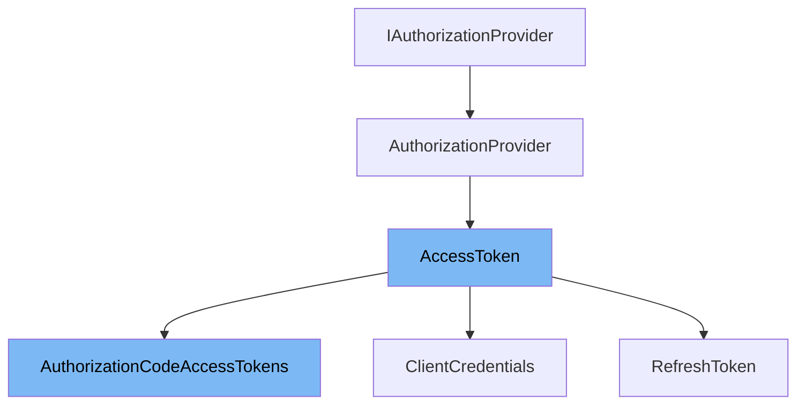

This document will cover the class <SwmToken path="src/AuthorizationProvider/Grant/AuthorizationCodeAccessTokens.php" pos="11:2:2" line-data="class AuthorizationCodeAccessTokens extends AccessToken {">`AuthorizationCodeAccessTokens`</SwmToken> in the `MediaWiki` `OAuth` extension. We will discuss:

1. The <SwmToken path="src/AuthorizationProvider/AccessToken.php" pos="9:4:4" line-data="abstract class AccessToken extends AuthorizationProvider implements IAccessTokenProvider {">`AccessToken`</SwmToken> class
2. The <SwmToken path="src/AuthorizationProvider/Grant/AuthorizationCodeAccessTokens.php" pos="11:2:2" line-data="class AuthorizationCodeAccessTokens extends AccessToken {">`AuthorizationCodeAccessTokens`</SwmToken> class



# <SwmToken path="/src/AuthorizationProvider/AccessToken.php" pos="9:4:4" line-data="abstract class AccessToken extends AuthorizationProvider implements IAccessTokenProvider {">`AccessToken`</SwmToken> Class

<SwmToken path="src/AuthorizationProvider/AccessToken.php" pos="9:4:4" line-data="abstract class AccessToken extends AuthorizationProvider implements IAccessTokenProvider {">`AccessToken`</SwmToken> is an abstract class that extends <SwmToken path="src/AuthorizationProvider/AccessToken.php" pos="9:8:8" line-data="abstract class AccessToken extends AuthorizationProvider implements IAccessTokenProvider {">`AuthorizationProvider`</SwmToken> and implements <SwmToken path="src/AuthorizationProvider/AccessToken.php" pos="9:12:12" line-data="abstract class AccessToken extends AuthorizationProvider implements IAccessTokenProvider {">`IAccessTokenProvider`</SwmToken>. It provides methods for handling access token requests, including logging and responding to these requests.

<SwmSnippet path="/src/AuthorizationProvider/AccessToken.php" line="18">

---

This class implaments the <SwmToken path="/src/AuthorizationProvider/AccessToken.php" pos="18:5:5" line-data="	public function getAccessTokens(">`getAccessTokens`</SwmToken> method to retrieve access tokens from the server.

```hack
	public function getAccessTokens(
		ServerRequestInterface $request, ResponseInterface $response
	): ResponseInterface {
		$this->logAccessTokenRequest( $request );
		return $this->server->respondToAccessTokenRequest( $request, $response );
	}
```

---

</SwmSnippet>

# <SwmToken path="src/AuthorizationProvider/Grant/AuthorizationCodeAccessTokens.php" pos="11:2:2" line-data="class AuthorizationCodeAccessTokens extends AccessToken {">`AuthorizationCodeAccessTokens`</SwmToken> Class

<SwmSnippet path="/src/AuthorizationProvider/Grant/AuthorizationCodeAccessTokens.php" line="11">

---

<SwmToken path="src/AuthorizationProvider/Grant/AuthorizationCodeAccessTokens.php" pos="11:2:2" line-data="class AuthorizationCodeAccessTokens extends AccessToken {">`AuthorizationCodeAccessTokens`</SwmToken> is a class defined in <SwmPath>[src/AuthorizationProvider/Grant/AuthorizationCodeAccessTokens.php](src/AuthorizationProvider/Grant/AuthorizationCodeAccessTokens.php)</SwmPath>. It on of the classes that extend the <SwmToken path="src/AuthorizationProvider/Grant/AuthorizationCodeAccessTokens.php" pos="11:6:6" line-data="class AuthorizationCodeAccessTokens extends AccessToken {">`AccessToken`</SwmToken> class and it specializes in handling access tokens for the authorization code grant type.&nbsp;

```hack
class AuthorizationCodeAccessTokens extends AccessToken {
```

---

</SwmSnippet>

This class is responsible for creating and configuring the <SwmToken path="src/AuthorizationProvider/Grant/AuthorizationCodeAccessTokens.php" pos="20:8:8" line-data="		$grant = new AuthCodeGrant( $authCodeRepo, $refreshTokenRepo, new DateInterval( &#39;PT10M&#39; ) );">`AuthCodeGrant`</SwmToken> object, which is used to issue access tokens based on authorization codes. It leverages the core functionalities provided by the <SwmToken path="src/AuthorizationProvider/Grant/AuthorizationCodeAccessTokens.php" pos="3:8:8" line-data="namespace MediaWiki\Extension\OAuth\AuthorizationProvider\Grant;">`AuthorizationProvider`</SwmToken> class.

<SwmSnippet path="/src/AuthorizationProvider/Grant/AuthorizationCodeAccessTokens.php" line="17">

---

The class implaments the <SwmToken path="src/AuthorizationProvider/Grant/AuthorizationCodeAccessTokens.php" pos="17:5:5" line-data="	protected function getGrant(): GrantTypeInterface {">`getGrant`</SwmToken> function defined in <SwmToken path="/src/AuthorizationProvider/AuthorizationProvider.php" pos="19:4:4" line-data="abstract class AuthorizationProvider implements IAuthorizationProvider {">`AuthorizationProvider`</SwmToken>. It creates an <SwmToken path="src/AuthorizationProvider/Grant/AuthorizationCodeAccessTokens.php" pos="20:8:8" line-data="		$grant = new AuthCodeGrant( $authCodeRepo, $refreshTokenRepo, new DateInterval( &#39;PT10M&#39; ) );">`AuthCodeGrant`</SwmToken> object using the authorization code and refresh token repositories, and configures it based on the <SwmToken path="src/AuthorizationProvider/Grant/AuthorizationCodeAccessTokens.php" pos="7:4:4" line-data="use League\OAuth2\Server\Grant\AuthCodeGrant;">`OAuth2`</SwmToken> settings.

```hack
	protected function getGrant(): GrantTypeInterface {
		$authCodeRepo = $this->getAuthCodeRepo();
		$refreshTokenRepo = $this->getRefreshTokenRepo();
		$grant = new AuthCodeGrant( $authCodeRepo, $refreshTokenRepo, new DateInterval( 'PT10M' ) );
		if ( !$this->config->get( 'OAuth2RequireCodeChallengeForPublicClients' ) ) {
			$grant->disableRequireCodeChallengeForPublicClients();
		}

		return $grant;
	}
```

---

</SwmSnippet>

&nbsp;

*This is an auto-generated document by Swimm 🌊 and has not yet been verified by a human*

<SwmMeta version="3.0.0" repo-id="Z2l0aHViJTNBJTNBbWVkaWF3aWtpLWV4dGVuc2lvbnMtT0F1dGglM0ElM0FTd2ltbS1EZW1v" repo-name="mediawiki-extensions-OAuth"><sup>Powered by [Swimm](https://app.swimm.io/)</sup></SwmMeta>
