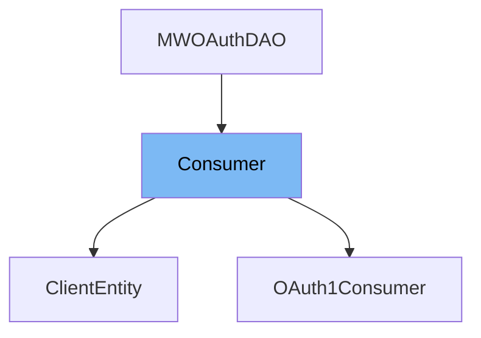

This document will cover the <SwmToken path="src/Backend/Consumer.php" pos="39:11:11" line-data=" * Representation of an OAuth consumer.">`consumer`</SwmToken> class in the <SwmPath>[src/Backend/Consumer.php](src/Backend/Consumer.php)</SwmPath> file. We will cover:

1. What <SwmToken path="src/Backend/Consumer.php" pos="39:11:11" line-data=" * Representation of an OAuth consumer.">`consumer`</SwmToken> is.
2. Variables and functions in <SwmToken path="src/Backend/Consumer.php" pos="39:11:11" line-data=" * Representation of an OAuth consumer.">`consumer`</SwmToken>.
3. Usage example of <SwmToken path="src/Backend/Consumer.php" pos="39:11:11" line-data=" * Representation of an OAuth consumer.">`consumer`</SwmToken> in <SwmToken path="src/Backend/Consumer.php" pos="28:10:10" line-data="use MediaWiki\Extension\OAuth\Entity\ClientEntity as OAuth2Client;">`ClientEntity`</SwmToken>.



# What is Consumer

The <SwmToken path="src/Backend/Consumer.php" pos="39:11:11" line-data=" * Representation of an OAuth consumer.">`consumer`</SwmToken> class in <SwmPath>[src/Backend/Consumer.php](src/Backend/Consumer.php)</SwmPath> represents an <SwmToken path="src/Backend/Consumer.php" pos="64:8:8" line-data="	/** @var string OAuth callback URL for authorization step */">`OAuth`</SwmToken> consumer. It is used to manage and store information about <SwmToken path="src/Backend/Consumer.php" pos="64:8:8" line-data="	/** @var string OAuth callback URL for authorization step */">`OAuth`</SwmToken> consumers, including their keys, secrets, and various metadata. This class provides methods to interact with the database and perform operations related to <SwmToken path="src/Backend/Consumer.php" pos="64:8:8" line-data="	/** @var string OAuth callback URL for authorization step */">`OAuth`</SwmToken> consumers.

<SwmSnippet path="/src/Backend/Consumer.php" line="52">

---

# Variables and functions

The variable <SwmToken path="src/Backend/Consumer.php" pos="52:12:12" line-data="	/** @var int|null Unique ID */">`ID`</SwmToken> is used to store the unique ID of the consumer.

```hack
	/** @var int|null Unique ID */
```

---

</SwmSnippet>

<SwmSnippet path="/src/Backend/Consumer.php" line="54">

---

The variable <SwmToken path="src/Backend/Consumer.php" pos="152:2:2" line-data="				&#39;consumerKey&#39;           =&gt; &#39;oarc_consumer_key&#39;,">`consumerKey`</SwmToken> is a hex token used as the consumer key.

```hack
	/** @var string Hex token */
```

---

</SwmSnippet>

<SwmSnippet path="/src/Backend/Consumer.php" line="56">

---

The variable <SwmToken path="src/Backend/Consumer.php" pos="56:8:8" line-data="	/** @var string Name of connected application */">`Name`</SwmToken> stores the name of the connected application.

```hack
	/** @var string Name of connected application */
```

---

</SwmSnippet>

<SwmSnippet path="/src/Backend/Consumer.php" line="61">

---

The variable <SwmToken path="src/Backend/Consumer.php" pos="61:4:4" line-data="	protected $userId;">`userId`</SwmToken> stores the publisher's central user ID.

```hack
	protected $userId;
```

---

</SwmSnippet>

<SwmSnippet path="/src/Backend/Consumer.php" line="63">

---

The variable <SwmToken path="src/Backend/Consumer.php" pos="63:4:4" line-data="	protected $version;">`version`</SwmToken> stores the version used for handshake breaking changes.

```hack
	protected $version;
```

---

</SwmSnippet>

<SwmSnippet path="/src/Backend/Consumer.php" line="64">

---

The variable <SwmToken path="src/Backend/Consumer.php" pos="156:2:2" line-data="				&#39;callbackUrl&#39;           =&gt; &#39;oarc_callback_url&#39;,">`callbackUrl`</SwmToken> stores the <SwmToken path="src/Backend/Consumer.php" pos="64:8:8" line-data="	/** @var string OAuth callback URL for authorization step */">`OAuth`</SwmToken> callback URL for the authorization step.

```hack
	/** @var string OAuth callback URL for authorization step */
```

---

</SwmSnippet>

<SwmSnippet path="/src/Backend/Consumer.php" line="70">

---

The variable <SwmToken path="src/Backend/Consumer.php" pos="70:4:4" line-data="	protected $callbackIsPrefix;">`callbackIsPrefix`</SwmToken> is a boolean indicating if the callback URL is a prefix.

```hack
	protected $callbackIsPrefix;
```

---

</SwmSnippet>

<SwmSnippet path="/src/Backend/Consumer.php" line="72">

---

The variable <SwmToken path="src/Backend/Consumer.php" pos="72:4:4" line-data="	protected $description;">`description`</SwmToken> stores the application description.

```hack
	protected $description;
```

---

</SwmSnippet>

<SwmSnippet path="/src/Backend/Consumer.php" line="74">

---

The variable <SwmToken path="src/Backend/Consumer.php" pos="74:4:4" line-data="	protected $email;">`email`</SwmToken> stores the publisher's email address.

```hack
	protected $email;
```

---

</SwmSnippet>

<SwmSnippet path="/src/Backend/Consumer.php" line="76">

---

The variable <SwmToken path="src/Backend/Consumer.php" pos="76:4:4" line-data="	protected $emailAuthenticated;">`emailAuthenticated`</SwmToken> stores the timestamp of when the email address was confirmed.

```hack
	protected $emailAuthenticated;
```

---

</SwmSnippet>

<SwmSnippet path="/src/Backend/Consumer.php" line="78">

---

The variable <SwmToken path="src/Backend/Consumer.php" pos="78:4:4" line-data="	protected $developerAgreement;">`developerAgreement`</SwmToken> is a boolean indicating if the user accepted the developer agreement.

```hack
	protected $developerAgreement;
```

---

</SwmSnippet>

<SwmSnippet path="/src/Backend/Consumer.php" line="80">

---

The variable <SwmToken path="src/Backend/Consumer.php" pos="80:4:4" line-data="	protected $ownerOnly;">`ownerOnly`</SwmToken> is a boolean indicating if the consumer is for use by the owner only.

```hack
	protected $ownerOnly;
```

---

</SwmSnippet>

<SwmSnippet path="/src/Backend/Consumer.php" line="82">

---

The variable <SwmToken path="src/Backend/Consumer.php" pos="82:4:4" line-data="	protected $oauthVersion;">`oauthVersion`</SwmToken> stores the version of the <SwmToken path="src/Backend/Consumer.php" pos="64:8:8" line-data="	/** @var string OAuth callback URL for authorization step */">`OAuth`</SwmToken> protocol.

```hack
	protected $oauthVersion;
```

---

</SwmSnippet>

<SwmSnippet path="/src/Backend/Consumer.php" line="84">

---

The variable <SwmToken path="src/Backend/Consumer.php" pos="84:4:4" line-data="	protected $wiki;">`wiki`</SwmToken> stores the Wiki ID the application can be used on.

```hack
	protected $wiki;
```

---

</SwmSnippet>

<SwmSnippet path="/src/Backend/Consumer.php" line="86">

---

The variable <SwmToken path="src/Backend/Consumer.php" pos="86:4:4" line-data="	protected $registration;">`registration`</SwmToken> stores the timestamp of the proposal.

```hack
	protected $registration;
```

---

</SwmSnippet>

<SwmSnippet path="/src/Backend/Consumer.php" line="88">

---

The variable <SwmToken path="src/Backend/Consumer.php" pos="88:4:4" line-data="	protected $secretKey;">`secretKey`</SwmToken> stores the secret HMAC key.

```hack
	protected $secretKey;
```

---

</SwmSnippet>

<SwmSnippet path="/src/Backend/Consumer.php" line="90">

---

The variable <SwmToken path="src/Backend/Consumer.php" pos="90:4:4" line-data="	protected $rsaKey;">`rsaKey`</SwmToken> stores the public RSA key.

```hack
	protected $rsaKey;
```

---

</SwmSnippet>

<SwmSnippet path="/src/Backend/Consumer.php" line="92">

---

The variable <SwmToken path="src/Backend/Consumer.php" pos="92:4:4" line-data="	protected $grants;">`grants`</SwmToken> stores the list of grants.

```hack
	protected $grants;
```

---

</SwmSnippet>

<SwmSnippet path="/src/Backend/Consumer.php" line="93">

---

The variable <SwmToken path="src/Backend/Consumer.php" pos="93:10:10" line-data="	/** @var MWRestrictions IP restrictions */">`restrictions`</SwmToken> stores the IP restrictions.

```hack
	/** @var MWRestrictions IP restrictions */
```

---

</SwmSnippet>

<SwmSnippet path="/src/Backend/Consumer.php" line="96">

---

The variable <SwmToken path="src/Backend/Consumer.php" pos="96:4:4" line-data="	protected $stage;">`stage`</SwmToken> stores the stage of the consumer in the review workflow.

```hack
	protected $stage;
```

---

</SwmSnippet>

<SwmSnippet path="/src/Backend/Consumer.php" line="98">

---

The variable <SwmToken path="src/Backend/Consumer.php" pos="98:4:4" line-data="	protected $stageTimestamp;">`stageTimestamp`</SwmToken> stores the timestamp of the last stage change.

```hack
	protected $stageTimestamp;
```

---

</SwmSnippet>

<SwmSnippet path="/src/Backend/Consumer.php" line="100">

---

The variable <SwmToken path="src/Backend/Consumer.php" pos="100:4:4" line-data="	protected $deleted;">`deleted`</SwmToken> is a boolean indicating if the consumer's information is suppressed.

```hack
	protected $deleted;
```

---

</SwmSnippet>

<SwmSnippet path="/src/Backend/Consumer.php" line="102">

---

The variable <SwmToken path="src/Backend/Consumer.php" pos="102:4:4" line-data="	protected $oauth2IsConfidential;">`oauth2IsConfidential`</SwmToken> is a boolean indicating if the client is able to keep the secret.

```hack
	protected $oauth2IsConfidential;
```

---

</SwmSnippet>

<SwmSnippet path="/src/Backend/Consumer.php" line="103">

---

The variable <SwmToken path="src/Backend/Consumer.php" pos="104:4:4" line-data="	protected $oauth2GrantTypes;">`oauth2GrantTypes`</SwmToken> stores the <SwmToken path="src/Backend/Consumer.php" pos="103:8:8" line-data="	/** @var array OAuth2 grant types available to the client */">`OAuth2`</SwmToken> grant types available to the client.

```hack
	/** @var array OAuth2 grant types available to the client */
```

---

</SwmSnippet>

<SwmSnippet path="/src/Backend/Consumer.php" line="147">

---

The function <SwmToken path="src/Backend/Consumer.php" pos="147:7:7" line-data="	protected static function getSchema() {">`getSchema`</SwmToken> returns the database schema for the consumer.

```hack
	protected static function getSchema() {
		return [
			'table'          => 'oauth_registered_consumer',
			'fieldColumnMap' => [
				'id'                    => 'oarc_id',
				'consumerKey'           => 'oarc_consumer_key',
				'name'                  => 'oarc_name',
				'userId'                => 'oarc_user_id',
				'version'               => 'oarc_version',
				'callbackUrl'           => 'oarc_callback_url',
				'callbackIsPrefix'      => 'oarc_callback_is_prefix',
				'description'           => 'oarc_description',
				'email'                 => 'oarc_email',
				'emailAuthenticated'    => 'oarc_email_authenticated',
				'oauthVersion'          => 'oarc_oauth_version',
				'developerAgreement'    => 'oarc_developer_agreement',
				'ownerOnly'             => 'oarc_owner_only',
				'wiki'                  => 'oarc_wiki',
				'grants'                => 'oarc_grants',
				'registration'          => 'oarc_registration',
				'secretKey'             => 'oarc_secret_key',
```

---

</SwmSnippet>

<SwmSnippet path="/src/Backend/Consumer.php" line="181">

---

The function <SwmToken path="src/Backend/Consumer.php" pos="181:7:7" line-data="	protected static function getFieldPermissionChecks() {">`getFieldPermissionChecks`</SwmToken> returns the field permission checks for the consumer.

```hack
	protected static function getFieldPermissionChecks() {
		return [
			'name'             => 'userCanSee',
			'userId'           => 'userCanSee',
			'version'          => 'userCanSee',
			'callbackUrl'      => 'userCanSee',
			'callbackIsPrefix' => 'userCanSee',
			'description'      => 'userCanSee',
			'rsaKey'           => 'userCanSee',
			'email'            => 'userCanSeeEmail',
			'secretKey'        => 'userCanSeeSecret',
			'restrictions'     => 'userCanSeeSecurity',
		];
	}
```

---

</SwmSnippet>

<SwmSnippet path="/src/Backend/Consumer.php" line="200">

---

The function <SwmToken path="src/Backend/Consumer.php" pos="200:7:7" line-data="	protected static function getConsumerClass( array $data ) {">`getConsumerClass`</SwmToken> returns the consumer class based on the <SwmToken path="src/Backend/Consumer.php" pos="64:8:8" line-data="	/** @var string OAuth callback URL for authorization step */">`OAuth`</SwmToken> version.

```hack
	protected static function getConsumerClass( array $data ) {
		return static::isOAuth2( $data ) ?
			OAuth2Client::class :
			OAuth1Consumer::class;
	}
```

---

</SwmSnippet>

<SwmSnippet path="/src/Backend/Consumer.php" line="210">

---

The function <SwmToken path="src/Backend/Consumer.php" pos="210:7:7" line-data="	protected static function isOAuth2( array $data = [] ) {">`isOAuth2`</SwmToken> checks if the consumer is using <SwmToken path="src/Backend/Consumer.php" pos="103:8:8" line-data="	/** @var array OAuth2 grant types available to the client */">`OAuth2`</SwmToken>.

```hack
	protected static function isOAuth2( array $data = [] ) {
		$oauthVersion = $data['oarc_oauth_version'] ?? $data['oauthVersion'];
		return (int)$oauthVersion === self::OAUTH_VERSION_2;
	}
```

---

</SwmSnippet>

<SwmSnippet path="/src/Backend/Consumer.php" line="221">

---

The function <SwmToken path="src/Backend/Consumer.php" pos="221:7:7" line-data="	public static function newFromKey( IDatabase $db, $key, $flags = 0 ) {">`newFromKey`</SwmToken> creates a new consumer from the given key.

```hack
	public static function newFromKey( IDatabase $db, $key, $flags = 0 ) {
		$queryBuilder = $db->newSelectQueryBuilder()
			->select( array_values( static::getFieldColumnMap() ) )
			->from( static::getTable() )
			->where( [ 'oarc_consumer_key' => (string)$key ] )
			->caller( __METHOD__ );
		if ( $flags & IDBAccessObject::READ_LOCKING ) {
			$queryBuilder->forUpdate();
		}
		$row = $queryBuilder->fetchRow();

		if ( $row ) {
			return static::newFromRow( $db, $row );
		} else {
			return false;
		}
	}
```

---

</SwmSnippet>

<SwmSnippet path="/src/Backend/Consumer.php" line="247">

---

The function <SwmToken path="src/Backend/Consumer.php" pos="247:7:7" line-data="	public static function newFromNameVersionUser(">`newFromNameVersionUser`</SwmToken> creates a new consumer from the given name, version, and user ID.

```hack
	public static function newFromNameVersionUser(
		IDatabase $db, $name, $version, $userId, $flags = 0
	) {
		$queryBuilder = $db->newSelectQueryBuilder()
			->select( array_values( static::getFieldColumnMap() ) )
			->from( static::getTable() )
			->where( [
				'oarc_name' => (string)$name,
				'oarc_version' => (string)$version,
				'oarc_user_id' => (int)$userId
			] )
			->caller( __METHOD__ );
		if ( $flags & IDBAccessObject::READ_LOCKING ) {
			$queryBuilder->forUpdate();
		}
		$row = $queryBuilder->fetchRow();

		if ( $row ) {
			return static::newFromRow( $db, $row );
		} else {
			return false;
```

---

</SwmSnippet>

<SwmSnippet path="/src/Backend/Consumer.php" line="274">

---

The function <SwmToken path="src/Backend/Consumer.php" pos="274:7:7" line-data="	public static function newGrants() {">`newGrants`</SwmToken> returns a new list of grants.

```hack
	public static function newGrants() {
		return [];
	}
```

---

</SwmSnippet>

<SwmSnippet path="/src/Backend/Consumer.php" line="281">

---

The function <SwmToken path="src/Backend/Consumer.php" pos="281:7:7" line-data="	public static function getAllStages() {">`getAllStages`</SwmToken> returns all the stages a consumer can be in.

```hack
	public static function getAllStages() {
		return [
			self::STAGE_PROPOSED,
			self::STAGE_REJECTED,
			self::STAGE_EXPIRED,
			self::STAGE_APPROVED,
			self::STAGE_DISABLED,
		];
	}
```

---

</SwmSnippet>

<SwmSnippet path="/src/Backend/Consumer.php" line="295">

---

The function <SwmToken path="src/Backend/Consumer.php" pos="295:5:5" line-data="	public function getId() {">`getId`</SwmToken> returns the internal ID of the consumer.

```hack
	public function getId() {
		return $this->get( 'id' );
	}
```

---

</SwmSnippet>

<SwmSnippet path="/src/Backend/Consumer.php" line="304">

---

The function <SwmToken path="src/Backend/Consumer.php" pos="304:5:5" line-data="	public function getConsumerKey() {">`getConsumerKey`</SwmToken> returns the consumer key.

```hack
	public function getConsumerKey() {
		return $this->get( 'consumerKey' );
	}
```

---

</SwmSnippet>

<SwmSnippet path="/src/Backend/Consumer.php" line="312">

---

The function <SwmToken path="src/Backend/Consumer.php" pos="312:5:5" line-data="	public function getName() {">`getName`</SwmToken> returns the name of the consumer.

```hack
	public function getName() {
		return $this->get( 'name' );
	}
```

---

</SwmSnippet>

&nbsp;

*This is an auto-generated document by Swimm AI 🌊 and has not yet been verified by a human*

<SwmMeta version="3.0.0" repo-id="Z2l0aHViJTNBJTNBbWVkaWF3aWtpLWV4dGVuc2lvbnMtT0F1dGglM0ElM0FTd2ltbS1EZW1v" repo-name="mediawiki-extensions-OAuth"><sup>Powered by [Swimm](/)</sup></SwmMeta>
