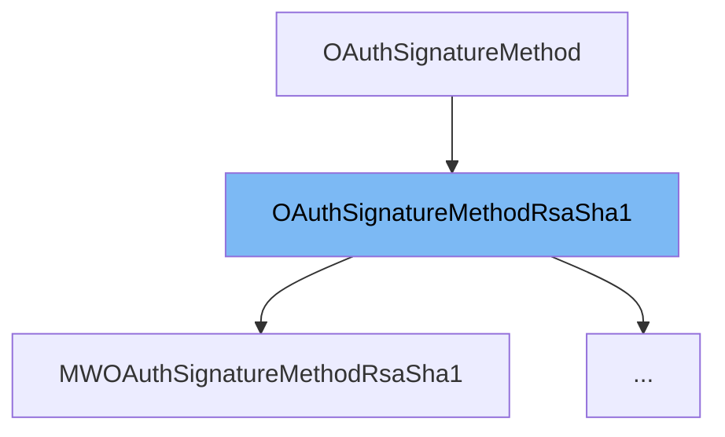

This document will cover the class <SwmToken path="src/Backend/MWOAuthSignatureMethodRsaSha1.php" pos="8:10:10" line-data="use MediaWiki\Extension\OAuth\Lib\OAuthSignatureMethodRsaSha1;">`OAuthSignatureMethodRsaSha1`</SwmToken> in detail. We will discuss:

1. What <SwmToken path="src/Backend/MWOAuthSignatureMethodRsaSha1.php" pos="8:10:10" line-data="use MediaWiki\Extension\OAuth\Lib\OAuthSignatureMethodRsaSha1;">`OAuthSignatureMethodRsaSha1`</SwmToken> is.
2. The variables and functions defined in <SwmToken path="src/Backend/MWOAuthSignatureMethodRsaSha1.php" pos="8:10:10" line-data="use MediaWiki\Extension\OAuth\Lib\OAuthSignatureMethodRsaSha1;">`OAuthSignatureMethodRsaSha1`</SwmToken>.
3. An example of how to use <SwmToken path="src/Backend/MWOAuthSignatureMethodRsaSha1.php" pos="8:10:10" line-data="use MediaWiki\Extension\OAuth\Lib\OAuthSignatureMethodRsaSha1;">`OAuthSignatureMethodRsaSha1`</SwmToken> in <SwmToken path="src/Backend/MWOAuthSignatureMethodRsaSha1.php" pos="10:2:2" line-data="class MWOAuthSignatureMethodRsaSha1 extends OAuthSignatureMethodRsaSha1 {">`MWOAuthSignatureMethodRsaSha1`</SwmToken>.



# What is <SwmToken path="src/Backend/MWOAuthSignatureMethodRsaSha1.php" pos="8:10:10" line-data="use MediaWiki\Extension\OAuth\Lib\OAuthSignatureMethodRsaSha1;">`OAuthSignatureMethodRsaSha1`</SwmToken>

<SwmToken path="src/Backend/MWOAuthSignatureMethodRsaSha1.php" pos="8:10:10" line-data="use MediaWiki\Extension\OAuth\Lib\OAuthSignatureMethodRsaSha1;">`OAuthSignatureMethodRsaSha1`</SwmToken> is an abstract class that implements the <SwmToken path="src/Lib/OAuthSignatureMethodRsaSha1.php" pos="39:4:6" line-data="		return &quot;RSA-SHA1&quot;;">`RSA-SHA1`</SwmToken> signature method for <SwmToken path="src/Backend/MWOAuthSignatureMethodRsaSha1.php" pos="3:6:6" line-data="namespace MediaWiki\Extension\OAuth\Backend;">`OAuth`</SwmToken>. It uses the <SwmToken path="src/Lib/OAuthSignatureMethodRsaSha1.php" pos="30:17:21" line-data=" * The RSA-SHA1 signature method uses the RSASSA-PKCS1-v1_5 signature algorithm as defined in">`RSASSA-PKCS1-v1_5`</SwmToken> signature algorithm as defined in <SwmToken path="src/Lib/OAuthSignatureMethodRsaSha1.php" pos="31:4:4" line-data=" * [RFC3447] section 8.2 ( more simply known as PKCS#1 ), using SHA-1 as the hash function for">`RFC3447`</SwmToken> section <SwmToken path="src/Lib/OAuthSignatureMethodRsaSha1.php" pos="31:9:11" line-data=" * [RFC3447] section 8.2 ( more simply known as PKCS#1 ), using SHA-1 as the hash function for">`8.2`</SwmToken>, with <SwmToken path="src/Lib/OAuthSignatureMethodRsaSha1.php" pos="31:32:34" line-data=" * [RFC3447] section 8.2 ( more simply known as PKCS#1 ), using SHA-1 as the hash function for">`SHA-1`</SwmToken> as the hash function for <SwmToken path="src/Lib/OAuthSignatureMethodRsaSha1.php" pos="32:3:7" line-data=" * EMSA-PKCS1-v1_5. It is assumed that the Consumer has provided its RSA public key in a">`EMSA-PKCS1-v1_5`</SwmToken>. This class is used to sign and verify <SwmToken path="src/Backend/MWOAuthSignatureMethodRsaSha1.php" pos="3:6:6" line-data="namespace MediaWiki\Extension\OAuth\Backend;">`OAuth`</SwmToken> requests using <SwmToken path="src/Lib/OAuthSignatureMethodRsaSha1.php" pos="39:4:6" line-data="		return &quot;RSA-SHA1&quot;;">`RSA-SHA1`</SwmToken>.

<SwmSnippet path="/src/Lib/OAuthSignatureMethodRsaSha1.php" line="38">

---

# Variables and functions

The function <SwmToken path="src/Lib/OAuthSignatureMethodRsaSha1.php" pos="38:5:5" line-data="	public function get_name() {">`get_name`</SwmToken> returns the name of the signature method, which is <SwmToken path="src/Lib/OAuthSignatureMethodRsaSha1.php" pos="39:4:6" line-data="		return &quot;RSA-SHA1&quot;;">`RSA-SHA1`</SwmToken>.

```hack
	public function get_name() {
		return "RSA-SHA1";
	}
```

---

</SwmSnippet>

<SwmSnippet path="/src/Lib/OAuthSignatureMethodRsaSha1.php" line="48">

---

The abstract function <SwmToken path="src/Lib/OAuthSignatureMethodRsaSha1.php" pos="48:7:7" line-data="	protected abstract function fetch_public_cert( &amp;$request );">`fetch_public_cert`</SwmToken> is intended to fetch the public certificate needed to verify the signature. It must be implemented by subclasses.

```hack
	protected abstract function fetch_public_cert( &$request );
```

---

</SwmSnippet>

<SwmSnippet path="/src/Lib/OAuthSignatureMethodRsaSha1.php" line="54">

---

The abstract function <SwmToken path="src/Lib/OAuthSignatureMethodRsaSha1.php" pos="54:7:7" line-data="	protected abstract function fetch_private_cert( &amp;$request );">`fetch_private_cert`</SwmToken> is intended to fetch the private certificate needed to sign the request. It must be implemented by subclasses.

```hack
	protected abstract function fetch_private_cert( &$request );
```

---

</SwmSnippet>

<SwmSnippet path="/src/Lib/OAuthSignatureMethodRsaSha1.php" line="56">

---

The function <SwmToken path="src/Lib/OAuthSignatureMethodRsaSha1.php" pos="56:5:5" line-data="	public function build_signature( $request, $consumer, $token ) {">`build_signature`</SwmToken> constructs the signature for the given request using the private key. It fetches the private certificate, extracts the private key, and signs the base string of the request.

```hack
	public function build_signature( $request, $consumer, $token ) {
		$base_string = $request->get_signature_base_string();
		$request->base_string = $base_string;

		// Fetch the private key cert based on the request
		$cert = $this->fetch_private_cert( $request );

		// Pull the private key ID from the certificate
		$privatekeyid = openssl_get_privatekey( $cert );

		// Sign using the key
		$ok = openssl_sign( $base_string, $signature, $privatekeyid );

		return base64_encode( $signature );
	}
```

---

</SwmSnippet>

<SwmSnippet path="/src/Lib/OAuthSignatureMethodRsaSha1.php" line="72">

---

The function <SwmToken path="src/Lib/OAuthSignatureMethodRsaSha1.php" pos="72:5:5" line-data="	public function check_signature( $request, $consumer, $token, $signature ) {">`check_signature`</SwmToken> verifies the signature of the given request using the public key. It fetches the public certificate, extracts the public key, and verifies the signature against the base string of the request.

```hack
	public function check_signature( $request, $consumer, $token, $signature ) {
		$decoded_sig = base64_decode( $signature );

		$base_string = $request->get_signature_base_string();

		// Fetch the public key cert based on the request
		$cert = $this->fetch_public_cert( $request );

		// Pull the public key ID from the certificate
		$publickeyid = openssl_get_publickey( $cert );

		// Check the computed signature against the one passed in the query
		$ok = openssl_verify( $base_string, $decoded_sig, $publickeyid );

		return $ok == 1;
```

---

</SwmSnippet>

# Usage example

Here is an example of how to use <SwmToken path="src/Backend/MWOAuthSignatureMethodRsaSha1.php" pos="8:10:10" line-data="use MediaWiki\Extension\OAuth\Lib\OAuthSignatureMethodRsaSha1;">`OAuthSignatureMethodRsaSha1`</SwmToken> in <SwmToken path="src/Backend/MWOAuthSignatureMethodRsaSha1.php" pos="10:2:2" line-data="class MWOAuthSignatureMethodRsaSha1 extends OAuthSignatureMethodRsaSha1 {">`MWOAuthSignatureMethodRsaSha1`</SwmToken>.

<SwmSnippet path="/src/Backend/MWOAuthSignatureMethodRsaSha1.php" line="1">

---

<SwmToken path="src/Backend/MWOAuthSignatureMethodRsaSha1.php" pos="10:2:2" line-data="class MWOAuthSignatureMethodRsaSha1 extends OAuthSignatureMethodRsaSha1 {">`MWOAuthSignatureMethodRsaSha1`</SwmToken> extends <SwmToken path="src/Backend/MWOAuthSignatureMethodRsaSha1.php" pos="8:10:10" line-data="use MediaWiki\Extension\OAuth\Lib\OAuthSignatureMethodRsaSha1;">`OAuthSignatureMethodRsaSha1`</SwmToken> and provides implementations for the abstract methods <SwmToken path="src/Lib/OAuthSignatureMethodRsaSha1.php" pos="48:7:7" line-data="	protected abstract function fetch_public_cert( &amp;$request );">`fetch_public_cert`</SwmToken> and <SwmToken path="src/Lib/OAuthSignatureMethodRsaSha1.php" pos="54:7:7" line-data="	protected abstract function fetch_private_cert( &amp;$request );">`fetch_private_cert`</SwmToken>. This class can be used to sign and verify <SwmToken path="src/Backend/MWOAuthSignatureMethodRsaSha1.php" pos="3:6:6" line-data="namespace MediaWiki\Extension\OAuth\Backend;">`OAuth`</SwmToken> requests using <SwmToken path="src/Lib/OAuthSignatureMethodRsaSha1.php" pos="39:4:6" line-data="		return &quot;RSA-SHA1&quot;;">`RSA-SHA1`</SwmToken>.

```hack
<?php

namespace MediaWiki\Extension\OAuth\Backend;

use MediaWiki\Extension\OAuth\Lib\OAuthDataStore;
use MediaWiki\Extension\OAuth\Lib\OAuthException;
use MediaWiki\Extension\OAuth\Lib\OAuthRequest;
use MediaWiki\Extension\OAuth\Lib\OAuthSignatureMethodRsaSha1;

class MWOAuthSignatureMethodRsaSha1 extends OAuthSignatureMethodRsaSha1 {
	/** @var MWOAuthDataStore */
	protected $store;
	/** @var string PEM encoded RSA private key */
	private $privateKey;

	/**
	 * @param OAuthDataStore $store
	 * @param string|null $privateKey RSA private key, passed to openssl_get_privatekey
	 */
	public function __construct( OAuthDataStore $store, $privateKey = null ) {
		$this->store = $store;
```

---

</SwmSnippet>

&nbsp;

*This is an auto-generated document by Swimm AI 🌊 and has not yet been verified by a human*

<SwmMeta version="3.0.0" repo-id="Z2l0aHViJTNBJTNBbWVkaWF3aWtpLWV4dGVuc2lvbnMtT0F1dGglM0ElM0FTd2ltbS1EZW1v" repo-name="mediawiki-extensions-OAuth"><sup>Powered by [Swimm](/)</sup></SwmMeta>
