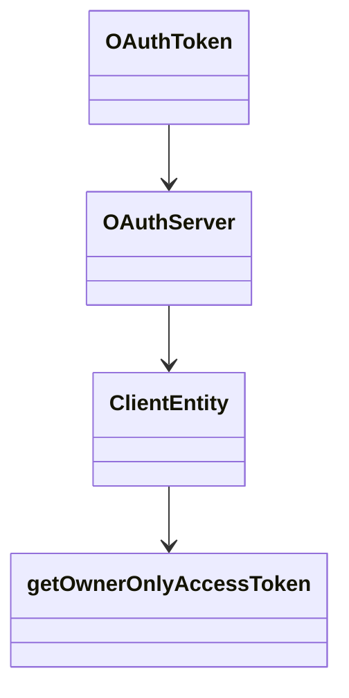

# Overview

Token Management involves handling the lifecycle of <SwmToken path="src/Lib/OAuthServer.php" pos="48:14:14" line-data="		$this-&gt;logger = LoggerFactory::getInstance( &#39;OAuth&#39; );">`OAuth`</SwmToken> tokens, including creation, persistence, and revocation. This document will cover the key classes and methods involved in token management within the REST context.

# OAuthToken Class

The `OAuthToken` class is responsible for representing access tokens and request tokens, storing their key and secret. It provides methods for serializing the token into a string format.

# RefreshTokenRepository Class

The `RefreshTokenRepository` class manages refresh tokens, providing methods to create, persist, revoke, and check the revocation status of refresh tokens. The `revokeRefreshToken` method revokes a refresh token by deleting it from the cache.

# <SwmToken path="src/Lib/OAuthServer.php" pos="35:2:2" line-data="class OAuthServer {">`OAuthServer`</SwmToken> Class

The <SwmToken path="src/Lib/OAuthServer.php" pos="35:2:2" line-data="class OAuthServer {">`OAuthServer`</SwmToken> class processes requests for request tokens and access tokens, verifying signatures and generating new tokens as needed. It includes methods for fetching request tokens, fetching access tokens, and verifying API calls.

<SwmSnippet path="/src/Lib/OAuthServer.php" line="35">

---

The <SwmToken path="src/Lib/OAuthServer.php" pos="35:2:2" line-data="class OAuthServer {">`OAuthServer`</SwmToken> class handles the core logic for processing <SwmToken path="src/Lib/OAuthServer.php" pos="48:14:14" line-data="		$this-&gt;logger = LoggerFactory::getInstance( &#39;OAuth&#39; );">`OAuth`</SwmToken> token requests, including signature verification and token generation.

```hack
class OAuthServer {
	protected $timestamp_threshold = 300; // in seconds, five minutes
	protected $version = '1.0'; // hi blaine
	protected $signature_methods = array();

	/** @var OAuthDataStore */
	protected $data_store;

	/** @var LoggerInterface */
	protected $logger;

	function __construct( $data_store ) {
		$this->data_store = $data_store;
		$this->logger = LoggerFactory::getInstance( 'OAuth' );
	}

	public function add_signature_method( $signature_method ) {
		$this->signature_methods[$signature_method->get_name()] = $signature_method;
	}

	// high level functions
```

---

</SwmSnippet>

# <SwmToken path="src/Entity/ClientEntity.php" pos="19:2:2" line-data="class ClientEntity extends Consumer implements MWClientEntityInterface {">`ClientEntity`</SwmToken> Class

The <SwmToken path="src/Entity/ClientEntity.php" pos="19:2:2" line-data="class ClientEntity extends Consumer implements MWClientEntityInterface {">`ClientEntity`</SwmToken> class handles client-related operations, including validating secrets and grant types, and authorizing users. It is used in various parts of the codebase to manage client-specific token operations.

<SwmSnippet path="/src/Entity/ClientEntity.php" line="19">

---

The <SwmToken path="src/Entity/ClientEntity.php" pos="19:2:2" line-data="class ClientEntity extends Consumer implements MWClientEntityInterface {">`ClientEntity`</SwmToken> class defines client-specific operations and properties, such as redirect <SwmToken path="src/Entity/ClientEntity.php" pos="24:17:17" line-data="	 * Alternatively return an indexed array of redirect URIs.">`URIs`</SwmToken> and confidentiality status.

```hack
class ClientEntity extends Consumer implements MWClientEntityInterface {

	/**
	 * Returns the registered redirect URI (as a string).
	 *
	 * Alternatively return an indexed array of redirect URIs.
	 *
	 * @return string|string[]
	 */
	public function getRedirectUri() {
		return $this->getCallbackUrl();
	}

	/**
	 * Returns true if the client is confidential.
	 *
	 * @return bool
	 */
	public function isConfidential() {
		return $this->oauth2IsConfidential;
	}
```

---

</SwmSnippet>

# <SwmToken path="src/Entity/ClientEntity.php" pos="156:5:5" line-data="	public function getOwnerOnlyAccessToken(">`getOwnerOnlyAccessToken`</SwmToken> Method

The <SwmToken path="src/Entity/ClientEntity.php" pos="156:5:5" line-data="	public function getOwnerOnlyAccessToken(">`getOwnerOnlyAccessToken`</SwmToken> method in the <SwmToken path="src/Entity/ClientEntity.php" pos="19:2:2" line-data="class ClientEntity extends Consumer implements MWClientEntityInterface {">`ClientEntity`</SwmToken> class generates an access token for a single user, ensuring that the client is allowed to use the <SwmToken path="src/Entity/ClientEntity.php" pos="159:7:7" line-data="		$grantType = &#39;client_credentials&#39;;">`client_credentials`</SwmToken> grant type and handling token persistence.

<SwmSnippet path="/src/Entity/ClientEntity.php" line="144">

---

The <SwmToken path="src/Entity/ClientEntity.php" pos="156:5:5" line-data="	public function getOwnerOnlyAccessToken(">`getOwnerOnlyAccessToken`</SwmToken> method ensures that the client is allowed to use the <SwmToken path="src/Entity/ClientEntity.php" pos="159:7:7" line-data="		$grantType = &#39;client_credentials&#39;;">`client_credentials`</SwmToken> grant type and handles the generation and persistence of the access token.

```hack
	/**
	 * Get the access token to be used with a single user
	 * Should never be called outside of client registration/manage code
	 *
	 * @param ConsumerAcceptance $approval
	 * @param bool $revokeExisting Delete all existing tokens
	 *
	 * @return AccessTokenEntityInterface
	 * @throws MWOAuthException
	 * @throws OAuthServerException
	 * @throws Exception
	 */
	public function getOwnerOnlyAccessToken(
		ConsumerAcceptance $approval, $revokeExisting = false
	) {
		$grantType = 'client_credentials';
		if (
			count( $this->getAllowedGrants() ) !== 1 ||
			$this->getAllowedGrants()[0] !== $grantType
		) {
			// make sure client is allowed *only* client_credentials grant,
```

---

</SwmSnippet>

&nbsp;

*This is an auto-generated document by Swimm AI 🌊 and has not yet been verified by a human*

<SwmMeta version="3.0.0" repo-id="Z2l0aHViJTNBJTNBbWVkaWF3aWtpLWV4dGVuc2lvbnMtT0F1dGglM0ElM0FTd2ltbS1EZW1v" repo-name="mediawiki-extensions-OAuth"><sup>Powered by [Swimm](/)</sup></SwmMeta>
